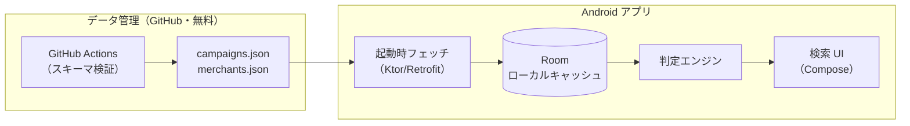

# ポイ活ナビ（仮）開発計画

店舗ごとに「どの支払い方法が最も得か」を短時間で判断するための Android アプリ。
学習目的を兼ねるため、モダンな標準構成（Kotlin + Jetpack Compose）で、無料の範囲で段階的に作る。

## 0. 最重要の設計判断：データをどう持つか

このアプリの本質的な難所は Android 実装ではなく **還元施策データの収集と鮮度維持** にある。

- 三井住友カード（Vポイントアッププログラム / 対象店舗で最大7%）、MUFG カード（対象店舗スマホ決済で高還元）などの対象店舗リストに **公式 API は存在しない**。各社の Web ページから手動（または半自動）で収集するしかない。
- 施策は数ヶ月単位で改定される（対象店舗の追加・除外、還元率・条件の変更）。
- したがって、**データはアプリ本体にハードコードせず、外部の JSON として管理し、アプリは起動時にフェッチしてローカルにキャッシュする** 構成にする。これによりデータ更新のたびにアプリを再ビルド・再インストールしなくて済む。

データ置き場は **GitHub リポジトリ（raw URL 配信 or GitHub Pages）** を使う。完全無料で、変更履歴も残り、後述の GitHub Actions によるデータ検証も組める。



### データモデル（初期案）

```
Campaign（施策）
  - id, 発行体（三井住友 / MUFG / PayPay / 自治体名 …）
  - 支払い手段（クレカタッチ / QR / …）
  - 還元率、上限額、条件（例：スマホのタッチ決済必須、要エントリー）
  - 期間（開始日・終了日。常設なら null）
  - 最終確認日 ← 施策は変わるので「いつ時点の情報か」を必ず持つ

Merchant（チェーン）
  - id, 正式名、エイリアス配列（"マクドナルド", "マック", "McDonald's"…）
  - カテゴリ（コンビニ / ファストフード / …）

CampaignMerchant（対応関係）
  - campaign_id, merchant_id
  - 除外店舗パターン（Phase 2 で使用。例：「○○空港店」「△△遊園地内店」）
```

エイリアスと除外パターンを最初からスキーマに入れておくと、Phase 2 の機能がデータ追加だけで実現できる。

## 1. 技術スタック（すべて無料）

| 項目 | 選定 | 備考 |
|---|---|---|
| 言語 / UI | Kotlin + Jetpack Compose | 現在の Android 標準。学習価値が最も高い |
| アーキテクチャ | MVVM + Repository | 公式推奨構成 |
| ローカル DB | Room | 施策データのキャッシュと検索 |
| HTTP | Ktor Client（or Retrofit） | JSON フェッチ |
| DI | Hilt | 学習目的なら入れる価値あり。最初は手動 DI でも可 |
| データ配信 | GitHub raw / Pages | 無料 |
| 開発・実機テスト | Android Studio + 手持ち端末 | 無料（USB 接続でインストール） |

**費用が発生しうるポイント（要検討事項）**

- Google Play 公開：開発者登録 **$25（買い切り）**。個人利用だけなら不要（実機への直接インストールで運用可）。
- Google Places API（Phase 2 の GPS 機能）：無料枠あり（2025年改定で SKU ごとの月間無料コール枠制。個人利用の頻度なら実質無料の見込みだが、クレカ登録が必要）。**代替として完全無料・キー不要の OpenStreetMap Overpass API をまず試す**。
- Firebase：使うとしても Spark プラン（無料）の範囲で足りる想定。当面は不要。

## 2. フェーズ計画

### Phase 1（MVP）：チェーン名入力 → 三井住友 / MUFG の高還元対象判定

**マイルストーン**

1. **M1: データ作成** — 三井住友カード「対象のコンビニ・飲食店で最大7%」と MUFG カードの高還元施策の対象店舗を公式ページから手動収集し、上記スキーマの JSON を作る。まずは各 20〜40 チェーン程度。
2. **M2: アプリ骨格** — Compose プロジェクト作成。JSON はいったん assets 同梱で読み込み、Room に投入。
3. **M3: 検索と判定表示** — 店舗名のインクリメンタル検索（エイリアス対応、ひらがな/カタカナ正規化）。ヒットしたチェーンについて「対象施策・還元率・条件（タッチ決済必須等）・最終確認日」をカード形式で表示。対象外なら通常還元率の比較を表示。
4. **M4: リモートデータ化** — JSON を GitHub に置き、起動時フェッチ + キャッシュに切り替え。これで「データ更新はスマホアプリを触らず GitHub 上の JSON 編集だけ」になる。

**Phase 1 完了の定義**：「サイゼリヤ」と入れたら「三井住友カード スマホのタッチ決済で 7%（要 Visa/Mastercard タッチ）」が即表示される。

### Phase 2：QR クーポン・自治体施策・個別店舗判定・GPS

優先順に：

1. **個別店舗名での対象外判定** — 「マクドナルド ○○駅前店」のような入力に対し、除外パターン（正規表現 or 部分一致リスト）と照合して「このチェーンは対象だが、この店舗は対象外」を警告表示。データは各社の「対象外店舗一覧」ページから収集。
2. **自治体還元施策** — 「○○市×auPAY 20%還元」型の施策を Campaign として追加（地域フィールドを追加）。ユーザーが設定画面で居住地・行動圏の自治体を登録し、該当施策のみ表示。
3. **QR 決済クーポン** — PayPay クーポン等は **ユーザーごとに配布が異なり、API もない** ため完全な自動判定は不可能。現実的な落とし所：(a) 全員配布系の大型クーポンのみ手動でデータ化、(b) 判定結果画面に「PayPay アプリでこの店のクーポンを確認」のディープリンク/導線を置く。
4. **GPS 店舗候補** — 現在地周辺の店舗を取得し、タップで判定表示へ。まず **Overpass API（OSM、無料・キー不要）** で実装し、店舗網羅性に不満が出たら Google Places API（無料枠）を検討。位置情報パーミッション処理の学習題材としても良い。

### Phase 3：最適化アドバイス（期間限定ポイント・ウエル活）

- **残高は手入力**：楽天ポイント等の残高・期限を取得できる公式 API はないため、設定画面で「期間限定ポイント残高と失効日」を手入力してもらう（スクレイピングは規約・認証の面で非推奨）。
- **判定エンジンを「還元率比較」から「期待価値スコア比較」に拡張**：
  - `スコア = 還元率 × ポイント価値係数 + 失効間近ポイントの消化ボーナス`
  - ポイント価値係数の例：ウエルシアでの V ポイント/WAON POINT は 1.5 倍価値（ウエル活）、失効 7 日前の期間限定ポイントは「使わないと 0 円」なので消化を最優先、など。
- ルールベースで十分実現可能。AI 等は不要。

## 3. リスクと割り切り

| リスク | 対応 |
|---|---|
| 施策情報が古くなり誤判定 | `最終確認日` を必ず表示し「最新の条件は公式で確認」の注記を出す。月 1 回のデータ見直しを運用ルール化 |
| 対象外店舗リストの網羅が困難 | 「対象外の可能性あり」レベルの警告表示に留め、断定しない |
| クーポンの個人差 | 自動判定を諦め、確認導線の提示に留める（上記） |
| スクレイピング自動化 | 各社の利用規約に抵触しうるため、当面は手動収集。自動化するなら個人利用範囲で頻度を抑える |

## 4. 学習面で得られるもの

Phase 1 だけでも：Compose UI、Room、MVVM、Repository パターン、JSON シリアライズ、リモートデータ + キャッシュ戦略。
Phase 2 で：位置情報パーミッション、外部 API 連携、ディープリンク。
Phase 3 で：ドメインロジック（スコアリングエンジン）の設計とテスト。

## 5. 次のアクション

1. 三井住友・MUFG の対象店舗リストを調べて `data/campaigns.json` / `data/merchants.json` の初版を作る
2. Android Studio で空の Compose プロジェクトを作成（パッケージ名：`com.ktakjm.poikatsu`、minSdk 29 / Android 10 = 手持ち最古端末）
3. M2〜M3 を実装して実機で動かす
