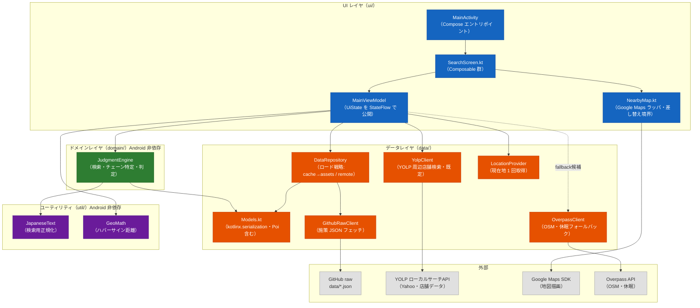
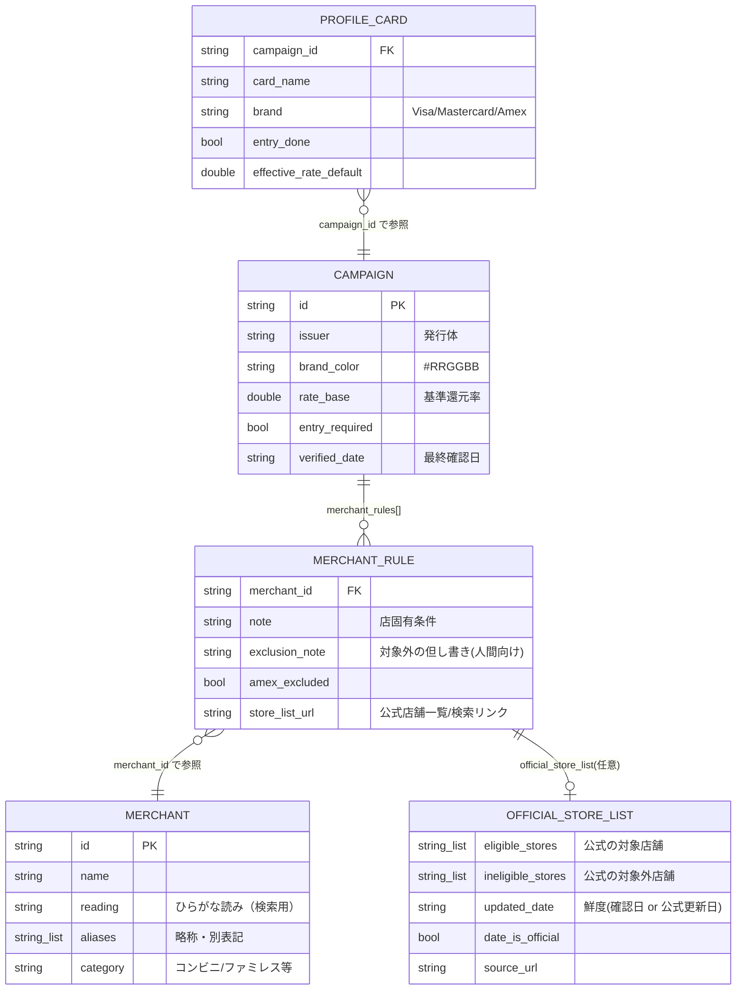
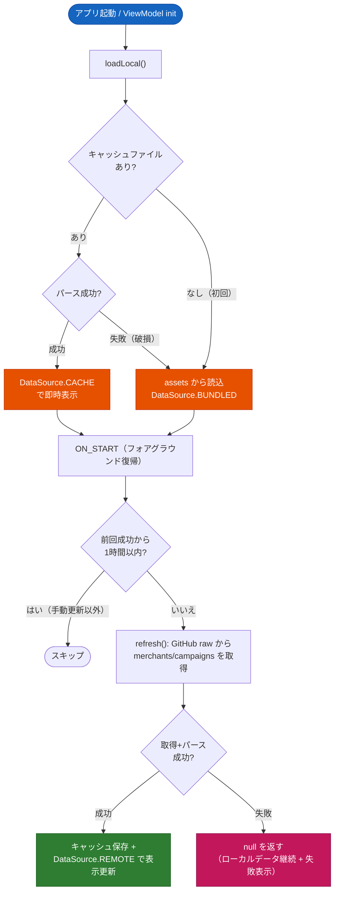
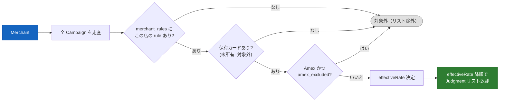
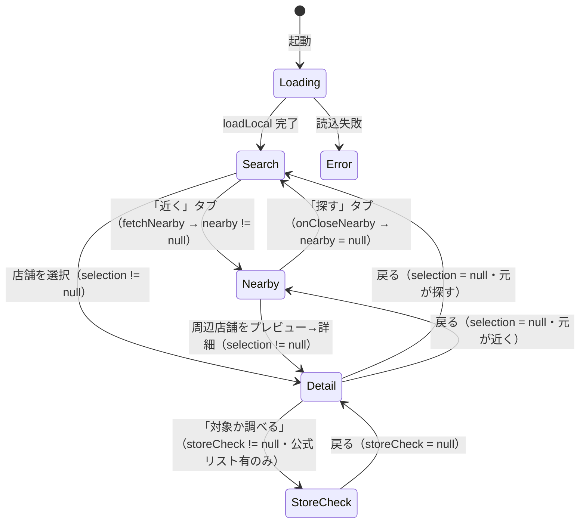
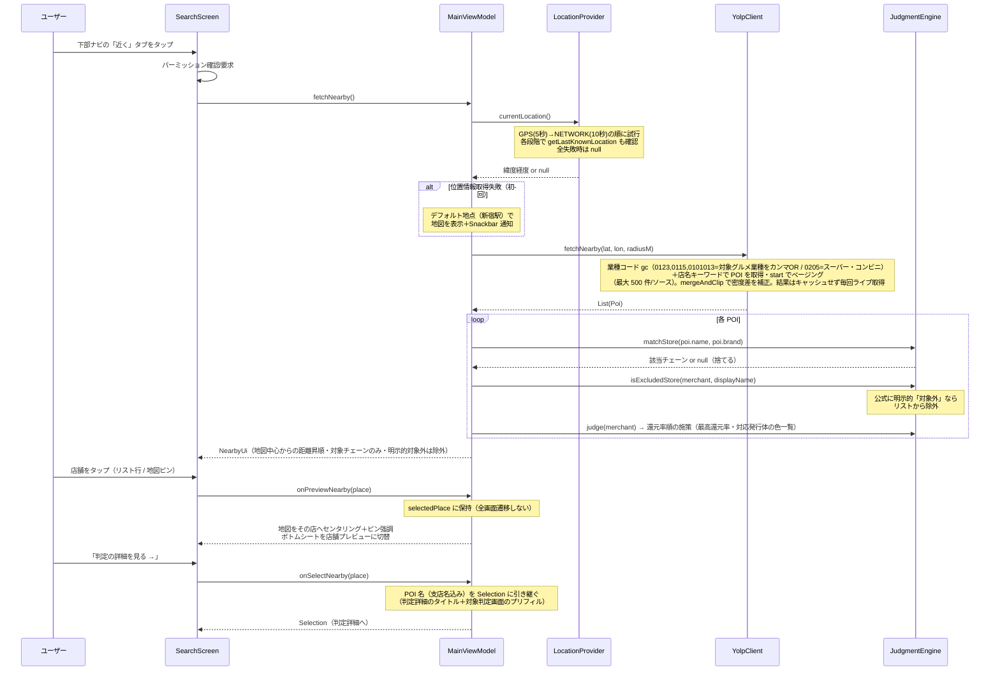

# poikatsu コード解説（学習用）

店舗名やカテゴリから「どの支払い方法が最も得か」を判定する Android アプリのコード解説ドキュメント。
Kotlin + Jetpack Compose の標準的な構成（MVVM + Repository）を学ぶための題材として、各レイヤの責務・設計判断・データフローを説明する。

- 対象リビジョン: Phase 1 完了 + 店舗単位の対象判定（公式リスト方式・3 状態）+ GPS 周辺検索 実装済み時点
- 全体計画: [PLAN.md](../PLAN.md) / データ仕様: [data/README.md](../data/README.md) / プロジェクト規約: [CLAUDE.md](../CLAUDE.md)

## 1. 全体アーキテクチャ

MVVM + Repository パターン。レイヤ間の依存は一方向（UI → Domain → Data）で、判定ロジック（domain/）と日本語処理（util/）は **Android 非依存の純 Kotlin** として書かれており、JVM ユニットテストで実データを使って検証できる。



### 設計判断のポイント

| 判断 | 理由 |
|---|---|
| Room を使わない | 施策データは数十件の JSON で全件メモリに乗る。リモート JSON をファイルキャッシュ（テキストのまま保存）するだけで十分だった（PLAN.md M4 実績メモ参照） |
| DI フレームワーク（Hilt）なし | クラス数が少なく手動 DI で足りる。`DataRepository` は関数（`readAsset` / `fetchRemote`）と `File` をコンストラクタ注入する形にして、フレームワークなしでテスタビリティを確保 |
| 地図は Google Maps（2026-06-20〜） | 当初は Play Services 非依存を掲げ osmdroid（OSM）を採用していたが、OSM はデータ品質（新規店・支店名欠落）と地図デザインが実用に劣るため、描画を **Google Maps SDK**・店舗データを **YOLP** へ移行。**Play Services 依存・API キー・課金アカウントを受け入れる方針転換**。位置情報は引き続き `LocationManager`（Play Services 非依存のまま）。経緯・規約・フェーズ戦略は docs/map-data-stack.md、依存は docs/licenses.md |
| 判定ロジックは純 Kotlin | `domain/` と `util/` は Android API に触れないため、実データ（`data/*.json`）を読むユニットテストが JVM 上で高速に回る |
| ロゴ画像不使用 | 商標・著作権リスク回避。`campaigns.json` の `brand_color`（#RRGGBB）で発行体を識別 |

## 2. ディレクトリ構成

```
poikatsu/
├── PLAN.md                 # 全体計画（フェーズ・マイルストーン）
├── CLAUDE.md               # プロジェクト規約（ライセンス方針ほか）
├── data/                   # 施策データ（単一ソース）
│   ├── merchants.json      # チェーン店マスタ（59 件、読み・エイリアス付き）
│   ├── campaigns.json      # 還元施策（三井住友・MUFG の 2 施策、計 62 ルール）
│   ├── profile.json        # ユーザー前提条件（保有カード・エントリー状況）
│   └── README.md           # データスキーマ仕様・更新ルール
├── docs/
│   ├── licenses.md         # 依存ライブラリのライセンス調査
│   ├── roadmap.md          # 進捗とロードマップ
│   └── code-guide.md       # このドキュメント
└── app/src/
    ├── main/java/com/ktakjm/poikatsu/
    │   ├── MainActivity.kt
    │   ├── PoikatsuApplication.kt  # Timber 初期化（debug のみ DebugTree）
    │   ├── ui/             # MainViewModel, SearchScreen, NearbyMap, theme/
    │   ├── domain/         # JudgmentEngine（純 Kotlin）
    │   ├── data/           # Models, DataRepository, GithubRawClient,
    │   │                   # OverpassClient, LocationProvider
    │   └── util/           # JapaneseText, GeoMath（純 Kotlin）
    └── test/java/com/ktakjm/poikatsu/
        ├── JudgmentEngineTest.kt   # 実データを使った検索・判定・店舗対象判定テスト（27 件）
        ├── DataRepositoryTest.kt   # ロード戦略のテスト（5 件）
        └── NearbyTest.kt           # Overpass パース・距離計算のテスト（10 件）
```

ポイント: `data/` はリポジトリ直下にあり、`app/build.gradle.kts` の `assets.srcDir(rootProject.file("data"))` で **そのまま assets として同梱** される。同じファイルが GitHub raw 配信のソースでもあるため、「同梱データ」「リモートデータ」「テストデータ」が常に単一ソースで一致する。

## 3. データモデル（data/Models.kt）

`kotlinx.serialization` の `@Serializable` データクラス。JSON のスネークケースは `@SerialName` でマッピングする。



3 つの JSON の役割分担:

- `merchants.json` — チェーンの正規化マスタ。検索ヒット率は `reading` / `aliases` の充実度で決まる
- `campaigns.json` — 汎用的な施策情報のみ。**ユーザー固有の前提を書かない**（規約）
- `profile.json` — ユーザー前提（保有ブランド・エントリー済みか等）。常にローカル（assets）から読み、リモート更新の対象外

パースは `PoikatsuJson.parse()` に集約。`ignoreUnknownKeys = true` + `coerceInputValues = true` により、スキーマに後からフィールドを追加しても旧アプリが壊れない（前方互換）。

## 4. データ取得戦略（data/DataRepository.kt）

「即時表示 + 裏で更新」の 2 段構え。リモート取得失敗時は静かにローカルを使い続ける。



学習ポイント:

- **テスタビリティのための依存注入**: `DataRepository(readAsset, cacheDir, fetchRemote)` は Android の `Context` を一切受け取らない。本番では `app.assets.open(...)` と `GithubRawClient::fetch` を渡し、テストではラムダとテンポラリディレクトリを渡す
- **「成功した場合のみキャッシュ」**: 取得した生テキストをまずパースし、成功したものだけ `writeText` する。壊れた JSON でキャッシュを汚染しない
- **データソースの可視化**: `DataSource`（REMOTE / CACHE / BUNDLED）を UI まで運び、「最新データ取得済み / 前回取得データ(オフライン?)」と表示してデータ鮮度をユーザーに伝える

### リモート更新の発火タイミング（ui/MainViewModel.kt）

リモート取得は `init` ではなく **Lifecycle の ON_START 起点**（`SearchScreen` の `LifecycleEventObserver` → `onAppForeground()`）。初回起動でも必ず一度走り、フォアグラウンド復帰のたびに試行されるが、直近 1 時間以内に成功していればスキップする（施策データの更新は月数回なので十分）。`initialLoad.join()` でローカルロード完了を待ってからリモート結果を適用し、表示順序の競合を防いでいる。自動更新は設定でオフにでき（その場合フォアグラウンド時の自動取得をしない／手動更新は可）。

### 設定の永続化（data/SettingsRepository.kt）

テーマ・データ取得・マイカードの設定は **DataStore Preferences**（`SettingsRepository`）に保存する。テーマ／dynamic color／自動更新は型付きキー、カード差分（`CardOverride`：所有・還元率・ブランド・ウエル活）は `campaign_id` をキーにした Map を JSON 文字列として 1 キーに格納する（キー数が可変でも Preferences のキーを増やさない）。`MainViewModel` は `settings` Flow を購読し、変更のたびに **profile.json（カタログ＝既定値）へユーザー差分を重ねて**エンジンを作り直す（マージは VM 層、`JudgmentEngine` は純 Kotlin のまま）。profile.json 自体は書き換えない。テーマは描画前に必要なので `MainActivity` が `state.themeMode`/`dynamicColor` を `PoikatsuTheme` に渡す（6.1 参照）。

## 5. 判定エンジン（domain/JudgmentEngine.kt）

このアプリの心臓部。Android 非依存で、3 つの仕事をする。

### 5.1 検索（search）

コンストラクタで全チェーンの検索キー（正規化済みの name / reading / aliases）を `searchIndex` として前計算する。検索はスコアリング方式:

| スコア | 条件 | 例 |
|---|---|---|
| 0 | 前方一致 | 「ガスト」→ ガスト |
| 1 | 部分一致 | 「ガスト」→ ステーキガスト |
| 2 | 単語境界つき包含（キー 3 文字以上） | 「マクドナルド渋谷店」→ マクドナルド |

`containsAsWord` は「マックスバリュ」が「マック」に誤ヒットしないための仕組み。キーの前後の隣接文字が **同じ文字種（かな同士・英数同士）で連続している場合は別単語の一部** とみなして弾く。漢字→かなのような文字種の切り替わりは単語境界として許容する（「くら寿司ららぽーと店」は OK）。

### 5.2 日本語正規化（util/JapaneseText.kt）

「セブン-イレブン」「ｾﾌﾞﾝｲﾚﾌﾞﾝ」「せぶんいれぶん」を同一視するための正規化パイプライン:

1. NFKC 正規化（全角・半角の統一。半角カナ→全角カナもここで解決）
2. 小文字化
3. 記号除去（スペース・中点・各種ハイフン等。長音「ー」は読みの一部なので残す）
4. カタカナ→ひらがな（コードポイントを `-0x60` シフト）

### 5.3 チェーン判定（judge）と店舗単位の対象判定（checkStore）

`judge` はチェーン単位の判定（店舗名は受け取らない）。店舗単位の対象/対象外は別関数 `checkStore` が担う。



- `effectiveRate = card.effectiveRateDefault ?: campaign.rateBase` — ユーザー前提（profile）があればそれを優先
- **保有カードのみ対象**: profile に対応カードが無い施策はスキップする。設定で「所有」OFF にしたカードは `MainViewModel` のマージ層で profile から外れるため、ここで自然に除外される。
- **Amex の対象外**: カードブランドが Amex で店舗 rule が `amex_excluded` のとき、その店ではこの施策を除外する（警告ではなく非表示。検索・判定詳細・地図ピン/件数すべてに波及）。非 Amex（Mastercard/Visa/JCB）は従来どおり。
- **設定値の反映はマージ層**: 還元率の手入力・MUFG ブランド・ウエル活 ×1.5（`ProfileCard.point_multiplier` の係数）は `MainViewModel` が DataStore の差分（`CardOverride`）を profile に重ねてからエンジンへ渡す。`JudgmentEngine` は純 Kotlin・実データテストのまま保つ（4 章「設定の永続化」／6.1 参照）。
- **reward の無いチェーンは一覧に出さない**: 判定が空（所有カードで対象になる施策が無い）チェーンは検索結果・近隣リストから除外する（`MainViewModel.searchRewarded` と `loadNearbyAround` で `judge` 非空のものだけ残す）。
- **エントリー要否は持たない**: 還元率はユーザーが公式アプリの実効値（エントリー込み）を手入力する前提のため、`entry_done` フラグと未エントリー警告は廃止した。`Judgment.warnings` は将来の用途（例: `period_end` 期限切れ）に備えて空のまま残す。
- **店舗単位の判定 `checkStore(merchant, storeName)`**: `official_store_list` を持つ施策ごとに、`ineligible_stores` 一致 → 対象外 / `eligible_stores` 一致 → 対象 / どちらにも無し → 要確認（`StoreEligibility.UNKNOWN`）の **3 状態**を返す（対象外を優先）。リスト網羅性を仮定せず、**公式が店舗名で明示した店だけ言い切る**設計（旧 `facility_risk_patterns` によるキーワード推測警告は実際の対象外店舗との乖離が大きく廃止）。
- `canCheckStore(merchant)`: `official_store_list` を持つ施策が 1 つでもあれば、対象判定画面（`StoreCheckScreen`）に遷移できる。
- `isExcludedStore(merchant, storeName)`: 近隣リスト用。`checkStore` の結果が INELIGIBLE を含み ELIGIBLE を含まないときだけ true（**明示的対象外のみ**近隣リストから除外する）。
- チェーン rule の引き当ては `Campaign.ruleFor(merchant)`（private 拡張）に集約。
- `matchStore(storeName, brand)` は GPS 検索用。OSM の POI 名（「マクドナルド 渋谷駅前店」）からチェーンを特定する。「ステーキガスト」が「ガスト」に負けないよう、**一致キーが最長のチェーンを採用**する

## 6. UI レイヤ（ui/）

### 6.1 状態管理

`MainViewModel` が単一の `UiState`（data class）を `StateFlow` で公開し、`SearchScreen` が `collectAsState()` で購読する単方向データフロー（UDF）。状態更新はすべて `MutableStateFlow.update {}`（スレッドセーフな copy）で行う。

画面遷移は Navigation ライブラリを使わず、**UiState のフィールドで排他的に表現**するシンプルな状態機械:



「対象チェーン店」（名前検索）と「近く」（GPS 周辺）は**下部ナビ（`NavigationBar`）で対等に切り替わるトップレベル 2 モード**で、`nearby == null / != null` がそのまま選択中タブを表す（専用の `tab` フラグは持たない）。`Detail`（判定詳細）/`StoreCheck`（店舗判定）はそのどちらかに**重なるオーバーレイ**で、`nearby` を消さないため戻ると元のモードへ復帰する（近くで選んだ店の詳細から戻れば近くに戻る）。

**設定**（`showSettings`）も探す/近くのどちらにも重なる独立オーバーレイで、`loading`/`error` の次・他のオーバーレイより先に評価する。歯車の `onOpenSettings` で開く（「対象チェーン店」は `TopAppBar` 右肩アクション、「近く」は場所検索バーの右の浮きボタン＝7.1）。閉じるのは `onCloseSettings`（または `BackHandler`）で、下の画面状態（`nearby` 等）は保持されるため元のモードへ復帰する。設定値（`themeMode`/`dynamicColor`/`autoRefresh`/`cardSettings`）は `SettingsRepository`（DataStore）の Flow を購読して `UiState` に載せ、変更は VM の setter→DataStore へ書く（`onEach { rebuild() }` で再判定）。テーマだけは描画前にテーマ層へ渡す必要があるため、`MainActivity` で VM を生成し `state.themeMode`/`dynamicColor` を `PoikatsuTheme` に注入してから `PoikatsuApp` を包む。

戻る操作は Compose の `BackHandler` で実装。`storeCheck` 分岐は `selection` より先に評価する（両方非 null のとき対象判定画面を優先表示）。データ差し替え時（リモート更新成功時）は、表示中の `selection` / `storeCheck` があれば新データで判定を引き直す（`applyData` 内）。Selection の組み立ては `JudgmentEngine.selectionFor(merchant, hint)`（private 拡張）に集約し、判定・遷移可否・プリフィルをまとめて引く。

近隣取得は非同期なので、**読込中に「探す」タブへ移ったのに取得完了で「近く」へ戻される**のを防ぐため、`MainViewModel` は世代カウンタ（`nearbyGeneration`、`@Volatile`）を持つ。`fetchNearby`/`searchHere` は開始時に世代を進めて捕捉し、`onCloseNearby`（タブ移動）でも進める。取得完了時は `applyNearbyIfCurrent(gen, …)` で**捕捉した世代が最新のときだけ** `nearby` に反映し、タブを離れた後・再取得で破棄された古い結果は捨てる。

### 6.2 判定カード表示

`JudgmentCard` は施策ごとに 1 枚。左端のストライプとカード名バッジに `brand_color` を使い、ロゴ画像なしで発行体を識別する。表示要素は「還元率（大）→ 条件達成時最大 → 支払い方法 → 店固有条件 → 公式店舗一覧リンク → 上限 → **情報確認日**」の順。**ウエル活**フラグ（`ProfileCard.point_multiplier`）を持つカードは、ウエル活の ON/OFF によらずカード名バッジの右に「ウエル活利用可」バッジ（色は profile の `point_multiplier.color`＝ウエルシアのロゴ色を `parseBrandColor`＋`onColorFor` で表示）を常時添え、上限の直後に注記を出す（ON＝「※還元率はウエル活利用時の実質還元率」／OFF＝「※WAONポイントに交換する事でウエル活利用可能」）。ON/OFF の状態は実行時フラグ `ProfileCard.welcatsuApplied`（VM のマージで付与・`@Transient`）で判定カードへ運ぶ。`verified_date` の表示は必須ルール（データが古くなるリスクへの対処）。

公式リストを持つチェーン（`canCheckStore` が true）では判定詳細に「この店舗が対象か調べる →」ボタンを出し、別画面 `StoreCheckScreen` へ遷移する。同画面は店舗名入力に対し `StoreVerdictCard` で 対象（`CheckCircle`）/ 対象外（`Close`）/ 要確認（`Info`）を Material アイコン＋**トーナル面のステータスピル**（`Surface` の container/content 対：対象＝`primaryContainer`、対象外＝`errorContainer`、要確認＝`warningContainerColor()`）で表示し、断定の鮮度（`date_is_official` に応じて「公式情報の更新日」or「確認日」）を併記する。色をカード地（`surfaceVariant`）に直接乗せず container 対で出すのは、コントラスト担保のため（6.4 警告色 参照）。公式リストの無いチェーンはボタンを出さない（判定画面を意識させない）。

### 6.3 位置情報パーミッション

パーミッション要求は UI 層（`rememberLauncherForActivityResult`）の責務で、下部ナビの「近く」タブのタップを起点に確認・要求する。ViewModel は「許可済み前提」の `fetchNearby()` と「拒否された」`onLocationDenied()` だけを持つ。FINE / COARSE のどちらか片方でも許可されれば検索する。

### 6.4 デザイン方針（Material 3 追従）

UI は Compose + Material 3。**実装ルールの要約は [CLAUDE.md「UI・デザイン方針」](../CLAUDE.md) に置く（新規/改修時はそちらに従う）**。ここではその背景と実装上の勘所を補足する。

- **配色は dynamic color 中心・最小**（`ui/theme/Theme.kt`）。固定ブランド色を持たないのは、本アプリが複数発行体（三井住友＝緑 / MUFG＝赤 …）を横断するアグリゲーターで、本体の色を特定発行体色にすると「その会社のアプリ」に見え、かつ error（赤）/ 緑の意味論ともぶつかるため。発行体 identity は `brand_color`（地図ピン・カード名バッジ）側で個別表現する。Android 12+ は壁紙追従、11 以下は `lightColorScheme()`/`darkColorScheme()` の M3 ベースライン。
- **ベーステーマは DayNight**（`res/values/themes.xml` = `android:Theme.DeviceDefault.DayNight`）。Compose 製なので XML テーマは描画前の一瞬のウィンドウ背景のみを担い、DayNight 化でダークモード起動時の白フラッシュを防ぐ。`com.google.android.material` 非依存のため `Theme.Material3.*` は使わずフレームワークの DayNight を採用（minSdk=29 で可）。
- **警告色**（`ui/theme/ExtendedColors.kt`）は M3 に warning ロールが無いため独自定義した固定の琥珀。error（赤・致命/不可）と注意（琥珀・要確認/一部対象外）を出し分ける。dynamic color に左右されない固定値にしているのは「注意＝琥珀」の意味を端末によらず一定に保つため（error が常に赤系なのと同じ考え）。
  - **ロールは用途で使い分ける**（M3 のセマンティック色が単色でなく container 対を持つのと同じ）。`warningColor()`（濃い琥珀の単色）は**白に近い surface に直接乗せるテキスト/アイコン色**用（例: 設定の Amex 注記）。一方、グレーの `surfaceVariant`（カード地）に色文字を直接乗せるとコントラストが不足する（ライトで約 4.6:1・dynamic color で地が暖色化するとさらに埋もれる）ため、**面で見せる注意は `warningContainerColor()`＋`onWarningContainerColor()` の対**で出す（淡い琥珀の面に濃い文字、約 13:1）。error 側は M3 標準の `errorContainer`/`onErrorContainer` を同様に使う。
  - これに従い、判定詳細の `NoticeRow`（一部対象外・致命警告）と `StoreVerdictCard` のステータスは `Surface`（container/content）で実装している。致命=`errorContainer`、注意=`warningContainerColor()`。`error`/`warningColor()` を「文字色」として使うのは、地が白系 surface（全画面エラー文・`OutlinedTextField` のエラー状態・設定注記）に限る。
- **ナビゲーション骨格は単一 `Scaffold`**（`PoikatsuApp`）。`topBar`/`bottomBar`/`snackbarHost` を `UiState` に追従させ、`topBar` の `when` は本文の `when`（6.1 の状態機械）と**同じ分岐順**にする（`showSettings` → `storeCheck` → `selection` → `nearby` の優先順がズレると、地図から店舗を選んだ後にバーが消える等の不整合になる）。**地図（近く）モードはタイトルバーを持たない**（外側 `topBar` も `BottomSheetScaffold` の `topBar` も出さない）。地図をステータスバー裏まで全面表示（full-bleed）し、操作系（場所検索バー＋歯車・このエリアを検索・現在地ボタン）は地図上の浮きコントロールに置く（7.1）。これに伴い外側 `Scaffold` の本文 `Box` は、地図モードのときだけ上端 inset を当てず（`isMap = baseTabsVisible && nearby != null`。`baseTabsVisible` は下部ナビ表示条件と共有）、上端の高さ（`topInset = innerPadding.calculateTopPadding()`）を `NearbyPane`→`NearbyMap` に渡して浮きコントロールだけが避ける。ステータスバー/ナビバーのアイコン明暗は `MainActivity` で**アプリのテーマ**（`darkTheme`）に追従させる（`WindowCompat.isAppearanceLight*Bars`。システムのダーク設定でなくアプリ配色＝地図の明暗に合わせ、full-bleed の地図上でアイコンが埋もれないように）。
- **モード切替は下部 `NavigationBar`**（「対象チェーン店」＝名前検索 /「近く」＝GPS 周辺）。2 モードは対等なトップレベルで、`nearby == null / != null` がそのまま選択中タブになる。下部ナビは**ベースの 2 タブ表示時のみ**出し、`selection`/`storeCheck`/`showSettings`（下位画面・設定のオーバーレイ）や `loading`/`error` では隠す。標準 `NavigationBar` の内容高 80dp は厚いため `Modifier.height(56dp + systemBarInset)` で詰める（`defaultMinSize` を固定高で上書き＋システムバー inset を足し戻し安全領域を確保）。専用の `ShortNavigationBar`（64dp）は M3 Expressive 系のため安定版重視の方針で不採用。
- **アイコンは `material-icons-core` の範囲**で賄う。`-extended` は数千アイコンで APK/メソッド数が膨らむため公開アプリでは原則追加しない。core に無い理想形（例: 塗りつぶし✕ `Cancel`/`Block`）は代替（`Close` + error 色）で表現する。
- **アクセシビリティ**: タッチ領域 48dp 最小、絵文字でなくアイコン、コントラストは `onColorFor()` で担保。

## 7. GPS 周辺検索のデータフロー



### 7.1 地図表示と差し替え境界（ui/NearbyMap.kt）

近隣検索は **地図を全面に出し、距離順リストを引き上げ式のボトムシート**に収めて表示する（`NearbyPane`、`BottomSheetScaffold`）。**タイトルバーは持たず**（地図系アプリの定石）、地図をステータスバー裏まで全面表示（full-bleed）し、操作系（設定・このエリアを検索・現在地）は地図上の浮きコントロールに置く。**絞り込みバー（ジャンル＋チェーン）**と距離順リスト（還元率・距離）はシートに置く。シートは `PartiallyExpanded`（一覧時 `sheetPeekHeight = 220dp`、掴み手は縦を詰めた `CompactDragHandle`）で起動し、引き上げると一覧をスクロールできる（`skipHiddenState = true` で一覧シートは常に下部に残す）。**シートの展開上限**はリスト側コンテンツに `heightIn(max = parentMaxHeight - topInset - 16dp)` を設定し、検索バーを覆いつつステータスバーにはかからない位置で止まるようにする（`BoxWithConstraints` の実レイアウト高さを使い、エミュレーターと実機の差異を解消）。**初回ロードで位置情報を取得できなかった場合（パーミッション拒否・位置情報サービス OFF 等）は、デフォルト地点（新宿駅）で地図を表示**しつつ Snackbar でエラーを通知する（`fallbackToDefaultPlace`）。起点は `nearbyOrigin` にセットされ距離表示は「新宿駅から○○m」、青ドットは非表示。ユーザーは地名検索や地図パンで移動できる。**地図表示後の📍での取得失敗は** Snackbar のみで地図・起点は変更しない（`failNearby`）。YOLP 取得失敗などの一般的な失敗も同様に、再検索は地図・一覧を残す（後述「再検索中も地図・一覧を残す」）。このフォールバックでも見出し・歯車は出さない（地図表示への切替で見出しが消える中途半端さを避ける。設定は「探す」タブから）。**地図は上端はステータスバー裏まで、下端はシート（peek）背面まで描き、端や角丸から背景が覗くのを防ぐ**。上端 inset は当てず、その高さは外側 `Scaffold` から `topInset` で受け取り、浮きコントロールだけがその分下がる（6.4 のナビ骨格・full-bleed 参照）。

- 地図画面だけ全幅で描くため、全画面共通だった横 16dp パディングはルート（`Box`）から外し `PaddedColumn` ヘルパーへ移譲した。検索・判定詳細・店舗判定の各画面は従来どおり 16dp の左右余白を保つ。
- **上部の浮きコントロール（タイトルバーなし）**: 地図上端に**場所検索バー＋設定歯車**を 1 行に配置する。検索バーは `PlaceSearchBar`（`RoundedCornerShape(24.dp)` / `surfaceContainerHigh`）で GPS 起点時は「場所を検索…」プレースホルダー、地名起点時は「○○周辺 ✕」を表示する。タップで `BasicTextField` 入力モードに切り替わり、IME Search で `Geocoder` 候補（最大5件）を検索バー下のドロップダウン（`Surface` + `ListItem`）に表示する。歯車（`Settings`・`onOpenSettings`）は検索バーの右に `FilledTonalIconButton`（48dp）で配置（「対象チェーン店」モードの `TopAppBar` actions と位置を合わせる）。検索バーの下に条件付きで「このエリアを検索」ボタン（テキストのみ・アイコンなし）、再検索中は進捗ピルを同位置に出す。**📍 現在地で検索は右下**（ボトムシート peek の上・`Alignment.BottomEnd`）に配置し、`userLocation` がある時のみ表示する。`topInset` は外側 `Scaffold` の `innerPadding.calculateTopPadding()`（地図モードでは＝ステータスバー高）を `NearbyPane`→`NearbyMap` に渡したもの。**スクリムは敷かない**（Google マップ同様。ステータスバーアイコンの可読性は `MainActivity` のテーマ追従で担保＝6.4）。
- **ダークモード追従**: 表示が暗いとき Google Maps の**純正ダーク配色**（`GoogleMap` の `mapColorScheme = ComposeMapColorScheme.DARK`、明るいときは `LIGHT`）を使う。建物・駅も視認できる。地図 View 生成時の `GoogleMapOptions.mapColorScheme` にも同値を渡し、戻った直後の一瞬ライトで描かれるチラつきを防ぐ。**暗いかどうかは `MaterialTheme.colorScheme.surface.luminance() < 0.5` で判定する**——設定のテーマ上書き（システム/ライト/ダーク）を反映した実際の配色から見るため、OS 設定だけを見る `isSystemInDarkTheme()` と違い、アプリ内テーマ切替にも追従する。（旧 osmdroid 時代の `TilesOverlay.INVERT_COLORS`、および移行初期に試した自前スタイル JSON 方式は廃止。）
- **ピンのクラスタリング**: 密集するピンは `maps-compose-utils` の `Clustering` コンポーザブルで**件数バッジ（`inverseSurface` 色の円＋白縁＋件数テキスト）にまとめ**、ズームインで個別ピンに展開する。クラスタリングは `NearbyMap.kt` 内に閉じ込め（`StoreClusterItem` : `ClusterItem`）、アプリ側は従来どおり `List<MapMarker>` を渡すだけ。個別ピンは店舗が対応する施策の `campaign.brand_color` で着色（ロゴ不使用方針と整合）。複数発行体に対応する店舗（例: 三井住友＝緑 と MUFG＝赤 の両対応）は色を扇状に等分して 1 つのピンに描き分ける（2 色なら斜めの境界で分割）。描画は `Clustering` の `clusterItemContent` 内で Compose `drawBehind` により直接描画する。単色用途（現在地の青ドット）は `dotDescriptor`（Canvas ビットマップ）で別途描画し、クラスタ対象外にする。**同一地点の重なり対策**: 同一ビル 1F/2F 等、座標が極めて近い（5m 以内）店舗はズームしても個別ピンに分解できない。この問題に対し、マーカー生成前の前処理（`SearchScreen.kt` の `groupByProximity`）で近接店舗をグルーピングし、代表マーカー（`MapMarker.groupSize > 1`）にまとめる。代表マーカーはライブラリクラスタと同じ件数バッジで描画し（`clusterItemContent` で `groupSize` を判定）、ユーザーからは「高ズームでもクラスタが残る」ように見える。**タップ時の挙動だけが異なる**: ライブラリクラスタはズーム+2 で分解、複合ピンは BottomSheet にグループ内店舗リスト（「同じ場所に N 件」）を表示し、そこから個別プレビューへ遷移する。
- **選択とプレビュー（リスト⇔地図の連動）**: ピン/リスト行のタップはどちらも全画面遷移せず、その店を「選択」する（`onPreviewNearby` → `NearbyUi.selectedPlace`）。選択中はボトムシートが店舗プレビュー（店名・距離・カテゴリ・最大還元率・「判定の詳細を見る →」）に切り替わり、地図は `NearbyMap` に渡した `selectedPoint` の変化を `LaunchedEffect` で検知してその店へ寄せる。**ズームはクラスタ解除のため最低 `SELECTION_MIN_ZOOM`（17）まで寄る**（既に深ければ維持。密集商業施設で 17 でも解除できない場合はクラスタ表示のまま許容）。該当ピンを `MapMarker.selected=true` で拡大＋白縁強調し最前面に描く（選択ピンは `zIndex` を上げて最前面に）。**クラスタ（件数バッジ）タップ時**は現在ズーム+2（上限 `MAX_CLUSTER_ZOOM`=19）へアニメーション＋プレビュー表示中ならリスト表示に戻す（`onClusterTap`→`onClearNearbyPreview`）。ズーム完了後は「このエリアを検索」と同等の YOLP 再検索（`onSearchHere`）を自動実行し、リストをズーム後の表示エリアに合わせて更新する。**同一地点の複合ピン（`groupSize > 1`）タップ時**はズームではなく `compoundPlaces` を設定し、BottomSheet にグループ内店舗のリスト（「同じ場所に N 件」）を表示する。リスト内の店舗をタップすると通常のプレビューに遷移する（`selectedPlace` がセットされると `compoundPlaces` はクリアされる）。シートは（一覧を展開中なら）`partialExpand()` で peek まで畳んで地図を見せる——ただし**既に `PartiallyExpanded` のときは呼ばない**。詳細画面から戻ると `NearbyPane` が作り直され `selectedPlace` を保持したまま再 composition されるが、レイアウト確定前に `partialExpand()` を叩くと競合してシートが peek より沈み「詳細を確認」下端が欠けるため、`currentValue != PartiallyExpanded` を条件にする。加えて**プレビュー/複合リスト時の peek は内容を実測して合わせる**（`onSizeChanged` で帰属表示込みの高さ＋`COMPACT_HANDLE_HEIGHT` を測り `maxOf(220dp, 実測)`）。フォント倍率や長い店名で 220dp に収まらない端末でもボタン下端が欠けない（収まるなら 220dp のまま）。判定詳細へはプレビューの「判定の詳細を見る →」ボタンから初めて `onSelectNearby` で遷移し、× ボタン / システムバック（`BackHandler`：選択中は `onClearNearbyPreview` で一覧へ、複合リスト表示中は `compoundPlaces = null` で一覧へ、それ以外は `onCloseNearby` で「探す」タブへ戻る）で復帰する。判定詳細のタイトルは POI 表示名（支店名込み、`Selection.displayName`＝リストに出ている名前と同じ）を出し、無ければチェーン名（`merchant.name`）にフォールバックする。再検索（`searchHere`/`fetchNearby`）では `selectedPlace` を null に戻して選択を解除する（再検索中も地図・一覧を残すため `NearbyUi` は作り直さず、直前を `copy` して `loading` と該当フィールドだけ更新する。後述）。
- **起点コントロール（場所検索）＝「どこを見るか」の 3 択**: 「近く」モードの起点を GPS 現在地・地図パン・**地名検索**の 3 つに拡張した。(1) 📍（右下、`onSearchMyLocation`→`fetchNearby`）は**現在地を取り直してその周辺で再検索**し、起点を GPS に戻す。(2)「このエリアを検索」（`searchHere`）は**地図中心を起点に再検索**する。(3) **地名検索**（検索バーに入力→`Geocoder`→候補選択）はその地点へカメラを移し周辺を検索する。距離の基準は起点に連動し、GPS 起点なら現在地から、地名起点なら検索地点から測る（`loadNearbyAround` の `originLat/originLon`）。検索バーの✕は**起点を GPS に戻しつつカメラは動かさない**（距離を現在地基準で再計算するが YOLP 再取得はしない＝`onClearOrigin`）。起点は `UiState.nearbyOrigin: GeocodedPlace?`（null=GPS）に持ち、フィルタと同じく `NearbyUi` の外で再検索をまたいで保持する。ジオコーディングは Android 標準 `Geocoder`（API 33+ 非同期 / 29–32 blocking on IO）で**依存追加・APIキー不要**。`Geocoder` は住所・地名の検索エンジンであり POI（駅名・施設名）検索には弱いため、**クエリが「駅」で終わらない場合は「{クエリ}駅」でも追加検索しマージする**（座標の重複は小数第5位で丸めて除去）。これにより「新宿」→「新宿」「新宿駅」の両方が候補に出る。既に「駅」で終わるクエリ（「新宿駅」）は二重サフィックスを避けスキップする。`Geocoder.isPresent()=false` 端末では手動パンにフォールバックする。起点とレンズ（ジャンル/チェーン絞り込み）は直交し互いに干渉しない。**候補の表示名**: `Geocoder` の `featureName` は施設名ではなく番地（`subThoroughfare` 相当の数字+ハイフン）や国名（`countryName`）を返すことが多い。この場合は施設名として無意味なので、住所コンポーネント（`adminArea`〜`subThoroughfare`）を結合した `fullAddress` を表示名にフォールバックする。住所コンポーネントが歯抜け（市区まで）の場合は `getAddressLine(0)` から国名・郵便番号を除いた文字列を優先する（ただし `getAddressLine(0)` は末尾に POI 名を含むことがあるため、このフォールバックは番地/国名判定時のみ使用）。施設名（駅名等）が `featureName` に入っている場合はそのまま表示し、括弧で `fullAddress` を添える。
- **「このエリアを検索」の表示条件**: 常時表示ではなく、地図カメラが最終検索中心から**画面の約4割以上パン移動**した、または**ズームアウトで表示範囲が検索時の倍以上**（ズーム1段階以上低下）になったときだけ検索バー下に表示する（`derivedStateOf` でリアルタイム判定）。再検索完了で非表示に戻る。再検索中は同位置に進捗ピルを出す。
- 明示的「対象外」店舗（`isExcludedStore`）は地図・リストの両方に出さない。
- **地図ライブラリの差し替え境界**: 地図ライブラリ固有の型（Google Maps の `LatLng`/`Marker`/`CameraPositionState`、`maps-compose-utils` の `Clustering`/`ClusterItem` 等）は `NearbyMap.kt` 1ファイルに閉じ込め、アプリ側（ViewModel/`NearbyPane`）は自前の `MapPoint`/`MapMarker` だけを扱う。これにより将来 MapLibre 等へ**表示層だけ**を差し替える場合も、変更は NearbyMap 本体・依存・API キー設定・docs に閉じる（ViewModel/テストは無変更）。クラスタリングも `NearbyMap.kt` 内部に完全に閉じ込めており（`StoreClusterItem`）、アプリ側からはクラスタの存在を意識しない。実際 2026-06 の osmdroid→Google Maps 移行もこの方式で 1 ファイル＋依存・キー・docs に収まった（docs/map-data-stack.md）。
- 座標は ViewModel が `NearbyPlace.lat/lon`・`NearbyUi.centerLat/centerLon`（YOLP 検索の中心＝地図カメラ中心）・`NearbyUi.userLat/userLon`（実際の現在地＝青ドット専用）・`UiState.nearbyOrigin`（地名検索の起点＝距離基準。null で GPS）で UI まで運ぶ。地図の初期ズームは `NearbyUi.zoom` から決める（初回/現在地検索/地名検索は既定だが店舗密度で適応、「このエリアを検索」では検索時の地図ズームを引き継ぐ＝後述のビューポート検索）。Google Maps の API キーは AndroidManifest の `com.google.android.geo.API_KEY` meta-data から読む（値は `local.properties` の `MAPS_API_KEY` を `manifestPlaceholders` で差し込み・非コミット）。**Google ロゴ/著作権表示がボトムシート（peek 分。一覧 220dp / プレビューは内容実測）に隠れないよう、`NearbyMap` の `bottomPadding`（＝`sheetPeek`）で地図 contentPadding をその分持ち上げる**（Maps 利用規約の帰属表示要件）。
- **「このエリアを検索」（ビューポート検索）**: スクロール/ズームは Google Maps に任せ、Compose からは触らない（操作中の再描画でズレないため）。地図上のボタンを押すと、地図中心（`cameraPositionState.position.target`）に加え**可視範囲から算出した半径（中心→北東角の距離）と現在のズーム**を `searchHere(lat, lon, radiusM, zoom)` に渡し、**地図に写っている範囲を起点に YOLP を引き直す**（Google Maps 同様＝ズームアウトで広く・インで狭く。旧 500m/1km/3km の半径チップは廃止）。検索時のズームを `NearbyUi.zoom` に引き継ぐことで、結果反映時のカメラ再センタリングが**ズームを変えない**（見ている範囲がそのまま残る）。現在地の青ドットは維持。`cameraPositionState.projection` 未確定時のみ既定 1km にフォールバック。初回・「現在地で検索」・地名検索は既定半径 2km で YOLP に問い合わせ、500m 以内の店舗が 10 件未満ならズーム 15（広域）、10 件以上なら 16（標準）に適応する（`adaptZoom`）。**初期カメラは `selectedPoint ?: center`**（地図 View 生成時の `GoogleMapOptions` と `cameraPositionState` の両方に同じ値を入れる）。カメラ再センタリングは `center`/`initialZoom`・`selectedPoint` の変化を `LaunchedEffect` で検知したときだけ行い、パン中は動かさない。**各 `LaunchedEffect` は自分の初回だけを個別フラグ（`centerInitialized`/`selectionInitialized`）でスキップする**——共有フラグを別 `LaunchedEffect` で立てる方式だと、その effect が同じ dispatcher 上で先に走り終え（記述順 FIFO）初回スキップが効かない。これにより詳細画面から戻った直後（`NearbyPane` 再生成・`selectedPoint` 保持）も、初期カメラ＝選択店のまま据え置き、いったん `center` へ飛んでから店へ `animate` で寄り直す「北→じわり南下」のズレが出ない。トレードオフ: 街全体まで極端にズームアウトすると YOLP 件数上限で遠方を取りこぼす可能性（通常ズームでは問題なし。後述「取りこぼし対策」）。
- **再検索中も地図・一覧を残す（まっさらにしない）**: `searchHere`/`fetchNearby` は、以前は `NearbyUi(loading=true)` を新規生成して `center`/`places` を捨てるため毎回全画面ローディングに落ちていた。現在は**直前の `NearbyUi` を `copy` して `loading` だけ立て**（`center`/`places`/現在地を保持）、`NearbyPane` も「`center` があれば再検索中でも地図・シートを出す」ゲートに変えた。進捗は全画面スピナーでなく、地図中央の「このエリアを検索」ボタンを **進捗ピル（小スピナー＋文言）** に差し替えて示し、その間 📍 は無効化して二重起動を防ぐ。文言は測位中／YOLP 検索中で出し分ける（`MainViewModel.NearbyLoadPhase` LOCATING/SEARCHING を `NearbyUi.loadingPhase` で運び、全画面ローディングと共通の `nearbyLoadingText` で表示）。初回（`center` がまだ無い）だけは従来どおり全画面ローディング。
- **失敗は「表示すべき内容の有無」と「位置情報 vs YOLP」で出し分け**: 位置情報の取得失敗は初回なら**デフォルト地点（新宿駅）にフォールバック**して地図を出しつつ Snackbar 通知（`fallbackToDefaultPlace`）、地図表示後なら地図を残して Snackbar のみ（`failNearby`）。YOLP 等のデータ取得失敗時は `failNearby` が『既に地図（`center`）が出ているか』で分岐し、出ている再検索の一時失敗は**地図・一覧を残したまま Snackbar 通知**（`UiState.nearbySearchFailed` に文言をセット→表示後 `onNearbySearchFailedShown` で消費）。表示すべき内容が無い初回失敗は**全画面エラー＋「再試行」**（`NearbyRetryState`、`onReload`＝`fetchNearby`）。Snackbar の文言はパーミッション拒否（「位置情報の許可が必要です…」）と取得タイムアウト（「現在地を取得できませんでした…」）を `hasPermission()` で出し分ける。CLAUDE.md「一時的失敗は Snackbar・致命的は全画面」に沿う運用。この Snackbar は**外側 `Scaffold` の host だと下部シート（peek）の裏に隠れる**ため、`NearbyPane` の `BottomSheetScaffold` 自身の `snackbarHost` に出す。世代カウンタ（`nearbyGeneration`）が古い失敗は無視し、`onCloseNearby` で未表示の失敗文言も破棄して、次に「近く」を開いたとき古い Snackbar が出ないようにする。
- **距離表示は起点基準、ソートは地図中心基準**: リストの距離ラベル（「現在地から○○m」「{起点名}から○○m」）は `NearbyPlace.distanceMeters`（`originLat/originLon` から算出）で表示し、リストの並び順は `NearbyPlace.distanceFromCenter`（`centerLat/centerLon` から算出）の昇順。地図を見ているエリアの店が上に来つつ、距離は起点基準でわかる。起点名は先頭の都道府県名（`^.{2,3}[都道府県]`）を除去して短縮し、それでも 10 文字を超える場合は省略（「渋谷区渋谷２丁目２１…から850m」）。GPS 起点（既定）なら「現在地から」、地名起点なら「{検索地名}から」を表示する。**再検索中は前回の起点名を維持**し、新起点名と旧距離が混在する不整合を防ぐ（`stableOriginName: MutableState` で `loading=false` 時のみ更新）。`NearbyUi.userLat/userLon` は常に実 GPS（青ドット用）を保持し、距離の意味とは分離する。`centerLat/centerLon` は YOLP の検索範囲・地図カメラ・ソート順・「このエリアを検索」表示条件の基準に使う。
- **絞り込み（レンズ）とブリッジ（探す→近く）**: 「近く」への機能追加は3層モデル（**モード**＝下部ナビ2タブ固定 /**レンズ**＝表示集合を絞る /**ブリッジ**＝モード間で選択を運ぶ）で整理し、散らからないようにする。**ジャンル絞り込み**（`UiState.nearbySelectedCategories`・探す側 `selectedCategories` とは独立）と**チェーン絞り込み**（`UiState.nearbyMerchantFilter: Merchant?`・ジャンルより優先）はどちらもクライアント側フィルタで、`nearby.places` を `visiblePlaces` に絞って地図ピン・一覧の両方へ適用する（YOLP 再取得なし）。フィルタ状態は毎回作り直す `NearbyUi` でなく `UiState` 側に持ち再検索をまたいで保持する。チェーンは**生のテキスト検索を足さず**（検索の入口は「探す」に一本化）、いま周辺に在るチェーンを件数つきで挙げる `ChainFilterDropdown`（「チェーンで絞る」・`presentChains`＝現在の `nearby.places` から導出、全体リストではない）から選ぶ選択式にとどめ、選択中は解除可能ピル（`InputChip`）で示す。**ブリッジ**は判定詳細（**名前検索由来＝`Selection.displayName == null` のときだけ表示**。近隣由来は既に地図上なので出さない）の「近くのこの店を探す」（`onFindNearby`）で、`nearbyMerchantFilter` を立てて判定詳細を閉じ→UI 側が続けて `onNearbyClick`（パーミッション→`fetchNearby`）で「近く」へ突入する。**在チェーン選択もブリッジも同じ `nearbyMerchantFilter` に収束**するため、UI・状態は1つで両方を賄う（ピル解除＝`onClearNearbyChain`、ジャンルへ戻る）。

周辺店舗データの設計判断（既定＝`YolpClient` / 休眠フォールバック＝`OverpassClient`。docs/map-data-stack.md）:

- **既定は YOLP ローカルサーチ**。`OverpassClient.fetchNearby` と同一シグネチャの `YolpClient.fetchNearby(lat, lon, radiusM)` にしてあり、ViewModel は呼び先 1 行で差し替わる（`Poi` は `Models.kt` の中立な型）。
- ⚠️ **YOLP データはキャッシュ禁止**（利用規約 第6条）。POI を Room/DataStore/ファイルへ永続化せず毎回ライブ取得する。アプリ下部に「Web Services by Yahoo! JAPAN」クレジットを常設する（`NearbyPane` のシート上部）。
- **取りこぼし対策**（駅前など密集地）: YOLP は 1 リクエスト最大 100 件。業種コード `gc` で絞り、`start` で**ページング**（ソースごと最大 5 ページ＝500 件、`sort=dist` で近い順）して 100 件超を取得する。**`gc` はカンマ区切りで複数コードの OR 取得が 1 コールでできる**（実 API で確認済み。スペース区切りは誤動作するので不可）。グルメは `01`（全般）だと新宿駅 3km で 8459 件と過密で、500 件上限＋近い順により中心付近で打ち切られ、後述クリップの共通半径が潰れて密集地で検知数が激減する。そこで対象チェーンが集中する業種だけに **`gc="0123,0115,0101013"`**（ファミレス 0123001＋FF 0123002＋カフェ 0115＋回転寿司 0101013）へ絞り、同条件で約 1870 件まで下げて**コール数を増やさず**半径を確保する。スーパー・コンビニは `0205`（=0205002＋0205001）。`02`/`01` のような上位コードは広すぎて誤マッチ・密度過多の原因になるため使わない。**gc で確実に取れないチェーンは店名キーワード `query` で個別取得**（query は OR 不可・1 チェーン 1 コールだが別名辞書で表記揺れに強い: KFC=ケンタッキー=ｹﾝﾀｯｷｰ）：カーブス（ジム=0405）／アカチャンホンポ（店舗ごとにジャンルコードがバラバラ）／オーケー（ジャンルコードが空）／ピザハット（宅配系コード 0114/0102 で gc 外）／上島珈琲・はま寿司（過半数／一部が gc 空）。最終的なチェーン絞り込みは `matchStore`（gc 非依存・店名一致）。ページ上限到達は `Timber.i` で logcat に出す（サイレント truncation を避ける）。
- **密度差クリップ `mergeAndClip`**: ズームアウトで半径が広がると、密なソース（gc）は 500 件上限で中心付近に打ち切られる一方、疎なキーワードチェーン（カーブス等）は半径いっぱいに広がり、周縁が疎チェーンばかりになる偏りが出る。そこで**上限に達したソースの最遠距離の最小値**を共通カバー半径とし、全ソースをその外側で切り捨てて密度を揃える（打ち切りソースが無ければ切り捨てない）。`GeoMath` 依存の純粋関数なのでユニットテスト可。gc ソースと keyword ソースで重複する同一店は「緯度,経度,名前」一致（YOLP は同一店に同一 Name＋座標を返すことを実 API で確認）と、ViewModel 側 `distinctBy`（merchantId＋支店名）の二段で 1 件化され、二重ピンにはならない。
- **`matchStore` の連結店名対応**: YOLP は支店名を区切りなく連結する（例「肉のハナマサひばりヶ丘店」）。`containsAsWord` の後方境界チェックは「マック」⊂「マックスバリュ」の誤マッチ防止用だが、正規化後にチェーン名の直後が同字種（はなまさ｜ひ…）で続くと正しい店も弾く。そこで**キーが 5 文字以上（≒完全なチェーン名）のときは後方境界を緩める**（短いキーは従来どおり厳格）。
- YOLP は支店名を `Name` に内包するため `branch` は null（`displayName` は `Name` のまま）。公式に「対象外」と明示された店舗（`isExcludedStore`）は近隣リストに出さない（照合は `displayName` で行う）。
- **休眠フォールバック `OverpassClient`**（OSM・無料・キー不要）はそのまま残置し、5万/日上限に当たる局面での再利用を想定する。Overpass 固有の判断（日本語名の正規表現はサーバ側で遅いため**カテゴリタグで広く取りクライアント側で照合** / 半径 1km 超は `node` のみ / 本家 overpass-api.de 失敗時はミラー `maps.mail.ru` へフォールバック）はコード内コメント参照。

## 8. テスト戦略

`./gradlew :app:testDebugUnitTest` で全 52 テストが JVM 上で実行される（エミュレータ不要）。

| テスト | 対象 | 特徴 |
|---|---|---|
| `JudgmentEngineTest`（30 件） | 検索・正規化・判定・店舗対象判定（3 状態）・近隣除外 | **リポジトリ直下 `data/` の実データを読み込む**。「マック→マクドナルド」「マックスバリュは誤ヒットしない」等の振る舞いと、merchant_id 参照切れ等のデータ整合性チェックを兼ねる。アカチャンホンポの公式リストで対象/対象外/要確認の 3 状態も検証 |
| `DataRepositoryTest`（5 件） | ロード戦略 | ラムダ注入により、キャッシュあり/なし/破損、リモート成功/失敗の各経路を File システムだけで検証 |
| `NearbyTest`（16 件） | Overpass/YOLP パース・距離計算・チェーン特定・施設テナント除外・重複排除キー | 固定 JSON フィクスチャでネットワーク非依存 |

「実データをテストに使う」のがこのプロジェクトの肝で、**データ更新（JSON 編集）だけの変更でも CI 的にテストを流せば参照切れやエイリアス衝突を検出できる**。

## 9. ログ方針

[Timber](https://github.com/JakeWharton/timber)（Apache-2.0）を使用。`PoikatsuApplication.onCreate()` で debug ビルド時のみ `DebugTree` を plant し、release では Tree を植えない（= `Timber.*` 呼び出しが全て no-op になる）。

### 使い方

```kotlin
Timber.d("検索結果: %d 件", results.size)   // debug 情報
Timber.w("HTTP %d", response.code)          // 警告
Timber.w(exception, "リクエスト失敗")         // 例外付き警告（スタックトレース出力）
```

TAG は `DebugTree` がクラス名から自動生成するため、手動定義は不要。

### レイヤ別ガイドライン

| レイヤ | 出すもの | レベル |
|---|---|---|
| data/（API クライアント） | HTTP エラー・リクエスト例外・ページネーション上限到達 | `Timber.w` / `Timber.i` |
| ui/（ViewModel） | 状態遷移・ユーザー操作の起点（必要に応じて追加） | `Timber.d` |
| domain/ | 純 Kotlin のため Timber を使わない（Android 依存を持ち込まない） | — |

### Logcat でのフィルタリング

Android Studio の Logcat で `package:com.ktakjm.poikatsu` を選択すれば、フレームワークの大量ノイズ（`ProxyAndroidLoggerBackend`・`HWUI`・`AdrenoGLES` 等）を除外してアプリのログだけを確認できる。正常動作時は data 層の警告が出ないのが期待値（出ていれば API エラー等の異常）。

### 将来（Play Store 公開時）

release ビルドで Crashlytics 等に送る場合は、`PoikatsuApplication` で `Timber.plant(CrashReportingTree())` を追加する（`CrashReportingTree` は `Timber.Tree` を継承し `w` / `e` を Crashlytics に転送する実装）。現時点では未導入。

## 10. 技術スタック早見表

| 項目 | 採用 | 備考 |
|---|---|---|
| 言語 / UI | Kotlin + Jetpack Compose (Material 3) | minSdk 29 / targetSdk 36 |
| アーキテクチャ | MVVM + Repository、手動 DI | 単一 ViewModel・単一 UiState |
| シリアライズ | kotlinx.serialization | ignoreUnknownKeys で前方互換 |
| ログ | Timber | debug ビルドのみ Logcat 出力（`DebugTree`）。release は Tree 未植栽で無出力 |
| HTTP | OkHttp（素のまま） | Retrofit/Ktor なし。YOLP・GitHub raw が GET、休眠の Overpass のみ POST |
| ローカル保存 | ファイルキャッシュ（filesDir/remote_data/） | Room は見送り |
| 設定の永続化 | DataStore Preferences（`SettingsRepository`） | テーマ・データ取得・カード差分。Apache-2.0 |
| 位置情報 | LocationManager（フレームワーク標準） | Play Services 不使用。GPS(5s)→NETWORK(10s)の2段フォールバック＋全失敗時はデフォルト地点（新宿駅） |
| 地図描画 | Google Maps SDK（maps-compose） | Play Services 依存・要 API キー。`NearbyMap.kt` に閉じ込め将来差し替え可能（旧 osmdroid から 2026-06 移行） |
| 地図クラスタリング | maps-compose-utils（`Clustering`） | 密集ピンを件数バッジにまとめる。`NearbyMap.kt` 内に閉じ込め |
| 店舗データ | YOLP ローカルサーチ（既定）/ Overpass（休眠） | YOLP はキャッシュ禁止・5万/日・要クレジット表示（docs/map-data-stack.md） |
| データ配信 | GitHub raw（main ブランチ data/） | 更新はアプリ再ビルド不要 |

依存追加時は **ライセンス確認 → docs/licenses.md へ追記** が必須ルール（GPL/AGPL 不可。詳細は [CLAUDE.md](../CLAUDE.md)）。

## 11. この構成から学べること

- **単方向データフロー（UDF）**: StateFlow + 不変 UiState + update のパターン
- **依存注入をフレームワークなしでやる**: 関数型インターフェース（ラムダ）注入によるテスタブル設計
- **オフラインファースト**: 即時ローカル表示 + バックグラウンド更新 + 鮮度の可視化
- **ドメインロジックの分離**: Android 非依存に保つことで実データテストが高速に回る
- **日本語検索の実務**: NFKC 正規化・かなカナ同一視・単語境界判定・前方一致優先
- **外部 API との付き合い方**: Overpass の性能特性に合わせたクエリ設計、失敗時の null フォールバック
