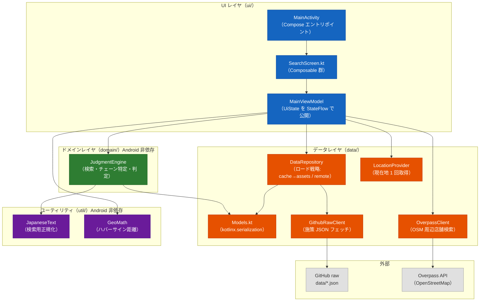
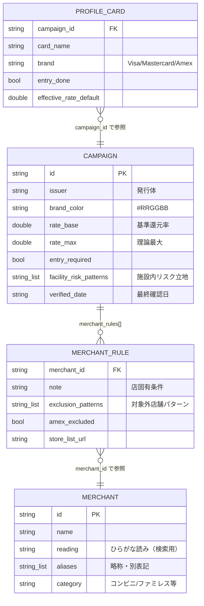
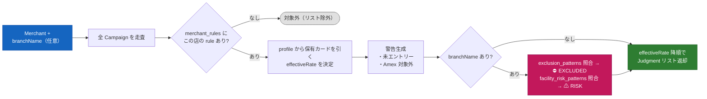
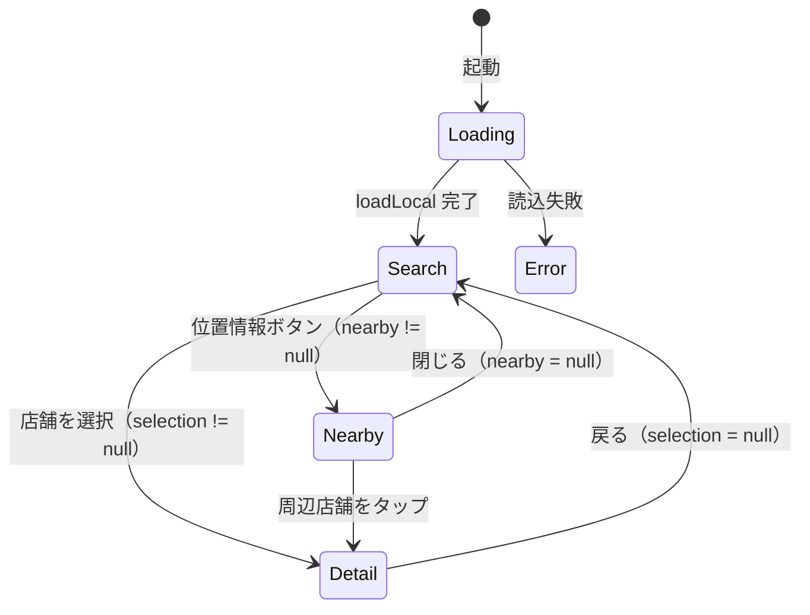
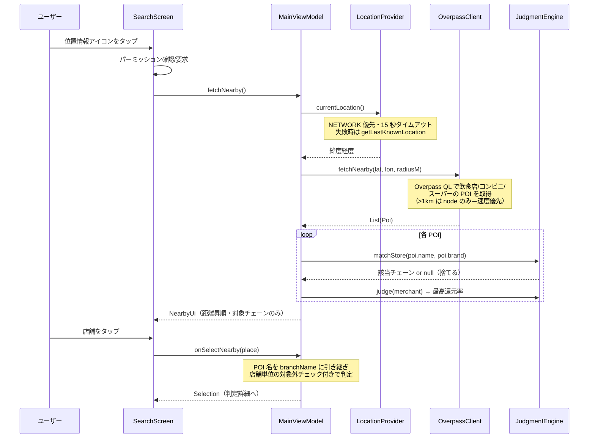

# poikatsu コード解説（学習用）

店舗名やカテゴリから「どの支払い方法が最も得か」を判定する Android アプリのコード解説ドキュメント。
Kotlin + Jetpack Compose の標準的な構成（MVVM + Repository）を学ぶための題材として、各レイヤの責務・設計判断・データフローを説明する。

- 対象リビジョン: Phase 1 完了 + 店舗単位対象外チェック + GPS 周辺検索 実装済み時点
- 全体計画: [PLAN.md](../PLAN.md) / データ仕様: [data/README.md](../data/README.md) / プロジェクト規約: [CLAUDE.md](../CLAUDE.md)

## 1. 全体アーキテクチャ

MVVM + Repository パターン。レイヤ間の依存は一方向（UI → Domain → Data）で、判定ロジック（domain/）と日本語処理（util/）は **Android 非依存の純 Kotlin** として書かれており、JVM ユニットテストで実データを使って検証できる。



### 設計判断のポイント

| 判断 | 理由 |
|---|---|
| Room を使わない | 施策データは数十件の JSON で全件メモリに乗る。リモート JSON をファイルキャッシュ（テキストのまま保存）するだけで十分だった（PLAN.md M4 実績メモ参照） |
| DI フレームワーク（Hilt）なし | クラス数が少なく手動 DI で足りる。`DataRepository` は関数（`readAsset` / `fetchRemote`）と `File` をコンストラクタ注入する形にして、フレームワークなしでテスタビリティを確保 |
| Google Play Services 不使用 | 位置情報はフレームワーク標準の `LocationManager` のみで実装（プロプライエタリ依存を増やさない） |
| 判定ロジックは純 Kotlin | `domain/` と `util/` は Android API に触れないため、実データ（`data/*.json`）を読むユニットテストが JVM 上で高速に回る |
| ロゴ画像不使用 | 商標・著作権リスク回避。`campaigns.json` の `brand_color`（#RRGGBB）で発行体を識別 |

## 2. ディレクトリ構成

```
poikatsu/
├── PLAN.md                 # 全体計画（フェーズ・マイルストーン）
├── CLAUDE.md               # プロジェクト規約（ライセンス方針ほか）
├── data/                   # 施策データ（単一ソース）
│   ├── merchants.json      # チェーン店マスタ（59 件、読み・エイリアス付き）
│   ├── campaigns.json      # 還元施策（三井住友・MUFG の 2 施策、計 62 ルール）
│   ├── profile.json        # ユーザー前提条件（保有カード・エントリー状況）
│   └── README.md           # データスキーマ仕様・更新ルール
├── docs/
│   └── licenses.md         # 依存ライブラリのライセンス調査
└── app/src/
    ├── main/java/com/ktakjm/poikatsu/
    │   ├── MainActivity.kt
    │   ├── ui/             # MainViewModel, SearchScreen, theme/
    │   ├── domain/         # JudgmentEngine（純 Kotlin）
    │   ├── data/           # Models, DataRepository, GithubRawClient,
    │   │                   # OverpassClient, LocationProvider
    │   └── util/           # JapaneseText, GeoMath（純 Kotlin）
    └── test/java/com/ktakjm/poikatsu/
        ├── JudgmentEngineTest.kt   # 実データを使った検索・判定テスト（23 件）
        ├── DataRepositoryTest.kt   # ロード戦略のテスト（5 件）
        └── NearbyTest.kt           # Overpass パース・距離計算のテスト（10 件）
```

ポイント: `data/` はリポジトリ直下にあり、`app/build.gradle.kts` の `assets.srcDir(rootProject.file("data"))` で **そのまま assets として同梱** される。同じファイルが GitHub raw 配信のソースでもあるため、「同梱データ」「リモートデータ」「テストデータ」が常に単一ソースで一致する。

## 3. データモデル（data/Models.kt）

`kotlinx.serialization` の `@Serializable` データクラス。JSON のスネークケースは `@SerialName` でマッピングする。



3 つの JSON の役割分担:

- `merchants.json` — チェーンの正規化マスタ。検索ヒット率は `reading` / `aliases` の充実度で決まる
- `campaigns.json` — 汎用的な施策情報のみ。**ユーザー固有の前提を書かない**（規約）
- `profile.json` — ユーザー前提（保有ブランド・エントリー済みか等）。常にローカル（assets）から読み、リモート更新の対象外

パースは `PoikatsuJson.parse()` に集約。`ignoreUnknownKeys = true` + `coerceInputValues = true` により、スキーマに後からフィールドを追加しても旧アプリが壊れない（前方互換）。

## 4. データ取得戦略（data/DataRepository.kt）

「即時表示 + 裏で更新」の 2 段構え。リモート取得失敗時は静かにローカルを使い続ける。


学習ポイント:

- **テスタビリティのための依存注入**: `DataRepository(readAsset, cacheDir, fetchRemote)` は Android の `Context` を一切受け取らない。本番では `app.assets.open(...)` と `GithubRawClient::fetch` を渡し、テストではラムダとテンポラリディレクトリを渡す
- **「成功した場合のみキャッシュ」**: 取得した生テキストをまずパースし、成功したものだけ `writeText` する。壊れた JSON でキャッシュを汚染しない
- **データソースの可視化**: `DataSource`（REMOTE / CACHE / BUNDLED）を UI まで運び、「最新データ取得済み / 前回取得データ(オフライン?)」と表示してデータ鮮度をユーザーに伝える

### リモート更新の発火タイミング（ui/MainViewModel.kt）

リモート取得は `init` ではなく **Lifecycle の ON_START 起点**（`SearchScreen` の `LifecycleEventObserver` → `onAppForeground()`）。初回起動でも必ず一度走り、フォアグラウンド復帰のたびに試行されるが、直近 1 時間以内に成功していればスキップする（施策データの更新は月数回なので十分）。`initialLoad.join()` でローカルロード完了を待ってからリモート結果を適用し、表示順序の競合を防いでいる。

## 5. 判定エンジン（domain/JudgmentEngine.kt）

このアプリの心臓部。Android 非依存で、3 つの仕事をする。

### 5.1 検索（search）

コンストラクタで全チェーンの検索キー（正規化済みの name / reading / aliases）を `searchIndex` として前計算する。検索はスコアリング方式:

| スコア | 条件 | 例 |
|---|---|---|
| 0 | 前方一致 | 「ガスト」→ ガスト |
| 1 | 部分一致 | 「ガスト」→ ステーキガスト |
| 2 | 単語境界つき包含（キー 3 文字以上） | 「マクドナルド渋谷店」→ マクドナルド |

`containsAsWord` は「マックスバリュ」が「マック」に誤ヒットしないための仕組み。キーの前後の隣接文字が **同じ文字種（かな同士・英数同士）で連続している場合は別単語の一部** とみなして弾く。漢字→かなのような文字種の切り替わりは単語境界として許容する（「くら寿司ららぽーと店」は OK）。

### 5.2 日本語正規化（util/JapaneseText.kt）

「セブン-イレブン」「ｾﾌﾞﾝｲﾚﾌﾞﾝ」「せぶんいれぶん」を同一視するための正規化パイプライン:

1. NFKC 正規化（全角・半角の統一。半角カナ→全角カナもここで解決）
2. 小文字化
3. 記号除去（スペース・中点・各種ハイフン等。長音「ー」は読みの一部なので残す）
4. カタカナ→ひらがな（コードポイントを `-0x60` シフト）

### 5.3 判定（judge）と店舗単位の警告



- `effectiveRate = card?.effectiveRateDefault ?: campaign.rateBase` — ユーザー前提（profile）があればそれを優先
- 店舗単位チェックは 2 段階の警告レベル（`BranchWarningLevel`）を持つ。**公式の対象外パターン一致（EXCLUDED）でも断定はせず「可能性が高い」表現に留める**（PLAN.md のリスク方針）
- `matchStore(storeName, brand)` は GPS 検索用。OSM の POI 名（「マクドナルド 渋谷駅前店」）からチェーンを特定する。「ステーキガスト」が「ガスト」に負けないよう、**一致キーが最長のチェーンを採用**する

## 6. UI レイヤ（ui/）

### 6.1 状態管理

`MainViewModel` が単一の `UiState`（data class）を `StateFlow` で公開し、`SearchScreen` が `collectAsState()` で購読する単方向データフロー（UDF）。状態更新はすべて `MutableStateFlow.update {}`（スレッドセーフな copy）で行う。

画面遷移は Navigation ライブラリを使わず、**UiState のフィールドで排他的に表現**するシンプルな状態機械:



戻る操作は Compose の `BackHandler` で実装。データ差し替え時（リモート更新成功時）は、表示中の `selection` があれば新データで判定を引き直す（`applyData` 内）。

### 6.2 判定カード表示

`JudgmentCard` は施策ごとに 1 枚。左端のストライプとカード名バッジに `brand_color` を使い、ロゴ画像なしで発行体を識別する。表示要素は「還元率（大）→ 条件達成時最大 → 店舗警告（⛔/⚠）→ 支払い方法 → 店固有条件 → エントリー警告 → 公式店舗一覧リンク → 上限 → **情報確認日**」の順。`verified_date` の表示は必須ルール（データが古くなるリスクへの対処）。

### 6.3 位置情報パーミッション

パーミッション要求は UI 層（`rememberLauncherForActivityResult`）の責務で、ViewModel は「許可済み前提」の `fetchNearby()` と「拒否された」`onLocationDenied()` だけを持つ。FINE / COARSE のどちらか片方でも許可されれば検索する。

## 7. GPS 周辺検索のデータフロー



Overpass 側の設計判断（`OverpassClient` のコメント参照）:

- 日本語名の正規表現フィルタはサーバ側で遅すぎるため、**カテゴリタグで広く取ってチェーン照合はクライアント側**で行う
- 半径 1km 超は `node` のみ取得（`way`＝建物ポリゴン店舗は落ちるが速度優先）
- 日本の OSM は支店名を `branch` タグに分ける慣習があるため、表示名は `name + branch` を結合

## 8. テスト戦略

`./gradlew :app:testDebugUnitTest` で全 38 テストが JVM 上で実行される（エミュレータ不要）。

| テスト | 対象 | 特徴 |
|---|---|---|
| `JudgmentEngineTest`（23 件） | 検索・正規化・判定・店舗警告 | **リポジトリ直下 `data/` の実データを読み込む**。「マック→マクドナルド」「マックスバリュは誤ヒットしない」等の振る舞いと、merchant_id 参照切れ等のデータ整合性チェックを兼ねる |
| `DataRepositoryTest`（5 件） | ロード戦略 | ラムダ注入により、キャッシュあり/なし/破損、リモート成功/失敗の各経路を File システムだけで検証 |
| `NearbyTest`（10 件） | Overpass パース・距離計算・チェーン特定 | 固定 JSON フィクスチャでネットワーク非依存 |

「実データをテストに使う」のがこのプロジェクトの肝で、**データ更新（JSON 編集）だけの変更でも CI 的にテストを流せば参照切れやエイリアス衝突を検出できる**。

## 9. 技術スタック早見表

| 項目 | 採用 | 備考 |
|---|---|---|
| 言語 / UI | Kotlin + Jetpack Compose (Material 3) | minSdk 29 / targetSdk 36 |
| アーキテクチャ | MVVM + Repository、手動 DI | 単一 ViewModel・単一 UiState |
| シリアライズ | kotlinx.serialization | ignoreUnknownKeys で前方互換 |
| HTTP | OkHttp（素のまま） | Retrofit/Ktor なし。GET 2 種 + POST 1 種のみなので十分 |
| ローカル保存 | ファイルキャッシュ（filesDir/remote_data/） | Room は見送り |
| 位置情報 | LocationManager（フレームワーク標準） | Play Services 不使用 |
| 周辺店舗 | Overpass API（OSM） | 無料・API キー不要 |
| データ配信 | GitHub raw（main ブランチ data/） | 更新はアプリ再ビルド不要 |

依存追加時は **ライセンス確認 → docs/licenses.md へ追記** が必須ルール（GPL/AGPL 不可。詳細は [CLAUDE.md](../CLAUDE.md)）。

## 10. この構成から学べること

- **単方向データフロー（UDF）**: StateFlow + 不変 UiState + update のパターン
- **依存注入をフレームワークなしでやる**: 関数型インターフェース（ラムダ）注入によるテスタブル設計
- **オフラインファースト**: 即時ローカル表示 + バックグラウンド更新 + 鮮度の可視化
- **ドメインロジックの分離**: Android 非依存に保つことで実データテストが高速に回る
- **日本語検索の実務**: NFKC 正規化・かなカナ同一視・単語境界判定・前方一致優先
- **外部 API との付き合い方**: Overpass の性能特性に合わせたクエリ設計、失敗時の null フォールバック
