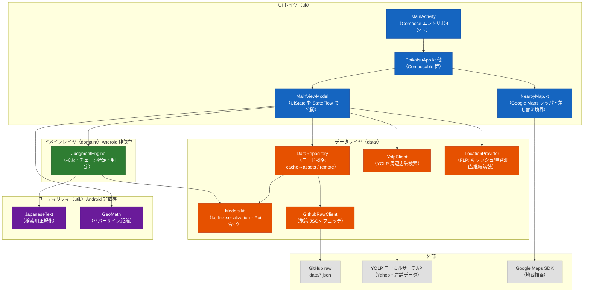
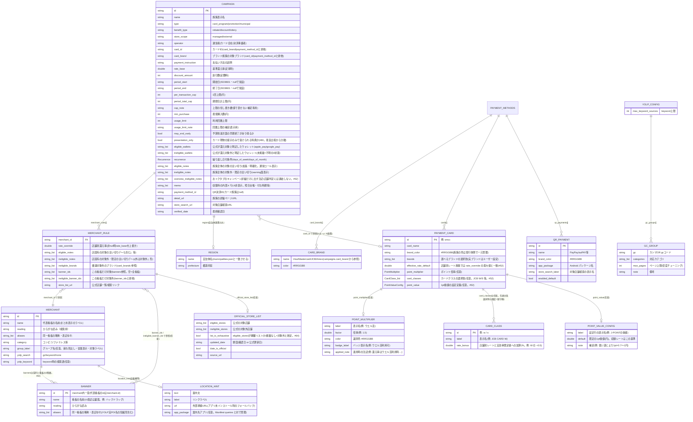
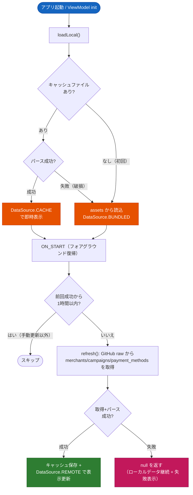
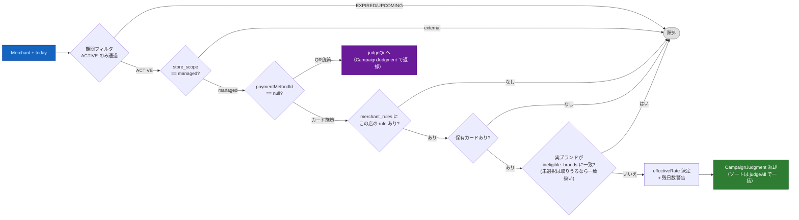
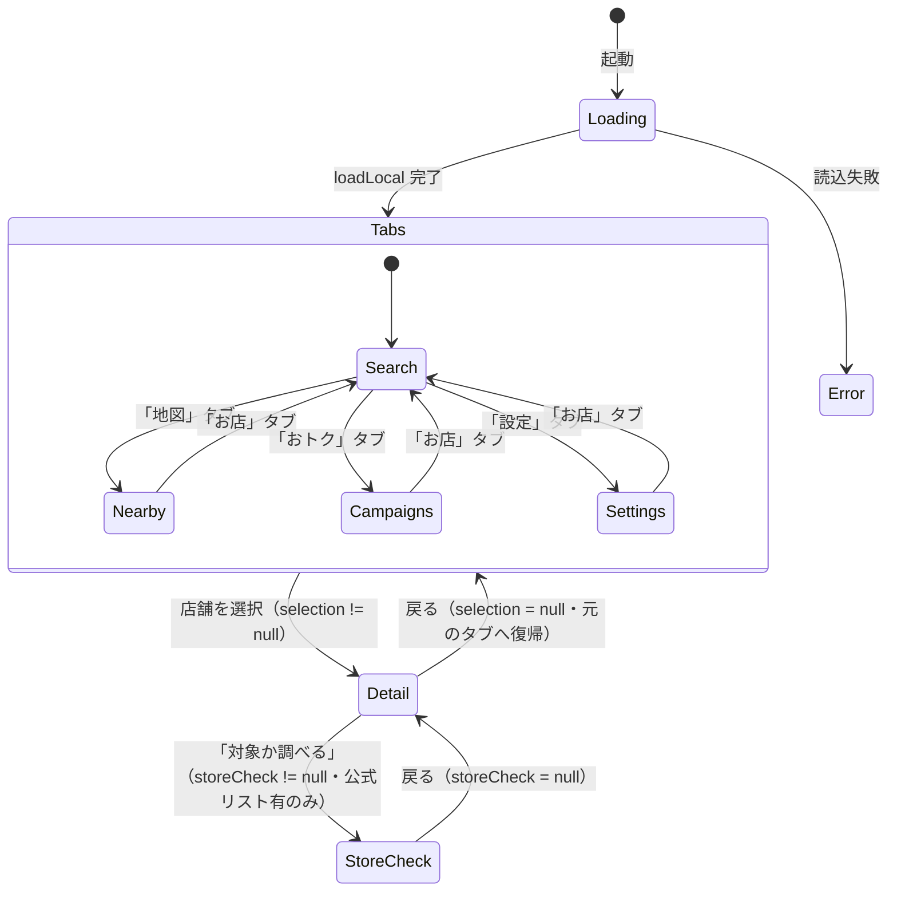
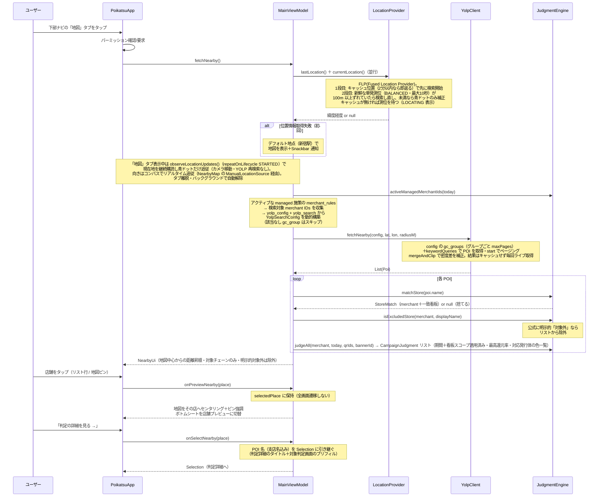

# poikatsu コード解説（学習用）

店舗名やカテゴリから「どの支払い方法が最もおトクか」を判定する Android アプリのコード解説ドキュメント。
Kotlin + Jetpack Compose の標準的な構成（MVVM + Repository）を学ぶための題材として、各レイヤの責務・設計判断・データフローを説明する。

- 対象リビジョン: Phase 1 完了 + Phase 2 キャンペーン拡張 Phase A〜F（期間限定キャンペーン・QR 決済・クーポン割引のデータ基盤、YOLP データ駆動化、おトクタブ+4タブナビ、判定画面の期間限定対応、設定画面拡張、データ投入）完了時点
- 全体計画: [PLAN.md](../PLAN.md) / データ仕様: [data/README.md](../data/README.md) / プロジェクト規約: [CLAUDE.md](../CLAUDE.md)

## 1. 全体アーキテクチャ

MVVM + Repository パターン。レイヤ間の依存は一方向（UI → Domain → Data）で、判定ロジック（domain/）と日本語処理（util/）は **Android 非依存の純 Kotlin** として書かれており、JVM ユニットテストで高速に検証できる。ロジックテストはフィクスチャデータで自己完結し、実データ（`data/*.json`）の整合性は専用の `*RealDataTest` で検証する。


```mermaid
graph TD
    subgraph ui["UI レイヤ（ui/）"]
        ACT["MainActivity<br/>（Compose エントリポイント）"]
        SCR["PoikatsuApp.kt 他<br/>（Composable 群）"]
        VM["MainViewModel<br/>（UiState を StateFlow で公開）"]
        MAP["NearbyMap.kt<br/>（Google Maps ラッパ・差し替え境界）"]
    end
    subgraph domain["ドメインレイヤ（domain/）Android 非依存"]
        ENG["JudgmentEngine<br/>（検索・チェーン特定・判定）"]
    end
    subgraph dat["データレイヤ（data/）"]
        REPO["DataRepository<br/>（ロード戦略: cache→assets / remote）"]
        MODELS["Models.kt<br/>（kotlinx.serialization・Poi 含む）"]
        GH["GithubRawClient<br/>（施策 JSON フェッチ）"]
        YL["YolpClient<br/>（YOLP 周辺店舗検索）"]
        LOC["LocationProvider<br/>（FLP: キャッシュ/単発測位/継続購読）"]
    end
    subgraph util["ユーティリティ（util/）Android 非依存"]
        JT["JapaneseText<br/>（検索用正規化）"]
        GEO["GeoMath<br/>（ハバーサイン距離）"]
    end
    subgraph ext["外部"]
        RAW["GitHub raw<br/>data/*.json"]
        YOLP["YOLP ローカルサーチAPI<br/>（Yahoo・店舗データ）"]
        GMAP["Google Maps SDK<br/>（地図描画）"]
    end

    ACT --> SCR
    SCR --> VM
    SCR --> MAP
    MAP --> GMAP
    VM --> ENG
    VM --> REPO
    VM --> YL
    VM --> LOC
    VM --> GEO
    ENG --> JT
    ENG --> MODELS
    REPO --> MODELS
    REPO --> GH
    GH --> RAW
    YL --> YOLP

    style ACT fill:#1565C0,stroke:#0D47A1,color:#fff
    style SCR fill:#1565C0,stroke:#0D47A1,color:#fff
    style VM fill:#1565C0,stroke:#0D47A1,color:#fff
    style ENG fill:#2E7D32,stroke:#1B5E20,color:#fff
    style REPO fill:#E65100,stroke:#BF360C,color:#fff
    style MODELS fill:#E65100,stroke:#BF360C,color:#fff
    style GH fill:#E65100,stroke:#BF360C,color:#fff
    style YL fill:#E65100,stroke:#BF360C,color:#fff
    style LOC fill:#E65100,stroke:#BF360C,color:#fff
    style JT fill:#6A1B9A,stroke:#4A148C,color:#fff
    style GEO fill:#6A1B9A,stroke:#4A148C,color:#fff
    style RAW fill:#E0E0E0,stroke:#9E9E9E,color:#333
    style YOLP fill:#E0E0E0,stroke:#9E9E9E,color:#333
    style GMAP fill:#E0E0E0,stroke:#9E9E9E,color:#333
    style MAP fill:#1565C0,stroke:#0D47A1,color:#fff
```

### 設計判断のポイント

| 判断 | 理由 |
|---|---|
| Room を使わない | 施策データは数十件の JSON で全件メモリに乗る。リモート JSON をファイルキャッシュ（テキストのまま保存）するだけで十分だった（PLAN.md M4 実績メモ参照） |
| DI フレームワーク（Hilt）なし | クラス数が少なく手動 DI で足りる。`DataRepository` は関数（`readAsset` / `fetchRemote`）と `File` をコンストラクタ注入する形にして、フレームワークなしでテスタビリティを確保 |
| 地図は Google Maps（2026-06-20〜） | 当初は Play Services 非依存を掲げ osmdroid（OSM）を採用していたが、OSM はデータ品質（新規店・支店名欠落）と地図デザインが実用に劣るため、描画を **Google Maps SDK**・店舗データを **YOLP** へ移行。**Play Services 依存・API キー・課金アカウントを受け入れる方針転換**。位置情報も当初は `LocationManager`（Play Services 非依存）を維持していたが、単発測位の遅さ・古いキャッシュ表示の問題から 2026-07-08 に **Fused Location Provider**（`play-services-location`。maps で受け入れ済みの GMS 依存の範囲内・課金対象外）へ移行。経緯・規約・フェーズ戦略は docs/map-data-stack.md、依存は docs/licenses.md |
| 判定ロジックは純 Kotlin | `domain/` と `util/` は Android API に触れないため、フィクスチャデータを使ったユニットテストが JVM 上で高速に回る。実データ（`data/*.json`）の整合性検証は専用の `*RealDataTest` クラスで行う |
| ロゴ画像不使用 | 商標・著作権リスク回避。発行体の `brand_color`（#RRGGBB。`payment_methods.json` の cards / card_brands / qr_payments で一元管理）で識別 |

## 2. ディレクトリ構成

```
poikatsu/
├── PLAN.md                 # 全体計画（フェーズ・マイルストーン）
├── CLAUDE.md               # プロジェクト規約（ライセンス方針ほか）
├── data/                   # 施策データ（単一ソース）
│   ├── merchants.json      # チェーン店マスタ（59 件）+ YOLP 検索設定（yolp_config）
│   ├── campaigns.json      # 還元施策（常設 card_program + キャンペーン promotion + 自治体 municipal）
│   ├── payment_methods.json # 決済手段カタログ（カード + QR 決済のマスタ）
│   ├── municipalities.json # 全国自治体マスタ（47 都道府県・1,741 市区町村・自治体グループ。scripts/ で自動生成）
│   └── README.md           # データスキーマ仕様・更新ルール
├── docs/
│   ├── licenses.md         # 依存ライブラリのライセンス調査
│   ├── roadmap.md          # 進捗とロードマップ
│   └── code-guide.md       # このドキュメント
└── app/src/
    ├── main/java/com/ktakjm/poikatsu/
    │   ├── MainActivity.kt
    │   ├── PoikatsuApplication.kt  # Timber 初期化（debug のみ DebugTree）
    │   ├── ui/             # MainViewModel, PoikatsuApp, SettingsScreen,
    │   │                   # PaymentMethodsSettings, MunicipalitySettings,
    │   │                   # CampaignScreen, JudgmentScreen, UiHelpers,
    │   │                   # NearbyMap, theme/
    │   ├── domain/         # JudgmentEngine（純 Kotlin）
    │   ├── data/           # Models, DataRepository, GithubRawClient,
    │   │                   # YolpClient, LocationProvider, SettingsRepository
    │   └── util/           # JapaneseText, GeoMath（純 Kotlin）
    └── test/java/com/ktakjm/poikatsu/
        ├── JudgmentEngineTest.kt        # フィクスチャで検索・判定ロジックを検証（48 件）
        ├── JudgmentEngineRealDataTest.kt # 実データの整合性・施策固有の振る舞い検証（18 件）
        ├── BannerTest.kt                 # 系列と看板の2階層（照合・看板スコープ・実データの取りこぼし/誤爆検知。#60）
        ├── DataRepositoryTest.kt         # ロード戦略のテスト（8 件、インライン JSON フィクスチャ）
        └── NearbyTest.kt                 # チェーン特定・YOLP パース・密度クリップ・YolpSearchConfig（25 件）
```

ポイント: `data/` はリポジトリ直下にあり、`app/build.gradle.kts` の `assets.srcDir(rootProject.file("data"))` で **そのまま assets として同梱** される。同じファイルが GitHub raw 配信のソースでもあるため、「同梱データ」「リモートデータ」「テストデータ」が常に単一ソースで一致する。

## 3. データモデル（data/Models.kt）

`kotlinx.serialization` の `@Serializable` データクラス。JSON のスネークケースは `@SerialName` でマッピングする。


```mermaid
erDiagram
    MERCHANT {
        string id PK
        string name "代表看板の名前(まとめ表示のラベル)"
        string reading "ひらがな読み（検索用）"
        string_list aliases "同一看板の略称・表記ゆれ"
        string category "コンビニ/ファミレス等"
        string group_label "グループ名(任意。束ね見出し・従属表示・対象ラベル)"
        string yolp_search "gc/keyword/none"
        string yolp_keyword "keyword時の検索語(任意)"
    }
    BANNER {
        string id PK "merchant内一意(代表看板のidはmerchant.id)"
        string name "看板の名前(UI表記は業態。例: ハックドラッグ)"
        string reading "ひらがな読み"
        string_list aliases "同一看板の略称・表記ゆれ(YOLP実POI名の短縮形含む)"
    }
    LOCATION_HINT {
        string text "案内文"
        string label "リンクラベル"
        string url "外部導線URL(アプリ未インストール時のフォールバック)"
        string app_package "案内先アプリ(任意。Manifest queries と対で管理)"
    }
    CAMPAIGN {
        string id PK
        string name "施策表示名"
        string type "card_program/promotion/municipal"
        string benefit_type "rebate/discount/lottery"
        string store_scope "managed/external"
        string operator "運営者(カード会社/決済事業者)"
        string card_id "カードID(card_brand/payment_method_idと排他)"
        string card_brand "ブランド施策の対象ブランド(card_id/payment_method_idと排他)"
        string payment_instruction "支払い方法の説明"
        double rate_base "基準還元率(定率時)"
        int discount_amount "割引額(定額時)"
        string period_start "開始日(ISO8601・nullで常設)"
        string period_end "終了日(ISO8601・nullで常設)"
        int per_transaction_cap "1回上限(円)"
        int period_total_cap "期間合計上限(円)"
        string cap_note "上限の但し書き(数値で表せない補足専用)"
        int min_purchase "最低購入額(円)"
        int usage_limit "利用回数上限"
        string usage_limit_note "回数上限の補足(表示用)"
        bool may_end_early "予算到達次第の早期終了があり得るか"
        bool presentation_only "カード現物の提示のみで受けられる特典か(#80。最良比較から分離)"
        string_list eligible_wallets "公式が還元対象と明記したウォレット(apple_pay/google_pay)"
        string_list ineligible_wallets "公式が還元対象外と明記したウォレット(未掲載=不明の3状態)"
        Recurrence recurrence "繰り返し日付条件(days_of_week/days_of_month)"
        string_list eligible_notes "施策全体の対象の言い切り(拡張・明確化。通常ロール表示)"
        string_list ineligible_notes "施策全体の対象外・限定の言い切り(warning面表示)"
        string_list overview_ineligible_notes "おトクタブのキャンペーン詳細だけに出す注記(店舗判定には連結しない。#52)"
        string_list memo "収集時の内部メモ(UI非表示。照合台帳・付与時期等)"
        string payment_method_id "QR決済ID(カード施策はnull)"
        string detail_url "施策の詳細ページURL"
        string store_search_url "対象店舗検索URL"
        string verified_date "最終確認日"
    }
    REGION {
        string name "自治体名(municipalities.jsonと一致させる)"
        string prefecture "都道府県"
    }
    MERCHANT_RULE {
        string merchant_id FK
        double rate_override "店舗別還元率(非null時rate_baseを上書き)"
        string_list eligible_notes "店固有の対象の言い切り(「〜も含む」等)"
        string_list ineligible_notes "店固有の対象外・限定の言い切り(「〜以外は対象外」形)"
        string_list ineligible_brands "優遇対象外のブランド(card_brands 参照)"
        string_list banner_ids "この看板だけ対象(banners参照。空=全看板)"
        string_list ineligible_banner_ids "この看板だけ対象外(banner_idsと排他)"
        string store_list_url "公式店舗一覧/検索リンク"
    }
    OFFICIAL_STORE_LIST {
        string_list eligible_stores "公式の対象店舗"
        string_list ineligible_stores "公式の対象外店舗"
        bool list_is_exhaustive "eligible_storesが網羅リストか(掲載なし=対象外と断定。#64)"
        string updated_date "鮮度(確認日 or 公式更新日)"
        bool date_is_official
        string source_url
    }
    PAYMENT_METHODS {
    }
    CARD_BRAND {
        string name "Visa/Mastercard/JCB/Amex(campaigns.card_brand から参照)"
        string color "#RRGGBB"
    }
    PAYMENT_CARD {
        string id PK "例: smcc"
        string card_name
        string brand_color "#RRGGBB(施策の色は発行体側で一元管理)"
        string_list brands "選べるブランドの選択肢(実ブランドはユーザー設定)"
        double effective_rate_default "店舗別レート施策では rate_override の最大値と一致(#52)"
        PointMultiplier point_multiplier "ポイント倍率(任意)"
        CardClass_list card_classes "カードクラスの選択肢(任意。JCB W/S 等。#52)"
        PointValueConfig point_value "1pt価値の設定定義(任意。#52)"
    }
    CARD_CLASS {
        string id PK "例: w / s"
        string label "表示名(例: JCB CARD W)"
        double rate_bonus "店舗別レートと実効率既定値への加算(%。例: W の +0.5)"
    }
    POINT_VALUE_CONFIG {
        string label "設定行の表示名(例: J-POINTの価値)"
        double default "既定の1pt価値(円)。収録レートはこの基準"
        string note "補足(例: 使い道により1pt=0.7〜1円)"
    }
    POINT_MULTIPLIER {
        string label "表示名(例: ウエル活)"
        double factor "倍率(例: 1.5)"
        string color "識別色 #RRGGBB"
        string badge_label "バッジ表示名(例: ウエル活利用可)"
        string applied_note "適用時の注記(例: 還元率はウエル活利用時…)"
    }
    QR_PAYMENT {
        string id PK
        string name "PayPay/auPAY等"
        string brand_color "#RRGGBB"
        string app_package "Android パッケージ名"
        string store_search_label "対象店舗検索の表示名"
        bool enabled_default
    }
    YOLP_CONFIG {
        int max_keyword_sources "keyword上限"
    }
    GC_GROUP {
        string gc "カンマOR gcコード"
        string_list categories "対応カテゴリ"
        int max_pages "ページ上限(密度チューニング)"
        string note "備考"
    }
    PAYMENT_METHODS ||--o{ CARD_BRAND : "card_brands[]"
    PAYMENT_METHODS ||--o{ PAYMENT_CARD : "cards[]"
    PAYMENT_METHODS ||--o{ QR_PAYMENT : "qr_payments[]"
    CAMPAIGN ||--o{ MERCHANT_RULE : "merchant_rules[]"
    CAMPAIGN ||--o| REGION : "region(自治体施策のみ)"
    MERCHANT ||--o{ BANNER : "banners[](系列と看板の2階層。#60)"
    MERCHANT ||--o| LOCATION_HINT : "location_hint(自販機等)"
    MERCHANT_RULE }o--|| MERCHANT : "merchant_id で参照"
    MERCHANT_RULE }o--o{ BANNER : "banner_ids / ineligible_banner_ids で参照(任意)"
    MERCHANT_RULE ||--o| OFFICIAL_STORE_LIST : "official_store_list(任意)"
    CAMPAIGN }o--o| PAYMENT_CARD : "card_id で参照(1カード:N施策)"
    PAYMENT_CARD ||--o| POINT_MULTIPLIER : "point_multiplier(任意)"
    PAYMENT_CARD ||--o{ CARD_CLASS : "card_classes[](任意。先頭が未選択時の既定=保守側)"
    PAYMENT_CARD ||--o| POINT_VALUE_CONFIG : "point_value(任意)"
    YOLP_CONFIG ||--o{ GC_GROUP : "gc_groups[]"
```

3 つの JSON の役割分担:

- `merchants.json` — チェーンの正規化マスタ。**1 merchant = 1 系列**（施策の帰属単位）で、傘下で別の名前を掲げる**看板**（UI 表記は「業態」）は `banners` に入れ子で持つ（#60。merchant 自身の name/reading/aliases は「代表看板」= banner id は merchant.id）。施策側は `merchant_id` を書くだけで傘下看板がすべて対象になり、看板単位の対象/対象外は `merchant_rules[].banner_ids` / `ineligible_banner_ids` で表す。alias（同一看板の略称・表記ゆれ）と banner（別の看板）の線引き・照合制約・運用ルールは data/README.md「系列と看板」参照。検索ヒット率は `reading` / `aliases` の充実度で決まる。トップレベルに `yolp_config`（YOLP 検索の gc グループ定義・密度チューニング用の `max_pages`）を持ち、各 merchant の `yolp_search`（`gc`/`keyword`/`none`）で検索方式を指定する。`YolpClient` はこの設定から `YolpSearchConfig` を動的に構築し、アクティブな施策が参照する merchant だけを検索対象にする（該当 merchant がいない gc_group はスキップ）。位置情報を持たない発行体（自販機など）は `location_hint` で外部導線（Coke ON アプリ等）を案内し、「近くのこのお店を探す」を出さない
- `campaigns.json` — 汎用的な施策情報のみ。**ユーザー固有の前提を書かない**（規約）。`type` で常設カード（`card_program`）/ キャンペーン（`promotion`。managed=特定チェーン対象、external=全加盟店対象のおトクタブ専用。#44）/ 自治体施策（`municipal`）を区分し、`benefit_type` でポイント還元（`rebate`）/ 即時割引（`discount`）を区分し、定率/定額は `rate_base` / `discount_amount` のどちらが入っているかで導出する。`store_scope` が `managed` ならチェーン検索・地図に表示、`external` ならおトクタブのみ表示（`detail_url`/`store_search_url` で公式ページへリンク）。施策の帰属は `card_id`（カード施策。payment_methods.json の `cards[].id` を参照、1 カード : N 施策）か `payment_method_id`（QR 施策・自治体施策）の**ちょうど一方**を持つ
- `payment_methods.json` — 決済手段カタログ（カード `cards` + QR 決済 `qr_payments`）。ユーザー固有値は持たず（差分は DataStore）、merchants/campaigns と同様にリモート更新・テストデータ切替の対象。`point_multiplier`（`PointMultiplier`）を持つカードはポイント価値の倍率（例: ウエル活 ×1.5）を設定画面で ON/OFF でき、ON 時は `effectiveRateDefault × factor` が実質還元率になる。`point_multiplier.color` はウエルシアのロゴ色など識別バッジに使う。`card_classes`（同一製品内のグレード差。JCB CARD W/S 等）と `point_value`（1pt 価値が使い道で変動するポイント通貨）を持つカード（#52）は、どのクラスか・1pt をいくらとみなすかをユーザー設定（`CardOverride.cardClass` / `pointValue`）で持ち、マージ時に `(率 + クラス加算) × 1pt価値` で実効率へ合成する（店舗別レート用の `rateBonus` / `rateMultiplier` もマージ後カードに載る。§5.4 参照）

パースは `PoikatsuJson.parse()` に集約。`ignoreUnknownKeys = true` + `coerceInputValues = true` により、スキーマに後からフィールドを追加しても旧アプリが壊れない（前方互換）。

## 4. データ取得戦略（data/DataRepository.kt）

「即時表示 + 裏で更新」の 2 段構え。リモート取得失敗時は静かにローカルを使い続ける。


```mermaid
flowchart TD
    START(["アプリ起動 / ViewModel init"]) --> LL["loadLocal()"]
    LL --> HASCACHE{"キャッシュファイル<br/>あり?"}
    HASCACHE -- "あり" --> PARSE1{"パース成功?"}
    PARSE1 -- "成功" --> CACHE["DataSource.CACHE<br/>で即時表示"]
    PARSE1 -- "失敗（破損）" --> BUNDLED["assets から読込<br/>DataSource.BUNDLED"]
    HASCACHE -- "なし（初回）" --> BUNDLED
    CACHE --> FG["ON_START（フォアグラウンド復帰）"]
    BUNDLED --> FG
    FG --> SKIP{"前回成功から<br/>1時間以内?"}
    SKIP -- "はい（手動更新以外）" --> NOP(["スキップ"])
    SKIP -- "いいえ" --> FETCH["refresh(): GitHub raw から<br/>merchants/campaigns/payment_methods を取得"]
    FETCH --> OK{"取得+パース<br/>成功?"}
    OK -- "成功" --> SAVE["キャッシュ保存 +<br/>DataSource.REMOTE で表示更新"]
    OK -- "失敗" --> KEEP["null を返す<br/>（ローカルデータ継続 + 失敗表示）"]

    style START fill:#1565C0,stroke:#0D47A1,color:#fff
    style SAVE fill:#2E7D32,stroke:#1B5E20,color:#fff
    style KEEP fill:#C2185B,stroke:#880E4F,color:#fff
    style BUNDLED fill:#E65100,stroke:#BF360C,color:#fff
    style CACHE fill:#E65100,stroke:#BF360C,color:#fff
```

学習ポイント:

- **テスタビリティのための依存注入**: `DataRepository(readAsset, cacheDir, fetchRemote)` は Android の `Context` を一切受け取らない。本番では `app.assets.open(...)` と `GithubRawClient::fetch` を渡し、テストではラムダとテンポラリディレクトリを渡す
- **「成功した場合のみキャッシュ」**: 取得した生テキストをまずパースし、成功したものだけ `writeText` する。壊れた JSON でキャッシュを汚染しない
- **データソースの可視化**: `DataSource`（REMOTE / CACHE / BUNDLED）を UI まで運び、「最新データ取得済み / 前回取得データ(オフライン？)」と表示してデータ鮮度をユーザーに伝える

### 同梱データ直読モード（開発者向け、#36）

設定 → 開発者向け → 開発者モード ON → 「同梱データを使う」を ON にすると `loadBundled(dataDir)` が assets を直読し、キャッシュ・リモート取得を両方バイパスする。データ（data/*.json、municipalities.json 含む）をローカル編集 → `installDebug` するだけで **push せずに実機検証**できる。仕組み:

- **Gradle**: `data/` と `data-test/` は同名ファイルを含むため srcDir 直付けでは asset マージが衝突する。`bundleDataAssets`（Sync タスク）が両ディレクトリを構造ごと `build/generated/dataAssets/` に集めて（`*.md` 除外）assets に同梱し、`preBuild` が依存する。assets 内は `data/xxx.json` / `data-test/xxx.json` のパス構造
- **取得元マトリクス**: `useTestData`（data/⇔data-test/）と `useBundledData`（リモート⇔assets）は直交する。`readAsset` は `"data/merchants.json"` のようなパスを受け、`DataRepository` が `dataDir` を前置するため、リモートの `dataDir` 切替と対称になる
- **ON 中の挙動**: `refresh()` は自動・手動とも即 return（データサブページの「今すぐ更新」と開発者向けサブページの「データ取得先 commit」「使用中データの commit」はグレーアウト）。ON 中の useTestData 切替は assets の再読で反映。municipalities.json も `dataDir` に追従する（リモート取得の対象外は従来どおり）
- **OFF 復帰**: `refresh(force = true)` で通常運用へ（dataCommitRef 変更時と同じ扱い）
- **表示**: データ更新状況欄に「同梱データ表示中(開発者設定)」。BUNDLED はキャッシュなしフォールバックでも立つため、トグル ON 時のみこの文言にして実データとの取り違えを防ぐ。同梱 JSON のパース失敗（編集ミス）は直前のデータを残して Snackbar で知らせる

### 開発者モード（#37）

開発者向け設定（`dataCommitRef` / `useTestData` / `useBundledData`。今後増える開発者向け項目もここ）は、「開発者向け」サブページ（`DeveloperSettingsPage`）内で「開発者モード」トグルを ON にしたときだけ現れる。一般利用時に設定画面が長くならないこと、テストデータの戻し忘れ事故を防ぐことが目的。

- **画面**: 設定サブページの一つ（#47 で設定トップの階層化に統合。`UiState.settingsSubpage = DEVELOPER` + topBar/本文 when の分岐 + `BackHandler`。下部ナビは非表示）。設定トップの「開発者向け」行には ON/OFF と非既定値のサマリ（`developerRowSummary`。例「開発者モード オン・テストデータ ON・ref=abc1234」）を出し、遷移せずに現在の状態が分かる
- **切替確認**: ON/OFF とも `AlertDialog` で確認を挟む（ON=開発者専用・想定外挙動の注意、OFF=一括リセットの注意）
- **OFF 時の一括リセット**: `SettingsRepository.resetDeveloperSettings()` が 1 回の edit で ref/testData/bundled を既定値へ戻し `developerMode=false` にする。emission が 1 度なので既存の変更検知（`settingsJob` → `refresh(force = true)`）が 1 回だけ働き本番データへ自動復帰する。ON にしたときは何も変えない（常に既定値から始まる）
- **カスタムキャンペーン・対象外ペアのモード分離（#65 / #68）**: どちらもデータセットの ID（payment_methods / merchants / campaigns）を参照するユーザーデータだが、data/ と data-test/ では ID 体系が異なり前提が噛み合わない（対象外ペアは特に、テストデータ表示中は通常側の登録が全件「終了したキャンペーン」と誤判定され、一括削除で本物の登録が消える footgun があった）。そのため保存キーを `custom_campaigns` / `custom_campaigns_test`、`excluded_store_pairs` / `excluded_store_pairs_test` に分け、読み書きとも現在の `useTestData` 側だけを使う（`AppSettings.activeCustomCampaigns` / `activeExcludedStorePairs`。書き込みは同一トランザクション内でモード判定）。テスト側は検証用の一時データなので JSON バックアップ対象外、開発者モード OFF のリセットでも消さない（次回 ON で再利用できる）
- **使用中データの commit 表示**: `refresh()` は先に GitHub API（`GithubRawClient.resolveCommitSha`。`Accept: application/vnd.github.sha` でプレーンテキスト取得）で ref をフル SHA に解決し、**3 ファイルの raw 取得をその SHA に固定**する（branch 名のまま順に取ると取得の合間の push で別 commit の内容が混ざり得るため）。SHA はキャッシュ（`commit_sha.txt`）にも保存し、CACHE 起動でも表示できる。解決失敗（オフライン・API 制限）は従来どおり ref のまま取得し「不明」、同梱モード中はグレーアウト（`LoadedData.commitSha` → `UiState.dataCommitSha`）

### リモート更新の発火タイミング（ui/MainViewModel.kt）

リモート取得は `init` ではなく **Lifecycle の ON_START 起点**（`PoikatsuApp` の `LifecycleEventObserver` → `onAppForeground()`）。初回起動でも必ず一度走り、フォアグラウンド復帰のたびに試行されるが、直近 1 時間以内に成功していればスキップする（施策データの更新は月数回なので十分）。`initialLoad.join()` でローカルロード完了を待ってからリモート結果を適用し、表示順序の競合を防いでいる。自動更新は設定でオフにでき（その場合フォアグラウンド時の自動取得をしない／手動更新は可）。

### 設定の永続化（data/SettingsRepository.kt）

テーマ・データ取得・マイカード・QR 決済・自治体の設定は **DataStore Preferences**（`SettingsRepository`）に保存する。テーマ／dynamic color／自動更新は型付きキー、カード差分（`CardOverride`：所有・還元率・ブランド・ウエル活）はカード id（payment_methods.json の `cards[].id`）をキーにした Map を JSON 文字列として 1 キーに格納する（キー数が可変でも Preferences のキーを増やさない）。QR 決済の有効 ID（`Set<String>`）・カタログ外カードの保有ブランド（`owned_brands`: `Set<String>`。card_brand 施策の仮想カード合成に使う）・登録エリア（`registered_areas`: `List<RegisteredArea>`。自治体単体かグループを type+code で持ち、おトクタブの地域フィルタに使う）・ユーザー登録の対象外ペア（`excluded_store_pairs`: `List<ExcludedStorePair>`。#63。詳細は 5.4）も同様に JSON 文字列として格納する。カスタムキャンペーン（`custom_campaigns` / `custom_campaigns_test`。#65）と対象外ペア（`excluded_store_pairs` / `excluded_store_pairs_test`。#68）は通常データ用とテストデータ用の 2 キーに分かれ、`useTestData` に応じた側だけを読み書きする（「開発者モード」節参照）。`MainViewModel` は `settings` Flow を購読し、変更のたびに **payment_methods.json（カタログ＝既定値）へユーザー差分を重ねて**エンジンを作り直す（マージは VM 層、`JudgmentEngine` は純 Kotlin のまま）。payment_methods.json 自体は書き換えない。テーマは描画前に必要なので `MainActivity` が `state.themeMode`/`dynamicColor` を `PoikatsuTheme` に渡す（6.1 参照）。

### 設定のバックアップと引き継ぎ（#50 / #51）

ユーザー固有データ（マイカード差分・所有ブランド・コード決済・マイエリア・カスタムカード/キャンペーン）は DataStore にしか無く、端末が変われば消える。引き継ぎ経路は **自動（Auto Backup）と手動（JSON エクスポート）の 2 本立て**。

**Auto Backup（#51）**: `AndroidManifest.xml` は `allowBackup="true"` + `dataExtractionRules`（API 31+）/ `fullBackupContent`（API 30 以下）を指定し、ルールファイル（`res/xml/data_extraction_rules.xml` / `backup_rules.xml`）は **除外なし = アプリデータを全部バックアップ**。これは意図的な選択で、各ファイルのコメントにも理由を明記している。対象は DataStore と `filesDir/remote_data`（data/*.json のキャッシュ）だけで、認証情報も端末固有データも持たず、25MB 枠に対して桁違いに小さいため。キャッシュの復元は初回起動時のオフラインフォールバックとしてむしろプラス。**今後 DataStore に「復元されると困るキー」を足すときは両ファイルに `<exclude>` を追加する**（片方だけだと OS 版で挙動がずれる）。復元テストの手順は下記。

**JSON エクスポート/インポート（#50）**: Auto Backup は (1) Google アカウント+バックアップ設定が有効な場合のみ、(2) 復元タイミングを制御できない（インストール時のみ）、(3) 取れているかアプリから確認できない、という制約がある。手入力資産（カスタムカード・カスタムキャンペーン）を失う痛みが大きいため、明示的な保険として設定 → **バックアップ**サブページ（`BackupSettingsPage`）に書き出し/復元を置く。

- **形式**: `SettingsBackup`（data/SettingsBackup.kt）を 1 ファイルの JSON に整形出力（`prettyPrint` + `encodeDefaults`。不具合報告でそのまま読める）。キー名は埋め込む `CustomCampaign` 等が DataStore に camelCase で保存済みなのに合わせ **camelCase**（同梱データの snake_case とは別系統）
- **含める/含めない**: 含めるのは端末をまたいで持っていく意味があるものだけ。開発者向け設定（ref/testData/bundled/developerMode）は端末ごとの一時状態なので除外し、復元時も現在値を書き換えない。通知済みキーは設定値でなく通知ジョブの内部状態なので除外。テストデータ側のカスタムキャンペーン（`custom_campaigns_test`。#65）・対象外ペア（`excluded_store_pairs_test`。#68）も検証用の一時データなので除外し、復元でも触らない（通常側のみ全上書き）
- **スキーマ版**: `schemaVersion`（現在 1）。キー追加は旧ファイルが既定値で読めるので上げず、非互換変更のときだけ上げる。**`schemaVersion` に既定値を持たせない**のが要点で、無関係な JSON を選んだときにパースを失敗させる（既定値ありだと「全部既定値のバックアップ」として読めてしまい、復元で設定を消す事故になる）。読み込み側が現在版より新しいファイルは読まずに断る
- **経路**: SAF（`CreateDocument` / `OpenDocument`）でユーザーがファイルを選ぶ。ストレージのパーミッションは持たない。書き出しは `"wt"`（切り詰め）で開き、既存ファイルへの上書きで前の内容が末尾に残らないようにする。読み込みは 1MB で打ち切り（誤って動画等を選ばれてもメモリを食い潰さない）
- **適用**: 選択 → 中身の要約（`backupContentSummary`）付き確認ダイアログ → `SettingsRepository.importSettings()` が **1 回の edit で全上書き**（emission 1 回 = rebuild 1 回）。マージはしない。通知ジョブ（WorkManager）は DataStore と別管理なので、復元値に合わせて `schedule`/`cancel` し直す
- **実行時パーミッションは復元時に取り直す**: 通知の許可はアプリが持てる情報ではないのでバックアップに入らない。通知 ON のファイルを未許可の端末に復元すると「設定は ON なのに通知が来ない」状態になるため、確認ダイアログの「復元」で **POST_NOTIFICATIONS を要求してから適用**する（Android 13+ かつ未許可のときだけ。ダイアログ本文にも要求することを予告する）。拒否されたら通知だけ OFF に落として復元し、Snackbar でその旨を伝える（通知サブページの ON 操作と同じ「許可を取ってから ON にする」方針。判定は共通の `notificationPermissionGranted()`）。Auto Backup 経路では権限付与状態を OS が別枠で扱う（揃うとは限らず、アプリからは復元を検知できない）ため、通知サブページ側でも「設定は ON なのに権限が無い」状態を検出して warning 面で知らせる（`ON_RESUME` のたびに権限を読み直す。端末設定での取り消しにも効く）
- **テスト**: `SettingsBackupTest`（往復・旧ファイル・壊れた値・無関係な JSON・id 重複）。DataStore/SAF を挟まない純関数（`toBackup` / `toSettings` / `encode` / `decode`）に切り出してあるのでユニットテストで賄える

**復元テストの手順**（Auto Backup が実際に効くかの確認。端末に Google アカウント + バックアップ有効が必要）:

```bash
adb shell bmgr enabled                                  # バックアップが有効か
adb shell bmgr backupnow com.ktakjm.poikatsu            # 即時バックアップ
adb uninstall com.ktakjm.poikatsu                       # アンインストール（ローカルデータは消える）
./gradlew installDebug                                  # 再インストール → 初回起動で自動復元
```

復元は**インストール時に一度だけ**走るので、アンインストールを挟まない再インストール（Android Studio の ▶ 等）では確認できない。確認できる範囲は debug ビルドの署名・アカウント状況に依存するため、うまく復元されない場合は JSON エクスポート側（#50）を保険として使う。

**復元テストで分かった「復元されないもの」（2026-07-27）**: DataStore（マイカード等）は復元されたが、通知は復元されなかった。Auto Backup が構造的に運べないものが 2 つあるため:

| 復元されないもの | 理由 | 対処 |
|---|---|---|
| 実行時パーミッション（POST_NOTIFICATIONS） | アプリデータではなく OS が別枠で扱う。新規インストール扱いだと未許可のまま | 通知サブページで「オンなのに未許可」を検出して warning 表示（`ON_RESUME` ごとに再判定）。warning 面の**「許可する」ボタン**（`NoticeRow` の `actionLabel`/`onAction`＝面の下に右寄せの `OutlinedButton`。線・文字とも面の content 色（`LocalContentColor`）に合わせる——既定の primary はブランド色なので警告面の上では意味が混ざりコントラストも崩れる。面全体をタップ領域にはしない：注意文の面は押せるように見えず何が起きるかも読めない。テキストボタンでは注意面に埋もれて操作と気づけないため中強調の枠線つきにした。M3 Compose に banner／インラインアラートのコンポーネントは無いので、型は banner 仕様に倣った自前）でその場から権限要求まで完結し、2 回拒否済みでシステムがダイアログを出さない場合（`shouldShowRequestPermissionRationale` が false で拒否が返る）だけ端末の通知設定へ送る。JSON 復元（#50）は復元時にその場で要求 |
| WorkManager の日次ジョブ登録 | ジョブは WorkManager の Room DB（`androidx.work.workdb`）にあり、その置き場所は **`no_backup` ディレクトリ**（`WorkDatabasePathHelper` が `getNoBackupFilesDir()` 配下に置く）= Auto Backup 対象外 | 起動後の初回設定 emission で `CampaignNotifications.ensureScheduled()` が「設定は ON なのにジョブが無い」を検出して登録し直す |

`ensureScheduled()` は**既に登録済みなら何もしない**のが要点。無条件に `schedule()` を呼ぶと、通知時刻を過ぎて実行待ち（省電力で遅延中）のジョブが翌日へ再アンカーされ、その日の通知を取りこぼす。

## 5. 判定エンジン（domain/JudgmentEngine.kt）

このアプリの心臓部。Android 非依存で、3 つの仕事をする。

### 5.1 検索（search）

コンストラクタで全チェーンの検索キー（正規化済みの name / reading / aliases）を **merchant × 看板（banners。代表看板含む）単位**で `searchIndex` として前計算する（#60）。検索はスコアリング方式で、merchant ごとに最良の 1 エントリへ集約する（同点は代表看板を優先）。傘下看板のキーに一致したヒットは `SearchHit` に看板情報が付き、UI は主ラベル=業態名+従属にグループ名（`group_label`）で出す:

| スコア | 条件 | 例 |
|---|---|---|
| 0 | 前方一致 | 「ガスト」→ ガスト |
| 1 | 部分一致 | 「ガスト」→ ステーキガスト |
| 2 | 単語境界つき包含（キー 3 文字以上） | 「マクドナルド渋谷店」→ マクドナルド |

`containsAsWord` は「マックスバリュ」が「マック」に誤ヒットしないための仕組み。キーの前後の隣接文字が **同じ文字種（かな同士・英数同士）で連続している場合は別単語の一部** とみなして弾く。漢字→かなのような文字種の切り替わりは単語境界として許容する（「くら寿司ららぽーと店」は OK）。

### 5.2 日本語正規化（util/JapaneseText.kt）

「セブン-イレブン」「ｾﾌﾞﾝｲﾚﾌﾞﾝ」「せぶんいれぶん」を同一視するための正規化パイプライン:

1. NFKC 正規化（全角・半角の統一。半角カナ→全角カナもここで解決）
2. 小文字化
3. 記号除去（スペース・中点・各種ハイフン等。長音「ー」は読みの一部なので残す）
4. カタカナ→ひらがな（コードポイントを `-0x60` シフト）

### 5.3 期間フィルタ（campaignStatus / daysRemaining）

`judge` に `today: LocalDate` パラメータを追加し、期間フィルタを適用する。`today` は外から渡す（`LocalDate.now()` をドメイン内で呼ばない＝純 Kotlin 維持）。

```kotlin
enum class CampaignStatus { ACTIVE, UPCOMING, EXPIRED }
```

| 状態 | 条件 | 判定への影響 |
|---|---|---|
| ACTIVE | `period_start` ≤ today ≤ `period_end`、または両方 null（常設） | `judgeCards`/`judgeQr` に含まれる |
| UPCOMING | `period_start` > today（未来開始） | おトクタブにのみ表示（Phase C）。`judgeCards` には含まれない |
| EXPIRED | `period_end` < today（期限切れ） | **UI に一切表示しない** |

`daysRemaining(campaign, today)` は残り日数を返す（`period_end` null なら null）。残り 3 日以下で `CampaignJudgment.warnings` に警告を追加する。

### 5.4 チェーン判定（judgeCards / judgeQr / judgeAll）と店舗単位の対象判定（checkStore）

`judgeCards(merchant, today)` はカード施策のチェーン単位判定。`judgeQr` は QR 決済施策の判定。どちらも統一型 `CampaignJudgment` を返す。`judgeAll` は両方を統合して `JudgmentResult`（`judgments` + `bestOption`）を返す。店舗単位の対象/対象外は別関数 `checkStore` が担う。


```mermaid
flowchart LR
    IN["Merchant + today"] --> PERIOD{"期間フィルタ<br/>ACTIVE のみ通過"}
    PERIOD -- "EXPIRED/UPCOMING" --> DROP(["除外"])
    PERIOD -- "ACTIVE" --> SCOPE{"store_scope<br/>== managed?"}
    SCOPE -- "external" --> DROP
    SCOPE -- "managed" --> PMID{"paymentMethodId<br/>== null?"}
    PMID -- "QR施策" --> QR["judgeQr へ（CampaignJudgment で返却）"]
    PMID -- "カード施策" --> RULE{"merchant_rules に<br/>この店の rule あり?"}
    RULE -- "なし" --> DROP
    RULE -- "あり" --> CARD{"保有カードあり?"}
    CARD -- "なし" --> DROP
    CARD -- "あり" --> BRAND{"実ブランドが<br/>ineligible_brands に一致?<br/>(未選択は取りうるなら一致扱い)"}
    BRAND -- "はい" --> DROP
    BRAND -- "いいえ" --> RATE["effectiveRate 決定<br/>+ 残日数警告"]
    RATE --> OUT["CampaignJudgment 返却<br/>（ソートは judgeAll で一括）"]

    style IN fill:#1565C0,stroke:#0D47A1,color:#fff
    style OUT fill:#2E7D32,stroke:#1B5E20,color:#fff
    style DROP fill:#E0E0E0,stroke:#9E9E9E,color:#333
    style QR fill:#6A1B9A,stroke:#4A148C,color:#fff
```

- `effectiveRate = card.effectiveRateDefault ?: campaign.rateBase` — ユーザー設定の実効率があればそれを優先
- **card_program の店舗別レート（#52）**: J-POINT パートナーのように 1 施策内で店舗ごとに率が異なる常設プログラムは、`merchant_rules[].rate_override` に**基準構成（カタログ既定クラス・1pt=既定価値）の絶対%**を全ルールへ収録する（`rate_base` = その最大値。整合性テストで強制）。判定時は `resolveCardCampaignRate` → `scaledStoreRate` が `(rate_override + クラス加算) × (1pt価値 × ウエル活倍率)` でユーザー設定を合成する（加算はポイント数の加算なので乗算より先。JCB CARD W の +0.5% と J-POINT の価値変動 0.7〜1円 を 1 つの式で正確に吸収）。rate_override の無い従来の card_program（SMCC/MUFG）は挙動不変。おトクタブ一覧の「最大○%」はユーザー実効率（`campaignPersonalRates`）を、詳細の対象チェーン列挙は率別グルーピング（`campaignStoreRates` → `campaignTargetLabelGroups`）を使い、低率店が最大率と誤読されないようにする
- **保有カードのみ対象**: 施策の `card_id` に一致するカードが cards に無い施策はスキップする。設定で「所有」OFF にしたカードは `MainViewModel` のマージ層でカード一覧から外れるため、ここで自然に除外される。
- **期間フィルタ**: `campaignStatus(campaign, today)` が ACTIVE の施策のみ。期限切れ・未来開始はスキップ。
- **store_scope フィルタ**: `store_scope == "managed"` のみ。`external` の施策は「お店」「地図」に出さない。
- **カード vs QR の分離**: `paymentMethodId == null` のカード施策のみ `judgeCards` が返す。QR 決済施策は `judgeQr` が担当（`enabledQrIds` でユーザーの利用 QR をフィルタ）。どちらも統一型 `CampaignJudgment` を返す。
- **ブランドの対象外**: カードの実ブランドが店舗 rule の `ineligible_brands` に含まれるとき、その店ではこの施策を除外する（警告ではなく非表示。検索・判定詳細・地図ピン/件数すべてに波及）。リストに無いブランドは従来どおり。ブランド未選択でも除外ブランドを取りうるカードは除外側に倒す（`JudgmentEngine.excludedByBrand`）。
- **設定値の反映はマージ層**: 還元率の手入力・MUFG ブランド・ウエル活 ×1.5（`PaymentCard.point_multiplier` の係数）は `MainViewModel` が DataStore の差分（`CardOverride`）をカタログのカード一覧に重ねてからエンジンへ渡す。`JudgmentEngine` は純 Kotlin・実データテストのまま保つ（4 章「設定の永続化」／6.1 参照）。
- **reward の無いチェーンは一覧に出さない**: 判定が空（所有カードで対象になる施策が無い）チェーンは検索結果・近隣リストから除外する（`MainViewModel.searchRewarded` と `loadNearbyAround` で `judgeAll` 非空のものだけ残す）。
- **エントリー要否は持たない**: 還元率はユーザーが公式アプリの実効値（エントリー込み）を手入力する前提のため、`entry_done` フラグと未エントリー警告は廃止した。`CampaignJudgment.warnings` は期限切れ間近（残り 3 日以下）の警告に使われる。
- **店舗単位の判定 `checkStore(merchant, storeName)`**: `official_store_list` を持つ施策ごとに、`ineligible_stores` 一致 → 対象外 / `eligible_stores` 一致 → 対象 / どちらにも無し → 要確認（`StoreEligibility.UNKNOWN`）の **3 状態**を返す（対象外を優先）。リスト網羅性を仮定せず、**公式が店舗名で明示した店だけ言い切る**設計（旧 `facility_risk_patterns` によるキーワード推測警告は実際の対象外店舗との乖離が大きく廃止）。例外は **`list_is_exhaustive: true` の網羅リスト（#64）**: 「対象は次のN店舗のみ」型（コジマ×ビックカメラの au PAY クーポン等）では掲載なし=**対象外**と断定する（`matched = null` の INELIGIBLE。UI は「対象のお店リストに掲載がない」理由文に分岐）。
- **網羅リストの店舗単位間引き（#64）**: `exhaustiveListIneligibleCampaignIds(merchant, poiName)` が「網羅リストで対象と確認できない施策 id」を返し、`judgeAll(..., storeIneligibleCampaignIds)` が該当施策を**黙って**間引く（ユーザー登録ペア #63 の `excludedCampaignIds` と違い解除の概念が無いため `excludedJudgments` に載せない=看板スコープ外と同じ扱い）。適用箇所は #63 と同じ3箇所（`loadNearbyAround` / `selectionFor` の displayName 非 null / `recomputeNearbyPlaces`）。店のピンは他の施策が残れば残る。
- `canCheckStore(merchant)`: `official_store_list` を持つ施策が 1 つでもあれば、対象判定画面（`StoreCheckScreen`）に遷移できる。網羅リスト（`list_is_exhaustive`）だけのチェーンにも導線を出す（#70。当初 #64 では非網羅限定としていたが、掲載のない店が理由なく消えたように見え、対象外の根拠を確かめる手段が無かったため方針を変更した）。
- `isExcludedStore(merchant, storeName)`: 近隣リスト用。`checkStore` の結果が**明示一致の** INELIGIBLE（`matched != null`）を含み ELIGIBLE を含まないときだけ true（明示的対象外のみ店舗ごと除外する）。網羅リストの「掲載なし=対象外」はここに含めず、施策単位の間引き（上記）で扱う。
- **ユーザー登録の対象外ペア（#63）**: 「このお店ではこの施策は対象外だった」をユーザーが (施策, 店舗) ペアで登録し、店舗単位で判定から間引く。`judgeAll(..., excludedCampaignIds)` が該当施策を `JudgmentResult.excludedJudgments` に**分けて返し**（黙って消さない。判定詳細の「登録済み」畳み表示+その場解除に使う）、`bestOption` は残った施策から選び直す。除外集合は `excludedCampaignIdsFor(merchant, poiName, pairs)` が DataStore の `ExcludedStorePair`（campaignId × merchantId × ユーザー申告の店舗名）から算出（保存は useTestData でモード分離。#68・「開発者モード」節参照）。店舗の同定は重複排除と同じ `normalizedBranch` を**保存名・POI 名の双方に毎回適用**して比較する（表記ゆれ・alias 変更に追従）。適用は店舗を特定できる判定のみ: 地図パイプライン（`loadNearbyAround`。全施策が間引かれた店はピンごと消える）と、判定詳細を具体的なお店として開いたとき（`selectionFor` の displayName 非 null）。チェーン視点（お店タブの検索ヒット）には適用しない。POI 名は登録ダイアログのプリフィルに使うだけで、**保存するのはユーザーが確認・確定した店舗名のみ・座標は保存しない**（YOLP 規約=店舗データの永続キャッシュ禁止への配慮。map-data-stack.md）。管理一覧は設定→「対象外に登録したお店」（個別削除+終了した施策の一括削除。自動削除はしない）。
- チェーン rule の引き当ては `Campaign.ruleFor(merchant, bannerId)`（private 拡張）に集約。bannerId 非 null は看板（業態）としての判定で、看板スコープ（`banner_ids` / `ineligible_banner_ids`）に合わないルールは適用されない=対象外看板の POI は判定ゼロで地図からも消える。null はグループ視点（お店タブのカテゴリ一覧カード等）で、スコープ付きルールも「対象は◯◯のみ / ◯◯は対象外」の合成注記付きで全部出す（#60）
- `matchStore(storeName)` は GPS 検索用。地図 POI 名（「マクドナルド 渋谷駅前店」）からチェーンを特定し、**どの看板（業態）に一致したか**を `StoreMatch(merchant, bannerId, bannerName)` で返す（判定の看板スコープと地図の業態レンズに使う。#60）。「ステーキガスト」が「ガスト」に負けないよう、**一致キーが最長のものを採用**する。照合キーは 3 文字以上、または**漢字のみ 2 文字**（松屋・夢庵等。#38）。漢字キーは前方境界のみ厳格（「小松屋」の「松屋」は別の店名の一部とみなす。直後の漢字は「松屋渋谷店」のように支店名なので許容）

### 5.5 統一判定型 CampaignJudgment と統合判定（judgeAll）

`judgeCards` と `judgeQr` はどちらも統一型 `CampaignJudgment` を返す。カード決済・QR 決済・キャンペーン詳細で共用でき、各フィールドが null / 空なら UI 側で非表示になるため、カード種別ごとの分岐は不要。

```kotlin
data class CampaignJudgment(
    val campaign: Campaign,
    val badgeLabel: String,          // カード名 / QR決済名 / operator
    val brandColor: String?,
    val benefitType: BenefitType,    // REBATE / DISCOUNT
    val effectiveRate: Double?,
    val discountAmount: Int?,
    val daysRemaining: Int?,
    val eligibleNotes: List<String>,   // campaign直下 + その店のrule をレベル横断で連結(「対象」セクション)
    val ineligibleNotes: List<String>, // 同上(「対象外」セクション。warning面1コンテナに箇条書き)
    val warnings: List<String>,      // 残り3日以下等
    val minPurchase: Int?,
    val usageLimitText: String?,     // usageLimitNote ?: "お一人様N回まで"
    val appPackage: String?,         // アプリ起動用（QR決済 / google_pay eligible ならウォレット）
    val appLabel: String?,           // 起動リンクのラベル（QR=「◯◯アプリ」、カード=「ウォレット(Google Pay)」。バッジと分離）
    val pointMultiplier: PointMultiplier?,  // ポイント倍率（バッジ・注記はデータ駆動）
    val welcatsuApplied: Boolean,
    // ... perTransactionCap, periodTotalCap, capNote, storeSearchUrl, storeListUrl, detailUrl
)
```

`judgeAll(merchant, today, enabledQrIds)` は `judgeCards` + `judgeQr` を統合し、定率（`effectiveRate` 降順）→ 定額（`discountAmount` 降順）の統一ソートで `JudgmentResult`（`judgments` + `bestOption`）を返す。`bestOption` は定率（`rate_base` あり・`discount_amount` なし）で最高還元率のものを選ぶ。定額は購入額に依存するため比較せず並列表示とする。抽選（lottery）と**対象商品限定（`product_scope`。店の全商品に効かないため。#43）**、**提示のみ（`presentation_only`。「最大おトク率」に載せると「このカードで払え」に読めるが、実際の最適解は提示しつつ別の高還元手段で払うことのため。#80）**も比較から除外する。

`BenefitType`（`REBATE` / `DISCOUNT`）と `CampaignType`（`CARD_PROGRAM` / `PROMOTION` / `MUNICIPAL`）はそれぞれ `jsonValue` プロパティを持つ enum で、`fromString()` で JSON 文字列から変換する。`Campaign.campaignType` 拡張プロパティで `type` 文字列を enum に変換でき、コード中で生 String 比較を排除している。rebate は後日ポイント付与（PayPay の「クーポン」含む）、discount は即時値引き。定率/定額は `rate_base` / `discount_amount` のどちらが入っているかで導出する（2 軸直交）。

特典の表示ラベルは `formatBenefit(benefitType, rate, discount): BenefitLabel?` に集約されている。`BenefitLabel`（`value` + `suffix`）が 2×2 のラベル行列（`%還元` / `円還元` / `% OFF` / `円引き`）を返し、UI 層はこれを `toString()` するだけで統一的に表示できる

一覧系（検索一覧・近くリスト・地図プレビュー）の「最良特典」は `JudgmentResult.bestBenefitLabel(): BenefitLabel?` で組み立てる（#29）。`bestOption`（定率の最大）があればそれを、定額特典しか無いチェーンでは判定リスト先頭（定額同士は金額降順ソート済み）の特典をラベル化する。定額を比較対象にしない `determineBest` のポリシーはそのままに見せ方だけをラベルにしたもので、これにより定額のみのチェーンが「0%」と表示される問題を防ぐ。**対象商品限定（`product_scope`）・提示のみ（`presentation_only`）の特典しか無いチェーンは「○% 還元(対象商品)」「○% OFF(提示のみ)」と付記**し、支払うだけで全商品に効く率と誤認されないようにする（#43/#80）。UI 側は `SearchResult.bestBenefit` / `NearbyPlace.bestBenefit`（ともに `BenefitLabel?`）を表示するだけで、率の `Double` は一覧系のモデルに持たない

## 6. UI レイヤ（ui/）

### 6.1 状態管理

`MainViewModel` が単一の `UiState`（data class）を `StateFlow` で公開し、`PoikatsuApp` が `collectAsState()` で購読する単方向データフロー（UDF）。状態更新はすべて `MutableStateFlow.update {}`（スレッドセーフな copy）で行う。

画面遷移は Navigation ライブラリを使わず、**UiState のフィールドで排他的に表現**するシンプルな状態機械:


```mermaid
stateDiagram-v2
    [*] --> Loading: 起動
    Loading --> Tabs: loadLocal 完了
    Loading --> Error: 読込失敗

    state Tabs {
        [*] --> Search
        Search --> Nearby: 「地図」タブ
        Nearby --> Search: 「お店」タブ
        Search --> Campaigns: 「おトク」タブ
        Campaigns --> Search: 「お店」タブ
        Search --> Settings: 「設定」タブ
        Settings --> Search: 「お店」タブ
    }

    Tabs --> Detail: 店舗を選択（selection != null）
    Detail --> StoreCheck: 「対象か調べる」（storeCheck != null・公式リスト有のみ）
    StoreCheck --> Detail: 戻る（storeCheck = null）
    Detail --> Tabs: 戻る（selection = null・元のタブへ復帰）
```

下部ナビ（`NavigationBar`）で対等に切り替わる **4 タブ**（お店 / 地図 / おトク / 設定）を `selectedTab`（`AppTab` enum: `SEARCH` / `NEARBY` / `CAMPAIGNS` / `SETTINGS`）で管理する。`Detail`（判定詳細）/`StoreCheck`（店舗判定）はお店・地図タブに**重なるオーバーレイ**で、`selectedTab` を変更しないため戻ると元のタブへ復帰する（地図で選んだ店の詳細から戻れば地図に戻る）。**例外はお店・おトクタブの二ペイン時**（#54/#55。窓が M3 の list-detail 二ペイン相当のとき＝`searchTwoPane`/`campaignsTwoPane`）: `selection`/`storeCheck`/`selectedCampaignGroup` はオーバーレイでなく**右の詳細ペイン内の表示**になり、topBar・下部ナビ/Rail・本文とも「ベースのタブ表示」のまま扱う（状態フィールド自体は同じで、見せ方だけが窓に応じて変わる。詳細は 6.4）。**地図タブの横画面**（#57。`nearbySideSheet`）も同様にオーバーレイ分岐を素通りさせ、`selection`/`storeCheck`/`selectedCampaignGroup` を地図の上に浮くサイドシート（`NearbyDetailSideSheet`。6.4 参照）に出す。`selectedCampaignGroup`（施策詳細）はタブ非依存のため、二ペイン扱いになるのは**おトクタブ表示中に開いたときだけ**（地図タブのお知らせピル発は横画面ならサイドシート、縦画面は従来どおり全画面オーバーレイ）。

**設定**は 4 タブの 1 つ（`AppTab.SETTINGS`）として独立した `SettingsScreen` に分離されている。設定値（`themeMode`/`dynamicColor`/`autoRefresh`/`cardSettings`/`qrPaymentSettings`/`registeredAreas`）は `SettingsRepository`（DataStore）の Flow を購読して `UiState` に載せ、変更は VM の setter→DataStore へ書く（`onEach { rebuild() }` で再判定）。テーマだけは描画前にテーマ層へ渡す必要があるため、`MainActivity` で VM を生成し `state.themeMode`/`dynamicColor` を `PoikatsuTheme` に注入してから `PoikatsuApp` を包む。設定画面は**トップページ（カテゴリ行のみ）+ サブページ**の 2 階層（#47）。トップ（`SettingsScreen`）はカテゴリ行（表示 / お支払い方法 / マイエリア / 通知 / キャンペーンデータ / バックアップ / 開発者向け / このアプリ）だけを置き、各行に畳んだ現在値のサマリ（`UiHelpers` の純関数 `displaySettingsSummary`・`paymentMethodsSummary`・`municipalitySummary`・`dataRowSummary`・`developerRowSummary`。例「カード3枚・コード決済2件」「埼玉県 南部 ほか1件」。登録なしは「未登録」+効果の一言）を出して遷移せず状態を一望できるようにする。行タップで `UiState.settingsSubpage`（`SettingsSubpage` enum）にサブページを積む（設定タブ上のオーバーレイ+`BackHandler`。topBar のタイトルは enum の `title`、分岐順は本文 when と一致させる。下部ナビは非表示）。サブページ: **表示**（`DisplaySettingsPage`。テーマ・dynamic color）/ **お支払い方法**（`PaymentMethodsSettingsPage`。マイカード（所有・還元率・国際ブランド・ウエル活）+ 国際ブランド + コード決済の 3 セクション統合——いずれも「何を持っているか」の登録で意味的に同族）/ **マイエリア**（`MunicipalitySettingsPage`。居住地・行動圏の自治体を登録。「自治体」だと登録する動機が伝わらないため「受け取りたくて登録している地域」のニュアンスで命名（マイカードと対）。登録済みリストの表示名は「都道府県 名前」（`areaDisplayName`。「南部」だけではどこの南部か分からないため。グループは構成自治体数を supporting に併記）。追加は都道府県→「グループ(まとめて登録)」+「市区町村」の 2 段ピッカー。グループは municipalities.json の `groups` 由来で「東京23区」「埼玉県南部」等。ピッカーの都道府県選択の階には**検索フィールド**（#49。`searchAreas`＝純関数+実マスタでテスト）があり、自治体名・グループ名の部分一致で都道府県横断の候補を出す（例「札幌」→ 北海道 札幌市。名前が分かっているとき 2 段を辿らずに済む近道で、都道府県から辿る導線も残す。マスタに読みがなが無いため表記の一致のみ）。行はチェックボックスのトグルで登録/解除を**即時反映**——「登録済み=操作不能」にせず押し間違いをその場で取り消せる。グループ行は ▼ で構成自治体名を展開でき「23区西部」の範囲を確認できる。登録済みリストの ✕ は確認ダイアログを挟まず**即削除+Snackbar「元に戻す」**（#49。アプリ共通の snackbarHost を使う。ピッカー内のトグル解除には出さない——チェックし直せば戻せるし、ダイアログ背面の Snackbar は押せないため）。マスタは起動時に assets からロードし、登録内容はおトクタブの地域フィルタに反映される）/ **キャンペーンデータ**（`DataSettingsPage`。データの状態・自動更新・手動更新。行サマリは「データ更新日：」の接頭辞を省いた短縮形 `dataRowSummary`）/ **バックアップ**（`BackupSettingsPage`。設定の JSON エクスポート/インポート。#50。状態を持たない操作の入口なので行サマリは現在値でなく用途「機種変更・再インストールに備えて設定をファイルに保存」。詳細は「4. データ取得戦略」の設定のバックアップ節）/ **開発者向け**（`DeveloperSettingsPage`。「開発者モード」トグル+ ON 中のみ現れる開発者向け設定。詳細は「4. データ取得戦略」の開発者モード節）/ **このアプリ**（`AboutSettingsPage`。バージョン・GitHub リンク・**オープンソースライセンス**（#48。`LicensesPage`＝ABOUT 配下の 2 階層目サブページ `SettingsSubpage.LICENSES`。戻る操作は `onCloseSettingsSubpage` が親の ABOUT へ戻す。一覧は AboutLibraries の Android プラグインがビルド時に Gradle 依存から自動生成した `R.raw.aboutlibraries` を M3 の `LibrariesContainer` で表示——依存の増減に自動追従。Gradle 依存でない同梱コード（AppIcons.kt の material-design-icons）は `app/config/libraries/` のカスタム定義で掲載））。

**おトクタブの構成**（#44 で「期間限定」タブから改名）: `rebuild()` は card_program も除外せず全施策を `campaignsActive`/`campaignsUpcoming` に載せ、セクション分けは `CampaignScreen` 側が行う。順序は **開催中 → 常設 → 開催中（本日対象外）→ 常設（本日対象外）→ もうすぐ開始 → 終了（自作）**（recurrence 持ちは期間限定・常設それぞれの側で本日対象外セクションへ分ける）。「常設」は `isTimeLimited=false`（終了日なし かつ may_end_early でない: SMCC/MUFG の card_program・全加盟店対象の常設 promotion・終了日なしカスタム）のグループで、日付が無ければ期間行ごと省く（常設セクションの見出しが説明を兼ねる。専用バッジは他タブに無い装飾になるため付けない。判定詳細側の期間表示は `formatPeriod` が「常設」を返す）。recurrence 持ちの常設（たぬきの抽選会等）は非対象日でも常設セクションに留め、カード内の「次の対象日」行で案内する。card_program のカードタイトルは display_name → name（多チェーンでも「他Nチェーン」形式にしない）。全加盟店対象の promotion は `store_scope=external`+`merchant_rules` 空の「おトクタブ専用施策」（お店/地図の判定エンジンは managed のみ対象なので出ない。整合性テストは managed にだけ期間+merchant_rules を強制）。カスタムキャンペーンにも「お店を指定しない（全店舗対象）」トグルがあり、保存時に external へ写る。カスタムにも「早期終了の可能性あり」チェック（`CustomCampaign.mayEndEarly`＝campaigns.json の may_end_early と同義。終了日の有無と直交する 4 パターン対応）があり、終了日なし+チェックなしは常設扱い、チェックありは「終了日未定」の期間限定扱いになる。may_end_early の注記文言は終了日の有無で出し分ける: 終了日ありは「※早期終了の可能性あり」（詳細は自治体＝予算型なら「予算上限あり。〜」、カスタムは予算に言及しない）、終了日なしは「※予告なく終了する場合があります」（「早期」の比較対象となる期限が無いため）。カスタムの詳細条件には「提示のみで受けられる特典」チェック（`CustomCampaign.presentationOnly`＝campaigns.json の presentation_only と同義。#80）もあり、変換時にフラグがそのまま写って同梱施策と同じ分離・バッジ・注記の経路に乗る。

**おトクタブの表示レートはお店タブと同じ基準**: 率の優先ロジック（promotion=施策の率優先 / card_program=カードの実効率優先・定額と率なし promotion は率を出さない）は `domain/JudgmentEngine.kt` の純関数 `resolveCardCampaignRate` に集約し、judgeCards（お店/地図）とおトクタブ（一覧=`campaignPersonalRates`・詳細=`onSelectCampaignGroup`）が共有する。所有カードの card_program はユーザー設定の実効率（ウエル活 ON ならマージ時に倍率適用済み）で表示され、倍率バッジ・「実質還元率」注記も判定カードと同様に出る。未所有カードの施策は施策側の rate_base へフォールバック（カタログ値の表示）。

**おトクタブの地域フィルタ**: 登録エリアがあると `rebuild()` が `filterCampaignsByArea`（domain/RegionFilter.kt・純 Kotlin）で `campaignsActive`/`campaignsUpcoming` を絞り込む。突合は (都道府県名, 自治体名)。region を持たない全国施策と、マスタで解決できない region（合併等で名称がずれた場合）は防御的に通す。タブのチップ行末尾に「登録地域のみ」チップ（登録あり かつ マスタ読込済みのときだけ表示・既定 ON）があり、OFF で全件表示（`showAllCampaigns`。閲覧モードなので永続化せず、再起動で既定のフィルタ ON に戻る）。

戻る操作は Compose の `BackHandler` で実装。`storeCheck` 分岐は `selection` より先に評価する（両方非 null のとき対象判定画面を優先表示）。データ差し替え時（リモート更新成功時）は、表示中の `selection` / `storeCheck` があれば新データで判定を引き直す（`applyData` 内）。Selection の組み立ては `JudgmentEngine.selectionFor(merchant, hint)`（private 拡張）に集約し、判定・遷移可否・プリフィルをまとめて引く。

近隣取得は非同期なので、**読込中に「お店」タブへ移ったのに取得完了で「地図」へ戻される**のを防ぐため、`MainViewModel` は世代カウンタ（`nearbyGeneration`、`@Volatile`）を持つ。`fetchNearby`/`searchHere` は開始時に世代を進めて捕捉し、`onCloseNearby`（タブ移動）でも進める。取得完了時は `applyNearbyIfCurrent(gen, …)` で**捕捉した世代が最新のときだけ** `nearby` に反映し、タブを離れた後・再取得で破棄された古い結果は捨てる。

### 6.2 判定カード表示

`CampaignJudgmentCard` は施策ごとに 1 枚の統一カード。カード決済・QR 決済・キャンペーン詳細で共用し、各フィールドの null / 空チェックだけで表示を出し分ける。左端のストライプとバッジに `brand_color` を使い、ロゴ画像なしで発行体を識別する。表示要素は「特典表示（`formatBenefit()` で統一生成。抽選＝lottery は率を持たないため専用の「抽選」表示。段階制＝rate_rules は「最大」、対象商品限定＝product_scope は「対象商品」を数字に冠する）→ バッジ（badgeLabel。期間限定・**提示のみ**（presentation_only。利点の表示なので secondary 系。#80）・**商品限定**（product_scope。warning 系）・**対象のお店のみ**（`exhaustiveStoreList`。warning 系。#79）バッジ併記）→ 期間 → 対象日（recurrence 施策のみ。「今日は対象日」/「次の対象日: ○/○」）→ お支払い方法（payment_instruction）→ 対象（eligible_notes。campaign 直下+店固有をレベル横断で連結、通常ロール）→ 警告 → 対象外（ineligible_notes。同連結、warning 面 1 コンテナに箇条書き）→ 特定店舗限定注記（`exhaustiveStoreList`。「対象のお店が決まっているキャンペーンです。〜」）→ 提示のみ注記（presentation_only。「提示だけで受けられる特典です。支払いは別の支払い方法でも対象です」。secondary 系+Info アイコン——利点の案内なので NoticeRow 既定の ⚠ にしない）→ 対象商品限定注記（product_scope.label）→ 要エントリー警告（requires_entry）→ 早期終了注記（may_end_early）→ 抽選の但し書き → 公式店舗一覧リンク → 最低購入額（min_purchase_scope=period_total なら「期間中の購入合計○円以上」表示）→ 利用回数制限 → 上限 → 対象店舗確認 → 詳細リンク → アプリ起動 → ポイント倍率注記 → **情報確認日**」の順。**ポイント倍率**（`PointMultiplier`）を持つカードは、バッジの右に `badge_label`（例: 「ウエル活利用可」）を表示し、適用時は `applied_note`（例: 「還元率はウエル活利用時の実質還元率」）を末尾に注記する。文言は `PointMultiplier` のデータから取り、UI にハードコードしない。`verified_date` の表示は必須ルール（データが古くなるリスクへの対処）。

判定詳細（`JudgmentDetail`）の先頭領域（カテゴリタグ・YOLP 帰属・「近くのこのお店を探す」等のボタン類）は判定カードと同じ LazyColumn の先頭 item に入れて**一緒にスクロール**させ、固定はタイトル（全画面=TopAppBar / 二ペイン=`PaneHeader`）のみにする（#54。高さの限られる横画面で判定カードの表示域を確保するため。ボタンは本文先頭にあり初期表示では見える）。

公式リストを持つチェーン（`canCheckStore` が true）では判定詳細に「このお店が対象か調べる →」ボタンを出し、別画面 `StoreCheckScreen` へ遷移する。同画面は店舗名入力に対し `StoreVerdictCard` で 対象（`CheckCircle`）/ 対象外（`Close`）/ 要確認（`Info`）を Material アイコン＋**トーナル面のステータスピル**（`Surface` の container/content 対：対象＝`primaryContainer`、対象外＝`errorContainer`、要確認＝`warningContainerColor()`）で表示し、断定の鮮度（`date_is_official` に応じて「公式情報の更新日」or「確認日」）を併記する。色をカード地（`surfaceVariant`）に直接乗せず container 対で出すのは、コントラスト担保のため（6.4 警告色 参照）。公式リストの無いチェーンはボタンを出さない（判定画面を意識させない）。

### 6.3 位置情報パーミッション

パーミッション要求は UI 層（`rememberLauncherForActivityResult`）の責務で、下部ナビの「地図」タブのタップを起点に確認・要求する。ViewModel は「許可済み前提」の `fetchNearby()` と「拒否された」`onLocationDenied()` だけを持つ。FINE / COARSE のどちらか片方でも許可されれば検索する。

### 6.4 デザイン方針（Material 3 追従）

UI は Compose + Material 3。**実装ルールの要約は [CLAUDE.md「UI・デザイン方針」](../CLAUDE.md) に置く（新規/改修時はそちらに従う）**。ここではその背景と実装上の勘所を補足する。

- **配色は dynamic color 中心・最小**（`ui/theme/Theme.kt`）。固定ブランド色を持たないのは、本アプリが複数発行体（三井住友＝緑 / MUFG＝赤 …）を横断するアグリゲーターで、本体の色を特定発行体色にすると「その会社のアプリ」に見え、かつ error（赤）/ 緑の意味論ともぶつかるため。発行体 identity は `brand_color`（地図ピン・カード名バッジ）側で個別表現する。Android 12+ は壁紙追従、11 以下は `lightColorScheme()`/`darkColorScheme()` の M3 ベースライン。
- **ベーステーマは DayNight**（`res/values/themes.xml` = `android:Theme.DeviceDefault.DayNight`）。Compose 製なので XML テーマは描画前の一瞬のウィンドウ背景のみを担い、DayNight 化でダークモード起動時の白フラッシュを防ぐ。`com.google.android.material` 非依存のため `Theme.Material3.*` は使わずフレームワークの DayNight を採用（minSdk=29 で可）。
- **警告色**（`ui/theme/ExtendedColors.kt`）は M3 に warning ロールが無いため独自定義した固定の琥珀。error（赤・致命/不可）と注意（琥珀・要確認/一部対象外）を出し分ける。dynamic color に左右されない固定値にしているのは「注意＝琥珀」の意味を端末によらず一定に保つため（error が常に赤系なのと同じ考え）。ライトの面（`WarningContainerLight`）は errorContainer（淡いピンク）より目立たない彩度に抑え、「赤=致命 > 琥珀=注意」の序列をライト/ダーク双方で保つ。
  - **明暗の判定はアプリのテーマに追従させる**: `PoikatsuTheme` が provide する `LocalAppDarkTheme`（= MainActivity の `darkTheme`）で切り替える。`isSystemInDarkTheme()`（OS 設定）を見ると、設定でテーマを上書きしたとき（OS=ダーク・アプリ=ライト等）に colorScheme とズレて warning だけ暗い色が出る（ステータスバーのアイコン明暗・地図の `surface.luminance()` 判定と同じ落とし穴）。
  - **ロールは用途で使い分ける**（M3 のセマンティック色が単色でなく container 対を持つのと同じ）。`warningColor()`（濃い琥珀の単色）は**白に近い surface に直接乗せるテキスト/アイコン色**用（例: 設定の Amex 注記）。一方、グレーの `surfaceVariant`（カード地）に色文字を直接乗せるとコントラストが不足する（ライトで約 4.6:1・dynamic color で地が暖色化するとさらに埋もれる）ため、**面で見せる注意は `warningContainerColor()`＋`onWarningContainerColor()` の対**で出す（淡い琥珀の面に濃い文字、約 13:1）。error 側は M3 標準の `errorContainer`/`onErrorContainer` を同様に使う。
  - これに従い、判定詳細の `NoticeRow`（一部対象外・致命警告）と `StoreVerdictCard` のステータスは `Surface`（container/content）で実装している。致命=`errorContainer`、注意=`warningContainerColor()`。`error`/`warningColor()` を「文字色」として使うのは、地が白系 surface（全画面エラー文・`OutlinedTextField` のエラー状態・設定注記）に限る。
- **ナビゲーション骨格は単一 `Scaffold`**（`PoikatsuApp`）。`topBar`/`bottomBar`/`snackbarHost` を `UiState` に追従させ、`topBar` の `when` は本文の `when`（6.1 の状態機械）と**同じ分岐順**にする（`storeCheck` → `selection` → `selectedCampaignGroup`（キャンペーン詳細。お店タブのお知らせバナー・地図のお知らせピルからも開くためタブ非依存のオーバーレイ） → `nearby` の優先順がズレると、地図から店舗を選んだ後にバーが消える等の不整合になる）。**地図タブはタイトルバーを持たない**（外側 `topBar` も `BottomSheetScaffold` の `topBar` も出さない）。地図をステータスバー裏まで全面表示（full-bleed）し、操作系（場所検索バー・このエリアを検索・現在地ボタン）は地図上の浮きコントロールに置く（7.1）。これに伴い外側 `Scaffold` の本文 `Box` は、地図モードのときだけ上端 inset を当てず（`isMap = baseTabsVisible && selectedTab == AppTab.NEARBY && state.nearby != null`。`baseTabsVisible` は下部ナビ表示条件と共有）、上端の高さ（`topInset = innerPadding.calculateTopPadding()`）を `NearbyPane`→`NearbyMap` に渡して浮きコントロールだけが避ける。ステータスバー/ナビバーのアイコン明暗は `MainActivity` で**アプリのテーマ**（`darkTheme`）に追従させる（`WindowCompat.isAppearanceLight*Bars`。システムのダーク設定でなくアプリ配色＝地図の明暗に合わせ、full-bleed の地図上でアイコンが埋もれないように）。
- **モード切替は下部 `NavigationBar`**（「お店」/「地図」/「おトク」/「設定」の 4 タブ）。`selectedTab`（`AppTab` enum）で選択中タブを管理する。下部ナビは**ベースのタブ表示時のみ**出し、`selection`/`storeCheck`（下位画面）や `loading`/`error` では隠す。標準 `NavigationBar` の内容高 80dp は厚いため `Modifier.height(56dp + systemBarInset)` で詰める（`defaultMinSize` を固定高で上書き＋システムバー inset を足し戻し安全領域を確保）。専用の `ShortNavigationBar`（64dp）は M3 Expressive 系のため安定版重視の方針で不採用。**横画面では下部タブを左端の `NavigationRail` に置き換える**（#4）: 横持ち（高さ 412dp 級）では下部タブ+地図シート peek で高さの約 7 割が塞がるため、`LocalConfiguration` の向きで `Row(NavigationRail, Scaffold)` に組み替える（アプリ全体の骨格。タブ定義は `NavTabSpec` に共通化して縦横で共用し、表示条件 `baseTabsVisible` も下部ナビと同じ）。Rail の既定 `containerColor` は surface で本文と同色になり面が見えないため、`surfaceContainer`（`NavigationBar` の既定）を明示して縦横の見えを揃える。Rail への置き換え判定に WindowSizeClass は使わない（依存追加なしで window の向きだけで足りる。回転で Activity が再生成されるためその場判定でよい）——後発の #54（お店タブ二ペイン）は逆に M3 標準の WindowSizeClass 判断を使うが、**Rail=向き・ペイン分割=窓幅と、判定基準は直交・併存**（横持ちでも幅が足りなければ Rail のみ二ペインなし、という組み合わせが正しく成立する）。
- **お店タブの横画面は上部を圧縮し、一覧+詳細を list-detail 二ペインにする**（#54）:
  - **上部圧縮（横画面のみ・向き判定）**: 横画面の 1 ペインでは、タイトル「ポイ活ナビ」の直後に検索窓（320dp 固定）と再取得アイコン（`RefreshAction`。縦のデータ状態行と共用）を**左詰め**で並べた 1 行ヘッダ `SearchBarRow` を TopAppBar の title スロットに置き、本文側の検索窓の行（約 64dp）を節約する（actions＝右寄せに置くと直下のカテゴリチップ行と分断されて「店名で検索 or ジャンルで絞る」の操作群に見えないため不採用）。`SearchPane` は `searchInHeader`（検索窓が TopAppBar 側にある＝横画面の 1 ペインのみ。本文の検索窓と状態行の再取得を出さない）と `compact`（横画面の圧縮。カテゴリチップを折り返し（FlowRow）から 1 行の横スクロール（地図タブ `NearbyFilterBar` と同型）に畳み、データ状態行を出さない——データ状態は設定→キャンペーンデータで確認できる。初期説明文は結果が出れば消えるため横でも出す）の 2 フラグで出し分ける。**横スクロールのチップ行はスクロール余地のある側をフェード**させ「まだ続きがある」ことを示す（`UiHelpers` の `Modifier.horizontalFadingEdges`＝Android 標準の fading edge 相当。`canScrollForward/Backward` を見て右端/左端だけ、DstIn 合成のため `CompositingStrategy.Offscreen` が必要。お店タブのチップ行と地図タブ `NearbyFilterBar` で共用）。
  - **一覧+詳細の二ペイン**: `material3-adaptive`（`adaptive`+`adaptive-layout`、Compose BOM 管理・Apache-2.0）の `ListDetailPaneScaffold` を採用し、**分割判断は directive 指定なしで M3 標準**（`calculatePaneScaffoldDirective(currentWindowAdaptiveInfo())`＝WindowSizeClass ベース。幅 Expanded 級=840dp 以上で 2 ペイン）**に委ねる**。横持ちスマホでも幅が足りない端末では 1 ペインのまま＝従来の全画面オーバーレイ（縦画面と同じ見え方）になり、これは仕様（窓ごとのあるべき姿に M3 が合わせる）。手作り Row（#4 と同型）との比較の上、レイアウト判断を M3 標準に乗せる価値（タブレット/フォルダブルへの自然な追従・ペイン切替アニメーション）を取ってライブラリ採用を決定した。
  - **二ペイン時の状態機械**: `searchTwoPane =（お店タブ）&&（maxHorizontalPartitions > 1）`のとき、`selection`/`storeCheck` の全画面オーバーレイ分岐（topBar・本文とも）を素通りさせ、`SearchListDetail` が右の詳細ペインに出す。**グローバル TopAppBar も出さない**（topBar 分岐は Unit。アプリバーは各ペインに属する M3 の multi-pane 定石）: 一覧ペイン先頭に「タイトル+再取得」行と全幅検索窓（`SearchPane` のインラインフィールド）の **2 行ヘッダ**を置き、詳細ペインは上端（ステータスバー直下）まで全高＝詳細カードの表示域を約 64dp 広く取る。1 行同居（`SearchBarRow` をペイン先頭に置く）はペイン幅ではタイトル・再取得と分け合う検索窓が短すぎ、グローバルバー方式は詳細ペインがバー分下がる——と実機レビューでどちらも撤回し、2 行化で検索窓の実用幅と詳細の高さを両立した。再取得は横（データ状態行なし）はタイトル行の右端、縦（タブレット級）は従来どおり状態行に出す。全画面時に TopAppBar が担っていた詳細のタイトルと閉じる/戻るは `PaneHeader` がペイン内で肩代わり（判定詳細=右端✕・店舗判定=左端←で判定詳細へ戻る＝ペイン内置換）。`baseTabsVisible` も二ペイン時は `selection`/`storeCheck` を除外条件から外し、NavigationRail/下部ナビを出したままにする。一覧の選択行は `secondaryContainer` でハイライト（M3 list-detail の定石）。`ThreePaneScaffoldNavigator` は使わない（画面遷移は UiState 一元の方針のため、`calculateThreePaneScaffoldValue` に VM 状態から算出した destination を渡す）。`onSelect` は `storeCheck` も閉じる（二ペインでは店舗判定を開いたまま一覧の別のお店を選べるため）。おトク（一覧+施策詳細）・設定（カテゴリ+内容）への展開は #55 / #56（後述）。
- **おトクタブも同じ list-detail 二ペイン**（#55）: `campaignsTwoPane =（おトクタブ）&&（maxHorizontalPartitions > 1）`のとき `CampaignsListDetail` が一覧（`CampaignPane`）+施策詳細（`CampaignDetail`）を二ペインで出す。ペイン様式は #54 と共通（グローバル TopAppBar なし・一覧ペイン先頭に `PaneHeader`「おトク」・詳細は右端✕・選択カードは `secondaryContainer` ハイライト・Rail/下部ナビ維持・destination は UiState から算出）。#54 と違う点: (1) 施策詳細は**タブ非依存のオーバーレイ**（お店タブの自治体バナー・地図タブのお知らせピルからも開く）のため、`overlayCampaignGroup = selectedCampaignGroup.takeUnless { campaignsTwoPane }` で「おトクタブ内で開いたときだけ」右ペインに出し分ける（地図発は従来どおり全画面。地図ブリッジの復帰先はおトクタブなので横画面では右ペインに復元される）。(2) **FAB（キャンペーン自作登録）は二ペインでも Scaffold 側のまま**（M3 の list-detail でも FAB は画面右下が定石。詳細ペインの LazyColumn は下端 88dp を空けて FAB との重なりを回避）。(3) **編集画面（`CustomCampaignEditorScreen`）はペイン内置換しない**——verticalScroll 付き全画面フォームで横画面でも成立しているため、従来どおり最前面の全画面オーバーレイ（#55 追記コメントで決着）。フィルタチップ行（全て/自治体/自治体以外・登録地域のみ）は一覧ペイン内の従来位置のままで成立。なお同 issue の必須修正として、**M3 `DatePicker`（カレンダー）は推奨高約 568dp 前提で横画面（高さ 412dp 級）では曜日と日付が重なって読めない**ため、カスタムキャンペーン編集の日付ダイアログ（`EditorDatePickerDialog`）は横では `DisplayMode.Input`（テキスト入力）で開き（compact-height 向けの M3 標準解）、モード切替でカレンダーに戻したときのために `DatePicker` 自体へ `verticalScroll` も付ける（判定は #4 と同じ window の向き）。
- **地図タブの横画面の詳細は M3 サイドシート**（#57）: `nearbySideSheet =（地図タブ）&&（横画面・向き判定）&&（nearby != null）`のとき、判定詳細（`selection`）・店舗判定（`storeCheck`）・お知らせピル発の施策詳細（`selectedCampaignGroup`）を全画面オーバーレイでなく**地図の上に浮く右端・全高・400dp のサイドシート**（`NearbyDetailSideSheet`。`surfaceContainerLow`+画面端に接しない左側だけ 16dp 角丸+影 2dp・非モーダル/スクリムなし）に出す。二ペイン（#54/#55）と違い `ListDetailPaneScaffold` は使わず、**下の地図・右ペイン（320dp）のサイズを変えずに上へ重ねる**（ペイン幅を 320dp⇔詳細幅で可変にする案は、GoogleMap の再レイアウトが開閉のたびに走る・タップ直後のピンが広がったペインの下に隠れる・「このエリアを検索」判定との相互作用を疑う必要がある——の理由で不採用＝issue の制約）。シート内の様式は二ペインの詳細ペインと同じ: `PaneHeader` がタイトル+✕/←を肩代わり、店舗判定はシート内で判定詳細と置き換え、`baseTabsVisible` は真のままで NavigationRail も表示、full-bleed のため内容だけ `topInset` を避ける。分岐順（`storeCheck`→`selection`→`campaignGroup`）は全画面オーバーレイの when と揃える（回転で全画面オーバーレイに切り替わっても同じ画面が最前面になる）。**非モーダルゆえの相互作用が 3 点**: (1) シート表示中も地図のピンは押せるため、ピンタップはプレビューだけでなく**シートの詳細ごとその店に差し替える**（`onPreviewNearby` が詳細表示中なら `withSelection` まで進める。地図の選択とシートの中身の食い違い防止。VM 側に置くのは、マーカーの onClick が `remember(visiblePlaces, selectedPlace)` 内で作られ、UI 側のラッパだと詳細の開閉ではラムダが再生成されず古い判定を掴むため）。(2) お知らせピルも押せるため、`onSelectCampaignGroup` は開いていた `selection`/`storeCheck` をクリアして施策詳細に置き換える（残すと when の優先順で施策詳細が隠れる）。(3) クラスタ/複合ピンのタップは**シートを閉じてから**グループリストを右ペイン（320dp）に出す（`onCloseDetail`＝VM の `onCloseNearbyDetail`。シートが上に残るとグループリストが隠れて見えないため）。`nearby` が無い間（初回ロード/エラー）は地図が無いため従来どおり全画面オーバーレイへフォールバック。縦画面は無変更（ボトムシートに詳細を収める高さはない）。
- **設定タブも同じ list-detail 二ペイン**（#56）: `settingsTwoPane =（設定タブ）&&（maxHorizontalPartitions > 1）`のとき `SettingsListDetail` がカテゴリ一覧（`SettingsScreen`）+サブページ内容を二ペインで出す。骨格・ペイン様式は #54/#55 と共通（グローバル TopAppBar なし・一覧ペイン先頭に `PaneHeader`「設定」・選択行は `secondaryContainer` ハイライト・Rail/下部ナビ維持・destination は UiState から算出）。#56 固有の勘所:
  - **サブページの中身は 1 か所で定義して 2 か所から描く**: 本文の `when (settingsSubpage)`（各サブページへ state とコールバックを配る約 100 行）は、全画面オーバーレイ（一ペイン）と詳細ペインの両方から必要になる。`state`/`viewModel`/`snackbarHostState` を掴んだローカルの `val settingsSubpageContent: @Composable (SettingsSubpage) -> Unit`（`PoikatsuApp` の Scaffold 本文内）にまとめ、両方から呼ぶ——お店・おトクタブの `searchPane`/`campaignPane` と同じ作法。トップレベル関数に切り出すと `state`/`viewModel` がスコープ外になり引数が 40 個近くになるため採らない（引き換えに独立した recomposition スコープは持たないが、`ListItem` 並びの再構成コストは無視できる）。
  - **2 階層目とハイライト**: 1 階層目のサブページは右端✕（`onCloseSettingsSubpage`＝選択解除でプレースホルダに戻る＝カード様式）、2 階層目（`LICENSES`/`DEVELOPER_POIS`）は左端←で親カテゴリへ戻る（ペイン内置換＝TopAppBar 様式）。2 階層目を開いている間は一覧に無い行を選択中にできないため、**親カテゴリの行**をハイライトしたままにする。親子関係は `SettingsSubpage.parent`（`LICENSES`→`ABOUT` / `DEVELOPER_POIS`→`DEVELOPER`）に一元化し、戻る操作（`onCloseSettingsSubpage`）とハイライト算出で共用する（対応表が二重化すると「戻ると設定トップまで飛ぶ」「2 階層目でハイライトが消える」が同時に起きるため、`SettingsSubpageParentTest` で対応表を固定）。
  - **未選択時の右ペインはプレースホルダ**（「設定したい項目を選ぶと、ここに表示します。」）。先頭カテゴリの自動選択は、タブに来ただけで 1 つ選ばれた状態になり戻る操作の起点もぶれるため採らない（#54/#55 の詳細ペイン未選択時と同じ様式）。
  - **タブ離脱時に `settingsSubpage` をクリアする**（`onSelectTab`）。二ペインでは Rail/下部ナビが出たままなのでサブページを開いたまま他タブへ移れ、残すと `overlaySettingsSubpage` が生きて他タブの上に設定サブページが全画面オーバーレイで出てしまう。一ペインではサブページ表示中はナビが隠れて移動できないため挙動は変わらない。
  - **ペイン内容に `PaddedColumn` を使わない**: サブページ・カテゴリ行は `ListItem` が自前で 16dp の横余白を持つため、包むと 32dp に二重インデントされる。代わりに `PaneHeader` に `modifier` を足し、見出し行だけ画面端側へ寄せる（タイトルのみは 16dp、先頭に `IconButton` を置く側は 4dp＝TopAppBar の navigationIcon と同じ視覚位置）。
  - マイエリア削除の「元に戻す」Snackbar はアプリ共通 host のまま（`Scaffold` 下端＝両ペインにまたがる。M3 の Snackbar は画面単位のため変更不要）。縦画面は無変更。
- **二ペインの詳細ペインは surfaceContainerLow の面（container）にする**（#78）: `AnimatedPane` は背景を塗らず両ペインが `Scaffold` の同じ surface に乗るため、ライブラリ既定の gutter 24dp（幅 Expanded）が「同色の余白」に埋もれて左右境界がまったく見えない（#56 実機レビュー指摘）。M3 の canonical list-detail が用意する手段のうち「ペイン＝コンテナ」（Gmail 等と同形。issue の案1）を採り、お店/おトク/設定の詳細ペインを共通の `DetailPaneSurface`（`PoikatsuApp.kt`。surfaceContainerLow・全周 16dp 角丸・影なし）で包む。案2（`paneExpansionDragHandle` のリサイズ可能分割線）は `PaneExpansionState`/アンカー設計の手間とペイン幅可変が既存レイアウトへ与える影響の検証コストを嫌って不採用、素の `VerticalDivider` 1 本は「Divider はまとめる用途に限る」方針と折り合わず不採用。実装の勘所:
  - **統一ルール（全タブ×縦横）**: 詳細表示の面は表示形態で決める。縦・一ペインの全画面オーバーレイ＝素の surface（面を立てない）。横の常設ペイン＝surfaceContainerLow（お店/おトク/設定の詳細ペインは全周 16dp 角丸+画面端 16dp マージン、地図の右ペイン 320dp は画面端接地のため角丸なし）。地図の上に**浮く**サイドシート（`NearbyDetailSideSheet`）だけ影 2dp（浮きは影で、常設面はトーン差で表現）。一覧ペインは面を立てない（詳細だけが container を持つのが M3 canonical。一覧も包むと「カードの中のカード」になる）。
  - **画面端側の 16dp は面の外のマージン**に移す（従来はペイン内側の `PaddedColumn(end=16dp)`。端に接すると角丸が切れて境界表現にならない）。ペイン間はライブラリの gutter 24dp のまま。内側の横 16dp は面の中へ（`contentPadding` 既定）。設定タブは `ListItem` 自前の 16dp に依存するため `PaddingValues()`（0）を渡す（#56 の「ペイン内容に PaddedColumn を使わない」と同じ理由）。
  - **未選択プレースホルダも面の中**に入れる。空の面が常時見えて二ペイン構造が読める（境界を見せるという issue の目的そのもの）。
  - **面上の `ListItem` は `transparentListItemColors()`**（`UiHelpers.kt`。`SettingsGroupSurface` 用の private 版を昇格）で containerColor を透明にする——既定の containerColor（surface）が面を打ち消して白いブロックに浮くため。縦画面は background == surface（dynamic/baseline とも）なので透明化しても見た目は不変＝縦横で同じ Composable を共用できる。判定詳細・店舗判定・施策詳細はサイドシート（同じ塗り）で実績のある container 系ロールのみで変更不要。AboutLibraries の `LibrariesContainer` も既定が `colorScheme.background` の全面塗りのため `libraryColors(libraryBackgroundColor = Color.Transparent, dialogBackgroundColor = surfaceContainerHigh)` を渡す（dialog 側は既定で libraryBackgroundColor に連動＝透明のままだと本文が透ける）。
  - **ダークテーマで surface とのトーン差が弱ければ** `DetailPaneSurface` に `border = BorderStroke(1.dp, outlineVariant)` を足す（3 タブ一括で効く。shadowElevation はダークで視認できず補強にならない）。実機確認までは トーン差のみ。
  - 面の入れ子は上位ロール+1 段小さい角丸: `SettingsGroupSurface`（12dp）は当初 surfaceContainer（Low の面上で 1 段差）だったが、ライト/ダークとも実機でコントラスト不足だったため **surfaceContainerHigh**（ペインと 2 段差・縦の素の surface とは 3 段差）に上げた（KDoc 参照）。
- **アイコンは `material-icons-core` の範囲**で賄う。`-extended` は数千アイコンで APK/メソッド数が膨らむため依存としては追加しない。core に無い理想形がタブアイコン等の看板用途でどうしても必要な場合は、**そのアイコンのパスデータだけを `ui/theme/AppIcons.kt` に個別コピー**する（google/material-design-icons 由来・Apache-2.0。`addPathNodes` で SVG パス文字列から ImageVector を組む。docs/licenses.md に記録）。現在のコピーは下部ナビ用の `Storefront`（お店）/ `Map`（地図）/ `LocalOffer`（おトク＝値札。キャンペーンを表す装飾にも使う）。装飾程度なら代替（例: 塗りつぶし✕は `Close` + error 色）で表現する。
- **アクセシビリティ**: タッチ領域 48dp 最小、絵文字でなくアイコン、コントラストは `onColorFor()` で担保。

## 7. GPS 周辺検索のデータフロー


```mermaid
sequenceDiagram
    participant U as ユーザー
    participant SC as PoikatsuApp
    participant VM as MainViewModel
    participant LP as LocationProvider
    participant YC as YolpClient
    participant JE as JudgmentEngine

    U->>SC: 下部ナビの「地図」タブをタップ
    SC->>SC: パーミッション確認/要求
    SC->>VM: fetchNearby()
    VM->>LP: lastLocation() ＋ currentLocation()（並行）
    Note over LP: FLP(Fused Location Provider)。<br/>1段目: キャッシュ位置（2分以内なら即返る）で先に検索開始<br/>2段目: 新鮮な単発測位（BALANCED・最大10秒）が<br/>100m 以上ずれていたら検索し直し、未満なら青ドットのみ補正<br/>キャッシュが無ければ測位を待つ（LOCATING 表示）
    LP-->>VM: 緯度経度 or null
    alt 位置情報取得失敗（初回）
        Note over VM: デフォルト地点（新宿駅）で<br/>地図を表示＋Snackbar 通知
    end
    Note over SC,VM: 「地図」タブ表示中は observeLocationUpdates()（repeatOnLifecycle STARTED）で<br/>現在地を継続購読し青ドットだけ追従（カメラ移動・YOLP 再検索なし）。<br/>向きはコンパスでリアルタイム追従（NearbyMap の ManualLocationSource 経由）。<br/>タブ離脱・バックグラウンドで自動解除
    VM->>JE: activeManagedMerchantIds(today)
    Note over VM: アクティブな managed 施策の merchant_rules<br/>→ 検索対象 merchant IDs を収集<br/>→ yolp_config + yolp_search から<br/>YolpSearchConfig を動的構築<br/>（該当なし gc_group はスキップ）
    VM->>YC: fetchNearby(config, lat, lon, radiusM)
    Note over YC: config の gc_groups（グループごと maxPages）<br/>＋keywordQueries で POI を取得・start でページング<br/>mergeAndClip で密度差を補正。結果はキャッシュせず毎回ライブ取得
    YC-->>VM: List(Poi)
    loop 各 POI
        VM->>JE: matchStore(poi.name)
        JE-->>VM: StoreMatch（merchant＋一致看板）or null（捨てる）
        VM->>JE: isExcludedStore(merchant, displayName)
        Note over JE: 公式に明示的「対象外」なら<br/>リストから除外
        VM->>JE: judgeAll(merchant, today, qrIds, bannerId) → CampaignJudgment リスト（期間＋看板スコープ適用済み・最高還元率・対応発行体の色一覧）
    end
    VM-->>SC: NearbyUi（地図中心からの距離昇順・対象チェーンのみ・明示的対象外は除外）
    U->>SC: 店舗をタップ（リスト行 / 地図ピン）
    SC->>VM: onPreviewNearby(place)
    Note over VM: selectedPlace に保持（全画面遷移しない）
    VM-->>SC: 地図をその店へセンタリング＋ピン強調<br/>ボトムシートを店舗プレビューに切替
    U->>SC: 「判定の詳細を見る →」
    SC->>VM: onSelectNearby(place)
    Note over VM: POI 名（支店名込み）を Selection に引き継ぐ<br/>（判定詳細のタイトル＋対象判定画面のプリフィル）
    VM-->>SC: Selection（判定詳細へ）
```

### 7.1 地図表示と差し替え境界（ui/NearbyMap.kt）

近隣検索は **地図を全面に出し、距離順リストを引き上げ式のボトムシート**に収めて表示する（`NearbyPane`、`BottomSheetScaffold`）。**タイトルバーは持たず**（地図系アプリの定石）、地図をステータスバー裏まで全面表示（full-bleed）し、操作系（場所検索バー・このエリアを検索・現在地）は地図上の浮きコントロールに置く。**自治体施策のお知らせピル**（#3）も浮きコントロールの一つ: 検索完了ごとに検索中心を 1 回だけリバースジオコーディング（`resolveMunicipalNotice`。カメラ追従では更新しない=境界付近のチラつきと Geocoder 呼び出しの嵩みを避け、店舗リストと同じ「検索単位」で更新）し、所在自治体（`locality`→`subLocality` の順で `campaign.region` と突合）で開催中の `municipal` 施策があれば検索バー下に「○○のキャンペーン開催中」ピルを出す。ピルの文言は市区町村を優先し、**県全域+市区町村の併催時は「千葉県・千葉市」と併記**（`municipalRegionsLabel`。施策詳細のタイトル `campaignGroupDisplayTitle` のグループ版とロジックを共用し、ピル「千葉市」/詳細タイトル「千葉県」/カードは両方——という文言の食い違いを防ぐ）。タップで `CampaignDetail`（タブ非依存オーバーレイ）を開き、戻るで地図へ復帰。解決失敗・該当なしは何も出さない（参考情報のためエラーにしない）。**絞り込みバー（ジャンル＋チェーン）**と距離順リスト（還元率・距離）はシートに置く。シートは `PartiallyExpanded`（一覧時 `sheetPeekHeight = 220dp`、掴み手は縦を詰めた `CompactDragHandle`）で起動し、引き上げると一覧をスクロールできる（`skipHiddenState = true` で一覧シートは常に下部に残す）。**シートの展開上限**はリスト側コンテンツに `heightIn(max = parentMaxHeight - topInset - 16dp)` を設定し、検索バーを覆いつつステータスバーにはかからない位置で止まるようにする（`BoxWithConstraints` の実レイアウト高さを使い、エミュレーターと実機の差異を解消）。**初回ロードで位置情報を取得できなかった場合（パーミッション拒否・位置情報サービス OFF 等）は、デフォルト地点（新宿駅）で地図を表示**しつつ Snackbar でエラーを通知する（`fallbackToDefaultPlace`）。起点は `nearbyOrigin` にセットされ距離表示は「新宿駅から○○m」、青ドットは非表示。ユーザーは地名検索や地図パンで移動できる。**地図表示後の📍での取得失敗は** Snackbar のみで地図・起点は変更しない（`failNearby`）。YOLP 取得失敗などの一般的な失敗も同様に、再検索は地図・一覧を残す（後述「再検索中も地図・一覧を残す」）。このフォールバックでも見出しは出さない（地図表示への切替で見出しが消える中途半端さを避ける。設定は「設定」タブから）。**地図は上端はステータスバー裏まで、下端はシート（peek）背面まで描き、端や角丸から背景が覗くのを防ぐ**。上端 inset は当てず、その高さは外側 `Scaffold` から `topInset` で受け取り、浮きコントロールだけがその分下がる（6.4 のナビ骨格・full-bleed 参照）。

- 地図画面だけ全幅で描くため、全画面共通だった横 16dp パディングはルート（`Box`）から外し `PaddedColumn` ヘルパーへ移譲した。検索・判定詳細・店舗判定の各画面は従来どおり 16dp の左右余白を保つ。
- **横画面は二ペイン（ボトムシート不使用）**（#4）: 横画面では peek 220dp のシートが高さの半分以上を塞ぐため、`NearbyPane` を window の向き（外側の `NavigationRail` 分岐と同じ判定。食い違うとレイアウトが噛み合わない）で分岐し、`Row(地図 weight(1f), 右ペイン NEARBY_PANE_WIDTH=320dp)` の恒久二ペインにする。リストを右に置くのは地図を中央の主役に保ち、横持ちの親指分担（左=タブ・右=リスト）に合わせるため。ペインはシートと同じ面色（`surfaceContainerLow`）で、full-bleed のため内容だけ `topInset` を避ける。シートの 3 状態（一覧/プレビュー/グループ）は `NearbySheetContent` に共通化して縦横で共用する（縦は `sheetContent`、横はペインの中身。peek 実測 `onMeasured` と展開上限 `maxHeight` は縦専用で横は null）。横はシート特有の状態遷移（peek/`partialExpand`）が消え、`searchFailed` の Snackbar は地図側 `Box` の BottomCenter に出す（縦は `BottomSheetScaffold` 自身の host）。地図の `bottomPadding` は横=0（Google ロゴ・現在地ボタンは地図領域下端基準）。回転時は Activity 再生成で ViewModel 保持の状態（選択・検索起点・絞り込み）は残り、`placeGroup` 等 `remember` のローカル状態は消える（許容）。
- **上部の浮きコントロール（タイトルバーなし）**: 地図上端に**場所検索バー**を配置する。検索バーは `PlaceSearchBar`（`RoundedCornerShape(24.dp)` / `surfaceContainerHigh`）で GPS 起点時は「場所を検索…」プレースホルダー、地名起点時は「○○周辺 ✕」を表示する。タップで `BasicTextField` 入力モードに切り替わり、IME Search で `Geocoder` 候補（最大5件）を検索バー下のドロップダウン（`Surface` + `ListItem`）に表示する。検索バーの下に条件付きで「このエリアを検索」ボタン（テキストのみ・アイコンなし）、再検索中は進捗ピルを同位置に出す。**📍 現在地で検索は右下**（ボトムシート peek の上・`Alignment.BottomEnd`）に配置し、`userLocation` がある時のみ表示する。`topInset` は外側 `Scaffold` の `innerPadding.calculateTopPadding()`（地図モードでは＝ステータスバー高）を `NearbyPane`→`NearbyMap` に渡したもの。**スクリムは敷かない**（Google マップ同様。ステータスバーアイコンの可読性は `MainActivity` のテーマ追従で担保＝6.4）。
- **ダークモード追従**: 表示が暗いとき Google Maps の**純正ダーク配色**（`GoogleMap` の `mapColorScheme = ComposeMapColorScheme.DARK`、明るいときは `LIGHT`）を使う。建物・駅も視認できる。地図 View 生成時の `GoogleMapOptions.mapColorScheme` にも同値を渡し、戻った直後の一瞬ライトで描かれるチラつきを防ぐ。**暗いかどうかは `MaterialTheme.colorScheme.surface.luminance() < 0.5` で判定する**——設定のテーマ上書き（システム/ライト/ダーク）を反映した実際の配色から見るため、OS 設定だけを見る `isSystemInDarkTheme()` と違い、アプリ内テーマ切替にも追従する。（旧 osmdroid 時代の `TilesOverlay.INVERT_COLORS`、および移行初期に試した自前スタイル JSON 方式は廃止。）
- **Google 標準 POI ラベルのズーム連動抑制**: Google Maps が標準で描く他社店舗・施設の名前（POI ラベル）は、アプリの店舗ピンと紛らわしいためズーム連動で抑制する（`POI_SUPPRESS_ZOOM`=18）。**ズーム 18 未満（引き）はスタイル無指定＝デフォルト表示**のままにし、Google 内部の重要度ランキングに任せる——この帯域では大型公園・百貨店・大病院などのランドマーク級しか出ず、位置把握の目印としてむしろ有用。**ズーム 18 以上（寄り）では JSON スタイル（`MapStyleOptions`）で `poi` の labels を全カテゴリ off** にする——この帯域ではコンビニ・個人クリニック等の細かい POI が湧いて店舗ピンと紛らわしくなる。切替は `cameraPositionState.position.zoom` の `derivedStateOf` で閾値をまたいだ瞬間だけ `MapProperties` を差し替える。設計上の注意: (1) JSON スタイルには規模・重要度による絞り込み軸が無い（カテゴリ×on/off のみ）ため、ズーム連動が Tier 表示の代替手段になっている（本命が必要になればクラウドベーススタイル Map ID 方式の POI density へ移行。ただし JSON スタイルと排他）。(2) `visibility:"on"` を使うルールはダークモードの配色を上書きしてラベルだけ鮮やかに浮くため、**off 系ルールのみで構成する**（カテゴリのホワイトリスト方式を試して却下した経緯）。(3) 駅名は `transit.station`（poi とは別枠）なので影響を受けない。公園はラベルが消えても緑地の面（geometry）は残る。
- **ピンのクラスタリング**: 密集するピンは `maps-compose-utils` の `Clustering` コンポーザブルで**件数バッジ（`inverseSurface` 色の円＋白縁＋件数テキスト）にまとめ**、ズームインで個別ピンに展開する。クラスタリングは `NearbyMap.kt` 内に閉じ込め（`StoreClusterItem` : `ClusterItem`）、アプリ側は従来どおり `List<MapMarker>` を渡すだけ。個別ピンは店舗が対応する施策の発行体色（`PoikatsuData.brandColorOf()` で帰属先カタログから解決）で着色（ロゴ不使用方針と整合）。複数発行体に対応する店舗（例: 三井住友＝緑 と MUFG＝赤 の両対応）は色を扇状に等分して 1 つのピンに描き分ける（2 色なら斜めの境界で分割）。描画は `clusterItemContent` 内で Compose `drawBehind` により直接描画する（単独ピン＝`StorePin`、件数バッジ＝`ClusterBadge` として共通化）。現在地（青ドット＋向きのシェブロン）は自前マーカーでなく **SDK 純正の my-location レイヤー**で表示する——ただし位置・向きは SDK 内蔵の購読でなく `ManualLocationSource`（`GoogleMap(locationSource=)`）へアプリが流し込む（位置＝ViewModel の現在地継続購読、向き＝コンパス `rememberCompassHeading`（回転ベクトルセンサー、真北補正・2度未満の揺れは無視）を `Location.bearing` に載せる）。マーカーではないためクラスタとは無関係。`isMyLocationEnabled` は権限未許可だと SecurityException になるため権限チェックでゲートする（`searchStamp` キーで検索ごとに再評価）。**最小クラスタサイズは 2**: `Clustering` が内部で使う `DefaultClusterRenderer` は既定で 4 個以上集まらないとクラスタ描画しないため、2〜3 個の近接ピンが束ねられず画面上で重なったまま残る問題があった。`rememberClusterManager` + `rememberClusterRenderer`（`@OptIn(MapsComposeExperimentalApi::class)`）に切り替え、レンダラーを `DefaultClusterRenderer` にキャストして `minClusterSize = 2` を設定している（ライブラリのクラスタリングはスクリーン距離基準なので「画面上で重なるなら束ねる」に正しく合致する）。**クラスタバッジの件数は `cluster.items.sumOf { groupSize }`**（アイテム数 `cluster.size` ではない。後述の複合ピンを含むクラスタで店舗数を正しく出すため）。**同一地点の重なり対策**: 同一ビル 1F/2F 等、座標が極めて近い店舗はズームしても個別ピンに分解できない。この問題に対し、マーカー生成前の前処理（`PoikatsuApp.kt` の `groupByProximity`）で近接店舗をグルーピングし、代表マーカー（`MapMarker.groupSize > 1`）にまとめる。**グルーピングは閾値 10m の連結成分（single-linkage）**——「グループ内のいずれかのメンバーと 10m 以内なら取り込む」を推移的に繰り返す。シード 1 店舗との距離だけで判定する貪欲方式だと、A–B 4m / B–C 4m / A–C 8m のようなチェーンが入力順（＝検索起点からの距離順）しだいで {A,B}+{C} にも {A,B,C} にも分かれ、同じ施設でも検索のたびに結果が揺れる。連結成分なら分割は入力順によらず一意。グループ内の並びは元リスト順を保持する（BottomSheet 表示時に起点からの距離順へ並べ直す）。代表マーカーはライブラリクラスタと同じ件数バッジで描画し（`clusterItemContent` で `groupSize` を判定）、ユーザーからは「高ズームでもクラスタが残る」ように見える。**タップ時の挙動**: どちらも BottomSheet に内包店舗のリストを開き、ライブラリクラスタはさらにズーム+2 で分解を試みる（複合ピンはズームしても分解できないためリストのみ）。リストから個別プレビューへ遷移する。**カスタムレンダラー適用前に `Clustering` へアイテムを流さない**: `ClusterManager` は生成直後は標準の `DefaultClusterRenderer`（＝赤いデフォルトピン）を持ち、`rememberClusterRenderer` の生成と差し替え（`SideEffect`）が終わる前にアイテムを流すと一瞬赤ピンで描かれる。さらにマーカー描画は非同期（Handler＋RenderTask）のため、差し替え時の旧レンダラー掃除（`onRemove`）とすれ違うと赤ピンが**孤児マーカー**として地図に残り、タップすると新レンダラーのキャッシュ（`mMarkerCache`）に無い→ライブラリに null ガードが無く **null がクリックリスナーへ渡って NPE クラッシュ**する事象が稀に起きていた（2026-07 修正）。対策は 2 段: (1) `clusterManager.renderer === clusterRenderer` になるまで `Clustering` を composition しない（`Clustering.kt` の deprecation メッセージが示すライブラリ推奨パターン。`renderer` は snapshot 状態でないため composition で直接読まず、`SideEffect` から `rendererApplied` 状態へ書いて再コンポーズを起こす）、(2) 保険としてクラスタ/アイテムのクリックリスナーはパラメータを nullable に取り、null なら何もしない。
- **選択とプレビュー（リスト⇔地図の連動）**: ピン/リスト行のタップはどちらも全画面遷移せず、その店を「選択」する（`onPreviewNearby` → `NearbyUi.selectedPlace`）。選択中はボトムシートが店舗プレビュー（店名・距離・カテゴリ・最良特典「最大 7% 還元」等・「判定の詳細を見る →」）に切り替わり、地図は `NearbyMap` に渡した `selectedPoint` の変化を `LaunchedEffect` で検知してその店へ寄せる。**ズームはクラスタ解除のため最低 `SELECTION_MIN_ZOOM`（17）まで寄る**（既に深ければ維持。密集商業施設で 17 でも解除できない場合はクラスタ表示のまま許容）。該当ピンを `MapMarker.selected=true` で拡大＋白縁強調し最前面に描く（選択ピンは `zIndex` を上げて最前面に）。**クラスタ（件数バッジ）タップ時**は内包マーカーを店舗リストに展開して「この付近に N 件」シートを開き（`onClusterOpen`・`sameSpot=false`）、分解できるクラスタは同時に現在ズーム+2（上限 `MAX_CLUSTER_ZOOM`=19）へアニメーションする（かつてはズーム＋プレビュー解除のみだったが、下部シートが旧検索中心基準の全体リスト＝`distanceFromCenter` 順のままで、タップしたクラスタと無関係な店舗が上位に並んでしまうため 2026-07 に常時リスト表示へ変更）。**YOLP 再検索は自動実行しない**（かつてはズーム完了後に「このエリアを検索」相当の再検索を自動実行していたが、`minClusterSize=2` 化で高ズーム中のクラスタタップが頻発するようになり、その時点の表示範囲＝極小半径での再検索が広域で取得済みのリストを狭い結果で上書きしてしまうため 2026-07 に廃止。再検索したい場合は「このエリアを検索」ボタンで明示的に行う）。**ズームしても分解できないクラスタは「同じ場所に N 件」シート（`sameSpot=true`・ズームなし）になる**: ライブラリのクラスタリング（`NonHierarchicalDistanceBasedAlgorithm`）は整数ズーム z ごとに正規化世界座標で span=100/2^z/256 の探索ボックス（±span/2）を張って点を束ねるため、実効マージ半径は「赤道周長×cos(緯度)×50/(256×2^z)」＝**ズーム19・緯度36°で約 12m**。`groupByProximity` の閾値 10m を超えるが 12m 以内のピン（例: イオンレイクタウンのマクドナルド mori 店と KFC+マクドナルド複合ピン）は、クラスタタップのズーム上限 19 では永遠に分解できないデッドエンドになる。そこでタップ時に**クラスタ内アイテムの最大ペア間距離**（`maxPairwiseDistanceMeters`）を計算し、ズーム19の束ね距離（`clusterMergeDistanceMeters`）以下なら**ズームせず `sameSpot=true`** で開く。店舗リストへの展開はどちらも共通で、内包マーカーを `PoikatsuApp` 側の逆引き `markerGroups`（マーカー座標→グループ内店舗）で展開し、`placeGroup`（`PlaceGroupSheet`）に設定する。シートの見出しは `sameSpot` で出し分け（true=「同じ場所に N 件」/ false=「この付近に N 件」）、並びは各行の距離ラベルと同じ**起点からの距離順**（`distanceMeters`。全体リストのソートに使う `distanceFromCenter`＝旧検索中心基準だと、クラスタ内の並びとしては不自然なため）。**距離予測が外れて分解できないまま残った場合も、ズームが上限に達した後の再タップは必ず `sameSpot=true` に落ちる**（`currentZoom >= MAX_CLUSTER_ZOOM` の判定が先にあるため）。**同一地点の複合ピン（`groupSize > 1`）タップ時**はズームではなく `placeGroup`（`sameSpot=true`）を設定し、BottomSheet にグループ内店舗のリスト（「同じ場所に N 件」）を表示する。リスト内の店舗をタップすると通常のプレビューに遷移する（`selectedPlace` がセットされると `placeGroup` はクリアされる）。**再検索（現在地ボタン/このエリアを検索）の開始（`nearby.loading`）でも `placeGroup` をクリアする**——ViewModel は `selectedPlace` しかクリアせず、`placeGroup` は `NearbyPane` のローカル状態のため、閉じないと新しい検索結果と無関係な古いグループリストがシートに残る（2026-07 修正）。シートは（一覧を展開中なら）`partialExpand()` で peek まで畳んで地図を見せる——ただし**既に `PartiallyExpanded` のときは呼ばない**。詳細画面から戻ると `NearbyPane` が作り直され `selectedPlace` を保持したまま再 composition されるが、レイアウト確定前に `partialExpand()` を叩くと競合してシートが peek より沈み「詳細を確認」下端が欠けるため、`currentValue != PartiallyExpanded` を条件にする。加えて**プレビュー/グループリスト時の peek は内容を実測して合わせる**（`onSizeChanged` で帰属表示込みの高さ＋`COMPACT_HANDLE_HEIGHT` を測り `maxOf(220dp, 実測)`）。フォント倍率や長い店名で 220dp に収まらない端末でもボタン下端が欠けない（収まるなら 220dp のまま）。ただし**グループリストは件数分だけ内容が伸びる**ため、peek は画面高の約4割（`groupPeekMax`）で頭打ちにして地図（タップしたクラスタ）が隠れないようにする。リスト本体は `LazyColumn`（内容全体は `sheetMaxHeight` 上限）で、シートを引き上げ＋リスト内スクロールで続きを見る。判定詳細へはプレビューの「判定の詳細を見る →」ボタンから初めて `onSelectNearby` で遷移し、× ボタン / システムバック（`BackHandler`：選択中は `onClearNearbyPreview` で一覧へ、グループリスト表示中は `placeGroup = null` で一覧へ、それ以外は `onCloseNearby` で「お店」タブへ戻る）で復帰する。判定詳細のタイトルは POI 表示名（支店名込み、`Selection.displayName`＝リストに出ている名前と同じ）を出し、無ければチェーン名（`merchant.name`）にフォールバックする。再検索（`searchHere`/`fetchNearby`）では `selectedPlace` を null に戻して選択を解除する（再検索中も地図・一覧を残すため `NearbyUi` は作り直さず、直前を `copy` して `loading` と該当フィールドだけ更新する。後述）。
- **起点コントロール（場所検索）＝「どこを見るか」の 3 択**: 地図タブの起点を GPS 現在地・地図パン・**地名検索**の 3 つに拡張した。(1) 📍（右下、`onSearchMyLocation`→`fetchNearby`）は**現在地を取り直してその周辺で再検索**し、起点を GPS に戻す。(2)「このエリアを検索」（`searchHere`）は**地図中心を起点に再検索**する。(3) **地名検索**（検索バーに入力→`Geocoder`→候補選択）はその地点へカメラを移し周辺を検索する。距離の基準は起点に連動し、GPS 起点なら現在地から、地名起点なら検索地点から測る（`loadNearbyAround` の `originLat/originLon`）。検索バーの✕は**起点を GPS に戻しつつカメラは動かさない**（距離を現在地基準で再計算するが YOLP 再取得はしない＝`onClearOrigin`）。起点は `UiState.nearbyOrigin: GeocodedPlace?`（null=GPS）に持ち、フィルタと同じく `NearbyUi` の外で再検索をまたいで保持する。ジオコーディングは Android 標準 `Geocoder`（API 33+ 非同期 / 29–32 blocking on IO）で**依存追加・APIキー不要**。`Geocoder` は住所・地名の検索エンジンであり POI（駅名・施設名）検索には弱いため、**クエリが「駅」で終わらない場合は「{クエリ}駅」でも追加検索しマージする**（座標の重複は小数第5位で丸めて除去）。これにより「新宿」→「新宿」「新宿駅」の両方が候補に出る。既に「駅」で終わるクエリ（「新宿駅」）は二重サフィックスを避けスキップする。`Geocoder.isPresent()=false` 端末では手動パンにフォールバックする。起点とレンズ（ジャンル/チェーン絞り込み）は直交し互いに干渉しない。**候補の表示名**: `Geocoder` の `featureName` は施設名ではなく番地（`subThoroughfare` 相当の数字+ハイフン）や国名（`countryName`）を返すことが多い。この場合は施設名として無意味なので、住所コンポーネント（`adminArea`〜`subThoroughfare`）を結合した `fullAddress` を表示名にフォールバックする。住所コンポーネントが歯抜け（市区まで）の場合は `getAddressLine(0)` から国名・郵便番号を除いた文字列を優先する（ただし `getAddressLine(0)` は末尾に POI 名を含むことがあるため、このフォールバックは番地/国名判定時のみ使用）。施設名（駅名等）が `featureName` に入っている場合はそのまま表示し、括弧で `fullAddress` を添える。
- **「このエリアを検索」の表示条件**: 常時表示ではなく、地図カメラが最終検索中心から**画面の約2割以上パン移動**（下限 50m。当初は約4割/100m だったが、再検索したい場面で出ないことが多く 2026-07 に半減）した、または**ズームアウトで表示範囲が検索時の倍以上**（ズーム1段階以上低下）になったときだけ検索バー下に表示する（`derivedStateOf` でリアルタイム判定）。再検索完了で非表示に戻る。再検索中は同位置に進捗ピルを出す。
- 明示的「対象外」店舗（`isExcludedStore`）は地図・リストの両方に出さない。
- **地図ライブラリの差し替え境界**: 地図ライブラリ固有の型（Google Maps の `LatLng`/`Marker`/`CameraPositionState`、`maps-compose-utils` の `Clustering`/`ClusterItem` 等）は `NearbyMap.kt` 1ファイルに閉じ込め、アプリ側（ViewModel/`NearbyPane`）は自前の `MapPoint`/`MapMarker` だけを扱う。これにより将来 MapLibre 等へ**表示層だけ**を差し替える場合も、変更は NearbyMap 本体・依存・API キー設定・docs に閉じる（ViewModel/テストは無変更）。クラスタリングも `NearbyMap.kt` 内部に完全に閉じ込めており（`StoreClusterItem`）、アプリ側からはクラスタの存在を意識しない。実際 2026-06 の osmdroid→Google Maps 移行もこの方式で 1 ファイル＋依存・キー・docs に収まった（docs/map-data-stack.md）。
- 座標は ViewModel が `NearbyPlace.lat/lon`・`NearbyUi.centerLat/centerLon`（YOLP 検索の中心＝地図カメラ中心）・`NearbyUi.userLat/userLon`（実際の現在地＝青ドット専用）・`UiState.nearbyOrigin`（地名検索の起点＝距離基準。null で GPS）で UI まで運ぶ。地図の初期ズームは `NearbyUi.zoom` から決める（初回/現在地検索/地名検索は既定だが店舗密度で適応、「このエリアを検索」では検索時の地図ズームを引き継ぐ＝後述のビューポート検索）。Google Maps の API キーは AndroidManifest の `com.google.android.geo.API_KEY` meta-data から読む（値は `local.properties` の `MAPS_API_KEY` を `manifestPlaceholders` で差し込み・非コミット）。**Google ロゴ/著作権表示がボトムシート（peek 分。一覧 220dp / プレビューは内容実測）に隠れないよう、`NearbyMap` の `bottomPadding`（＝`sheetPeek`）で地図 contentPadding をその分持ち上げる**（Maps 利用規約の帰属表示要件）。
- **「このエリアを検索」（ビューポート検索）**: スクロール/ズームは Google Maps に任せ、Compose からは触らない（操作中の再描画でズレないため）。地図上のボタンを押すと、地図中心（`cameraPositionState.position.target`）に加え**可視範囲から算出した半径（中心→北東角の距離）と現在のズーム**を `searchHere(lat, lon, radiusM, zoom)` に渡し、**地図に写っている範囲を起点に YOLP を引き直す**（Google Maps 同様＝ズームアウトで広く・インで狭く。旧 500m/1km/3km の半径チップは廃止）。検索時のズームを `NearbyUi.zoom` に引き継ぐことで、結果反映時のカメラ再センタリングが**ズームを変えない**（見ている範囲がそのまま残る）。現在地の青ドットは維持。`cameraPositionState.projection` 未確定時のみ既定 1km にフォールバック。初回・「現在地で検索」・地名検索は既定半径 2km で YOLP に問い合わせ、500m 以内の店舗が 10 件未満ならズーム 15（広域）、10 件以上なら 16（標準）に適応する（`adaptZoom`）。**初期カメラは `selectedPoint ?: center`**（地図 View 生成時の `GoogleMapOptions` と `cameraPositionState` の両方に同じ値を入れる）。カメラ再センタリングは `center`/`initialZoom`/`searchStamp`・`selectedPoint` の変化を `LaunchedEffect` で検知したときだけ行い、パン中は動かさない。**`searchStamp`（`NearbyUi` の検索世代スタンプ＝`nearbyGeneration`）をキーに含める**のは、現在地ボタンの再検索で GPS が前回と同じ座標を返すと `center`/`initialZoom` が同値のままで effect が発火せず、パンで地図だけ動かした後に「現在地に戻らない」ため（2026-07 修正。値の変化でなく「検索完了」を発火条件にする）。**各 `LaunchedEffect` は自分の初回だけを個別フラグ（`centerInitialized`/`selectionInitialized`）でスキップする**——共有フラグを別 `LaunchedEffect` で立てる方式だと、その effect が同じ dispatcher 上で先に走り終え（記述順 FIFO）初回スキップが効かない。これにより詳細画面から戻った直後（`NearbyPane` 再生成・`selectedPoint` 保持）も、初期カメラ＝選択店のまま据え置き、いったん `center` へ飛んでから店へ `animate` で寄り直す「北→じわり南下」のズレが出ない。トレードオフ: 街全体まで極端にズームアウトすると YOLP 件数上限で遠方を取りこぼす可能性（通常ズームでは問題なし。後述「取りこぼし対策」）。
- **再検索中も地図・一覧を残す（まっさらにしない）**: `searchHere`/`fetchNearby` は、以前は `NearbyUi(loading=true)` を新規生成して `center`/`places` を捨てるため毎回全画面ローディングに落ちていた。現在は**直前の `NearbyUi` を `copy` して `loading` だけ立て**（`center`/`places`/現在地を保持）、`NearbyPane` も「`center` があれば再検索中でも地図・シートを出す」ゲートに変えた。進捗は全画面スピナーでなく、地図中央の「このエリアを検索」ボタンを **進捗ピル（小スピナー＋文言）** に差し替えて示し、その間 📍 は無効化して二重起動を防ぐ。文言は測位中／YOLP 検索中で出し分ける（`MainViewModel.NearbyLoadPhase` LOCATING/SEARCHING を `NearbyUi.loadingPhase` で運び、全画面ローディングと共通の `nearbyLoadingText` で表示）。初回（`center` がまだ無い）だけは従来どおり全画面ローディング。
- **失敗は「表示すべき内容の有無」と「位置情報 vs YOLP」で出し分け**: 位置情報の取得失敗は初回なら**デフォルト地点（新宿駅）にフォールバック**して地図を出しつつ Snackbar 通知（`fallbackToDefaultPlace`）、地図表示後なら地図を残して Snackbar のみ（`failNearby`）。YOLP 等のデータ取得失敗時は `failNearby` が『既に地図（`center`）が出ているか』で分岐し、出ている再検索の一時失敗は**地図・一覧を残したまま Snackbar 通知**（`UiState.nearbySearchFailed` に文言をセット→表示後 `onNearbySearchFailedShown` で消費）。表示すべき内容が無い初回失敗は**全画面エラー＋「再試行」**（`NearbyRetryState`、`onReload`＝`fetchNearby`）。Snackbar の文言はパーミッション拒否（「位置情報の許可が必要です…」）と取得タイムアウト（「現在地を取得できませんでした…」）を `hasPermission()` で出し分ける。CLAUDE.md「一時的失敗は Snackbar・致命的は全画面」に沿う運用。この Snackbar は**外側 `Scaffold` の host だと下部シート（peek）の裏に隠れる**ため、`NearbyPane` の `BottomSheetScaffold` 自身の `snackbarHost` に出す。世代カウンタ（`nearbyGeneration`）が古い失敗は無視し、`onCloseNearby` で未表示の失敗文言も破棄して、次に「地図」を開いたとき古い Snackbar が出ないようにする。
- **距離表示は起点基準、ソートは地図中心基準**: リストの距離ラベル（「現在地から○○m」「{起点名}から○○m」）は `NearbyPlace.distanceMeters`（`originLat/originLon` から算出）で表示し、リストの並び順は `NearbyPlace.distanceFromCenter`（`centerLat/centerLon` から算出）の昇順。地図を見ているエリアの店が上に来つつ、距離は起点基準でわかる。起点名は先頭の都道府県名（`^.{2,3}[都道府県]`）を除去して短縮し、それでも 10 文字を超える場合は省略（「渋谷区渋谷２丁目２１…から850m」）。GPS 起点（既定）なら「現在地から」、地名起点なら「{検索地名}から」を表示する。**再検索中は前回の起点名を維持**し、新起点名と旧距離が混在する不整合を防ぐ（`stableOriginName: MutableState` で `loading=false` 時のみ更新）。`NearbyUi.userLat/userLon` は常に実 GPS（青ドット用）を保持し、距離の意味とは分離する。`centerLat/centerLon` は YOLP の検索範囲・地図カメラ・ソート順・「このエリアを検索」表示条件の基準に使う。
- **絞り込み（レンズ）とブリッジ（お店/期間限定→地図）**: 「地図」への機能追加は3層モデル（**モード**＝下部ナビのタブ固定 /**レンズ**＝表示集合を絞る /**ブリッジ**＝モード間で選択を運ぶ）で整理し、散らからないようにする。**ジャンル絞り込み**（`UiState.nearbySelectedCategories`・お店側 `selectedCategories` とは独立）と**お店絞り込み**（`UiState.nearbyMerchantFilters: Set<NearbyLens>`。レンズ＝系列まるごと(bannerId=null) or 業態単位(bannerId 非 null)の 2 粒度。#60。非空ならジャンルより優先）はどちらもクライアント側フィルタで、`nearby.places` を `visiblePlaces` に絞って地図ピン・一覧の両方へ適用する（YOLP 再取得なし）。フィルタ状態は毎回作り直す `NearbyUi` でなく `UiState` 側に持ち再検索をまたいで保持する。お店は**生のテキスト検索を足さず**（検索の入口は「お店」に一本化）、いま周辺に在るお店を件数つきで挙げる `ChainFilterDropdown`（「お店で絞る」・`presentChains`＝現在の `nearby.places` から系列×業態で導出、全体リストではない）の**チェックボックスで複数選択**でき（トグルしてもメニューは閉じず続けて選べる）、選択中はレンズごとの解除可能ピル（`InputChip`・ラベルは業態名/系列名・増えたら横スクロール）で示す。同一系列の業態が複数在るときは**グループ見出し行（=系列一括選択）+業態行のインデントで束ね、初期状態から展開済み**にする（業態がどのグループか知らなくても業態行に直接届く。見出しと業態は重ね掛けせず置き換え＝`onToggleNearbyLens` が解決）。絞り込み中もピッカーを残し、解除せずに追加・入れ替えできる（全ピル解除でジャンル絞り込みへ戻る）。**ブリッジ**は2系統が**同じ `nearbyMerchantFilters` に収束**する（UI・状態は1つで賄う）: (1) 判定詳細（**名前検索由来＝`Selection.displayName == null` のときだけ表示**。近隣由来は既に地図上なので出さない）の「近くのこのお店を探す」（`onFindNearby`＝要素1個の Set）、(2) おトクタブの施策詳細（`CampaignDetail` の `TargetChainSection`）。(2) の UI はお店タブと視覚文法を揃え、**本文の上**に FilledTonalButton（単一チェーン「近くのこのお店を探す」/複数「近くの対象のお店を探す」＝全チェーンで地図へ）を主動線として置く（`onFindNearbyByIds` が merchant_id 群を Merchant に解決し、施策の看板スコープ（`banner_ids`/`ineligible_banner_ids`）があれば対象業態のレンズへ展開して対象外業態のピンに飛ばさない。location_hint 持ちは除く）。チェーン個別の絞り込みは施策詳細側ではやらず**地図タブ側のフィルタピル（各✕で解除）に一本化**する（個別チェーンのチップは「そのチェーン単独で地図表示」のアクションに読めないため 2026-07 に廃止）。ボタン下の「対象: ○○・△△」情報テキストは `campaignTargetLabels` で組む: banner_ids で業態を限定したルールは**業態名**、業態を持つ系列の全業態ルールは**グループ名**（「マツモトキヨシ」が業態かグループか区別できないため）、業態を持たない merchant は merchant 名。表示条件は「2 件以上/カスタム施策（タイトルが登録名固定で対象がどこにも出ない）/単一系列でも業態を持つグループ」のいずれか（7 件以上は先頭 4 件+「他N」に畳み、タップで全展開できる chevron 付きの面にする。SMCC/MUFG の常設 30 チェーン級で詳細が埋まらないように。#44）。どちらも元の画面を閉じ→UI 側が続けて `onNearbyClick`（パーミッション→`fetchNearby`）で「地図」へ突入する。**開始前・recurrence 非対象日でもブリッジは許可**する（場所の下見用途）: YOLP 取得対象は `activeManagedMerchantIds(today)`（`isTargetDay` フィルタ済み）に**チェーン絞り込み中の merchant を加えた集合**（`loadNearbyAround` の `filterIds`）で、絞り込み中の merchant は判定 0 件でも地図・一覧に残す（還元率ラベルなし）。施策詳細側は「本日は対象日ではありません（次の対象日: ○/○）。地図ではお店の場所のみ確認できます」を warning 色の注意面（`warningContainerColor`+`onWarningContainerColor` の Surface+Warning アイコン。ExtendedColors の container 対）で目立たせる。どちらのブリッジも閉じた元画面を保存し（(1)＝判定詳細を `UiState.selectionBridgeReturn`、(2)＝施策詳細を `UiState.campaignBridgeReturn`）、**地図タブの戻る操作（`onCloseNearby`）でブリッジ元のタブ+詳細画面へ復帰**する（下部ナビでの手動タブ切替は通常のタブ移動なので `onSelectTab` が破棄する。新しいブリッジは古い復元先を無効化する）。

周辺店舗データの設計判断（`YolpClient`。docs/map-data-stack.md）:

- **データ源は YOLP ローカルサーチ**。`YolpClient.fetchNearby(config, lat, lon, radiusM)` は `YolpSearchConfig`（検索対象の gc グループ＋キーワード一覧）を受け取り、データ駆動で検索する。config は `MainViewModel` がアクティブな施策の merchant_rules → merchants.json の `yolp_search`/`yolp_config` から構築する（`YolpSearchConfig.build`）。出力の `Poi` は `Models.kt` の中立な型で、データ源の差し替えに影響しない。
- ⚠️ **YOLP データはキャッシュ禁止**（利用規約 第6条）。POI を Room/DataStore/ファイルへ永続化せず毎回ライブ取得する。アプリ下部に「Web Services by Yahoo! JAPAN」クレジットを常設する（`NearbyPane` のシート上部）。
- **取りこぼし対策**（駅前など密集地）: YOLP は 1 リクエスト最大 100 件。業種コード `gc` で絞り、`start` で**ページング**（`sort=dist` で近い順）して 100 件超を取得する。**gc グループとキーワードクエリは `merchants.json` の `yolp_config` から動的に決定**（Phase 2B でハードコードから分離）。gc グループは `gc_groups[]` で定義し、グループごとに `max_pages`（密度チューニング用。密度の低いグループはページ数を減らしてリクエスト節約）を持つ。各 merchant の `yolp_search` が `gc` → そのカテゴリが属する gc_group で取得、`keyword` → 店名キーワード `query` で個別取得、`none` → 検索しない。**アクティブな施策が参照する merchant だけを検索対象にし、該当 merchant がいない gc_group はスキップ**する（`YolpSearchConfig.build`）。**`gc` はカンマ区切りで複数コードの OR 取得が 1 コールでできる**（実 API で確認済み。スペース区切りは誤動作するので不可）。グルメは `01`（全般）だと新宿駅 3km で 8459 件と過密で、500 件上限＋近い順により中心付近で打ち切られ、後述クリップの共通半径が潰れて密集地で検知数が激減する。そこで対象チェーンが集中する業種だけに絞り（現在は `0123,0115,0101013` と `0205` の 2 グループ。gc コードの業種説明は `merchants.json` の `yolp_config.gc_groups[].note` を参照）、密度を制御する。`02`/`01` のような上位コードは広すぎて誤マッチ・密度過多の原因になるため使わない。**keyword 検索の理由**: gc で確実に取れないチェーン（ジャンルコードが gc 外・バラバラ・空のもの）を店名で個別取得する（query は OR 不可・1 チェーン 1 コールだが YOLP の別名辞書で表記揺れに強い: KFC=ケンタッキー=ｹﾝﾀｯｷｰ）。`merchants.json` で `yolp_search: "keyword"` を指定し、`yolp_keyword` で検索語を上書きできる（省略時は merchant の `name`）。最終的なチェーン絞り込みは `matchStore`（gc 非依存・店名一致）。ページ上限到達は `Timber.i` で logcat に出す（サイレント truncation を避ける）。**gc_groups の分割は密度チューニングの結果**であり、新グループを追加する際は実 API で密度を確認してから決める。新カテゴリの追加手順は `data/README.md` 参照。
- **密度差クリップ `mergeAndClip`**: ズームアウトで半径が広がると、密なソース（gc）は 500 件上限で中心付近に打ち切られる一方、疎なキーワードチェーン（カーブス等）は半径いっぱいに広がり、周縁が疎チェーンばかりになる偏りが出る。そこで**上限に達したソースの最遠距離の最小値**を共通カバー半径とし、全ソースをその外側で切り捨てて密度を揃える（打ち切りソースが無ければ切り捨てない）。`GeoMath` 依存の純粋関数なのでユニットテスト可。gc ソースと keyword ソースで重複する同一店は「緯度,経度,名前」一致と、ViewModel 側の同一店舗集約（次項）の二段で 1 件化され、二重ピンにはならない。
- **同一店舗の重複登録と集約（ViewModel 側）**: YOLP には同一店舗が別名・空白違いだけでなく**別座標で**複数登録されていることがある。実例（2026-07 に実 API で確認、リヴィンオズ大泉＝練馬区東大泉）: ドトールコーヒーショップリヴィンオズ大泉店は「施設の実位置」（35.7523137, 139.5954530）と「約 44m 北東の地点」（35.7526671, 139.5956626）の 2 座標・表記ゆれ（全角スペース有無）含め 3 レコードで登録されており、北東側の座標は同施設のカーブスの重複レコードと**完全に同一**——複数店舗が座標を共有していることから、施設住所のジオコード点（住所→座標変換の代表点）とみられる。ViewModel（`loadNearbyAround`）はこれらを「`merchant.id` + `normalizedBranch`（正規化支店名）」でグルーピングして 1 店舗 1 件に集約する（座標基準にしないのは、同一モール内の同チェーン別店舗＝支店名違いを誤って潰さないため）。**残す 1 件は座標の辞書順（lat→lon→name）で選ぶ**。以前は「検索中心に最も近い 1 件」を残していたが、重複レコードが別座標を持つ場合、検索起点しだいで残る座標が入れ替わり（南から検索すると実位置、北東から検索するとジオコード点が残る）、下流の `groupByProximity` のまとまり方が検索のたびに揺れた——上記実例では、ドトール・カーブスがジオコード点側に飛ぶと、実位置側にしか登録の無いゼッテリアだけがクラスタから外れる。辞書順なら残る座標がレコード自身だけで決まり、起点によらず安定する。**今後の改善案（未実装・ジオコード点回避）**: 辞書順という選び方自体は恣意的なので、施設によっては実位置でなくジオコード点側のレコードが選ばれ得る（結果は毎回同じ＝安定だが、ピンが実位置から数十 m ずれ、同一施設の他店舗とグルーピングされない）。改善するなら「**重複レコード群のうち、他の店舗のレコードと座標を完全共有しているものはジオコード点の可能性が高いので劣後させ、店舗固有の座標を持つレコードを優先する**」ヒューリスティックが考えられる。実装イメージ: 集約前に全 POI で「座標文字列 → 異なる集約キーの出現数」を数え、2 キー以上で共有される座標を持つレコードを候補から後回しにする（全候補が共有座標なら従来どおり辞書順）。上記実例ではドトール・カーブスの北東側レコードが同一座標＝このシグネチャに該当し、実位置側が選ばれるようになる。
- **`matchStore` の連結店名対応**: YOLP は支店名を区切りなく連結する（例「肉のハナマサひばりヶ丘店」）。`containsAsWord` の後方境界チェックは「マック」⊂「マックスバリュ」の誤マッチ防止用だが、正規化後にチェーン名の直後が同字種（はなまさ｜ひ…）で続くと正しい店も弾く。そこで**キーが 5 文字以上（≒完全なチェーン名）のときは後方境界を緩める**（短いキーは従来どおり厳格）。
- YOLP は支店名を `Name` に内包するため `Poi.name` がそのまま表示名になる。公式に「対象外」と明示された店舗（`isExcludedStore`）は近隣リストに出さない（照合も `name` で行う）。
- かつては Overpass API（OSM）をデータ源にしており、YOLP 移行後も休眠フォールバックとして `OverpassClient` を残していたが、YOLP のクエリ設計と乖離し「すぐ使える」状態ではなくなったため **2026-07-08 に削除**した。必要になれば git 履歴を参照。

## 8. テスト戦略

`./gradlew :app:testDebugUnitTest` で全 147 テストが JVM 上で実行される（エミュレータ不要。件数は 2026-07-08 時点）。

テストは **ロジックテスト**（フィクスチャデータで自己完結）と **実データ整合性テスト**（`実データ_` プレフィックス、`*RealDataTest` クラス）に分離されている。ロジックテストは実データの更新で壊れず、実データテストは `data/*.json` のパース成功・構造整合性・施策固有の振る舞いを検証する。

| テスト | 件数 | 対象 | データソース |
|---|---|---|---|
| `JudgmentEngineTest` | 54 | 検索・正規化・判定・店舗対象判定・近隣除外・期間フィルタ・store_scope・QR判定・judgeAll・BenefitType・formatBenefit 4象限・bestBenefitLabel | **フィクスチャ**（Kotlin コード内定義） |
| `JudgmentEngineRealDataTest` | 18 | merchant_id 参照切れ・プロファイル参照整合・アカチャンホンポ 3 状態・実データの新フィールド検証 | **実データ**（`data/*.json`） |
| `MunicipalitiesTest`（3）+ `JapaneseTextTest`（3） | 6 | 47 都道府県・23 区の検証、シリアライズ往復、日本語正規化 | フィクスチャ |
| `DataRepositoryTest` | 8 | ロード戦略（キャッシュあり/なし/破損、リモート成功/失敗、同梱直読・dataDir 切替） | **フィクスチャ**（インライン JSON） |
| `StoreMatchTest`（9）+ `YolpSearchConfigTest`（4） | 13 | チェーン特定・施設テナント除外・gc_group スキップ・maxPages | **フィクスチャ** |
| `YolpSearchConfigRealDataTest` | 3 | gc グループ・キーワードの等価性検証 | **実データ** |
| その他（`YolpParseTest`・`YolpClipTest`・`GeoMathTest`） | 9 | YOLP パース・密度差クリップ・距離計算 | 固定 JSON フィクスチャ |

**データ更新（JSON 編集）だけの変更でも `*RealDataTest` が参照切れやエイリアス衝突を検出できる**。GitHub Actions CI（main push / PR）で自動実行される。

## 9. ログ方針

[Timber](https://github.com/JakeWharton/timber)（Apache-2.0）を使用。`PoikatsuApplication.onCreate()` で debug ビルド時のみ `DebugTree` を plant し、release では Tree を植えない（= `Timber.*` 呼び出しが全て no-op になる）。

### 使い方

```kotlin
Timber.d("検索結果: %d 件", results.size)   // debug 情報
Timber.w("HTTP %d", response.code)          // 警告
Timber.w(exception, "リクエスト失敗")         // 例外付き警告（スタックトレース出力）
```

TAG は `DebugTree` がクラス名から自動生成するため、手動定義は不要。

### レイヤ別ガイドライン

| レイヤ | 出すもの | レベル |
|---|---|---|
| data/（API クライアント） | HTTP エラー・リクエスト例外・ページネーション上限到達 | `Timber.w` / `Timber.i` |
| ui/（ViewModel） | 状態遷移・ユーザー操作の起点（必要に応じて追加） | `Timber.d` |
| domain/ | 純 Kotlin のため Timber を使わない（Android 依存を持ち込まない） | — |

### Logcat でのフィルタリング

Android Studio の Logcat で `package:com.ktakjm.poikatsu` を選択すれば、フレームワークの大量ノイズ（`ProxyAndroidLoggerBackend`・`HWUI`・`AdrenoGLES` 等）を除外してアプリのログだけを確認できる。正常動作時は data 層の警告が出ないのが期待値（出ていれば API エラー等の異常）。

### 将来（Play Store 公開時）

release ビルドで Crashlytics 等に送る場合は、`PoikatsuApplication` で `Timber.plant(CrashReportingTree())` を追加する（`CrashReportingTree` は `Timber.Tree` を継承し `w` / `e` を Crashlytics に転送する実装）。現時点では未導入。

## 10. 技術スタック早見表

| 項目 | 採用 | 備考 |
|---|---|---|
| 言語 / UI | Kotlin + Jetpack Compose (Material 3) | minSdk 29 / targetSdk 36 |
| アーキテクチャ | MVVM + Repository、手動 DI | 単一 ViewModel・単一 UiState |
| シリアライズ | kotlinx.serialization | ignoreUnknownKeys で前方互換 |
| ログ | Timber | debug ビルドのみ Logcat 出力（`DebugTree`）。release は Tree 未植栽で無出力 |
| HTTP | OkHttp（素のまま） | Retrofit/Ktor なし。YOLP・GitHub raw の GET のみ |
| ローカル保存 | ファイルキャッシュ（filesDir/remote_data/） | Room は見送り |
| 設定の永続化 | DataStore Preferences（`SettingsRepository`） | テーマ・データ取得・カード差分・QR 決済有効 ID・登録エリア。Apache-2.0 |
| 位置情報 | Fused Location Provider（play-services-location） | 2段階表示（新鮮なキャッシュで即表示→測位で補正）＋「地図」表示中の継続購読（青ドット追従）。取得失敗時はデフォルト地点（新宿駅）。旧 LocationManager から 2026-07 移行（単発 GPS 測位の遅さ・古いキャッシュ表示の解消） |
| 地図描画 | Google Maps SDK（maps-compose） | Play Services 依存・要 API キー。`NearbyMap.kt` に閉じ込め将来差し替え可能（旧 osmdroid から 2026-06 移行） |
| 地図クラスタリング | maps-compose-utils（`Clustering`） | 密集ピンを件数バッジにまとめる。`NearbyMap.kt` 内に閉じ込め |
| 店舗データ | YOLP ローカルサーチ | キャッシュ禁止・5万/日・要クレジット表示（docs/map-data-stack.md）。旧 Overpass（OSM）は 2026-07 削除（git 履歴参照） |
| データ配信 | GitHub raw（main ブランチ data/） | 更新はアプリ再ビルド不要 |

依存追加時は **ライセンス確認 → docs/licenses.md へ追記** が必須ルール（GPL/AGPL 不可。詳細は [CLAUDE.md](../CLAUDE.md)）。

## 11. この構成から学べること

- **単方向データフロー（UDF）**: StateFlow + 不変 UiState + update のパターン
- **依存注入をフレームワークなしでやる**: 関数型インターフェース（ラムダ）注入によるテスタブル設計
- **オフラインファースト**: 即時ローカル表示 + バックグラウンド更新 + 鮮度の可視化
- **ドメインロジックの分離**: Android 非依存に保つことで実データテストが高速に回る
- **日本語検索の実務**: NFKC 正規化・かなカナ同一視・単語境界判定・前方一致優先
- **外部 API との付き合い方**: YOLP の密度特性・件数上限に合わせたクエリ設計、失敗時の null フォールバック
