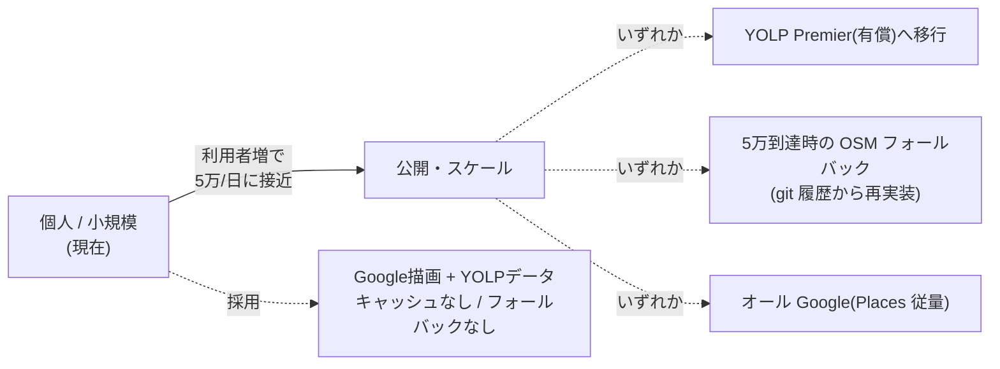

# 地図描画・店舗データソースの選定(決定記録)

最終更新: 2026-07-08

「近く」モードの地図描画と店舗(POI)データの取得元をどうするかの調査・決定を記録する。
背景フェーズは [PLAN.md](../PLAN.md)、UI 方針は [CLAUDE.md](../CLAUDE.md)、ライセンスは [licenses.md](licenses.md)、進捗は [roadmap.md](roadmap.md) を参照。

## 1. 決定の要約

| レイヤ | 採用 | 旧構成 |
|---|---|---|
| 地図描画 | **Google Maps SDK for Android**(無料) | osmdroid + OSM(MAPNIK)タイル |
| 店舗データ | **YOLP ローカルサーチAPI**(無料枠) | Overpass API(OSM) |
| フォールバック | **当面なし**(後述のフェーズ戦略で再評価) | — |

**理由**: 旧構成(OSM)は新規開店店舗の欠落・支店名(「○○店」)の欠落・地図デザインの質で実用に劣る。
描画品質はGoogle、店舗データ品質はYOLP(国内POIに強い)で補う。

**重要な方針転換**: 旧構成の osmdroid は「**Play Services 非依存**」を明示方針として選定した(本ファイル末尾の経緯)。
Google Maps SDK は **Play Services 必須**のため、この方針を意図的に転換する(転換済み。位置取得も 2026-07 に FLP へ移行済み)。詳細は §5 に記載。

## 2. 出発点(調査時点の現状)

調査時点(2026-06)の旧構成は **osmdroid(OSM タイル)+ Overpass API(OSM の POI 検索)** で、鍵不要・POI の永続化なし・地図ライブラリ固有型は `NearbyMap.kt` に隔離済みだった。旧実装の詳細は git 履歴を参照(Overpass クライアントは移行後しばらく休眠フォールバックとして残し、2026-07-08 に削除)。

POI 結果を永続化していない点は、後述の **YOLP キャッシュ禁止条項と既に整合**している(改修で崩さないこと)。

## 3. 調査結果

### 3.1 Google Maps SDK for Android(地図描画)

- **描画は無料・無制限**。2025 年の料金改定でモバイルの dynamic/static map は no-cost 化された。
- ただし以下が必須:
  - **Google Cloud の課金アカウント(クレジットカード登録)**。描画自体は$0でも請求先登録は要る。
  - **Play Services 依存**(`com.google.android.gms:play-services-maps`)。本プロジェクトの「Play Services 非依存」方針と相反する(§5)。
  - **API キー**。公開アプリでは APK から抽出可能なので、**パッケージ名 + 署名 SHA-1 で制限必須**。
- SDK は OSS ではなく **Google の利用規約に縛られるプロプライエタリ**。`licenses.md` には OSS 枠ではなく「サービスSDK・規約準拠」として記録する。
- 第三者データ(YOLP)を Google マップ上にマーカー表示するのは通常用途で問題なし。**禁止されるのは逆方向**(Google のコンテンツを非Googleマップに載せる/Googleマップに他社の地図タイルを重ねる)。YOLP は地図タイルを提供しない(§3.2)ため、この禁止には抵触しない。

### 3.2 YOLP(店舗データ)

#### 提供状況 — 地図描画系は終了済み

YOLP は **2020年10月31日に地図描画系の API/SDK を全廃**した。

- 終了: **Android Map SDK / iOS Map SDK / JavaScript Map API / Static Map API / 経路地図API**
- 継続: **ローカルサーチAPI / ジオコーダ / 施設検索 / 気象** などの**データ系API**
- Yahoo 自身が地図描画の代替として **Mapbox / ゼンリンデータコム** を案内している。

→ **YOLP に「無料で使えるアプリ向け地図描画 API」は存在しない。** したがって「描画は別(Google)、データは YOLP」は好みの組み合わせではなく、YOLP を使う以上ほぼ強制される形。

#### 利用条件(無料枠)

ローカルサーチ等のデータ系 API は **1 アプリあたり 1 日 5 万リクエストまで無料**(超過は有償版 YOLP Premier)。
順守すべき条件は以下。

**(a) ⚠️ キャッシュ・保存の禁止(2022年改訂・第6条)**

> YOLPにより提供される情報を利用する際には、常に最新の情報を取得しなければならない…意図して保存(キャッシュを含む)し、または、ユーザーに対して意図して保存(キャッシュを含む)させてはならない

- **YOLP の店舗データを Room / DataStore / ファイル等へ永続キャッシュするのは規約違反。** 毎回ライブ取得が前提。
- 表示中のメモリ保持(描画のために手元に持つ)は当然 OK。禁止されるのは「再利用のための意図的な保存」。
- 現状 POI を永続化していないので方針は維持できる。**改修でキャッシュを足さないこと。**

**(b) ⚠️ 5 万リクエスト/日は「1 アプリ単位」=全ユーザー合算**

> 1つのアプリケーションでリクエストできる回数は1日あたり5万回まで

- 個人/手元数台なら当たらない。**Play Store で公開し利用者が増えると全ユーザー合計で 5 万/日を共有**する点に注意((a)によりキャッシュで削減できない)。

**(c) クレジット表記必須**

> Web Services by Yahoo! JAPAN(等)を**アプリ下部に表示**。色変更・極端な縮小は禁止。

**(d) ライセンス消滅事由(該当すると利用権が消える・逐語)**

1. 限られた人、コンピュータによるアクセスのみ認めているサービス(**ただし、ユーザーに無料で提供しているサービスは除く**)
2. 企業、官公庁その他の団体におけるイントラネット内で提供されるサービス
3. ナビゲーション機能を有するサービス(自動測位・マップマッチング・経路誘導の組み合わせ)
4. YOLPにより提供される情報を利用して個人情報の検索を行う機能を提供するサービス
5. ダウンロード・外部出力機能を提供するサービス(カーナビ送信時は30件まで可)
6. 拠点情報に緯度経度を付与・ダウンロードする機能を提供するサービス
7. カーナビやポータブルナビ製品への地図提供
8. **YOLPにより提供される情報の使用によりユーザーから利益を得ていると認められるサービス**

#### poikatsu への当てはめ

| 事由 | 現状の poikatsu |
|---|---|
| (1) アクセス限定 | ✅ 無料アプリとして全ユーザー開放 → **但し書きで除外** |
| (8) 利益享受 | ✅ データに課金しない無料配布 → 非該当 |
| (3) ナビ | ✅ 経路誘導なし(地図表示+店舗検索のみ)。**将来「経路案内」を足すと抵触し得る** |
| (2)(4)(5)(6)(7) | ✅ いずれも非該当 |

**フリップ条件**: YOLP データを**有料の壁の裏に置く / データ自体を対価源にする**と (1)(8) に抵触。
広告・アフィリエイトはグレー(「ユーザーから利益」と直結はしないが解釈次第)。**本格的な収益化に踏み込む前に YOLP Premier(商用枠)移行 か Yahoo 個別確認**が安全。
法的拘束力のある本文は YOLP 個別規約 + [LINEヤフー共通利用規約](https://www.lycorp.co.jp/ja/company/terms/) に集約される。

### 3.3 Google Places API(対抗案・データ)

- 描画と同一ベンダで完結でき、**Yahoo クレジット不要・利益享受条項なし**で規約上いちばん身軽。データ品質(支店名・新規店)も高い。
- 一方 Nearby/Text Search は**従量課金 SKU**(無料枠あり)。トレードオフは「**YOLP 無料枠 vs Places 課金 + 規約の身軽さ**」。
- 公開してスケールする局面では、課金で素直に伸ばせる Places の方が運用が楽になる可能性がある(§6)。

## 4. 決定

現フェーズ(無料・個人/小規模)では **Google Maps SDK(描画)+ YOLP ローカルサーチ(データ)・キャッシュなし・フォールバックなし** を採用する。

却下した案:
- **オール OSM 維持**: データ品質が要件を満たさない(本件の発端)。
- **YOLP + Yahoo 地図**: Yahoo の地図描画 API は廃止済みで選択不可(§3.2)。
- **MapLibre Native(BSD-2)で Play Services 非依存を死守**: ベクタタイルに MapTiler 等(鍵・課金)が要り「完全無料」にならない。ユーザー判断で描画は Google を選択。将来 Play Services を外す要件が再浮上した場合の第一候補として温存。
- **オール Google(描画 + Places)**: 規約は最も身軽だが Places が従量課金。**§6 のスケール局面での再評価候補**として残す。
- **YOLP→OSM 同日フォールバックを今すぐ実装**: 5 万/日に当たらない個人/小規模では死にコード(YAGNI)。実測で上限が見えてから検討。(旧 Overpass クライアントも 2026-07-08 に削除済み。再導入するなら git 履歴から再実装)

## 5. Play Services 非依存方針の転換について

- 旧 osmdroid 採用と旧 `data/LocationProvider.kt`(`LocationManager` 使用)は **Play Services を避ける**ことを意図していた。
- Google Maps SDK 採用で **`play-services-maps` 依存が入る**ため、この方針は転換済み(2026-06-20)。**「Play Services 非依存」はもはや本プロジェクトの方針ではない**。GMS 依存を理由に FLP 等の Play Services API を避ける必要はない(採用時は他の依存と同様に licenses.md へ追記するだけでよい)。
- 位置取得も 2026-07-08 に `LocationManager` から **`FusedLocationProvider`(`play-services-location`)へ移行済み**(単発 GPS 測位の遅さ・古いキャッシュ表示の解消。code-guide.md §7)。
- 整理:
  - 「Play Services 非依存」を将来再び要件化する場合は **MapLibre Native へ描画層だけ差し替え**できるよう、§2 の抽象化(`NearbyMap.kt` 隔離)を維持する(その際は位置取得の `LocationManager` 戻しも併せて必要になる)。
  - この転換の事実は `licenses.md` にも反映済み。

## 6. フェーズ別戦略

- **現在(個人/小規模)**: 採用構成で十分。5 万/日には当たらない。
- **公開・スケール時**: キャッシュ不可 + 全体 5 万/日上限がボトルネック化し得る。対策は (1) YOLP Premier、(2) OSM フォールバック、(3) オール Google のいずれか。**公開規模が見えた段階で再評価**する(roadmap のリリース準備に積む)。

## 7. 実装時の遵守チェックリスト

- [ ] YOLP の店舗データを**永続キャッシュしない**(メモリ保持のみ)。Room/DataStore/ファイルへ書かない。
- [ ] アプリ下部に **YOLP クレジット**(例: 「Web Services by Yahoo! JAPAN」)を常設。色・サイズを潰さない。
- [ ] **経路誘導機能を足さない**(足すならナビ条項を再確認)。
- [ ] **API キー / アプリ ID をリポジトリにコミットしない**(`local.properties` → `BuildConfig`)。公開リポジトリのため必須。
- [ ] **Google Maps API キーはパッケージ名 + 署名 SHA-1 で制限**する。
- [ ] 収益化(広告・課金・アフィリエイト)に踏み込む前に YOLP 利用条件(1)(8)を再確認。
- [ ] `licenses.md` に Google Maps SDK・YOLP を「サービスSDK・規約準拠」枠で記録、クレジット義務を明記。
- [ ] 描画層は `NearbyMap.kt` への隔離を維持(将来の MapLibre 差し替え余地を残す)。

## 8. 既知の課題・今後の改善

実機検証で残っている軽微な課題(優先度低)。

- ~~**詳細画面から戻ると地図が「少し北→少し南」へわずかに沈み込む**(2026-06-21 実機確認)。~~ **(2026-06-23 解消)** 当初は初期カメラと `contentPadding` の差を疑ったが、実因は**カメラ移動 `LaunchedEffect` の初回スキップが効いていなかった**こと。共有フラグを別 `LaunchedEffect(Unit)` で立てる方式は、そのフラグ立て effect が同じ dispatcher 上で先に走り終える(記述順 FIFO)ため、`center`/`selectedPoint` 側のガードが初回から素通りし、戻った直後に `move(center)`(瞬間移動)→`animate(selectedPoint)`(滑らかに寄り直し)が両方走っていた。各 `LaunchedEffect` が自分の初回だけを個別フラグでスキップする方式に変更し、初期カメラ `selectedPoint ?: center` のまま据え置くようにして解消(code-guide.md 7.1)。
- **重複排除はチェーン+支店名一致で行う**ため、同一店舗を YOLP が**支店名まで変えて**複数返す場合(例: 「KFCイオン◯◯店」と「ケンタッキー◯◯店」のように施設名の有無まで違う)は取りこぼし得る。座標基準にしないのは、同一モール内の同チェーン別店舗(レイクタウンの複数スターバックス等)を誤結合しないため。
- **ジャンルコードが空の店舗**は `gc` で取れず店名キーワードで個別取得する。実 API 調査で判明した分: オーケー(ジャンル空)、上島珈琲(50 件中 27 件が gc 空)、はま寿司(29 件中 11 件が gc 空)。さらに空ジャンルのチェーンがあれば同様に取りこぼす。対象は merchants.json の `yolp_search: "keyword"` / `yolp_keyword` でデータ駆動(当初の YolpClient ハードコードは Phase 2B で分離済み。code-guide.md 7.2)。gc ソースと重複する同一店は座標+名前一致と ViewModel の同一店舗集約で 1 件化される。
- **`matchStore` の後方境界緩和は 5 文字以上のキーのみ**。4 文字以下のチェーン(ドミー/ポプラ/三和/フィール/ヤマナカ/オオゼキ/サンリブ等)で支店名がひらがな始まりだと取りこぼす可能性(漢字支店名なら可)。閾値は「フィール ⊂ フィールド」等の誤マッチ回避との妥協。
- **施設内テナント除外は heuristic**(「店」の後ろに業種名が続く形のみ)。別パターンのテナント誤検知は取りこぼし得る。
- **ビューポート検索の極端なズームアウト**: 「このエリアを検索」は地図の可視範囲(中心→北東角)から半径を算出するため、街全体まで縮小すると半径が大きくなり YOLP の件数上限(1 ソース最大 500 件=5 ページ)に当たって遠方の対象店を取りこぼし得る。これに対し `YolpClient.mergeAndClip` が「上限に達したソースの最遠距離の最小値」を共通カバー半径として全ソースを切り捨て、密度差で周縁が疎チェーン(カーブス等)ばかりになる偏りを抑える。
- **ズームアウト時の検知数と gc の絞り**: 上記クリップは最も密なソースの実効半径で全体を縛るため、`gc=01`(グルメ全般)のような過密ソース(新宿駅 3km で 8459 件)があると共通半径が極端に縮み、密集地で検知数が激減していた。対象チェーンが集中する業種だけに **`gc="0123,0115,0101013"`(カンマ区切りで 1 コール OR 取得)** へ絞り、同条件で約 1870 件まで下げてクリップ半径を回復させた(コール数は不変)。`gc` のカンマ OR は実機確認済み(スペース区切りは不可)。`query` 側は OR 不可・1 チェーン 1 コール(ただし別名辞書で表記揺れには強い: KFC=ケンタッキー=ｹﾝﾀｯｷｰ)。gc に入らない/空のチェーン(ピザハット=宅配系コード、上島珈琲・はま寿司=gc 空が多い)は `KEYWORD_QUERIES` 側で取得(上の空ジャンル項を参照)。

## 9. 参照(一次ソース・確認日 2026-06-20)

- [YOLP(地図) 利用規約 — Yahoo!デベロッパーネットワーク](https://developer.yahoo.co.jp/webapi/map/)
- [YOLP Web API 一部API・SDK提供終了のお知らせ](https://map.yahoo.co.jp/promo/yolp/close_information.html)
- [YOLP Web API 利用規約改訂のお知らせ(2022-08-17 / キャッシュ禁止 第6条)](https://developer.yahoo.co.jp/changelog/2022-08-17-map.html)
- [Yahoo! JAPAN Web API クレジット表示ガイドライン](https://developer.yahoo.co.jp/attribution/)
- [LINEヤフー共通利用規約](https://www.lycorp.co.jp/ja/company/terms/)
</content>
</invoke>
