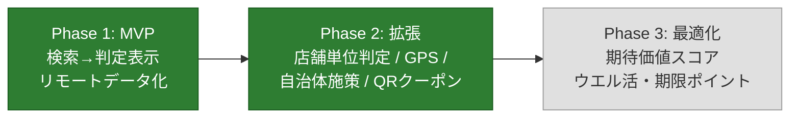

# poikatsu 進捗とロードマップ

開発の現在地と今後の計画をまとめるドキュメント。
フェーズの定義と背景は [PLAN.md](../PLAN.md)、コードの構成は [code-guide.md](code-guide.md)、個別タスクは [GitHub Issues](https://github.com/ktakjm/poikatsu/issues)（[Project Board](https://github.com/users/ktakjm/projects/1)）を参照。

最終更新: 2026-07-13

## 1. 現在地サマリ

**Phase 1（MVP）は完了**（2026-06-12）。Phase 2（店舗単位判定・GPS 周辺検索・期間限定キャンペーン・自治体施策・QR 決済クーポン・設定画面拡張）も完了（2026-06-30）。実機検証待ち。

| フェーズ | 状態 |
|---|---|
| Phase 1（MVP） | ✅ 完了（2026-06-12） |
| Phase 2（拡張 + キャンペーン Phase A〜F） | ✅ 完了（2026-06-30）。実機検証待ち |
| Phase 3 | ⬜ 未着手 |

## 2. 完了した作業

完了済み機能の一覧は [Project Board の Done 列](https://github.com/users/ktakjm/projects/1) を参照。各機能の技術詳細は [code-guide.md](code-guide.md)、実装の経緯は git 履歴に残っている。

主な完了項目:

- **Phase 1**: チェーン名検索→判定表示→リモートデータ化（GitHub raw 配信）
- **店舗単位の対象判定**: `official_store_list` による 3 状態（対象/対象外/要確認）の断定表示
- **GPS 周辺検索 + 地図**: Google Maps SDK + YOLP ローカルサーチ。full-bleed 地図・ボトムシート・クラスタリング・場所検索・3 層モデル（モード/レンズ/ブリッジ）
- **Material 3 デザイン**: dynamic color・TopAppBar・セマンティックカラー・warning ロール
- **設定画面**: テーマ・マイカード・QR 決済・自治体登録（DataStore 永続化）
- **キャンペーン Phase A〜F**: 期間限定キャンペーン・自治体施策・QR クーポン・4 タブナビ・キャンペーンタブ・判定画面のカード/QR セクション
- **GitHub Actions CI**: main push / PR 時に `testDebugUnitTest` を自動実行し、データ整合性（merchant_id 参照切れ・エイリアス衝突等）を検出
- **S-in 前リネーム（#34）**: カード id 独立（campaigns 側が `card_id` で参照する向きに反転）・profile.json → payment_methods.json（リモート取得/テストデータ切替対象に昇格）・`card_promotion`→`promotion`・`issuer`→`operator`。設計判断は [schema-refresh-plan.md](schema-refresh-plan.md) 参照（2026-07-05、実機検証済み）
- **スキーマ拡張（#35）**: promotion のカード紐付け + 率の優先順位修正（B-1）・`card_brand` ブランド施策 + ブランドモデル再整理（カタログ=選択肢 `brands`、実ブランド=ユーザー設定。B-2）・`merchant_rules[].rate_override`（B-3）・`may_end_early`（B-4）・`recurrence` 繰り返し日付条件（B-5）・`benefit_type: lottery`（B-6）。その後の実機検証レビューでブランド保有登録（設定画面「カードブランド」）・brand_color の発行体カタログ移設を追加し schema_version: campaigns 6 / payment_methods 6。設計判断は [schema-refresh-plan.md](schema-refresh-plan.md) 参照（2026-07-06、実機検証済み）。報酬通貨マスタの設計は #39 に分離
- **ショーケースデータ全パターン整備（#33）**: data-test/ に全 11 施策・4 merchant・QR 決済を収録。4 象限（即時定額・後日定額）・UPCOMING・残り 3 日警告・official_store_list 3 状態・Amex 除外・location_hint・min_purchase / usage_limit / cap 各種・自治体施策・複数施策競合を網羅。実チェーン aliases で地図表示にも対応（2026-07-07、実機検証済み）
- **クラスタタップで内包店舗リストを表示**: クラスタピンのタップで常に「この付近に N 件」シートを開き（分解できるクラスタは同時にズーム+2）、ズームだけだと下部シートが旧検索中心基準の全体リストのままで無関係な店舗が上位に並ぶ問題を解消。複合ピン/分解不能クラスタは従来どおり「同じ場所に N 件」。あわせて再検索開始時のグループシート残留クリア・GPS 同座標でもカメラが現在地へ戻る `searchStamp`・「このエリアを検索」の表示しきい値半減（画面の約2割/下限50m）も実施。詳細は code-guide.md 7.1（2026-07-07、実機検証済み）
- **Google 標準 POI ラベルのズーム連動抑制**: 地図上の他社店舗・個人クリニック等の名前がアプリの店舗ピンと紛らわしい問題への対処。ズーム 18 以上で JSON スタイル（`MapStyleOptions`）により `poi` labels を全 off、18 未満はデフォルト表示（Google の重要度ランキングでランドマーク級のみ出る）。`visibility:"on"` を使うホワイトリスト方式はダークモードの配色を壊すため off 系ルールのみで構成。詳細は code-guide.md 7.1（2026-07-07）
- **カード施策のウォレット（Google Pay）動線（#26）**: campaigns.json に `eligible_wallets` / `ineligible_wallets`（公式がウォレット単位で対象/対象外を言い切っている事実のみ登録する 3 状態設計。schema_version 7）を追加。google_pay が eligible なら判定詳細に「ウォレット(Google Pay)を開く」起動リンク、ineligible なら「還元対象外」警告（SMCC=リンク、MUFG=警告。apple_pay が eligible なら「(Apple Payは対象)」を付記）。起動リンクのラベルを `CampaignJudgment.appLabel` に分離（バッジのカード名だと起動先と齟齬が出るため。QR は「◯◯アプリ」）。ウォレットは `<queries>` に宣言（Android 11+ の可視性制限で Play Store 経由になるのを防ぐ）（2026-07-08、実機検証済み）
- **警告色のテーマ追従修正**: warning 系（ExtendedColors）が OS のダーク設定を見ており、テーマ上書き時（OS=ダーク・アプリ=ライト等）に warning だけ暗い琥珀が出ていた。`PoikatsuTheme` が provide する `LocalAppDarkTheme` でアプリのテーマに追従。あわせてライトの琥珀面を errorContainer より抑えた彩度にし「赤=致命 > 琥珀=注意」の序列を維持。詳細は code-guide.md 6.4（2026-07-08、実機検証済み）
- **現在地の高速化・追従（FLP 移行）**: 地図を開いた直後に古い位置が出る・現在地反映が遅い問題への対処。`LocationManager` の単発 GPS 測位（コールドスタートで数秒〜数十秒、タイムアウト時は鮮度不明のキャッシュ採用）を `play-services-location` の **Fused Location Provider** に置き換え。2段階表示（2分以内の FLP キャッシュで即座に地図＋検索を出し、並行測位が 100m 以上ずれたら取り直し）＋「近く」タブ表示中の現在地継続購読（3秒/5m、`repeatOnLifecycle(STARTED)` でタブ離脱・バックグラウンド時に自動解除）。あわせて現在地確定時点で YOLP 取得を待たず地図を先出しし、結果待ちはボトムシートの「周辺の店舗を探しています…」で示す。青ドットは SDK 純正 my-location レイヤー＋`ManualLocationSource`（位置=継続購読、向き=コンパス（真北補正）を `Location.bearing` で供給）でリアルタイム追従。詳細は code-guide.md 7/7.1（2026-07-09、実機検証済み）
- **旧 OSM 系の残骸整理**: 休眠フォールバックの `OverpassClient` を削除し `Poi` を name/lat/lon に簡素化（`branch`/`brand`/`matchStore` の brand 引数は OSM タグ由来で YOLP では常に未使用）。ドキュメントも「かつて Overpass を使っていた・必要なら git 履歴参照」まで圧縮し、「Play Services 非依存」という旧方針の記述も全 docs から一掃（map-data-stack.md §5）（2026-07-09、実機検証済み）
- **地図の赤いデフォルトピン＋タップクラッシュ修正**: 稀に未定義の赤いピン（SDK 標準マーカー）が出現しタップで NPE クラッシュする事象への対処。原因はカスタムレンダラー適用前に `Clustering` へアイテムが流れる競合（標準 `DefaultClusterRenderer` が赤ピンを描き、非同期描画と差し替え掃除がすれ違うと孤児マーカーが残る→タップでキャッシュ未登録の null がリスナーへ渡る）。レンダラー適用を待ってからアイテムを流すガード＋クリックリスナーの null 許容の 2 段で修正。詳細は code-guide.md 7.1（2026-07-09、実機検証済み）
- **自治体グループ登録＋キャンペーンタブ地域フィルタ（#5/#27）・自治体マスタ自動生成（#10）**: municipalities.json を v2 スキーマ（自治体コード＋グループ内包）へ刷新し、`scripts/generate_municipalities.py` で気象庁予報区データから自動生成（一次細分=「埼玉県南部」等・まとめ地域=「23区西部」等・補完定義=「東京23区」。政令市の区分割・地域分割はスクリプトが自治体単位へ正規化）。設定画面のピッカーに「グループ(まとめて登録)」セクションを追加し、登録は `RegisteredArea`（自治体 or グループ、DataStore キー `registered_areas`）へ統合。キャンペーンタブは登録エリアで既定絞り込み＋「登録地域のみ」チップで全件切替（`filterCampaignsByArea`・domain 純 Kotlin・実マスタでテスト）。campaigns.json の `region.area_group` は廃止（グループ所属はマスタ側で解決）。実機レビューでピッカーを改善: 行はチェックボックスの単一トグル（登録/解除とも即時反映）、グループ行は ▼ で構成自治体を角丸パネルに展開（2026-07-10、実機検証済み）
- **探す・近くタブの自治体キャンペーンお知らせ（#3）**: 施策内容は複製せず「あること」だけをマイルドに知らせる設計。探すタブは初期画面（検索前）のみに「○○区で自治体キャンペーン開催中」バナー（登録地域と厳密一致。タップでキャンペーンタブの自治体フィルタへ着地）。店舗カードタップ後の判定詳細には出さない（チェーン店は自治体施策の対象外が多く店舗単位の断定ができないため）。近くタブは検索完了ごとに検索中心を 1 回だけリバースジオコーディングし、所在自治体で開催中の施策があれば検索バー下にお知らせピル（タップでキャンペーン詳細）。所在地ベースなので登録外の自治体（旅行先等）でも出る。突合の domain 関数（`municipalCampaignsForAreas`/`municipalCampaignsForLocation`。フィルタと逆に「出さない」側へ倒す厳密一致）は純 Kotlin + 実データテスト。`CampaignDetail` はタブ非依存のオーバーレイに昇格（2026-07-10、実機検証済み）。続けて**県全域施策**（かながわトクトクキャンペーン『かなトク！』等）に対応: `region.name == prefecture` を県全域のマーカーとする規約（`Region.isPrefectureWide`。data/README.md 参照）を導入し、地域フィルタ・バナーは「同県の自治体を 1 つでも登録していれば表示」、近くタブのピルは「地点がその県内なら表示」。終了日未定（予算到達で終了）の施策を許容するため実データ整合性テストの不変条件を「period_end または may_end_early」へ緩和（2026-07-10）。さらに段階制還元率（かなトクの中小20%/大手10%）の誤認防止として **`rate_rules`**（条件別還元率。schema_version 8）を追加: managed の `merchant_rules[].rate_override` と対になる条件キーの構造で、登録規則は「全条件を列挙し rate_base はその最大値」（AI でのデータ収集時に base へ入れる値の判断を推論に委ねない無条件規則。`rate_base == 最大値` を CI で強制）。表示は rate_rules がある施策の数字に「最大」を冠し内訳を列挙、managed 側も rate_override 等でグループ内の率が変動する場合は一覧サマリーに「最大」を付ける同一規則に統一（2026-07-10）
- **開発者モードの導入（#37）**: 開発者向け設定（`dataCommitRef`・`useTestData`（#33）・`useBundledData`（#36））を設定画面から別画面 `DeveloperSettingsScreen` へ集約し、「開発者モード」トグル ON 中のみ導線を出す。ON/OFF とも確認ダイアログ（ON=開発者専用・想定外挙動の注意、OFF=一括リセットの注意）を挟み、OFF 時は `resetDeveloperSettings()` が 1 回の edit で全項目を既定値へ戻して本番データに自動復帰。導線行には非既定値のサマリ（「テストデータ ON・ref=abc1234」等）を表示。あわせて「使用中データの commit」表示を追加: `refresh()` が GitHub API で ref をフル SHA に解決してから 3 ファイルの raw 取得をその SHA に固定（取得の合間の push で別 commit の内容が混ざる余地も解消）し、SHA はキャッシュにも保存して CACHE 起動でも表示（同梱モード中はグレーアウト）。詳細は code-guide.md「4. データ取得戦略」（2026-07-11、実機検証済み）
- **タブ名・アイコンの刷新**: 下部ナビの「探す/近く/キャンペーン」は各タブの軸（店起点の判定/地図起点の探索/施策起点の一覧）が名前から読めず、「探す」と「近く」の境界も曖昧だったため、名詞で統一した「お店・地図・期間限定・設定」へ変更（期間限定タブの TopAppBar タイトルは「期間限定キャンペーン」）。アイコンも意味が一致する Storefront（お店）/ Map（地図）/ LocalOffer（期間限定=値札）へ差し替え。`-extended` は依存追加せず、必要な 3 つだけ google/material-design-icons（Apache-2.0）のパスデータを `ui/theme/AppIcons.kt` へ個別コピーする方式を規約化（CLAUDE.md・code-guide.md 6・docs/licenses.md「同梱しているサードパーティ由来のコード」）。キャンペーンの意味で星を使っていた装飾（期間限定タブ空表示・お店タブの自治体バナー・地図のお知らせピル）も値札に統一し、星は「最良」の意味（判定詳細の最大おトク率）に限定（2026-07-12、実機検証済み）

- **施策データ収集の半自動化（[#8](https://github.com/ktakjm/poikatsu/issues/8)）**: Claude Code スキル `/collect-campaigns` を導入（`.claude/skills/collect-campaigns/`）。新規収集（PayPay/au PAY/d払い/カード2社/Amex/楽天ペイ・自治体は全国またはブロック指定）と既存メンテ（改定検知・verified_date 更新・期限切れ削除提案）をワンストップ化し、campaigns.json の下書きと見送り一覧まで自動生成（コミットは人間レビュー後）。着手前に各社規約・robots.txt を調査し、収集原則（事実情報のみ・楽天ドメイン不アクセス・SMCC 半手動・自治体クロスチェック等）を [docs/coupon-collection-tos.md](coupon-collection-tos.md) に文書化。maintenance 実行と municipal 関東 実行で実運用検証済み（かなトク3決済・千葉県/千葉市各4件を追加、松屋の事前決済限定を修正）。施策レベルの対象/対象外表示は [#41](https://github.com/ktakjm/poikatsu/issues/41) へ（2026-07-13）
- **ドラッグストア×メーカー×決済連動キャンペーン対応（[#43](https://github.com/ktakjm/poikatsu/issues/43)）**: PayPay×花王・楽天ペイ×花王・d払い×久光等（20〜30% と高率だが対象商品限定）を扱うためのスキーマ 3 点セット（schema_version 9）を追加: `product_scope`（対象商品限定。「最良特典」比較から分離し、一覧は無条件の特典を優先・商品限定のみなら「○% 還元(対象商品)」付記・判定詳細で「対象商品」冠＋警告表示）、`min_purchase_scope`（最低購入額の集計単位 transaction / period_total。「期間累計3,000円以上」型の表示を「期間中の購入合計○円以上(合算可)」に切替）、`requires_entry`（事前エントリー必須の警告）。メーカー主催のレシート応募型（決済不問）は帰属先が無く収録対象外と決定（mapping.md 見送り判定に追加）。merchants.json にドラッグストア 6 チェーン（ウエルシア・スギ薬局・ツルハ・マツキヨ・サンドラッグ・ココカラファイン。施策の事前登録として）と gc グループ `0202001`（ドラッグストア。実 API 検証で 6 チェーン全部のヒットと密度=0205 の 1/2〜1/3 を確認済み。コンビニ施策と結果枠を食い合わないよう 0205 とは別グループ）を追加し、YOLP 整合性テストを「事前登録を許容しつつ参照分のカバーと keyword 枠を検証」へ更新。data-test に `test_product_scope` ショーケースと専用 merchant テストドラッグ（実在 6 チェーンを aliases に持ち地図でのピン表示も確認できる）を追加（2026-07-13、実機検証待ち）
- **多チェーン施策の表示改善と地図ブリッジ・チェーン絞り込みの複数選択化（[#45](https://github.com/ktakjm/poikatsu/issues/45)/[#46](https://github.com/ktakjm/poikatsu/issues/46)）**: #43 の多チェーン促販施策がカード一覧で先頭チェーン 1 枚に見える表示ギャップへの対処。campaigns.json に `display_name`（カード表示用の短いタイトル。任意・多チェーン promotion 専用。schema は互換維持）を追加し、タイトルのフォールバック連鎖（display_name → 単一チェーンは merchant 名 → 「{先頭チェーン} 他Nチェーン」→ name）を導入（登録規則は mapping.md）。地図タブのチェーン絞り込み（レンズ 2 段目）を `Set<Merchant>` に複数選択化（`ChainFilterDropdown` チェックボックス・チェーンごとの解除可能ピル・0 件文言の複数対応。純クライアントフィルタなので YOLP コスト増なし）。施策詳細（期間限定タブ）に地図ブリッジを追加: お店タブと同じ FilledTonalButton を本文上に置き（単一「近くのこのお店を探す」/複数「近くの対象店舗を探す」）、チェーン個別の絞り込みは地図側ピルに一本化（個別チップはアクションに読めず廃止）。開始前・recurrence 非対象日もブリッジ可（YOLP 検索対象へ絞り込み中 merchant を加え、判定 0 件でも場所確認用に表示。warning 色の注意面で案内）。お店/期間限定どちらのブリッジも閉じた詳細画面を保存し、地図タブの戻る操作でブリッジ元へ復帰（`selectionBridgeReturn`/`campaignBridgeReturn`）。カード一覧のバッジ消失（FlowRow と IntrinsicSize.Min の相性で折り返し行がクリップ）を weight(fill=false) の Row へ変更して修正。UI 文言の単独「店」を「お店」に統一（2026-07-16、実機検証済み）

## 3. 今後

### Phase 3: 最適化アドバイス（未着手）

判定エンジンを「還元率比較」から「期待価値スコア比較」へ拡張する。詳細は [#13](https://github.com/ktakjm/poikatsu/issues/13)。

### バックログ

個別の改善候補は [GitHub Issues](https://github.com/ktakjm/poikatsu/issues) で管理。`someday` ラベルは優先度低（必要になったら着手）。

## 4. 定常運用タスク

| タスク | 頻度 | 内容 |
|---|---|---|
| 常設施策データの確認 | 月 1 回 | `/collect-campaigns maintenance` で公式 URL を照合し `verified_date` を更新。改定があれば率・店舗リスト・`updated_at` を修正 |
| 期間限定キャンペーンの追加 | 月 1 回目安（任意） | `/collect-campaigns`（フルまたはソース/地域指定）で収集し下書きをレビュー。収録基準・情報源は [data/README.md](../data/README.md) と `.claude/skills/collect-campaigns/sources.md` 参照 |
| 期限切れデータの削除 | 月 1 回 | 終了後 30 日経過したキャンペーンを削除（`/collect-campaigns maintenance` が削除候補を提案） |
| 整合性チェック | データ更新のたび | `./gradlew :app:testDebugUnitTest`（merchant_id 参照切れ・エイリアス衝突を検出）。main push / PR 時は GitHub Actions CI でも自動実行される |
| 店舗単位の対象情報の追記 | 発見ベース | 公式が対象/対象外を**言い切っている**完全なリストを見つけたら `official_store_list` に追記。例示レベルの情報は `exclusion_note` に文章で残すにとどめる |

## 5. リスクと割り切り

| リスク | 対応状況 |
|---|---|
| 施策情報が古くなり誤判定 | ✅ `verified_date` を判定画面に必ず表示 + データ鮮度表示 |
| 対象外店舗リストの網羅が困難 | ✅ 公式が言い切っているリストがあるチェーンだけ断定表示 |
| クーポンの個人差 | ✅ 全員配布系のみデータ化。個人配布は QR アプリへの確認導線 |
| スクレイピング自動化の規約リスク | ✅ 各社規約・robots.txt を調査し [docs/coupon-collection-tos.md](coupon-collection-tos.md) に文書化。規約適合の範囲で半自動化（事実情報のみ・楽天ドメイン不アクセス・SMCC 半手動・403 不迂回） |
