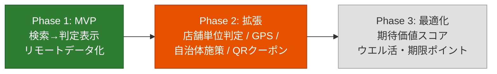
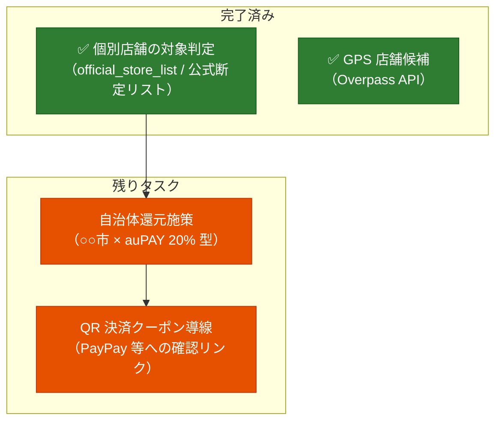

# poikatsu 進捗とロードマップ

開発の現在地と今後の計画をまとめるドキュメント。フェーズの定義と背景は [PLAN.md](../PLAN.md) を参照。
コードの構成は [docs/code-guide.md](code-guide.md) を参照。

最終更新: 2026-06-18

## 1. 現在地サマリ

**Phase 1（MVP）は完了**（2026-06-12）。さらに Phase 2 の優先項目 2 つ（個別店舗の対象外判定・GPS 周辺検索）も前倒しで実装済み。

| フェーズ | 状態 |
|---|---|
| Phase 1（MVP） | ✅ 完了（2026-06-12） |
| Phase 2 | 🔶 進行中（4 項目中 2 項目完了） |
| Phase 3 | ⬜ 未着手 |

## 2. 完了した作業

### Phase 1 マイルストーン（すべて完了）

| マイルストーン | 内容 | 実績メモ |
|---|---|---|
| M1: データ作成 | 三井住友・MUFG の対象店舗を公式ページから手動収集 | merchants 59 チェーン / 2 施策・計 62 merchant_rules。reading・aliases・brand_color 付き |
| M2: アプリ骨格 | Compose プロジェクト + JSON 読み込み | Room は不要と判断し見送り（ファイルキャッシュで代替）。`data/` を assets として直接同梱する構成に |
| M3: 検索と判定表示 | インクリメンタル検索 + 判定カード | エイリアス・ひらがな/カタカナ正規化・前方一致優先。計画外の追加: カテゴリ複数選択フィルタ、ブランドカラー表示 |
| M4: リモートデータ化 | GitHub raw フェッチ + キャッシュ | データ更新はリポジトリの JSON 編集のみでアプリ再ビルド不要に |

**Phase 1 完了の定義を達成**: 「サイゼリヤ」と入力すると「三井住友カード スマホのタッチ決済で 7%」が即表示される。

### Phase 1 完了後の追加実装（コミット履歴順）

| コミット | 内容 | 対応する計画項目 |
|---|---|---|
| `b6ad172` | フォアグラウンド復帰時の自動更新（1 時間間引き）+ 手動更新ボタン + データ鮮度表示 | 計画外の運用改善 |
| `568b38b` ほか | 店舗単位の対象判定。当初は ⛔ 公式対象外パターン / ⚠ 商業施設内リスクの 2 段階警告だったが、⚠ キーワード警告は実際の対象外店舗との乖離が大きくノイズのため廃止。**公式が対象/対象外を言い切っているチェーン（`official_store_list`）に限り、別画面で店舗名を入力し対象/対象外を断定表示する方式に変更**（公式情報の更新日を併記）。 | **Phase 2-1 完了（方針変更済み）** |
| `a85be2f` | GPS 周辺店舗検索（Overpass API / OSM、半径 500m〜3km、対象チェーンのみ距離順表示 → タップで店舗名引き継ぎ判定） | **Phase 2-4 完了**（Google Places を使わず OSM のみで実現） |
| `744d3f1` `d7700a8` | 近くのお店モードの UI 改善: 地図のダークモード追従（タイルに `INVERT_COLORS`）＋店舗一覧を引き上げ式ボトムシート化（地図を全面表示） | **3.3 フォローアップ完了**（GPS 地図のUI改善） |

### 基盤・運用面で整備済みのもの

- ユニットテスト 43 件（実データを使った検索・判定・データ整合性チェック含む）— `./gradlew :app:testDebugUnitTest`
- ライセンス管理ルールと調査記録（[licenses.md](licenses.md)）
- データスキーマ仕様と月次更新ルール（[data/README.md](../data/README.md)）
- ユーザー固有前提の分離（profile.json）— 将来の設定画面はこのファイル構造をそのまま編集対象にできる

## 3. 今後のロードマップ

### Phase 2 残り（優先順）

#### 3.1 自治体還元施策（Phase 2-2）

「○○市 × auPAY 20%還元」型の施策を Campaign として扱えるようにする。

- [ ] スキーマ拡張: Campaign に地域フィールド（自治体コード or 名称）を追加
- [ ] 設定画面の新設: 居住地・行動圏の自治体を登録（profile.json の編集 UI を兼ねる第一歩）
- [ ] 判定エンジン: 登録自治体に該当する施策のみ表示するフィルタ
- [ ] データ運用: 自治体施策は期間が短いため、`period_start` / `period_end` による期限切れ自動非表示の実装が事実上必須になる

#### 3.2 QR 決済クーポン導線（Phase 2-3）

完全な自動判定は不可能（ユーザーごとに配布が異なり API もない）と割り切り済み。

- [ ] 全員配布系の大型クーポンのみ手動でデータ化（スキーマ追加）
- [ ] 判定結果画面に「PayPay アプリでこの店のクーポンを確認」のディープリンク/導線を設置

#### 3.3 UI 刷新：ナビゲーション整理・GPS 地図・設定画面

現状は 1 画面に「名前検索」「GPS 検索」が同居し、画面遷移を `UiState` のフィールドで排他表現している（[code-guide.md](code-guide.md) 6.1 参照）。利用動線を整理するための UI 改善案。**GPS 地図表示は 2026-06-16 に実装済み**。ナビゲーション整理・設定画面は未着手（方針メモとして記録）。

- [ ] **メニュー（ナビゲーション）の導入**：名前検索と GPS 検索を別画面に分離する（ボトムナビ or タブ）。現在の `when (state)` 単純状態機械から、画面が増えるなら Navigation Compose の採用も検討（採用時はライセンス確認 → docs/licenses.md）。
- [x] **GPS 検索の地図表示**（2026-06-16 実装）：近隣検索を地図 + 距離順リストの上下分割に変更し、対象店舗をピン表示。
  - 地図ライブラリは **osmdroid（Apache-2.0）** を採用。Google Maps SDK の地図表示は無料無制限だが Play Services 依存＋API キー＋請求先（クレカ）登録が必要で、本プロジェクトの Play Services 非依存方針と相反するため見送り（費用での脱落ではなく方針整合での判断。詳細は licenses.md）。
  - **将来 Google Maps へ「表示層だけ」低コストで差し替えられるよう薄い抽象化を導入**：地図ライブラリ固有の型を `ui/NearbyMap.kt` に閉じ込め、アプリ側は自前の `MapPoint`/`MapMarker` だけを扱う。差し替え時に触るのは NearbyMap 本体・依存・API キー設定・docs のみ（ViewModel/テストは無変更）。
  - 店舗データは **Overpass(OSM) を維持**（Places API は従量課金＋大改修のため対象外）。ピンは `brand_color` で着色（ロゴ不使用方針と整合）。明示的対象外店舗（`isExcludedStore`）は地図にも出さない。
  - 公開時の留意: osmdroid 既定の OSM 公式タイルは一般配布で利用不可。Play Store 公開時はタイル提供元の差し替えが必要（licenses.md に記載）。
- [ ] **近くのお店モード: 現在地へ戻すボタン**（GPS 地図のフォローアップ）：地図をパン/「このエリアを検索」した後、ワンタップで地図中心を GPS 現在位置（青ドット）に戻す導線を追加する。`NearbyUi.userLat/userLon` が既にあるので、その点へリセンタリング（必要なら現在地で再検索）するだけで実現できる。
- [x] **近くのお店モード: 店舗リストの UI 改善**（2026-06-17 実装）：地図を全面表示にし、店舗一覧を Material3 `BottomSheetScaffold` の引き上げ式ボトムシートへ移動（`PartiallyExpanded`・peek 200dp、展開でフルスクロール）。地図を広く見せつつ、必要時に一覧を引き上げて確認できる。半径チップとヘッダーもシート/`topBar` に再配置。
- [x] **近くのお店モード: 地図のダークモード追従**（2026-06-17 実装）：OSM ラスタタイルは端末テーマに反応しないため、システムがダークなら osmdroid の `TilesOverlay.INVERT_COLORS` をタイルに適用（ライトで解除）。本格的なダーク配色が必要になれば専用ダークタイル（要・規約/帰属確認）への差し替えが次の選択肢。
- [x] **Material 3 追従のデザイン改善**（2026-06-18 実装）：(1) テーマを dynamic color 中心＋11 以下は M3 ベースラインに刷新（Android Studio テンプレ紫を撤去、`Color.kt` 削除）、ベーステーマを DayNight 化（ダーク起動時の白フラッシュ解消）。(2) 全画面を単一 `Scaffold` + `TopAppBar` 化し手書き Row ヘッダーを全廃。(3) 状態表現を絵文字→Material アイコン＋セマンティックカラー、警告色を `warningColor()`（独自 warning ロール）に分離、ブランド色上の文字は `onColorFor()` で可読性確保、タッチ領域 48dp、再取得失敗を Snackbar 化、行ごとの全幅 Divider を撤去。**実装ルールは CLAUDE.md「UI・デザイン方針」、背景は code-guide.md 6.4 に記録**（今後の改修もこれに従う）。
- [ ] **設定画面の新設（まずは空でよい）**：入口だけ用意しておき、将来の受け皿にする。下表「profile.json の設定画面化」と統合し、エントリー状況・カードブランド編集、自治体登録（3.1）、Phase 3 のポイント残高入力をここに集約する。

### Phase 3: 最適化アドバイス（未着手）

判定エンジンを「還元率比較」から「期待価値スコア比較」へ拡張する。

- [ ] 設定画面で期間限定ポイント残高・失効日を手入力（公式 API がないため手入力。スクレイピングはしない）
- [ ] スコアリング: `スコア = 還元率 × ポイント価値係数 + 失効間近ポイントの消化ボーナス`
  - 例: ウエルシアでの V ポイントは 1.5 倍価値（ウエル活）、失効 7 日前の期間限定ポイントは消化最優先
- [ ] ルールベースで実装し、ユニットテストを厚く書く（ドメインロジック設計の学習題材）

### フェーズ外の改善候補（バックログ）

計画には明記されていないが、実装中に見えてきた改善候補。

| 候補 | 背景 | 優先度 |
|---|---|---|
| GitHub Actions によるデータ検証 CI | PLAN.md の構想図にあり未実装。push 時に `testDebugUnitTest`（実データ整合性チェック兼用）を流すだけで実現できる | 高（低コスト） |
| profile.json の設定画面化 | 現状ユーザー前提はビルド時固定。エントリー状況・カードブランドをアプリ内で編集したい。自治体登録（Phase 2-2）と同時に作るのが効率的（設定画面の入口は 3.3 で新設予定） | 中 |
| 期限切れ施策の自動扱い | `period_end` がスキーマにあるが判定エンジンは未参照。自治体施策（短期）導入時に必須化 | 中（Phase 2-2 と同時） |
| 周辺検索の way 取りこぼし対策 | 広域（>1km）は node のみ取得のため建物ポリゴン登録の店が落ちる。件数上限 800 も都心部で取りこぼしの可能性 | 低（不満が出たら） |
| Google Play 公開の判断 | 開発者登録 $25。当面は実機直接インストールで運用 | 保留 |
| M3 Expressive ローダー（波形プログレス） | `*WavyProgressIndicator` / モーフィング `LoadingIndicator` は material3 1.5.0-alpha 専用（現行 BOM は 1.4.0 stable で未収録）。安定版重視の方針のため見送り | 保留（1.5 stable 化で再検討） |

## 4. 定常運用タスク

| タスク | 頻度 | 内容 |
|---|---|---|
| 施策データの確認 | 月 1 回 | `sources` の公式 URL を確認し `verified_date` を更新。改定があれば率・店舗リスト・`updated_at` を修正 |
| 整合性チェック | データ更新のたび | `./gradlew :app:testDebugUnitTest`（merchant_id 参照切れ・エイリアス衝突を検出） |
| 店舗単位の対象情報の追記 | 発見ベース | 公式が対象/対象外を**言い切っている**完全なリストを見つけたら `official_store_list`(mode/stores/official_updated_date) に追記。例示レベルの情報は `exclusion_note` に文章で残すにとどめる |

## 5. リスクと割り切り（再掲・現状評価）

| リスク | 対応状況 |
|---|---|
| 施策情報が古くなり誤判定 | ✅ 対応済み: `verified_date` を判定画面に必ず表示 + 「最新の条件は公式で確認」注記 + データ鮮度（REMOTE/CACHE/BUNDLED）表示 |
| 対象外店舗リストの網羅が困難 | ✅ 対応済み: キーワード推測による曖昧警告は廃止。**公式が言い切っているリストがあるチェーンだけ**断定表示し、無いチェーンは `exclusion_note` の但し書きにとどめる（誤った断定を避ける） |
| クーポンの個人差 | 🔶 方針決定済み（自動判定せず確認導線）。実装は Phase 2-3 |
| スクレイピング自動化の規約リスク | ✅ 手動収集を継続。月 1 回の運用ルール化済み |
