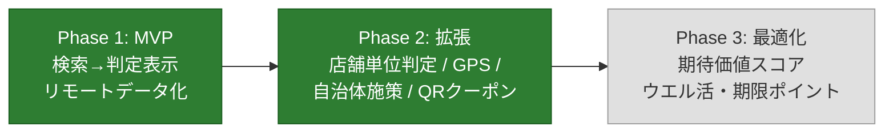

# poikatsu 進捗とロードマップ

開発の現在地と今後の計画をまとめるドキュメント。
フェーズの定義と背景は [PLAN.md](../PLAN.md)、コードの構成は [code-guide.md](code-guide.md)、個別タスクは [GitHub Issues](https://github.com/ktakjm/poikatsu/issues)（[Project Board](https://github.com/users/ktakjm/projects/1)）を参照。

最終更新: 2026-07-09

## 1. 現在地サマリ

**Phase 1（MVP）は完了**（2026-06-12）。Phase 2（店舗単位判定・GPS 周辺検索・期間限定キャンペーン・自治体施策・QR 決済クーポン・設定画面拡張）も完了（2026-06-30）。実機検証待ち。

| フェーズ | 状態 |
|---|---|
| Phase 1（MVP） | ✅ 完了（2026-06-12） |
| Phase 2（拡張 + キャンペーン Phase A〜F） | ✅ 完了（2026-06-30）。実機検証待ち |
| Phase 3 | ⬜ 未着手 |

## 2. 完了した作業

完了済み機能の一覧は [Project Board の Done 列](https://github.com/users/ktakjm/projects/1) を参照。各機能の技術詳細は [code-guide.md](code-guide.md)、実装の経緯は git 履歴に残っている。

主な完了項目:

- **Phase 1**: チェーン名検索→判定表示→リモートデータ化（GitHub raw 配信）
- **店舗単位の対象判定**: `official_store_list` による 3 状態（対象/対象外/要確認）の断定表示
- **GPS 周辺検索 + 地図**: Google Maps SDK + YOLP ローカルサーチ。full-bleed 地図・ボトムシート・クラスタリング・場所検索・3 層モデル（モード/レンズ/ブリッジ）
- **Material 3 デザイン**: dynamic color・TopAppBar・セマンティックカラー・warning ロール
- **設定画面**: テーマ・マイカード・QR 決済・自治体登録（DataStore 永続化）
- **キャンペーン Phase A〜F**: 期間限定キャンペーン・自治体施策・QR クーポン・4 タブナビ・キャンペーンタブ・判定画面のカード/QR セクション
- **GitHub Actions CI**: main push / PR 時に `testDebugUnitTest` を自動実行し、データ整合性（merchant_id 参照切れ・エイリアス衝突等）を検出
- **S-in 前リネーム（#34）**: カード id 独立（campaigns 側が `card_id` で参照する向きに反転）・profile.json → payment_methods.json（リモート取得/テストデータ切替対象に昇格）・`card_promotion`→`promotion`・`issuer`→`operator`。設計判断は [schema-refresh-plan.md](schema-refresh-plan.md) 参照（2026-07-05、実機検証済み）
- **スキーマ拡張（#35）**: promotion のカード紐付け + 率の優先順位修正（B-1）・`card_brand` ブランド施策 + ブランドモデル再整理（カタログ=選択肢 `brands`、実ブランド=ユーザー設定。B-2）・`merchant_rules[].rate_override`（B-3）・`may_end_early`（B-4）・`recurrence` 繰り返し日付条件（B-5）・`benefit_type: lottery`（B-6）。その後の実機検証レビューでブランド保有登録（設定画面「カードブランド」）・brand_color の発行体カタログ移設を追加し schema_version: campaigns 6 / payment_methods 6。設計判断は [schema-refresh-plan.md](schema-refresh-plan.md) 参照（2026-07-06、実機検証済み）。報酬通貨マスタの設計は #39 に分離
- **ショーケースデータ全パターン整備（#33）**: data-test/ に全 11 施策・4 merchant・QR 決済を収録。4 象限（即時定額・後日定額）・UPCOMING・残り 3 日警告・official_store_list 3 状態・Amex 除外・location_hint・min_purchase / usage_limit / cap 各種・自治体施策・複数施策競合を網羅。実チェーン aliases で地図表示にも対応（2026-07-07、実機検証済み）
- **クラスタタップで内包店舗リストを表示**: クラスタピンのタップで常に「この付近に N 件」シートを開き（分解できるクラスタは同時にズーム+2）、ズームだけだと下部シートが旧検索中心基準の全体リストのままで無関係な店舗が上位に並ぶ問題を解消。複合ピン/分解不能クラスタは従来どおり「同じ場所に N 件」。あわせて再検索開始時のグループシート残留クリア・GPS 同座標でもカメラが現在地へ戻る `searchStamp`・「このエリアを検索」の表示しきい値半減（画面の約2割/下限50m）も実施。詳細は code-guide.md 7.1（2026-07-07、実機検証済み）
- **Google 標準 POI ラベルのズーム連動抑制**: 地図上の他社店舗・個人クリニック等の名前がアプリの店舗ピンと紛らわしい問題への対処。ズーム 18 以上で JSON スタイル（`MapStyleOptions`）により `poi` labels を全 off、18 未満はデフォルト表示（Google の重要度ランキングでランドマーク級のみ出る）。`visibility:"on"` を使うホワイトリスト方式はダークモードの配色を壊すため off 系ルールのみで構成。詳細は code-guide.md 7.1（2026-07-07）
- **カード施策のウォレット（Google Pay）動線（#26）**: campaigns.json に `eligible_wallets` / `ineligible_wallets`（公式がウォレット単位で対象/対象外を言い切っている事実のみ登録する 3 状態設計。schema_version 7）を追加。google_pay が eligible なら判定詳細に「ウォレット(Google Pay)を開く」起動リンク、ineligible なら「還元対象外」警告（SMCC=リンク、MUFG=警告。apple_pay が eligible なら「(Apple Payは対象)」を付記）。起動リンクのラベルを `CampaignJudgment.appLabel` に分離（バッジのカード名だと起動先と齟齬が出るため。QR は「◯◯アプリ」）。ウォレットは `<queries>` に宣言（Android 11+ の可視性制限で Play Store 経由になるのを防ぐ）（2026-07-08、実機検証済み）
- **警告色のテーマ追従修正**: warning 系（ExtendedColors）が OS のダーク設定を見ており、テーマ上書き時（OS=ダーク・アプリ=ライト等）に warning だけ暗い琥珀が出ていた。`PoikatsuTheme` が provide する `LocalAppDarkTheme` でアプリのテーマに追従。あわせてライトの琥珀面を errorContainer より抑えた彩度にし「赤=致命 > 琥珀=注意」の序列を維持。詳細は code-guide.md 6.4（2026-07-08、実機検証済み）
- **現在地の高速化・追従（FLP 移行）**: 地図を開いた直後に古い位置が出る・現在地反映が遅い問題への対処。`LocationManager` の単発 GPS 測位（コールドスタートで数秒〜数十秒、タイムアウト時は鮮度不明のキャッシュ採用）を `play-services-location` の **Fused Location Provider** に置き換え。2段階表示（2分以内の FLP キャッシュで即座に地図＋検索を出し、並行測位が 100m 以上ずれたら取り直し）＋「近く」タブ表示中の現在地継続購読（3秒/5m、`repeatOnLifecycle(STARTED)` でタブ離脱・バックグラウンド時に自動解除）。あわせて現在地確定時点で YOLP 取得を待たず地図を先出しし、結果待ちはボトムシートの「周辺の店舗を探しています…」で示す。青ドットは SDK 純正 my-location レイヤー＋`ManualLocationSource`（位置=継続購読、向き=コンパス（真北補正）を `Location.bearing` で供給）でリアルタイム追従。詳細は code-guide.md 7/7.1（2026-07-09、実機検証済み）
- **旧 OSM 系の残骸整理**: 休眠フォールバックの `OverpassClient` を削除し `Poi` を name/lat/lon に簡素化（`branch`/`brand`/`matchStore` の brand 引数は OSM タグ由来で YOLP では常に未使用）。ドキュメントも「かつて Overpass を使っていた・必要なら git 履歴参照」まで圧縮し、「Play Services 非依存」という旧方針の記述も全 docs から一掃（map-data-stack.md §5）（2026-07-09、実機検証済み）
- **地図の赤いデフォルトピン＋タップクラッシュ修正**: 稀に未定義の赤いピン（SDK 標準マーカー）が出現しタップで NPE クラッシュする事象への対処。原因はカスタムレンダラー適用前に `Clustering` へアイテムが流れる競合（標準 `DefaultClusterRenderer` が赤ピンを描き、非同期描画と差し替え掃除がすれ違うと孤児マーカーが残る→タップでキャッシュ未登録の null がリスナーへ渡る）。レンダラー適用を待ってからアイテムを流すガード＋クリックリスナーの null 許容の 2 段で修正。詳細は code-guide.md 7.1（2026-07-09、実機検証済み）
- **自治体グループ登録＋キャンペーンタブ地域フィルタ（#5/#27）・自治体マスタ自動生成（#10）**: municipalities.json を v2 スキーマ（自治体コード＋グループ内包）へ刷新し、`scripts/generate_municipalities.py` で気象庁予報区データから自動生成（一次細分=「埼玉県南部」等・まとめ地域=「23区西部」等・補完定義=「東京23区」。政令市の区分割・地域分割はスクリプトが自治体単位へ正規化）。設定画面のピッカーに「グループ(まとめて登録)」セクションを追加し、登録は `RegisteredArea`（自治体 or グループ、DataStore キー `registered_areas`）へ統合。キャンペーンタブは登録エリアで既定絞り込み＋「登録地域のみ」チップで全件切替（`filterCampaignsByArea`・domain 純 Kotlin・実マスタでテスト）。campaigns.json の `region.area_group` は廃止（グループ所属はマスタ側で解決）。実機レビューでピッカーを改善: 行はチェックボックスの単一トグル（登録/解除とも即時反映）、グループ行は ▼ で構成自治体を角丸パネルに展開（2026-07-10、実機検証済み）

## 3. 今後

### Phase 3: 最適化アドバイス（未着手）

判定エンジンを「還元率比較」から「期待価値スコア比較」へ拡張する。詳細は [#13](https://github.com/ktakjm/poikatsu/issues/13)。

### バックログ

個別の改善候補は [GitHub Issues](https://github.com/ktakjm/poikatsu/issues) で管理。`someday` ラベルは優先度低（必要になったら着手）。

## 4. 定常運用タスク

| タスク | 頻度 | 内容 |
|---|---|---|
| 常設施策データの確認 | 月 1 回 | `sources` の公式 URL を確認し `verified_date` を更新。改定があれば率・店舗リスト・`updated_at` を修正 |
| 期間限定キャンペーンの追加 | 月末 | 翌月の自治体施策・カード会社期間限定・クーポンを収集し campaigns.json に追加。収録基準・情報源・運用フローは [data/README.md](../data/README.md) の「期間限定キャンペーン・クーポンの運用」参照 |
| 期限切れデータの削除 | 月 1 回 | 終了後 30 日経過したキャンペーンを campaigns.json から手動削除 |
| 整合性チェック | データ更新のたび | `./gradlew :app:testDebugUnitTest`（merchant_id 参照切れ・エイリアス衝突を検出）。main push / PR 時は GitHub Actions CI でも自動実行される |
| 店舗単位の対象情報の追記 | 発見ベース | 公式が対象/対象外を**言い切っている**完全なリストを見つけたら `official_store_list` に追記。例示レベルの情報は `exclusion_note` に文章で残すにとどめる |

## 5. リスクと割り切り

| リスク | 対応状況 |
|---|---|
| 施策情報が古くなり誤判定 | ✅ `verified_date` を判定画面に必ず表示 + データ鮮度表示 |
| 対象外店舗リストの網羅が困難 | ✅ 公式が言い切っているリストがあるチェーンだけ断定表示 |
| クーポンの個人差 | ✅ 全員配布系のみデータ化。個人配布は QR アプリへの確認導線 |
| スクレイピング自動化の規約リスク | ✅ 手動収集を継続。月 1 回の運用ルール化済み |
