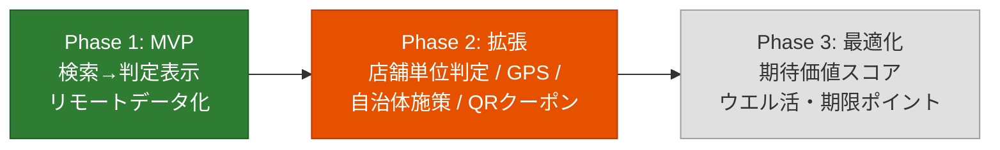
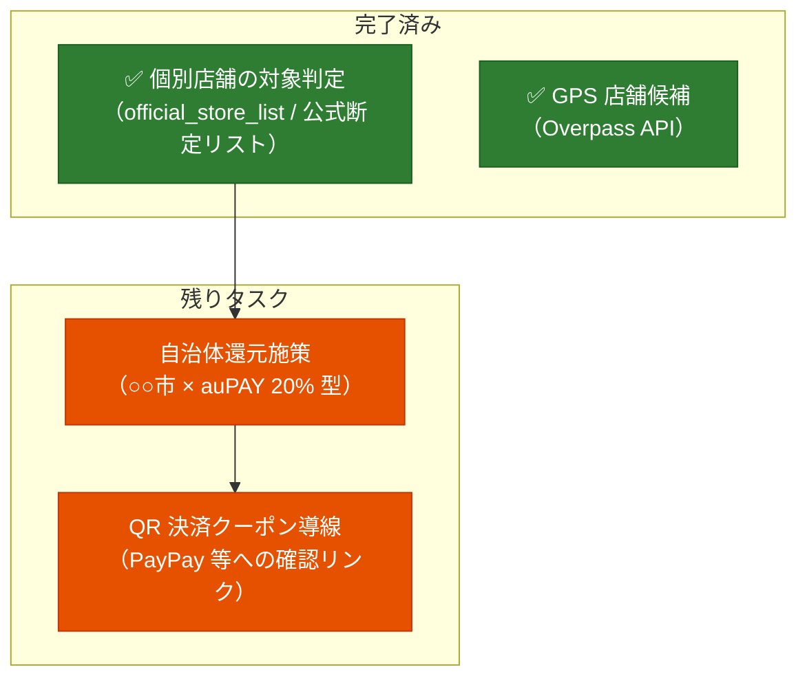

# poikatsu 進捗とロードマップ

開発の現在地と今後の計画をまとめるドキュメント。フェーズの定義と背景は [PLAN.md](../PLAN.md) を参照。
コードの構成は [docs/code-guide.md](code-guide.md) を参照。

最終更新: 2026-06-19

## 1. 現在地サマリ

**Phase 1（MVP）は完了**（2026-06-12）。さらに Phase 2 の優先項目 2 つ（個別店舗の対象外判定・GPS 周辺検索）も前倒しで実装済み。

| フェーズ | 状態 |
|---|---|
| Phase 1（MVP） | ✅ 完了（2026-06-12） |
| Phase 2 | 🔶 進行中（4 項目中 2 項目完了） |
| Phase 3 | ⬜ 未着手 |

## 2. 完了した作業

### Phase 1 マイルストーン（すべて完了）

| マイルストーン | 内容 | 実績メモ |
|---|---|---|
| M1: データ作成 | 三井住友・MUFG の対象店舗を公式ページから手動収集 | merchants 59 チェーン / 2 施策・計 62 merchant_rules。reading・aliases・brand_color 付き |
| M2: アプリ骨格 | Compose プロジェクト + JSON 読み込み | Room は不要と判断し見送り（ファイルキャッシュで代替）。`data/` を assets として直接同梱する構成に |
| M3: 検索と判定表示 | インクリメンタル検索 + 判定カード | エイリアス・ひらがな/カタカナ正規化・前方一致優先。計画外の追加: カテゴリ複数選択フィルタ、ブランドカラー表示 |
| M4: リモートデータ化 | GitHub raw フェッチ + キャッシュ | データ更新はリポジトリの JSON 編集のみでアプリ再ビルド不要に |

**Phase 1 完了の定義を達成**: 「サイゼリヤ」と入力すると「三井住友カード スマホのタッチ決済で 7%」が即表示される。

### Phase 1 完了後の追加実装（コミット履歴順）

| コミット | 内容 | 対応する計画項目 |
|---|---|---|
| `b6ad172` | フォアグラウンド復帰時の自動更新（1 時間間引き）+ 手動更新ボタン + データ鮮度表示 | 計画外の運用改善 |
| `568b38b` ほか | 店舗単位の対象判定。当初は ⛔ 公式対象外パターン / ⚠ 商業施設内リスクの 2 段階警告だったが、⚠ キーワード警告は実際の対象外店舗との乖離が大きくノイズのため廃止。**公式が対象/対象外を言い切っているチェーン（`official_store_list`）に限り、別画面で店舗名を入力し対象/対象外を断定表示する方式に変更**（公式情報の更新日を併記）。 | **Phase 2-1 完了（方針変更済み）** |
| `a85be2f` | GPS 周辺店舗検索（Overpass API / OSM、半径 500m〜3km、対象チェーンのみ距離順表示 → タップで店舗名引き継ぎ判定） | **Phase 2-4 完了**（Google Places を使わず OSM のみで実現） |
| `744d3f1` `d7700a8` | 近くのお店モードの UI 改善: 地図のダークモード追従（タイルに `INVERT_COLORS`）＋店舗一覧を引き上げ式ボトムシート化（地図を全面表示） | **3.3 フォローアップ完了**（GPS 地図のUI改善） |

### 基盤・運用面で整備済みのもの

- ユニットテスト 43 件（実データを使った検索・判定・データ整合性チェック含む）— `./gradlew :app:testDebugUnitTest`
- ライセンス管理ルールと調査記録（[licenses.md](licenses.md)）
- データスキーマ仕様と月次更新ルール（[data/README.md](../data/README.md)）
- ユーザー固有前提の分離（profile.json）— 将来の設定画面はこのファイル構造をそのまま編集対象にできる

## 3. 今後のロードマップ

### Phase 2 残り（優先順）

#### 3.1 自治体還元施策（Phase 2-2）

「○○市 × auPAY 20%還元」型の施策を Campaign として扱えるようにする。

- [ ] スキーマ拡張: Campaign に地域フィールド（自治体コード or 名称）を追加
- [ ] 設定画面の新設: 居住地・行動圏の自治体を登録（profile.json の編集 UI を兼ねる第一歩）
- [ ] 判定エンジン: 登録自治体に該当する施策のみ表示するフィルタ
- [ ] データ運用: 自治体施策は期間が短いため、`period_start` / `period_end` による期限切れ自動非表示の実装が事実上必須になる

#### 3.2 QR 決済クーポン導線（Phase 2-3）

完全な自動判定は不可能（ユーザーごとに配布が異なり API もない）と割り切り済み。

- [ ] 全員配布系の大型クーポンのみ手動でデータ化（スキーマ追加）
- [ ] 判定結果画面に「PayPay アプリでこの店のクーポンを確認」のディープリンク/導線を設置

#### 3.3 UI 刷新：ナビゲーション整理・GPS 地図・設定画面

名前検索と GPS 検索の利用動線を整理するための UI 改善。**GPS 地図表示（2026-06-16）と、両モードを下部ナビ（`NavigationBar`）で分離するナビゲーション整理（2026-06-18）は実装済み**。下位画面（判定詳細・店舗判定）の遷移は引き続き `UiState` のフィールドで排他表現する（[code-guide.md](code-guide.md) 6.1 参照）。**設定画面は入口（歯車→全画面オーバーレイ）を新設済み（2026-06-18）**。中身は表示・データの最小のみで、テーマ／マイカード編集は後続。

- [x] **メニュー（ナビゲーション）の導入**（2026-06-18 実装）：名前検索（「対象チェーン店」）と GPS 検索（「近く」）を下部ナビ（`NavigationBar`）の対等な 2 タブに分離。従来は検索ボックス内の地図ピンアイコンで「近く」へ遷移しており直感的でなかったため、下部ナビへ移し検索ボックスのピンは撤去。Navigation Compose は導入せず、既存の `UiState` 単純状態機械を維持（`nearby == null / != null` を選択中タブに流用し、判定詳細・店舗判定はその上のオーバーレイ＝戻ると元タブへ復帰）。下部ナビは標準 `NavigationBar` の内容高 80dp を 64dp に詰めて使用（`ShortNavigationBar` は M3 Expressive 系のため不採用）。「近く」読込中にタブ移動しても取得完了で戻されないよう世代カウンタ（`nearbyGeneration`）で進行中取得を無効化。ルール/背景は CLAUDE.md「UI・デザイン方針」と code-guide.md 6.1/6.4/7.1 に記録。設定画面は引き続き未着手。
- [x] **GPS 検索の地図表示**（2026-06-16 実装）：近隣検索を地図 + 距離順リストの上下分割に変更し、対象店舗をピン表示。
  - 地図ライブラリは **osmdroid（Apache-2.0）** を採用。Google Maps SDK の地図表示は無料無制限だが Play Services 依存＋API キー＋請求先（クレカ）登録が必要で、本プロジェクトの Play Services 非依存方針と相反するため見送り（費用での脱落ではなく方針整合での判断。詳細は licenses.md）。
  - **将来 Google Maps へ「表示層だけ」低コストで差し替えられるよう薄い抽象化を導入**：地図ライブラリ固有の型を `ui/NearbyMap.kt` に閉じ込め、アプリ側は自前の `MapPoint`/`MapMarker` だけを扱う。差し替え時に触るのは NearbyMap 本体・依存・API キー設定・docs のみ（ViewModel/テストは無変更）。
  - 店舗データは **Overpass(OSM) を維持**（Places API は従量課金＋大改修のため対象外）。ピンは `brand_color` で着色（ロゴ不使用方針と整合）。明示的対象外店舗（`isExcludedStore`）は地図にも出さない。
  - 公開時の留意: osmdroid 既定の OSM 公式タイルは一般配布で利用不可。Play Store 公開時はタイル提供元の差し替えが必要（licenses.md に記載）。
- [x] **近くのお店モード: 現在地へ戻すボタン**（GPS 地図のフォローアップ・2026-06-18 実装）：地図をパン/「このエリアを検索」した後、ワンタップで地図中心を GPS 現在位置（青ドット）に戻す導線。地図右上に `FilledTonalIconButton`（`LocationOn` アイコン）を置き、タップで `mapView.controller.animateTo(userLocation)` により**カメラだけ**現在地へ寄せる（ズーム維持・通信なし・再検索しない）。周辺を取り直したいときは現在地中心になった状態で既存の「このエリアを検索」を押す（既存の「再読み込み」は GPS 取り直し＋現在地周辺で再検索する挙動のため、役割が重複しないよう本ボタンは即時のカメラ移動に限定）。**※2026-06-19、このボタンは「現在地で検索」へ役割変更し（カメラ移動だけ→現在地で再検索）、重複していた「再読み込み」を撤去した（下記「地図操作の役割整理＋再検索の体験改善」）。**
- [x] **近くのお店モード: リスト選択と地図位置の連動**（GPS 地図のフォローアップ・方式検討から）：店舗リストの行をタップしたとき、店舗情報を表示しつつ「その店舗が地図上のどこにあるか」も分かる UI にしたい。現状はリスト行タップ＝即 `onSelectNearby` で判定詳細へ全画面遷移するため、選択店舗の地図上の位置が見えない。実装方式が複数あり得る（例: 選択ピンのハイライト＋地図のセンタリング／ボトムシートを半展開のまま店舗情報をプレビュー表示して地図を残す／地図とリストの選択状態を双方向に同期）ため、**UI 方式の比較検討から**着手する。`NearbyPlace.lat/lon` は既に UI まで来ているので、主作業は地図側の「選択中マーカー」状態管理とボトムシート連携。（2026-06-17 実装）：地図を全面表示にし、店舗一覧を Material3 `BottomSheetScaffold` の引き上げ式ボトムシートへ移動（`PartiallyExpanded`・peek 200dp、展開でフルスクロール）。地図を広く見せつつ、必要時に一覧を引き上げて確認できる。半径チップとヘッダーもシート/`topBar` に再配置。**（2026-06-18 実装・方式は「プレビューシート」を採用）**：行/ピンのタップを全画面遷移から「選択」に変更。`NearbyUi.selectedPlace` を新設し、選択中はボトムシートを店舗プレビュー（店名・距離・カテゴリ・最大還元率・「判定の詳細を見る →」）に切り替える。地図はその店へ `animateTo` でセンタリングし、ピンを拡大＋白縁強調して最前面に描く（`MapMarker.selected`）。判定詳細へはプレビューのボタンから明示遷移し、× / 戻る で一覧に復帰。行とピンのどちらからでも選択でき、選択状態は双方向に反映される。再検索（`searchHere`/半径変更/`fetchNearby`）では新しい `NearbyUi` で `selectedPlace` が null に戻り選択が解除される。
- [x] **近くのお店モード: 地図のダークモード追従**（2026-06-17 実装 / 2026-06-19 改善）：OSM ラスタタイルは描画済み画像でテーマに反応しないため、表示が暗いとき osmdroid の `TilesOverlay.INVERT_COLORS` をタイルに適用（明るいなら解除）。当初は `isSystemInDarkTheme()`（OS 設定）で判定していたが、設定画面のテーマ上書き（システム/ライト/ダーク）に追従しなかったため、`MaterialTheme.colorScheme.surface.luminance()` で「実際の表示が暗いか」を見る方式に変更。本格的なダーク配色が必要になれば専用ダークタイル（要・規約/帰属確認）への差し替えが次の選択肢。
- [x] **Material 3 追従のデザイン改善**（2026-06-18 実装）：(1) テーマを dynamic color 中心＋11 以下は M3 ベースラインに刷新（Android Studio テンプレ紫を撤去、`Color.kt` 削除）、ベーステーマを DayNight 化（ダーク起動時の白フラッシュ解消）。(2) 全画面を単一 `Scaffold` + `TopAppBar` 化し手書き Row ヘッダーを全廃。(3) 状態表現を絵文字→Material アイコン＋セマンティックカラー、警告色を `warningColor()`（独自 warning ロール）に分離、ブランド色上の文字は `onColorFor()` で可読性確保、タッチ領域 48dp、再取得失敗を Snackbar 化、行ごとの全幅 Divider を撤去。**実装ルールは CLAUDE.md「UI・デザイン方針」、背景は code-guide.md 6.4 に記録**（今後の改修もこれに従う）。
- [x] **近くのお店モード: 地図ピン・遷移先・距離の改善**（2026-06-18 実装）：(1) ピンを発行体ごとに色分け（三井住友＝緑 / MUFG＝赤）し、両対応店舗は斜めの二色ピンで描き分け（自前 `Drawable` の `storePinDrawable`。osmdroid のタップ判定のため `getIntrinsicWidth/Height` を返す）。(2) 地図ピン/リストからの遷移先タイトルに支店名を表示（`Selection.displayName`＝リストに出ている POI 名と一致）。(3) リストの距離表示・並び順を地図中心ではなく**常に現在地基準**に統一（「このエリアを検索」で遠方を見ても現在地からの距離になる）。詳細は code-guide.md 7.1。
- [x] **設定画面の入口を新設（軽スコープ）**（2026-06-18 実装）：「対象チェーン店」「近く」両モードの `TopAppBar` 右肩に歯車を置き、タップで全画面の設定オーバーレイ（`UiState.showSettings`・`onOpenSettings`/`onCloseSettings`）を開く。下位画面と同じく開いている間は下部ナビを隠し、閉じると元モードへ復帰。中身は現状「データ」（鮮度表示＋今すぐ更新）のみで、表示（テーマ／dynamic color）とマイカード（profile.json の編集＝書込み可能な DataStore 移行が前提）は後続ステップ。あわせて「近く」モードの**再読み込みボタンを半径チップ行の右端へ移設**（地図表示時はチップごとボトムシート内に入る）し、歯車と更新の同居を解消。更新導線自体の整理（後述バックログ）は別途。
- [ ] **近くのお店モード: ジャンル絞り込みの追加**：対象チェーン店検索（名前検索）にあるカテゴリ複数選択フィルタと同じジャンル絞り込みを「近く」モードにも追加する。現状「近く」は対象チェーン全種を距離順に出すのみで、飲食・ドラッグストア等で絞れない。名前検索側のフィルタ実装・カテゴリ定義を再利用し、地図ピンとボトムシート一覧の両方に絞り込みを反映する。
- [ ] **近くのお店モード: 横画面（landscape）の UI 改善**：現在の地図＋引き上げ式ボトムシート構成は縦画面前提で、横画面ではシート（peek 200dp）が地図の大部分を覆ってしまい地図がほとんど見えない。横画面では一覧を**左右どちらかのサイドパネルに寄せ**、地図に十分な面積を残したい。ただし最適な方式は自明でないため、**UI 方式の比較検討から着手する**（例: 縦=ボトムシート／横=サイドシート（`width` 固定の側面パネル）に出し分け／二ペイン（リスト＋地図の左右分割・`WindowSizeClass` で切替）／オーバーレイのままシート最大幅を制限）。判断材料は `WindowSizeClass`（幅クラス）での分岐方針、`BottomSheetScaffold` 流用の可否、選択⇔地図連動・進捗ピル・Snackbar 配置（7.1）との整合、回転時の状態保持。決めた方式は CLAUDE.md「UI・デザイン方針」と code-guide.md 7.1 に追記する。
- [x] **設定画面の入口（受け皿）を新設**（2026-06-18・上記項目で実装）：将来の設定を集約する受け皿を用意した。残りの中身は順次追加し、下表「profile.json の設定画面化」と統合して、エントリー状況・カードブランド編集、自治体登録（3.1）、Phase 3 のポイント残高入力に加え、**ユーザーにより還元率が変わる決済方法の還元率設定**（同じ決済手段でも利用者の契約・ランク等で還元率が異なるケースを、ユーザーが自分の値として登録し判定に反映できるようにする）を載せる。
- [x] **設定の中身（軽スコープ）を実装**（2026-06-19 実装）：**DataStore Preferences**（`SettingsRepository`）を採用し設定を永続化。(1) 表示＝テーマ3択（システム/ライト/ダーク・`MainActivity` で `PoikatsuTheme` に注入）＋ dynamic color トグル（Android 12+ のみ有効）。(2) マイカード＝カード所有チェック／還元率の手入力（公式アプリ表示値）／MUFG のブランド選択（Amex・Mastercard・Visa・JCB）／三井住友の「ウエル活 ×1.5」チェック（`point_multiplier` を profile.json に追加。係数・ラベルをデータ側に持たせ UI 文言をハードコードしない）。(3) データ＝自動更新トグル＋今すぐ更新。(4) このアプリ＝バージョン（`BuildConfig.VERSION_NAME`）/ GitHub リンク。ユーザー差分は DataStore に overlay 保存し、ViewModel のマージ層で profile に重ねてエンジンへ渡す（`JudgmentEngine` は純 Kotlin・実データテストを維持）。**判定エンジンを2点変更**：未所有カードの施策はスキップ／`amex_excluded`×Amex を警告→真の除外（検索・判定詳細・地図ピン/件数すべてに波及）。実データテスト追加（Amex 除外・所有絞り込み）。**reward の無いチェーンは検索・近隣に出さない**よう絞り込み、`entry_done` フラグと未エントリー警告は廃止（公式アプリ表示値の手入力が実効値のため）。OSS ライセンス一覧画面・カードの追加/削除・`rate_breakdown` 自動計算は今後。
- [x] **近くのお店モード: 地図操作の役割整理＋再検索の体験改善**（2026-06-19 実装）：地図上の操作が「更新（⟳）／現在地へ戻す（📍）／このエリアを検索」で役割が重なっていたのを、**検索の起点をどこにするかの 2 択**に整理した。(1) 📍 を「**現在地で検索**」へ格上げ（カメラ移動だけ→現在地を取り直してその周辺で再検索）、地図中心起点の「このエリアを検索」と対にし、重複していた ⟳ 再読み込みボタン（半径チップ右端）を撤去。(2) **再検索中も地図・一覧を残す**（直前の `NearbyUi` を `copy` して `loading` だけ立て、`NearbyPane` のゲートを「`center` があれば地図を出す」に変更）。全画面ローディングにせず、「このエリアを検索」を進捗ピルに差し替え 📍 は無効化。初回ロードのみ従来どおり全画面。(3) **再検索の一時失敗は Snackbar**（地図を残す。`failNearby` が `center` の有無で Snackbar／全画面エラーを出し分け、初回失敗は「再試行」付き全画面）。Snackbar は外側 `Scaffold` の host だとシート裏に隠れるため `BottomSheetScaffold` 自身の host に出す。(4) **地図をシート背面まで下端いっぱいに描画**し、ボトムシート角丸から背景が覗く見栄えを解消（下端 inset を当てず上端 `TopAppBar` 分だけ避ける）。背景・実装は code-guide.md 7.1。

### Phase 3: 最適化アドバイス（未着手）

判定エンジンを「還元率比較」から「期待価値スコア比較」へ拡張する。

- [ ] 設定画面で期間限定ポイント残高・失効日を手入力（公式 API がないため手入力。スクレイピングはしない）
- [ ] スコアリング: `スコア = 還元率 × ポイント価値係数 + 失効間近ポイントの消化ボーナス`
  - 例: ウエルシアでの V ポイントは 1.5 倍価値（ウエル活）、失効 7 日前の期間限定ポイントは消化最優先（※ウエル活 1.5 倍は三井住友カード向けに設定画面へ前倒し実装済み＝`point_multiplier`。Phase 3 ではこれを一般化する）
- [ ] ルールベースで実装し、ユニットテストを厚く書く（ドメインロジック設計の学習題材）

### フェーズ外の改善候補（バックログ）

計画には明記されていないが、実装中に見えてきた改善候補。

| 候補 | 背景 | 優先度 |
|---|---|---|
| GitHub Actions によるデータ検証 CI | PLAN.md の構想図にあり未実装。push 時に `testDebugUnitTest`（実データ整合性チェック兼用）を流すだけで実現できる | 高（低コスト） |
| profile.json の設定画面化 | カード所有・還元率・MUFG ブランド・ウエル活は設定画面で編集可能に（2026-06-19・DataStore overlay）。**残るはカードの追加/削除**（候補カードの集合自体は profile.json 管理のまま）と自治体登録（Phase 2-2）の統合 | 中 |
| 期限切れ施策の自動扱い | `period_end` がスキーマにあるが判定エンジンは未参照。自治体施策（短期）導入時に必須化 | 中（Phase 2-2 と同時） |
| 周辺検索の way 取りこぼし対策 | 広域（>1km）は node のみ取得のため建物ポリゴン登録の店が落ちる。件数上限 800 も都心部で取りこぼしの可能性 | 低（不満が出たら） |
| Google Play 公開の判断 | 開発者登録 $25。当面は実機直接インストールで運用 | 保留 |
| M3 Expressive ローダー（波形プログレス） | `*WavyProgressIndicator` / モーフィング `LoadingIndicator` は material3 1.5.0-alpha 専用（現行 BOM は 1.4.0 stable で未収録）。安定版重視の方針のため見送り | 保留（1.5 stable 化で再検討） |

## 4. 定常運用タスク

| タスク | 頻度 | 内容 |
|---|---|---|
| 施策データの確認 | 月 1 回 | `sources` の公式 URL を確認し `verified_date` を更新。改定があれば率・店舗リスト・`updated_at` を修正 |
| 整合性チェック | データ更新のたび | `./gradlew :app:testDebugUnitTest`（merchant_id 参照切れ・エイリアス衝突を検出） |
| 店舗単位の対象情報の追記 | 発見ベース | 公式が対象/対象外を**言い切っている**完全なリストを見つけたら `official_store_list`(mode/stores/official_updated_date) に追記。例示レベルの情報は `exclusion_note` に文章で残すにとどめる |

## 5. リスクと割り切り（再掲・現状評価）

| リスク | 対応状況 |
|---|---|
| 施策情報が古くなり誤判定 | ✅ 対応済み: `verified_date` を判定画面に必ず表示 + 「最新の条件は公式で確認」注記 + データ鮮度（REMOTE/CACHE/BUNDLED）表示 |
| 対象外店舗リストの網羅が困難 | ✅ 対応済み: キーワード推測による曖昧警告は廃止。**公式が言い切っているリストがあるチェーンだけ**断定表示し、無いチェーンは `exclusion_note` の但し書きにとどめる（誤った断定を避ける） |
| クーポンの個人差 | 🔶 方針決定済み（自動判定せず確認導線）。実装は Phase 2-3 |
| スクレイピング自動化の規約リスク | ✅ 手動収集を継続。月 1 回の運用ルール化済み |
