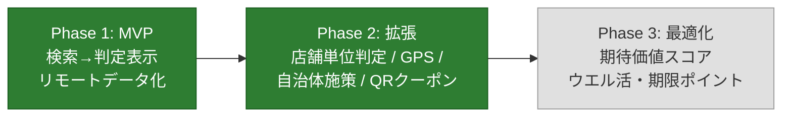

# poikatsu 進捗とロードマップ

開発の現在地と今後の計画をまとめるドキュメント。
フェーズの定義と背景は [PLAN.md](../PLAN.md)、コードの構成は [code-guide.md](code-guide.md)、個別タスクは [GitHub Issues](https://github.com/ktakjm/poikatsu/issues)（[Project Board](https://github.com/users/ktakjm/projects/1)）を参照。

最終更新: 2026-07-05

## 1. 現在地サマリ

**Phase 1（MVP）は完了**（2026-06-12）。Phase 2（店舗単位判定・GPS 周辺検索・期間限定キャンペーン・自治体施策・QR 決済クーポン・設定画面拡張）も完了（2026-06-30）。実機検証待ち。

| フェーズ | 状態 |
|---|---|
| Phase 1（MVP） | ✅ 完了（2026-06-12） |
| Phase 2（拡張 + キャンペーン Phase A〜F） | ✅ 完了（2026-06-30）。実機検証待ち |
| Phase 3 | ⬜ 未着手 |

## 2. 完了した作業

完了済み機能の一覧は [Project Board の Done 列](https://github.com/users/ktakjm/projects/1) を参照。各機能の技術詳細は [code-guide.md](code-guide.md)、実装の経緯は git 履歴に残っている。

主な完了項目:

- **Phase 1**: チェーン名検索→判定表示→リモートデータ化（GitHub raw 配信）
- **店舗単位の対象判定**: `official_store_list` による 3 状態（対象/対象外/要確認）の断定表示
- **GPS 周辺検索 + 地図**: Google Maps SDK + YOLP ローカルサーチ。full-bleed 地図・ボトムシート・クラスタリング・場所検索・3 層モデル（モード/レンズ/ブリッジ）
- **Material 3 デザイン**: dynamic color・TopAppBar・セマンティックカラー・warning ロール
- **設定画面**: テーマ・マイカード・QR 決済・自治体登録（DataStore 永続化）
- **キャンペーン Phase A〜F**: 期間限定キャンペーン・自治体施策・QR クーポン・4 タブナビ・キャンペーンタブ・判定画面のカード/QR セクション
- **GitHub Actions CI**: main push / PR 時に `testDebugUnitTest` を自動実行し、データ整合性（merchant_id 参照切れ・エイリアス衝突等）を検出
- **S-in 前リネーム（#34）**: カード id 独立（campaigns 側が `card_id` で参照する向きに反転）・profile.json → payment_methods.json（リモート取得/テストデータ切替対象に昇格）・`card_promotion`→`promotion`・`issuer`→`operator`。設計判断は [schema-refresh-plan.md](schema-refresh-plan.md) 参照（2026-07-05、実機検証待ち）
- **スキーマ拡張（#35）**: promotion のカード紐付け + 率の優先順位修正（B-1）・`card_brand` ブランド施策 + ブランドモデル再整理（カタログ=選択肢 `brands`、実ブランド=ユーザー設定。B-2）・`merchant_rules[].rate_override`（B-3）・`may_end_early`（B-4）・`recurrence` 繰り返し日付条件（B-5）・`benefit_type: lottery`（B-6）。schema_version: campaigns 5 / payment_methods 4。設計判断は [schema-refresh-plan.md](schema-refresh-plan.md) 参照（2026-07-05、実機検証待ち）

## 3. 今後

### Phase 3: 最適化アドバイス（未着手）

判定エンジンを「還元率比較」から「期待価値スコア比較」へ拡張する。詳細は [#13](https://github.com/ktakjm/poikatsu/issues/13)。

### バックログ

個別の改善候補は [GitHub Issues](https://github.com/ktakjm/poikatsu/issues) で管理。`someday` ラベルは優先度低（必要になったら着手）。

## 4. 定常運用タスク

| タスク | 頻度 | 内容 |
|---|---|---|
| 常設施策データの確認 | 月 1 回 | `sources` の公式 URL を確認し `verified_date` を更新。改定があれば率・店舗リスト・`updated_at` を修正 |
| 期間限定キャンペーンの追加 | 月末 | 翌月の自治体施策・カード会社期間限定・クーポンを収集し campaigns.json に追加。収録基準・情報源・運用フローは [data/README.md](../data/README.md) の「期間限定キャンペーン・クーポンの運用」参照 |
| 期限切れデータの削除 | 月 1 回 | 終了後 30 日経過したキャンペーンを campaigns.json から手動削除 |
| 整合性チェック | データ更新のたび | `./gradlew :app:testDebugUnitTest`（merchant_id 参照切れ・エイリアス衝突を検出）。main push / PR 時は GitHub Actions CI でも自動実行される |
| 店舗単位の対象情報の追記 | 発見ベース | 公式が対象/対象外を**言い切っている**完全なリストを見つけたら `official_store_list` に追記。例示レベルの情報は `exclusion_note` に文章で残すにとどめる |

## 5. リスクと割り切り

| リスク | 対応状況 |
|---|---|
| 施策情報が古くなり誤判定 | ✅ `verified_date` を判定画面に必ず表示 + データ鮮度表示 |
| 対象外店舗リストの網羅が困難 | ✅ 公式が言い切っているリストがあるチェーンだけ断定表示 |
| クーポンの個人差 | ✅ 全員配布系のみデータ化。個人配布は QR アプリへの確認導線 |
| スクレイピング自動化の規約リスク | ✅ 手動収集を継続。月 1 回の運用ルール化済み |
