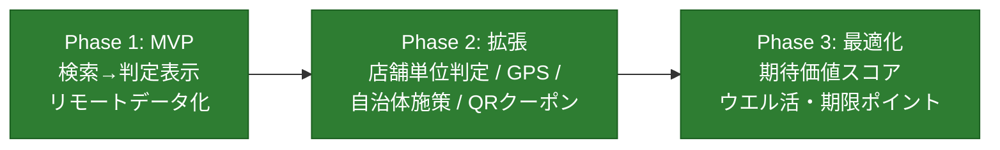

# poikatsu 進捗とロードマップ

開発の現在地と今後の計画をまとめるドキュメント。
フェーズの定義と背景は [PLAN.md](../PLAN.md)、コードの構成は [code-guide.md](code-guide.md)、個別タスクは [GitHub Issues](https://github.com/ktakjm/poikatsu/issues)（[Project Board](https://github.com/users/ktakjm/projects/1)）を参照。

最終更新: 2026-08-29

## 1. 現在地サマリ

**Phase 1（MVP）は完了**（2026-06-12）。Phase 2（店舗単位判定・GPS 周辺検索・期間限定キャンペーン・自治体施策・QR 決済クーポン・設定画面拡張）も完了（2026-06-30）。Phase 3（期待価値スコア比較）も実装済み（2026-08-19）。いずれも実機検証待ち。

```mermaid
flowchart LR
    P1["Phase 1: MVP<br/>検索→判定表示<br/>リモートデータ化"] --> P2["Phase 2: 拡張<br/>店舗単位判定 / GPS /<br/>自治体施策 / QRクーポン"] --> P3["Phase 3: 最適化<br/>期待価値スコア<br/>ウエル活・期限ポイント"]

    style P1 fill:#2E7D32,stroke:#1B5E20,color:#fff
    style P2 fill:#2E7D32,stroke:#1B5E20,color:#fff
    style P3 fill:#2E7D32,stroke:#1B5E20,color:#fff
```

| フェーズ | 状態 |
|---|---|
| Phase 1（MVP） | ✅ 完了（2026-06-12） |
| Phase 2（拡張 + キャンペーン Phase A〜F） | ✅ 完了（2026-06-30）。実機検証待ち |
| Phase 3（期待価値スコア比較） | ✅ 実装済み（2026-08-19）。実機検証待ち |

## 2. 完了した作業

完了済み機能の一覧は [Project Board の Done 列](https://github.com/users/ktakjm/projects/1) を参照。各機能の技術詳細は [code-guide.md](code-guide.md)、実装の経緯は git 履歴に残っている。

主な完了項目:

- **Phase 1**: チェーン名検索→判定表示→リモートデータ化（GitHub raw 配信）
- **店舗単位の対象判定**: `official_store_list` による 3 状態（対象/対象外/要確認）の断定表示
- **GPS 周辺検索 + 地図**: Google Maps SDK + YOLP ローカルサーチ。full-bleed 地図・ボトムシート・クラスタリング・場所検索・3 層モデル（モード/レンズ/ブリッジ）
- **Material 3 デザイン**: dynamic color・TopAppBar・セマンティックカラー・warning ロール
- **設定画面**: テーマ・マイカード・QR 決済・自治体登録（DataStore 永続化）
- **キャンペーン Phase A〜F**: 期間限定キャンペーン・自治体施策・QR クーポン・4 タブナビ・キャンペーンタブ・判定画面のカード/QR セクション
- **GitHub Actions CI**: main push / PR 時に `testDebugUnitTest` を自動実行し、データ整合性（merchant_id 参照切れ・エイリアス衝突等）を検出
- **S-in 前リネーム（#34）**: カード id 独立（campaigns 側が `card_id` で参照する向きに反転）・profile.json → payment_methods.json（リモート取得/テストデータ切替対象に昇格）・`card_promotion`→`promotion`・`issuer`→`operator`。設計判断は [schema-refresh-plan.md](schema-refresh-plan.md) 参照（2026-07-05、実機検証済み）
- **スキーマ拡張（#35）**: promotion のカード紐付け + 率の優先順位修正（B-1）・`card_brand` ブランド施策 + ブランドモデル再整理（カタログ=選択肢 `brands`、実ブランド=ユーザー設定。B-2）・`merchant_rules[].rate_override`（B-3）・`may_end_early`（B-4）・`recurrence` 繰り返し日付条件（B-5）・`benefit_type: lottery`（B-6）。その後の実機検証レビューでブランド保有登録（設定画面「カードブランド」）・brand_color の発行体カタログ移設を追加し schema_version: campaigns 6 / payment_methods 6。設計判断は [schema-refresh-plan.md](schema-refresh-plan.md) 参照（2026-07-06、実機検証済み）。報酬通貨マスタの設計は #39 に分離
- **ショーケースデータ全パターン整備（#33）**: data-test/ に全 11 施策・4 merchant・QR 決済を収録。4 象限（即時定額・後日定額）・UPCOMING・残り 3 日警告・official_store_list 3 状態・Amex 除外・location_hint・min_purchase / usage_limit / cap 各種・自治体施策・複数施策競合を網羅。実チェーン aliases で地図表示にも対応（2026-07-07、実機検証済み）
- **クラスタタップで内包店舗リストを表示**: クラスタピンのタップで常に「この付近に N 件」シートを開き（分解できるクラスタは同時にズーム+2）、ズームだけだと下部シートが旧検索中心基準の全体リストのままで無関係な店舗が上位に並ぶ問題を解消。複合ピン/分解不能クラスタは従来どおり「同じ場所に N 件」。あわせて再検索開始時のグループシート残留クリア・GPS 同座標でもカメラが現在地へ戻る `searchStamp`・「このエリアを検索」の表示しきい値半減（画面の約2割/下限50m）も実施。詳細は code-guide.md 7.1（2026-07-07、実機検証済み）
- **Google 標準 POI ラベルのズーム連動抑制**: 地図上の他社店舗・個人クリニック等の名前がアプリの店舗ピンと紛らわしい問題への対処。ズーム 18 以上で JSON スタイル（`MapStyleOptions`）により `poi` labels を全 off、18 未満はデフォルト表示（Google の重要度ランキングでランドマーク級のみ出る）。`visibility:"on"` を使うホワイトリスト方式はダークモードの配色を壊すため off 系ルールのみで構成。詳細は code-guide.md 7.1（2026-07-07）
- **カード施策のウォレット（Google Pay）動線（#26）**: campaigns.json に `eligible_wallets` / `ineligible_wallets`（公式がウォレット単位で対象/対象外を言い切っている事実のみ登録する 3 状態設計。schema_version 7）を追加。google_pay が eligible なら判定詳細に「ウォレット(Google Pay)を開く」起動リンク、ineligible なら「還元対象外」警告（SMCC=リンク、MUFG=警告。apple_pay が eligible なら「(Apple Payは対象)」を付記）。起動リンクのラベルを `CampaignJudgment.appLabel` に分離（バッジのカード名だと起動先と齟齬が出るため。QR は「◯◯アプリ」）。ウォレットは `<queries>` に宣言（Android 11+ の可視性制限で Play Store 経由になるのを防ぐ）（2026-07-08、実機検証済み）
- **警告色のテーマ追従修正**: warning 系（ExtendedColors）が OS のダーク設定を見ており、テーマ上書き時（OS=ダーク・アプリ=ライト等）に warning だけ暗い琥珀が出ていた。`PoikatsuTheme` が provide する `LocalAppDarkTheme` でアプリのテーマに追従。あわせてライトの琥珀面を errorContainer より抑えた彩度にし「赤=致命 > 琥珀=注意」の序列を維持。詳細は code-guide.md 6.4（2026-07-08、実機検証済み）
- **現在地の高速化・追従（FLP 移行）**: 地図を開いた直後に古い位置が出る・現在地反映が遅い問題への対処。`LocationManager` の単発 GPS 測位（コールドスタートで数秒〜数十秒、タイムアウト時は鮮度不明のキャッシュ採用）を `play-services-location` の **Fused Location Provider** に置き換え。2段階表示（2分以内の FLP キャッシュで即座に地図＋検索を出し、並行測位が 100m 以上ずれたら取り直し）＋「近く」タブ表示中の現在地継続購読（3秒/5m、`repeatOnLifecycle(STARTED)` でタブ離脱・バックグラウンド時に自動解除）。あわせて現在地確定時点で YOLP 取得を待たず地図を先出しし、結果待ちはボトムシートの「周辺の店舗を探しています…」で示す。青ドットは SDK 純正 my-location レイヤー＋`ManualLocationSource`（位置=継続購読、向き=コンパス（真北補正）を `Location.bearing` で供給）でリアルタイム追従。詳細は code-guide.md 7/7.1（2026-07-09、実機検証済み）
- **旧 OSM 系の残骸整理**: 休眠フォールバックの `OverpassClient` を削除し `Poi` を name/lat/lon に簡素化（`branch`/`brand`/`matchStore` の brand 引数は OSM タグ由来で YOLP では常に未使用）。ドキュメントも「かつて Overpass を使っていた・必要なら git 履歴参照」まで圧縮し、「Play Services 非依存」という旧方針の記述も全 docs から一掃（map-data-stack.md §5）（2026-07-09、実機検証済み）
- **地図の赤いデフォルトピン＋タップクラッシュ修正**: 稀に未定義の赤いピン（SDK 標準マーカー）が出現しタップで NPE クラッシュする事象への対処。原因はカスタムレンダラー適用前に `Clustering` へアイテムが流れる競合（標準 `DefaultClusterRenderer` が赤ピンを描き、非同期描画と差し替え掃除がすれ違うと孤児マーカーが残る→タップでキャッシュ未登録の null がリスナーへ渡る）。レンダラー適用を待ってからアイテムを流すガード＋クリックリスナーの null 許容の 2 段で修正。詳細は code-guide.md 7.1（2026-07-09、実機検証済み）
- **自治体グループ登録＋キャンペーンタブ地域フィルタ（#5/#27）・自治体マスタ自動生成（#10）**: municipalities.json を v2 スキーマ（自治体コード＋グループ内包）へ刷新し、`scripts/generate_municipalities.py` で気象庁予報区データから自動生成（一次細分=「埼玉県南部」等・まとめ地域=「23区西部」等・補完定義=「東京23区」。政令市の区分割・地域分割はスクリプトが自治体単位へ正規化）。設定画面のピッカーに「グループ(まとめて登録)」セクションを追加し、登録は `RegisteredArea`（自治体 or グループ、DataStore キー `registered_areas`）へ統合。キャンペーンタブは登録エリアで既定絞り込み＋「登録地域のみ」チップで全件切替（`filterCampaignsByArea`・domain 純 Kotlin・実マスタでテスト）。campaigns.json の `region.area_group` は廃止（グループ所属はマスタ側で解決）。実機レビューでピッカーを改善: 行はチェックボックスの単一トグル（登録/解除とも即時反映）、グループ行は ▼ で構成自治体を角丸パネルに展開（2026-07-10、実機検証済み）
- **探す・近くタブの自治体キャンペーンお知らせ（#3）**: 施策内容は複製せず「あること」だけをマイルドに知らせる設計。探すタブは初期画面（検索前）のみに「○○区で自治体キャンペーン開催中」バナー（登録地域と厳密一致。タップでキャンペーンタブの自治体フィルタへ着地）。店舗カードタップ後の判定詳細には出さない（チェーン店は自治体施策の対象外が多く店舗単位の断定ができないため）。近くタブは検索完了ごとに検索中心を 1 回だけリバースジオコーディングし、所在自治体で開催中の施策があれば検索バー下にお知らせピル（タップでキャンペーン詳細）。所在地ベースなので登録外の自治体（旅行先等）でも出る。突合の domain 関数（`municipalCampaignsForAreas`/`municipalCampaignsForLocation`。フィルタと逆に「出さない」側へ倒す厳密一致）は純 Kotlin + 実データテスト。`CampaignDetail` はタブ非依存のオーバーレイに昇格（2026-07-10、実機検証済み）。続けて**県全域施策**（かながわトクトクキャンペーン『かなトク！』等）に対応: `region.name == prefecture` を県全域のマーカーとする規約（`Region.isPrefectureWide`。data/README.md 参照）を導入し、地域フィルタ・バナーは「同県の自治体を 1 つでも登録していれば表示」、近くタブのピルは「地点がその県内なら表示」。終了日未定（予算到達で終了）の施策を許容するため実データ整合性テストの不変条件を「period_end または may_end_early」へ緩和（2026-07-10）。さらに段階制還元率（かなトクの中小20%/大手10%）の誤認防止として **`rate_rules`**（条件別還元率。schema_version 8）を追加: managed の `merchant_rules[].rate_override` と対になる条件キーの構造で、登録規則は「全条件を列挙し rate_base はその最大値」（AI でのデータ収集時に base へ入れる値の判断を推論に委ねない無条件規則。`rate_base == 最大値` を CI で強制）。表示は rate_rules がある施策の数字に「最大」を冠し内訳を列挙、managed 側も rate_override 等でグループ内の率が変動する場合は一覧サマリーに「最大」を付ける同一規則に統一（2026-07-10）
- **開発者モードの導入（#37）**: 開発者向け設定（`dataCommitRef`・`useTestData`（#33）・`useBundledData`（#36））を設定画面から別画面 `DeveloperSettingsScreen` へ集約し、「開発者モード」トグル ON 中のみ導線を出す。ON/OFF とも確認ダイアログ（ON=開発者専用・想定外挙動の注意、OFF=一括リセットの注意）を挟み、OFF 時は `resetDeveloperSettings()` が 1 回の edit で全項目を既定値へ戻して本番データに自動復帰。導線行には非既定値のサマリ（「テストデータ ON・ref=abc1234」等）を表示。あわせて「使用中データの commit」表示を追加: `refresh()` が GitHub API で ref をフル SHA に解決してから 3 ファイルの raw 取得をその SHA に固定（取得の合間の push で別 commit の内容が混ざる余地も解消）し、SHA はキャッシュにも保存して CACHE 起動でも表示（同梱モード中はグレーアウト）。詳細は code-guide.md「4. データ取得戦略」（2026-07-11、実機検証済み）
- **タブ名・アイコンの刷新**: 下部ナビの「探す/近く/キャンペーン」は各タブの軸（店起点の判定/地図起点の探索/施策起点の一覧）が名前から読めず、「探す」と「近く」の境界も曖昧だったため、名詞で統一した「お店・地図・期間限定・設定」へ変更（期間限定タブの TopAppBar タイトルは「期間限定キャンペーン」）。アイコンも意味が一致する Storefront（お店）/ Map（地図）/ LocalOffer（期間限定=値札）へ差し替え。`-extended` は依存追加せず、必要な 3 つだけ google/material-design-icons（Apache-2.0）のパスデータを `ui/theme/AppIcons.kt` へ個別コピーする方式を規約化（CLAUDE.md・code-guide.md 6・docs/licenses.md「同梱しているサードパーティ由来のコード」）。キャンペーンの意味で星を使っていた装飾（期間限定タブ空表示・お店タブの自治体バナー・地図のお知らせピル）も値札に統一し、星は「最良」の意味（判定詳細の最大おトク率）に限定（2026-07-12、実機検証済み）

- **施策データ収集の半自動化（[#8](https://github.com/ktakjm/poikatsu/issues/8)）**: Claude Code スキル `/collect-campaigns` を導入（`.claude/skills/collect-campaigns/`）。新規収集（PayPay/au PAY/d払い/カード2社/Amex/楽天ペイ・自治体は全国またはブロック指定）と既存メンテ（改定検知・verified_date 更新・期限切れ削除提案）をワンストップ化し、campaigns.json の下書きと見送り一覧まで自動生成（コミットは人間レビュー後）。着手前に各社規約・robots.txt を調査し、収集原則（事実情報のみ・楽天ドメイン不アクセス・SMCC 半手動・自治体クロスチェック等）を [docs/coupon-collection-tos.md](coupon-collection-tos.md) に文書化。maintenance 実行と municipal 関東 実行で実運用検証済み（かなトク3決済・千葉県/千葉市各4件を追加、松屋の事前決済限定を修正）。施策レベルの対象/対象外表示は [#41](https://github.com/ktakjm/poikatsu/issues/41) へ（2026-07-13）
- **ドラッグストア×メーカー×決済連動キャンペーン対応（[#43](https://github.com/ktakjm/poikatsu/issues/43)）**: PayPay×花王・楽天ペイ×花王・d払い×久光等（20〜30% と高率だが対象商品限定）を扱うためのスキーマ 3 点セット（schema_version 9）を追加: `product_scope`（対象商品限定。「最良特典」比較から分離し、一覧は無条件の特典を優先・商品限定のみなら「○% 還元(対象商品)」付記・判定詳細で「対象商品」冠＋警告表示）、`min_purchase_scope`（最低購入額の集計単位 transaction / period_total。「期間累計3,000円以上」型の表示を「期間中の購入合計○円以上(合算可)」に切替）、`requires_entry`（事前エントリー必須の警告）。メーカー主催のレシート応募型（決済不問）は帰属先が無く収録対象外と決定（mapping.md 見送り判定に追加）。merchants.json にドラッグストア 6 チェーン（ウエルシア・スギ薬局・ツルハ・マツキヨ・サンドラッグ・ココカラファイン。施策の事前登録として）と gc グループ `0202001`（ドラッグストア。実 API 検証で 6 チェーン全部のヒットと密度=0205 の 1/2〜1/3 を確認済み。コンビニ施策と結果枠を食い合わないよう 0205 とは別グループ）を追加し、YOLP 整合性テストを「事前登録を許容しつつ参照分のカバーと keyword 枠を検証」へ更新。data-test に `test_product_scope` ショーケースと専用 merchant テストドラッグ（実在 6 チェーンを aliases に持ち地図でのピン表示も確認できる）を追加（2026-07-13、実機検証待ち）
- **多チェーン施策の表示改善と地図ブリッジ・チェーン絞り込みの複数選択化（[#45](https://github.com/ktakjm/poikatsu/issues/45)/[#46](https://github.com/ktakjm/poikatsu/issues/46)）**: #43 の多チェーン促販施策がカード一覧で先頭チェーン 1 枚に見える表示ギャップへの対処。campaigns.json に `display_name`（カード表示用の短いタイトル。任意・多チェーン promotion 専用。schema は互換維持）を追加し、タイトルのフォールバック連鎖（display_name → 単一チェーンは merchant 名 → 「{先頭チェーン} 他Nチェーン」→ name）を導入（登録規則は mapping.md）。地図タブのチェーン絞り込み（レンズ 2 段目）を `Set<Merchant>` に複数選択化（`ChainFilterDropdown` チェックボックス・チェーンごとの解除可能ピル・0 件文言の複数対応。純クライアントフィルタなので YOLP コスト増なし）。施策詳細（期間限定タブ）に地図ブリッジを追加: お店タブと同じ FilledTonalButton を本文上に置き（単一「近くのこのお店を探す」/複数「近くの対象店舗を探す」）、チェーン個別の絞り込みは地図側ピルに一本化（個別チップはアクションに読めず廃止）。開始前・recurrence 非対象日もブリッジ可（YOLP 検索対象へ絞り込み中 merchant を加え、判定 0 件でも場所確認用に表示。warning 色の注意面で案内）。お店/期間限定どちらのブリッジも閉じた詳細画面を保存し、地図タブの戻る操作でブリッジ元へ復帰（`selectionBridgeReturn`/`campaignBridgeReturn`）。カード一覧のバッジ消失（FlowRow と IntrinsicSize.Min の相性で折り返し行がクリップ）を weight(fill=false) の Row へ変更して修正。UI 文言の単独「店」を「お店」に統一（2026-07-16、実機検証済み）
- **決済手段追加 AEON Pay・メルペイと決済アプリ複数対応（[#42](https://github.com/ktakjm/poikatsu/issues/42)）**: 規約確認を [coupon-collection-tos.md](coupon-collection-tos.md) に追記（AEON はグレーな一般条項+WAF の 403 を尊重してイオン系ドメイン不アクセス+半手動に、メルカリはガイドの禁止行為明記により楽天方式に。いずれも公開基準で保守側）。qr_payments カタログへ `aeon_pay` / `merpay` を追加（`enabled_default: false`。識別色はイオンマゼンタ/メルペイブルーの近似）し、collect-campaigns スキルに両社の収集経路（自治体クロスチェック+PR TIMES/加盟店側）を組み込み。既収録の自治体施策へ遡及（かなトク AEON Pay/メルペイ、千葉県・千葉市 AEON Pay。全て自治体側一次情報で確認）。AEON Pay が単独アプリ / iAEON の 2 本立てのため qr_payments を `app_packages`（サービス:アプリ = 1:N、schema_version 7）へ刷新し、判定詳細の起動リンクを候補全部のボタン表示に変更（`CampaignJudgment.appLinks` へ統合・Manifest `<queries>` も追随）（2026-07-16、実機検証済み）
- **対象/対象外スコープの両階層統一と conditions 解体（[#41](https://github.com/ktakjm/poikatsu/issues/41)）**: UI 非表示のまま公式の言い切り（参加登録店舗制・コンビニ対象外・チャネル限定等）が埋没していた `conditions` を解体し、`eligible_notes` / `ineligible_notes`（`[String]`）を**施策レベルと merchant_rules の両階層に同名・同型で導入**（旧 `note`/`exclusion_note` を改名。schema_version 10）。線引きは「見落とすとユーザーが損するか」: 損する言い切り（対象外+「〜のみ対象」型の限定）は ineligible_notes（warning 面 1 コンテナに箇条書き）、対象の拡張・明確化は eligible_notes（通常ロール）、行き場の無い補足は `memo`（旧 conditions。非表示・収集スキルの照合台帳）。判定詳細はレベル横断で連結した「対象」「対象外」2 セクション表示（お店/期間限定タブ共有 Composable）で、単一チェーン promotion のチャネル限定を施策レベルへ移し期間限定タブでも見えるように（松屋。あわせて `requires_entry` 未設定バグ修正、MUFG も要エントリー化）。階層の使い分けは「一様な事実=施策直下・店舗ごとの呼び分けは merchant 側（集約しすぎない）」。文字量圧縮の運用規則（既定値どおりの事実は書かない・冗長な言い換えをしない・バリアント間で cap_note/notes を統一）と整合性テスト（旧キー残存の生テキスト検出・payment_instruction 非空・memo への言い切り混入禁止）を追加し、data/README.md・mapping.md・code-guide.md を同一コミットで更新（2026-07-18、実機検証済み）

- **カスタムカード登録（[#2](https://github.com/ktakjm/poikatsu/issues/2)）**: 設定画面マイカードにカタログ外カードの追加・編集・削除 UI を追加。名前+識別色（12 色パレット+HEX カラーコード入力。未選択はグレー既定色）+国際ブランドを DataStore（`custom_cards`）に保持し、id は `custom:<UUID>` でカタログと衝突しない採番。エンジンへは PaymentCard に写して配管済みで、判定はキャンペーン駆動のため [#7](https://github.com/ktakjm/poikatsu/issues/7) カスタムキャンペーンが `custom:` id を参照した時点で判定に効く（ブランド付き登録は `card_brand` 施策に今から一致。`resolveCard` は firstOrNull なので `owned_brands` と重複しても判定は施策につき 1 件）。あわせて設定画面の決済手段（カード・ブランド・コード決済）全行に発行体の識別色ドット（24dp）を名前に併記し、カード行の「持っている/持っていない」補助文言を削除。UI 文言を「QR決済」→「コード決済」へ変更（商標配慮を保守側に。識別子・スキーマの `qr_payments` は維持）。副産物として、定額施策（`discount_amount`）に代表カードの常設率が `effectiveRate` へ混入し定額同士のソートが金額降順にならない問題を修正（`welcatsuApplied` も「カードの率を実際に表示したときのみ」に厳密化。回帰テスト追加）（2026-07-19、実機検証済み）
- **カスタムキャンペーン登録（[#7](https://github.com/ktakjm/poikatsu/issues/7)）**: 会員ポータル限定クーポン等、同梱データで配信できない施策をユーザー自身が登録できる UI を期間限定タブに追加（右下 FAB→全画面エディタ、施策詳細に編集・削除。登録導線は当初一覧末尾の行だったが、施策が多いとスクロールしないと見つからないため FAB に一本化）。登録内容は 2 段階構成: 基本＝名前・紐付け先決済手段（**複数選択可**。所有カタログカード / #2 のカスタムカード / コード決済（保存時に「利用中」へ自動登録）/ **ブランド指定**（Amex 会員限定施策等、card_brand 相当））・対象店舗（カタログチェーンの複数選択+一覧に無い店名の自由入力の併用可）・特典（還元/割引/抽選の型＋率・定額円・メモ）・期間（開始日・終了日とも任意）・対象日（毎日/曜日指定/日付指定＝recurrence）、折りたたみ「詳細条件」＝対象外注意（warning 表示）・対象商品限定・最低購入額(+期間合計スコープ)・利用回数・還元上限（1回/期間計/補足）・詳細 URL。DataStore（`custom_campaigns`・id は `custom:<UUID>`。旧単一決済スキーマは読み込み時に自動変換）に保持し、domain の純 Kotlin 変換（`CustomCampaigns.kt`）で**決済手段ごとに** Campaign（type=promotion・展開 id は `:pN` サフィックス）へ写して同梱データに合流させるため、エンジンにカスタム専用分岐は無い（1登録=1「率・条件」。決済ごとに率が異なる施策は別登録）。期間限定タブは登録単位で 1 カードにグルーピング（ストライプは決済色が複数並ぶ）。自由入力店名は合成 Merchant（`custom:store:<正規化名>`。同名は施策をまたいで集約）として注入し、既存の検索・POI 照合（部分一致）・YOLP キーワード検索にそのまま乗る（お店/地図/期間限定の 3 タブに自動反映）。一覧・判定カードに「自作」バッジ（secondaryContainer）で同梱施策と区別。終了日を過ぎた自作施策は判定から消えるが「終了(自作)」セクションに残して編集（期間延長）・削除の入口を維持。あわせて promotion で率も定額も無い施策にカードの常設率で代替しない修正（率を捏造して最良比較に載せない。既存データは非該当を確認済み）と、開始日・終了日とも無い施策の期間表示を「終了日未定」に統一（カスタムに限らず全施策。従来は一覧が「〜」だけ・判定詳細は非表示だった）。変換+エンジン統合の回帰テスト 20 件追加（2026-07-23、実機検証待ち）
- **amex_excluded → ineligible_brands 一般化（[#53](https://github.com/ktakjm/poikatsu/issues/53)）**: 「Amex かどうか」の Boolean フラグを除外ブランド名のリスト `merchant_rules[].ineligible_brands`（値は payment_methods.json `card_brands` 参照・整合性テストで強制。schema_version 11）へ置き換え、Amex 以外のブランド除外・複数ブランド除外に拡張可能にした。判定の保守的方針（未選択でも除外ブランドを取りうるなら除外側に倒す）は `excludedByBrand` の一般化でそのまま維持。設定画面のブランド警告文も Amex ハードコードを廃しデータ駆動（カードの施策から除外ブランドを集約して文言に埋め込む）に変更。汎用条件 DSL は作らない方針（#41 の conditions 解体と同じ「機械判定できる条件だけ型付きフィールド」の線）。旧フィールドは残さないため、**データを main へ push する前に 3 台とも新ビルドへ更新が必要**（旧アプリがリモートの新 JSON を読むと除外が消える）（2026-07-23、実機検証済み）
- **設定画面の階層化（[#47](https://github.com/ktakjm/poikatsu/issues/47)）**: 設定タブをトップページ（カテゴリ行のみ）+ サブページの 2 階層に再構成。#37 開発者向け設定で確立したオーバーレイ+戻るパターンを横展開し（`UiState.settingsSubpage`＝`SettingsSubpage` enum。topBar/本文 when の分岐順一致・`BackHandler`）、サブページは 表示 / お支払い方法（マイカード+国際ブランド+コード決済の統合。`PaymentMethodsSettings.kt`）/ マイエリア（自治体。`MunicipalitySettings.kt`）/ キャンペーンデータ / 開発者向け（開発者モードトグルをサブページ内に統合し二重ネスト回避）/ このアプリ の 6 つ。トップの各行に現在値サマリ（`UiHelpers` の純関数+単体テスト。「カード3枚・コード決済2件」「埼玉県 南部 ほか1件」等。未登録時は「登録すると期間限定タブを地域のキャンペーンに絞れます」と効果を添える）を出し遷移せず一望できるように。登録済み自治体の表示名を「都道府県 名前」（`areaDisplayName`。グループは構成自治体数を併記）へ変更し「南部(埼玉県・グループ)」問題を解消。行名は登録動機が伝わるよう「マイエリア」（マイカードと対）「キャンペーンデータ」に命名（2026-07-23、実機検証済み）
- **OSS ライセンス表示（[#48](https://github.com/ktakjm/poikatsu/issues/48)）**: 設定→このアプリに「オープンソースライセンス」行と一覧画面（`LicensesPage`）を追加。AboutLibraries 14.2.1（Apache-2.0。15.x は Kotlin 2.4 / compileSdk 37 要求のため Compose 1.10 / AGP 9 対応の 14 系を採用）の Android プラグイン（`com.mikepenz.aboutlibraries.plugin.android`）がビルド時に Gradle 依存からメタデータ（`R.raw.aboutlibraries`）を自動生成するため**依存の増減に自動追従**する（現在 137 ライブラリ。GMS 系のプロプライエタリライセンス ASDKL も区別して表示）。Gradle 依存でない同梱コード（AppIcons.kt の material-design-icons パスデータ）は `app/config/libraries/` のカスタム定義で掲載。画面は #47 の `SettingsSubpage` に LICENSES（ABOUT 配下の 2 階層目）を追加し、戻る操作は `onCloseSettingsSubpage` が親の ABOUT へ戻す。docs/licenses.md を依存追加前に更新（CLAUDE.md ルール）（2026-07-24、実機検証済み）。**保留**: AGP 9.3 / Gradle 9.5 以降、本プラグインが構成時に依存グラフを解決する既知の問題（AboutLibraries #1369）でビルド時に「Configuration 'debugCompileClasspath' was resolved during configuration time」警告が出る。実害なし（構成フェーズがわずかに遅くなるのみ）。修正は 15.x に入っているため、Kotlin 2.4 / compileSdk 37 へ上げる節目の 15.x 移行で解消する
- **自治体登録の UX 改善（[#49](https://github.com/ktakjm/poikatsu/issues/49)）**: マイエリアのピッカー（都道府県選択の階）に検索フィールドを追加し、自治体名・グループ名の部分一致で都道府県横断の候補を出す（例「札幌」→ 北海道 札幌市。`searchAreas`＝純関数を実マスタでテスト。マスタに読みがなが無いため表記の一致のみ）。都道府県から辿る既存導線は残し検索は近道として併設。登録済みリストの ✕ は確認ダイアログを挟まず即削除+Snackbar「元に戻す」（アプリ共通の snackbarHost。ピッカー内のトグル解除はチェックし直せば戻せるため出さない）（2026-07-26、実機検証済み）
- **キャンペーン通知（[#6](https://github.com/ktakjm/poikatsu/issues/6)）**: WorkManager のローカル通知方式（issue #6 の方式調査で FCM 不採用: 登録エリア・所有カード等の個人化情報は DataStore＝端末内にしかないため、判定は端末側でしか行えない。費用 ¥0）。毎日の通知時刻（設定→通知で 15 分刻みに変更可・既定 8:00。表示は「8:00頃」と厳密でないことを示す）の日次ジョブ（`CampaignNotificationWorker`。周期 24h だと発火が「前回実行の約24時間後」で後ろズレが蓄積するため、実行のたびに `setNextScheduleTimeOverride`+`UPDATE` で翌日の通知時刻へ**再アンカー**してズレを毎日リセット。残るのは当日の WorkManager 起動遅延＝通常数分で、再アンカーが漏れても周期ジョブとして生き残り次の成功時に補正される）が最新データを取得（リモート失敗時はキャッシュ→同梱にフォールバック）し、「開始日（当日+取りこぼし翌日まで）」「終了間近（3 日前から。UI の警告と同基準）」に該当する施策があるときだけ 1 件のまとめ通知を出す（recurrence の対象日通知は毎週発火して高頻度のため対象外）。対象は「自分に関係する施策」のみ: マイエリア厳密一致の自治体施策（`municipalCampaignsForAreas`）+ 所有カード/ブランド/利用中コード決済に紐づく promotion + カスタムキャンペーン（card_program は対象外）。判定・文言は `domain/NotificationPlanner.kt`（純 Kotlin+単体テスト 17 件）、カタログ×ユーザー設定のマージは rebuild から `domain/UserDataMerge.kt` へ抽出して VM と Worker で共用（表示と通知の基準ずれ防止）。再通知抑止は dedupKey（施策 id+期間の日付。期間改定で再通知される）を DataStore に記録。設定→通知サブページ（既定 OFF）の ON 操作で Android 13+ の POST_NOTIFICATIONS を要求し、許可時のみ有効化。may_end_early で終了日未定の施策は終了間近を拾えない旨をサブページに明記。依存に androidx.work:work-runtime-ktx（Apache-2.0、docs/licenses.md 追記）。通知アイコンはアプリアイコンの % シルエット（ic_launcher_monochrome と同パス）。通知チャンネルの初期値は重要度 HIGH（画面 ON ならヘッドアップ表示）+ バイブ ON（パターンは端末既定）。チャンネルは作成後の初期設定をアプリから変更できない（同 id での削除→再作成でも旧設定が復活する。上書きインストールでもチャンネルは残る）ため、**一般公開後に初期設定を変えるときは id にサフィックスを付けて別チャンネルにする**（旧 id は `deleteNotificationChannel` で掃除）。公開前の現在はアンインストール→再インストールで作り直せるので素の id のまま。**開発者向けに通知のテスト実行**（「今すぐテスト通知」「10 秒後にテスト通知」＝押してから画面を消して消灯中の鳴り方を見る用、「通知済み履歴を消す」）を追加: 日次ジョブとは別の unique work（`OneTimeWorkRequest`＋入力データ `test_run`）で、通知設定 OFF でも走り日次スケジュールには触れない一方、判定・通知そのものは本番と同じ経路を通す。JobScheduler はジョブをまとめて実行するため発火は指定時刻から数分ずれる（2026-07-28 の検証で 00:30 指定→00:31:04 発火）ので、時刻設定での動作確認は当てにせずこのテスト実行を使う。開始通知には終了日を併記（「〜が今日から開始（〜2026/07/28）」）: 開始と終了間近が同日に重なる短期施策は開始通知のみ（1施策1行で開始優先。終了当日に「今日で終了」が別途出る）のため、併記が無いと終了時期が通知から読めない（開始日=終了日の1日限り施策も併記でカバー）（2026-07-26、実機検証済み）

- **設定の JSON エクスポート/インポート（[#50](https://github.com/ktakjm/poikatsu/issues/50)）と Auto Backup ルールの明文化（[#51](https://github.com/ktakjm/poikatsu/issues/51)）**: 引き継ぎ経路を「自動（Auto Backup）+ 手動（JSON ファイル）」の 2 本立てにした。#51 はルールファイル（`data_extraction_rules.xml` / `backup_rules.xml`）のテンプレコメントを整理し、**除外なし = 全部バックアップが意図的な選択**である旨と理由（対象は DataStore と data キャッシュのみ・認証情報や端末固有データを持たない・25MB 枠に響かない）を cloud-backup / device-transfer 両方に明記。今後「復元されると困るキー」を足すときは両ファイルに除外を追加する。#50 は設定トップに「バックアップ」カテゴリ（`BackupSettingsPage`）を追加し、SAF（`CreateDocument`/`OpenDocument`）で JSON 1 ファイルの書き出し・復元を行う。含めるのは端末をまたぐ意味のあるユーザー設定だけ（開発者向け設定・通知済みキーは除外）。`schemaVersion`（現在 1）に**既定値を持たせない**ことで無関係な JSON を弾き（「全部既定値のバックアップ」として設定を消す事故の防止）、新しい版のファイルは読まずに断る。復元は中身の要約付き確認ダイアログ→1 回の edit で全上書き（マージなし）+ 通知ジョブの再同期。実行時パーミッションはバックアップに入れられないため、通知 ON のファイルを復元するときは **POST_NOTIFICATIONS を要求してから適用**し（Android 13+ かつ未許可のときだけ）、拒否されたら通知だけ OFF で復元して Snackbar で伝える（「設定は ON なのに通知が来ない」状態を作らない）。同じ食い違いは Auto Backup での復元・端末設定での権限取り消しでも起こる（どちらもアプリからは検知できない）ため、通知サブページに「通知はオンですが許可されていません」の warning 表示を追加（`ON_RESUME` のたびに権限を読み直す）。純関数（`toBackup`/`toSettings`/`encode`/`decode`）に切り出して `SettingsBackupTest` で往復・旧ファイル・壊れた値・id 重複を検証。詳細は code-guide.md「4. データ取得戦略」の設定のバックアップ節。**復元テストで判明した Auto Backup の穴 2 つも塞いだ**: 再インストール後、DataStore（マイカード等）は復元されたが通知は復元されなかった。(1) 実行時パーミッションは OS が別枠で扱い未許可のまま、(2) 通知の日次ジョブは WorkManager の Room DB（`androidx.work.workdb`）にあり、その置き場所が `no_backup` ディレクトリ（`WorkDatabasePathHelper` が `getNoBackupFilesDir()` 配下に置く）= Auto Backup 対象外。対処として (1) は通知サブページの warning 表示、(2) は起動後の初回設定 emission で `CampaignNotifications.ensureScheduled()` が「設定は ON なのにジョブが無い」を検出して登録し直す（既に登録済みなら何もしない——実行待ちのジョブを翌日へ押し出して当日分を落とさないため）（2026-07-27、実機検証済み。Auto Backup の復元テストも実施済み——手順は code-guide.md 同節）
- **おトクタブへの改名と全加盟店対象施策（[#44](https://github.com/ktakjm/poikatsu/issues/44)）**: 「期間限定」タブを「おトク」に改名（TopAppBar も「おトク」）し、期間限定でない施策も居場所を持てるタブに再定義。セクションを 開催中 → **常設** → 開催中（本日対象外）→ もうすぐ開始 → 終了（自作）に再構成し、常設（`isTimeLimited=false`）は日付なしなら期間行を省く（セクション見出しが説明を兼ねる。当初付けた「常設」バッジは他タブとの統一感を欠くため実機レビューで廃止。判定詳細の期間表示は「終了日未定」→「常設」に。may_end_early は従来どおり「終了日未定」）。**card_program（SMCC/MUFG）もおトクタブに表示**（`campaignType != CARD_PROGRAM` フィルタ撤廃。タイトルは display_name → name のフォールバックで「他Nチェーン」形式にしない。データ側に display_name「三井住友カード コンビニ・飲食店のタッチ決済」等を追加）。詳細の対象チェーン列挙は 7 件以上で先頭 4 件+「他N」に畳みタップで全展開（chevron 付きの面。SMCC の 35 チェーンで詳細が埋まらないように）。**全加盟店対象の promotion（external + merchant_rules 空）を整合性テストで許容**（おトクタブ専用施策。managed は従来どおり期間+merchant_rules 必須）し、常設抽選「たぬきの吉日 たぬきの抽選会」（au PAY・毎月5/8/15/25日・要200円・エントリー不要・Ponta 最大3,000pt 必ず当たる）を収録。**カスタムキャンペーンにも「お店を指定しない（全店舗対象）」トグル**を追加（`CustomCampaign.allStores`。選び忘れの誤登録と区別するため暗黙でなく明示トグル。保存時に external へ変換・合成 Merchant も作らない）。mapping.md の「チェーン特定できなければ external」とテストの矛盾も解消。PayPay スクラッチくじは 7/31 終了間近のため見送り。**続けておトクタブの表示レートをお店タブと同じ基準に統一**: 率の優先ロジックを純関数 `resolveCardCampaignRate` に抽出して judgeCards と共有し、所有カードの card_program はユーザー設定の実効率（ウエル活 ON なら倍率適用済み）+倍率バッジ・実質還元率注記で表示（未所有は rate_base のカタログ値へフォールバック）。カスタムキャンペーンにも「早期終了の可能性あり」チェック（`mayEndEarly`。campaigns.json の may_end_early と同義・終了日の有無と直交する 4 パターン対応）を追加し、常設と終了日未定をスキーマで区別できるようにした。セクションは常設側にも「常設（本日対象外）」を分離（開催中→常設→開催中（本日対象外）→常設（本日対象外）→もうすぐ開始→終了（自作））。may_end_early の注記は終了日なしのとき「※予告なく終了する場合があります」に出し分け（「早期」の比較対象となる期限が無いため。詳細カードも同様で、終了日あり×カスタムは予算に言及しない文言）（2026-07-29、実機検証待ち）
- **横画面（landscape）対応: NavigationRail + 地図タブの二ペイン化（[#4](https://github.com/ktakjm/poikatsu/issues/4)）**: 横持ちでは下部タブ+シート peek（220dp）が高さの約 7 割を塞ぎ地図がほぼ見えなかった問題への対処。横画面では (1) **下部タブを左端の `NavigationRail` に置き換え**（アプリ全体の骨格を `Row(Rail, Scaffold)` に。タブ定義は `NavTabSpec` で縦横共用。Rail の既定 containerColor=surface は本文と同色になるため `surfaceContainer` を明示して縦の下部タブと同色に）、(2) **地図タブをボトムシートでなく二ペイン**（地図=中央・全高・weight(1f)、お店リスト=右 320dp 固定ペイン。リスト右は地図を主役に保つ配置）に組み替え。シートの 3 状態（一覧/プレビュー/グループ）を `NearbySheetContent` に共通化して縦横で共用し、横はシート特有の状態遷移（peek/partialExpand）が消える。`searchFailed` の Snackbar は横では地図上（BottomCenter）。判定は `LocalConfiguration` の window の向きで WindowSizeClass 依存は追加しない。縦画面の挙動は無変更。検討過程（サイドシート案/幅制限シート案はモック比較の上で見送り——前者は M3 SideSheet 未提供で自作コスト、後者は幅制限が中央寄せ固定かつ高さ問題が未解決）（2026-07-29、実機検証済み）
- **お店タブの横画面対応: 上部圧縮 + 一覧+詳細の二ペイン（[#54](https://github.com/ktakjm/poikatsu/issues/54)）**: 横持ち（高さ 412dp 級）で TopAppBar+検索窓+チップ折り返し+状態行+説明文が上部の大半を占有し検索結果がほぼ見えなかった問題への対処。(1) **上部圧縮（横画面のみ・向き判定）**: 横画面の 1 ペインでは、タイトル「ポイ活ナビ」直後に検索窓（320dp）+再取得アイコンを**左詰め**で並べた 1 行ヘッダ `SearchBarRow` を TopAppBar の title スロットに置き検索窓の行（約 64dp）を節約（当初は actions＝右寄せだったが、チップ行との分断の実機レビューで左詰めに変更）、カテゴリチップは 1 行の横スクロール（地図タブ NearbyFilterBar と同型。**スクロール余地のある側をフェードさせ続きがあることを示す** `horizontalFadingEdges` を新設し両タブで共用）、データ状態行は横では非表示（再取得はヘッダ側、状態は設定→キャンペーンデータで確認可。初期説明文は結果が出れば消えるため横でも表示のまま）。(2) **一覧+詳細の list-detail 二ペイン**: `material3-adaptive`（1.2.0・Compose BOM 管理・Apache-2.0・licenses.md 追記）の `ListDetailPaneScaffold` を採用し、**分割判断は directive 指定なしで M3 標準（`calculatePaneScaffoldDirective`＝WindowSizeClass ベース。幅 Expanded 級=840dp 以上で 2 ペイン）に委ねる**。二ペイン時は**グローバル TopAppBar を出さず**（アプリバーは各ペインに属する M3 の multi-pane 定石）、一覧ペイン先頭に「タイトル+再取得」行+全幅検索窓の **2 行ヘッダ**を置き、詳細ペインは上端まで全高（詳細カードが約 64dp 高くなる。1 行同居の SearchBarRow をペイン先頭に置く案は検索窓が短すぎ、グローバルバー復活案は詳細がバー分下がる——と実機レビューでどちらも撤回し、2 行化で検索窓の幅と詳細の高さを両立）。判定詳細（selection）・店舗判定（storeCheck）は全画面オーバーレイでなく右の詳細ペインに表示（ペイン内ヘッダで✕/←、店舗判定はペイン内置換、一覧の選択行は secondaryContainer ハイライト、NavigationRail は出したまま）。判定詳細の先頭領域（カテゴリタグ・帰属・ボタン類）も判定カードと一緒にスクロールさせ、固定はタイトル（TopAppBar / PaneHeader）のみに変更（縦横共通。高さの限られる画面でカードの表示域を確保）。幅が足りない窓では従来どおり全画面オーバーレイ（縦画面と同じ見え方）になるため端末幅で挙動が割れても破綻しない。手作り Row 案との比較検討の上、レイアウト判断を M3 標準に乗せる価値（タブレット/フォルダブルへの自然な追従・ペイン切替アニメーション）を取ってライブラリ採用を決定（Rail の向き判定とは直交・併存）。おトク・設定タブへの list-detail 展開は採用可否が決まったため今後の別課題。縦画面は無変更（2026-07-30、実機検証済み）
- **おトクタブの横画面対応: 一覧+施策詳細の list-detail 二ペイン（[#55](https://github.com/ktakjm/poikatsu/issues/55)）**: #54 の決定（material3-adaptive / M3 標準の分割判断 / ペイン様式）をおトクタブへ横展開。`campaignsTwoPane`（おトクタブ かつ 幅 Expanded 級）のとき `CampaignsListDetail` が一覧（`CampaignPane`）+施策詳細（`CampaignDetail`）を二ペインで表示（グローバル TopAppBar なし・一覧ペイン先頭に `PaneHeader`「おトク」・詳細ペインは右端✕で閉じる・選択カードは secondaryContainer ハイライト・Rail/下部ナビ維持）。施策詳細は**タブ非依存のオーバーレイ**（お店タブの自治体バナー・地図タブのお知らせピルからも開く）のため、`overlayCampaignGroup` で「おトクタブ表示中に開いたときだけ」右ペインに出し分け、他タブ発は従来どおり全画面。地図ブリッジ（近くの対象のお店を探す→戻るで復帰）は復帰先がおトクタブなので横画面では右ペインに復元される。FAB（キャンペーン自作登録）は二ペインでも Scaffold 側のまま（詳細ペインの LazyColumn は下端 88dp を空けて FAB 回避）、編集画面（`CustomCampaignEditorScreen`）は全画面フォームで横でも成立するためペイン内置換しない（issue 追記コメントで決着）。フィルタチップ（全て/自治体/自治体以外・登録地域のみ）は一覧ペイン内の従来位置のまま。あわせて必須の小修正として、**カスタムキャンペーン編集の日付ポップアップ（`EditorDatePickerDialog`）が横画面で潰れて読めない問題**（M3 `DatePicker` のカレンダーは推奨高約 568dp 前提で、横のウィンドウ高 412dp 級では曜日と第 1 週が重なる）を、横では `DisplayMode.Input`（テキスト入力）で開く M3 標準解+カレンダー切替時に備えた `verticalScroll` で解消（判定は #4 と同じ向き判定）。縦画面は無変更（2026-07-31、実機検証済み）

- **系列と看板（業態）の 2 階層モデル（[#60](https://github.com/ktakjm/poikatsu/issues/60)）**: ドラッグストア系の「系列単位で対象・公式は傘下看板を全列挙」型施策（2026-08 ランドリン還元祭＝4 系列・46 看板）で、傘下看板の POI が照合されず地図・検索に出ない問題（実測 10/46）を解消。merchants.json を「merchant=系列に `banners`（看板。UI 表記は業態）を入れ子」に拡張し、`campaigns.json` の merchant_rules は系列 1 件のまま（列挙不要=#61 は対応不要見込み）で 46/46 が照合されるようにした。エンジンは `matchStore`/`search` が一致看板を返し、判定は `merchant_rules[].banner_ids` / `ineligible_banner_ids`（看板スコープ。ペルティカ型の除外・看板限定施策用。対象外看板の POI は判定なし=ピンも消える）に対応、スコープは判定詳細の「対象は◯◯のみ/◯◯は対象外」注記に自動合成。UI は業態ファースト: 検索は業態名でヒットし主ラベル=業態名+従属にグループ名、地図「お店で絞る」は業態行ベース（同系列 2 業態以上はグループ見出しで束ね**初期展開**・見出しで一括選択・レンズは系列/業態の 2 粒度）、お店タブのカテゴリ一覧はグループ代表カードに内包業態を併記、判定詳細に対象業態を全列挙、地図ブリッジは施策のスコープに合わせた業態レンズで遷移。カスタム登録のお店ピッカーもグループ束ね+業態単位選択（`bannerSelections`→`banner_ids` 変換。DataStore は後方互換の追加フィールド）に対応。データはウエルシア/スギ/ツルハ/マツキヨ/ココカラの 5 merchant へ 40 看板を登録（照合制約対応: B&D→B&Dドラッグストア・シミズ→シミズ薬品・ダルマ→ダルマ薬局。マツキヨココカラ 17 看板は出自で 2 merchant に振り分け、HD 施策は両 rule 必須を mapping.md に明記）。テストは看板照合ロジック+実データの「全看板の照合有効性（取りこぼし・登録ミス検知）」「照合キーの一意性（勝者不定防止）」「ランドリン 46 看板 E2E」「誤爆否定（ジャパンミート・だるま食堂等）」「banner_ids 排他・参照」を追加（計 22 件、全 301 件パス）。運用ルール（看板追加時の全施策見直し・グループ施策収集時の公式列挙との突き合わせ）は data/README.md「系列と看板」と collect-campaigns の mapping.md に明文化。既存チェーンへの横展開は [#62](https://github.com/ktakjm/poikatsu/issues/62)。実機検証後のフォローアップ: (1) banners の並び順=表示優先順（店舗数・知名度の降順）と規約化しカテゴリカードの併記を改善、(2) おトクタブ施策詳細の「対象:」ラベルを業態対応（banner_ids は業態名・全業態はグループ名・カスタムは 1 件でも表示。`campaignTargetLabels`）、(3) group_label は「その merchant の傘下範囲を正確に表す名前」に規約化（matsukiyo=マツモトキヨシグループ / cocokara_fine=ココカラファイングループ。マツキヨココカラだと相方も含むように読めるため）、(4) YOLP 実 POI 名の短縮形（「ぱぱす」「くすりセイジョー」実測）を alias で補完し「看板登録時は実 POI 名も確認」を運用化（ダルマは「だるま食堂」型誤爆とのトレードオフで見送り＝マツモトキヨシ併記の重複 POI で拾える）。既知の限界: 調剤薬局ジャンル（0402001）の店は YOLP 取得対象外、かな 3〜4 文字キー+かな始まり支店名は境界判定で照合不可（2026-08-01〜02、実機検証済み）
- **2 階層モデルの既存チェーン横展開（[#62](https://github.com/ktakjm/poikatsu/issues/62)）**: #60 の方式を既存チェーンへ展開。**banners 化は飲食店以外に限る**方針を確定（飲食系列はジャンルを跨ぐ＝すかいらーく: ファミレス+カフェ、松屋フーズ: 牛丼+とんかつ+寿司＝のにカテゴリは merchant 単位で 1 つ、かつ施策も業態単位で対象が割れる（例: JCB のガスト・バーミヤンのみ）ため。ゼンショーが業態別 merchant で違和感なく回っている実績も根拠）。非飲食 11 系列（ローソン・セイコーマート・ポプラ・サンリブ・アオキスーパー・三和・スーパー魚長・近商ストア・東急ストア・ジャパンミート・ヤマナカ）の傘下看板 23 件を aliases→banners 移行し、**松屋フーズは逆に業態を独立 merchant に分割**（松のや・マイカリー食堂・ステーキ屋松・松軒中華食堂・すし松。地図の「お店で絞る」に松のやが出ない問題はこちらで解消）。すかいらーくは 18 merchant の現状維持（統合しない）でペルティカも未登録（出ないだけの安全側。看板単位除外の将来例として issue に記録）。例外規約: POI 名が基本的に親ブランドで出る変種看板（モスバーガー&カフェ）と keyword 検索 merchant の傘下看板（上島珈琲店の UCC Cafe Plaza）は alias 残置、「ハナマサ」は略称なので alias。施策側は看板列挙の eligible_notes を削除（banners がマスタ側で表現）し、**MUFG ポイントアッププログラムのローソンスリーエフを `ineligible_banner_ids` で除外**（公式がナチュラルローソン・ローソンストア100 のみ明記と 2026-08-03 に確認。看板スコープの実データ初使用）、松屋フーズ 6 業態の rule を追加（公式「松屋フーズのブランド全てが対象」確認済み）。#61 は「まとめた系列は merchant_id 指定=系列指定」が成立し対応不要のままクローズ対象。テストはスリーエフ除外 E2E・松屋フーズ分割照合・誤爆否定（サンクス・ハーベスト・フランテロゼ）を追加（全 308 件パス）（2026-08-03）。実機フィードバック: カテゴリ一覧・検索カードの従属行はカテゴリと業態情報の区切りを「・」から「 | 」へ変更（「スーパー・プレッセ・フードステーション など3業態」だとカテゴリ名が業態列挙に溶け込むため。`searchResultSubtitle`。2026-08-04）
- **(施策, 店舗) ペア単位のユーザー対象外登録（[#63](https://github.com/ktakjm/poikatsu/issues/63)）**: チェーン全店施策のうち生活圏の特定店舗だけ対象外（SMCC 7% のサイゼリヤ一部店舗等）と判明したとき、ユーザー操作でその (施策, 店舗) ペアを判定・地図から取り除けるようにした。登録導線は判定詳細（具体的なお店として開いたときのみ）の各判定カードの「対象外のお店として登録」（OutlinedButton）→確認ダイアログ（POI 名プリフィル・編集可）。保存は `ExcludedStorePair(campaignId, merchantId, storeName, registeredDate)` を DataStore 新キー `excluded_store_pairs` へ（**保存するのはユーザー申告の店舗名のみ・座標は保存しない**= YOLP 規約への配慮）。照合は `normalizedBranch`（チェーン識別子を剥がした支店名）を保存名・POI 名の双方に毎回適用して比較し、表記ゆれ（KFC/ケンタッキー等）・alias 変更に追従。エンジンは `judgeAll(excludedCampaignIds)` が該当施策を `JudgmentResult.excludedJudgments` に分けて返し（bestOption は残りから再計算）、判定詳細では黙って消さず「このお店は対象外に登録済み」の畳み表示+その場解除（確認ダイアログ付き）。地図は `loadNearbyAround` で店舗ごとに間引き、全施策が消えた店はピンごと消える。あわせて rebuild に開いている地図の再計算 `recomputeNearbyPlaces`（YOLP 再検索なしのメモリ内再計算）を追加し、登録・解除や設定変更（QR 切替等）を開いている地図へ即反映するようにした（一度消えたピンは解除しても次の検索まで戻らない=タブ再訪で自己修復）。管理は設定→「対象外に登録したお店」（`SettingsSubpage.EXCLUDED_STORES`）: 一覧・個別削除・「終了したキャンペーン」（現データに施策 id が無い or 期間終了=EXPIRED で判定に出ない登録）の一括削除（どちらも確認ダイアログ付き。登録を戻す手段が判定詳細の再登録しかないため。UI 文言はキャンペーンで統一）。**自動削除はしない**（データの一時的な取得失敗で消えると困るため明示操作に限る）。バックアップ（#50）にも追加（キー追加のみなので schemaVersion 1 のまま。確認ダイアログの要約にも件数を出す）。テストはペア間引き・bestOption 再計算・表記ゆれ照合・別チェーン非干渉・バックアップ往復/重複除去を追加（全 313 件パス）。#52（JCB J-POINT）とは直交だが同じ judgeAll 周辺を触るため実装順を先行と整理済み。特定複数店舗限定キャンペーン対応（#64）はこの間引き配管にデータ源を差し替えて乗せる予定。実機フィードバック対応: 「終了」判定にデータ残存の期間終了（EXPIRED）も含め、登録・解除・削除の全操作に確認ダイアログを追加（2026-08-06、実機検証待ち）
- **特定複数店舗限定キャンペーン対応: official_store_list の網羅性フラグ（[#64](https://github.com/ktakjm/poikatsu/issues/64)）**: 「対象は次のN店舗のみ」型（コジマ×ビックカメラの au PAY 割引クーポン=首都圏20店舗・千葉9店舗限定）に対応。`official_store_list` に `list_is_exhaustive: true` を追加し、宣言された施策では**掲載のない店舗を要確認でなく対象外と断定**する（`checkStore` が `matched = null` の INELIGIBLE を返し、店舗対象判定画面は「対象のお店リストに掲載がない」理由文に分岐）。判定・地図は #63 の店舗単位間引き配管に乗せ、`exhaustiveListIneligibleCampaignIds` → `judgeAll(storeIneligibleCampaignIds)` で該当施策だけ**黙って**間引く（ユーザー登録ペアと違い解除の概念が無いため `excludedJudgments` に載せない。店のピンは他施策が残れば残る）。`isExcludedStore`（店舗ごと除外）は明示一致（`matched != null`）に限定し、網羅リストの掲載なしでピンごと消さないようガード。既存の非網羅リスト（アカチャンホンポ）は挙動不変。網羅リストだけのチェーンは「このお店が対象か調べる」導線を出さない（`canCheckStore` を非網羅リスト限定に変更。対象店しか表示されないため）。データ: merchants.json に kojima（カテゴリ「家電量販店」新設・`yolp_search: "keyword"`。YOLP キーワードは「ペットの専門店コジマ」の混入を防ぐため merchant 名=「コジマ×ビックカメラ」で検索し、gc 絞りは keyword 検索への gc 併用配管+家電 genre code の特定が必要なため見送り）、campaigns.json に au PAY 公式記事(5167/5196)+コジマ公式ページを一次情報とする3施策（首都圏第2弾 8/1〜8/9・第4弾 8/15〜8/23 最大20%割引/上限1,000円、千葉 8/7〜8/23 最大10%割引/上限1,500円・1回限り。リレーの PayPay 弾は詳細未公表のため未収録=collect-campaigns 運用で追加）。網羅リストのエントリは誤って対象側に倒れないよう識別性の高い表記（`店`接尾辞込み）で書く規約を data/README.md に明文化。data-test に `test_exhaustive_store_list` を追加。テストは網羅/非網羅の判定分岐・施策単位間引き・isExcludedStore 非発火・実データのコジマ照合/判定を追加し、keyword merchant カバレッジ検証を「施策の開催日で評価」に一般化（期間限定 keyword 施策で固定検証日だと落ちるため。全 319 件パス）（2026-08-06、実機検証待ち）
- **JCBオリジナルシリーズ対応: J-POINTパートナーの常設 card_program 収録と店舗別レート（[#52](https://github.com/ktakjm/poikatsu/issues/52)）**: SMCC/MUFG に続く 3 本目の常設 card_program。従来の「card_program はユーザー実効率の単一値」では表現できない「1 施策内で店舗ごとに率が異なる」(マクド 20倍=10% 〜 セブン 3倍=1.5%)に対応した。**エンジン**: `merchant_rules[].rate_override` を基準構成（JCB CARD S・1pt=1円）の絶対%で全ルールに収録し（`rate_base` = 最大値。整合性テストで強制）、`resolveCardCampaignRate` → `scaledStoreRate` が `(rate_override + クラス加算) × (1pt価値 × ウエル活倍率)` でユーザー設定を正確に合成（W の +0.5% は加算・J-POINT の価値変動 0.7〜1円 は乗算のため、比率スケールでなく加算+乗算の 2 軸で表現）。**カタログ/設定**: payment_methods.json に `jcb_original`（ティール #00707C・schema_version 8）と新スキーマ `card_classes`（W/S の選択肢。未選択は先頭=保守側 S）・`point_value`（1pt 価値の設定定義。既定 1 円）を追加し、設定画面に「カードの種類」ドロップダウンと「J-POINTの価値」入力を実装（`CardOverride.cardClass`/`pointValue`。クラス/価値を持つカードの還元率行は導出値表示で手入力不可。バックアップ #50 も追随）。**データ**: `jcb_jpoint_partner` を収録（基準: W 換算 2% 以上の物理チェーン=20倍飲食 9+ジハンピ自販機 20倍・セブン 3倍・ポプラ 5倍・紳士服 3 社 5倍・OWNDAYS 3倍。全店「要ポイントアップ登録」= requires_entry・支払いチャネル条件は店舗別 notes・すき家の QUICPay 対象外/スタバ 3 形態/マクドのモバイルオーダー限定を反映。青山/AOKI/はるやまは公式の対象外店舗リストを official_store_list に、OWNDAYS は対象 30 店舗の網羅リスト #64 として収録）。merchants.json に 7 件追加（サンマルクカフェ・ドミノピザ・洋服の青山・AOKI・はるやま・OWNDAYS・ジハンピ対応自販機。カテゴリ「ファッション」新設・紳士服/メガネ系は keyword 検索・ジハンピは coke_on と同じ location_hint 方式）。あわせて `activeManagedMerchantIds` を**未所有カードの施策を除外**するよう変更（JCB 専用チェーンが全ユーザーの YOLP keyword 検索を消費しないため）。**表示**: おトクタブ一覧の「最大○%」は所有 card_program でユーザー実効率のみを採用（1pt 価値 < 1 円設定時に収録値の最大が出る誤りを防止）、施策詳細の対象チェーン列挙は**率別グルーピング**（「10%: マクドナルド・ガスト / 1.5%: セブン-イレブン」。折りたたみは率グループ行単位）へ拡張。data-test に `test_store_rate_program` + `test_card_jcb` を追加。テストはレート合成・マージ・実データ整合性（rate_base=max・カタログ既定率一致・OWNDAYS 網羅・未所有 YOLP 除外）を追加（全 330 件パス）（2026-08-07）。実機検証前レビューでの追随（2026-08-08）: OWNDAYS の YOLP 表記対応（`yolp_keyword: "オンデーズ"`。公開ローカルサーチ API のデータセット自体に OWNDAYS がほぼ無い実測結果は campaigns.json の memo に記録）と公式対象30店舗一覧への `store_list_url`、ジハンピ（サントリー自販機・20倍）の収録（coke_on と同じ location_hint 方式）、`location_hint.app_package` 新設（インストール済みならアプリ直接起動・未インストールは URL へ。Coke ON が常に Play ストアに飛ぶ問題の修正。Manifest `<queries>` と対で管理）、`overview_ineligible_notes` 新設（おトクタブのキャンペーン詳細だけに出す注記。「低還元率のお店は表示対象外」を店舗判定カードに出さないため）、率別グルーピングの折りたたみを全グループ 1 枠・一括展開に変更、おトクタブのセクション見出しを「期間限定/常設」の軸に統一（旧「開催中」は常設との対比がずれるため）、カテゴリチップの「その他」を常に末尾へ（全 333 件パス）（実機検証待ち）
- **カスタムキャンペーンのテストデータ/通常データ分離（[#65](https://github.com/ktakjm/poikatsu/issues/65)）**: カスタムキャンペーンは決済手段・チェーンの ID（payment_methods / merchants）を参照するが data/ と data-test/ では ID 体系が異なり、単一保存だと「通常データで登録した施策がテストデータ表示中は名前解決も判定もできない」「テスト検証用の登録が通常データに戻っても残る」問題があった。DataStore の保存キーを `custom_campaigns`（通常）/ `custom_campaigns_test`（テスト）に分離し、読み書きとも現在の `useTestData` 側だけを使う（`AppSettings.activeCustomCampaigns`。書き込みは同一トランザクション内でモード判定=トグルと競合しない）。既存データは通常側としてそのまま扱う（移行不要）。通知ジョブも同じモードのリストに追従。テスト側は検証用の一時データなので JSON バックアップ（#50）対象外・復元でも触らず、開発者モード OFF の一括リセットでも消さない（次回 ON で再利用）。テストはバックアップにテスト側が混ざらないことを追加（全 332 件パス）（2026-08-09、実機検証済み）
- **対象外店舗登録のテストデータ/通常データ分離（[#68](https://github.com/ktakjm/poikatsu/issues/68)）**: #65 と同型の問題の対象外ペア(#63)版。ペアは campaignId・merchantId でデータセットの ID を参照するため、単一保存だと判定では無害（ID が一致しないだけ）でも管理画面で実害があった——テストデータ表示中は通常側の登録が全件「終了したキャンペーン」と誤判定され（`campaignId !in campaignNames` の campaignNames が表示中データ由来）、「まとめて削除」で**本物の登録が全部消える** footgun。保存キーを `excluded_store_pairs`（通常）/ `excluded_store_pairs_test`（テスト）に分離し、読み書きとも現在の `useTestData` 側だけを使う（`AppSettings.activeExcludedStorePairs`。判定・地図・管理一覧・一括削除の全経路を切替）。既存データは通常側としてそのまま（移行不要）。テスト側はバックアップ（#50）対象外・復元でも触らず、開発者モード OFF のリセットでも消さない。通知ワーカーは対象外ペアを参照しないため対応不要。バックアップのテストを #65 分と統合してテスト側非混入を検証（全 332 件パス）（2026-08-09、実機検証済み）
- **UI 文言の「キャンペーン」統一とバッジ折り返し対応**: (1) UI 文言の「施策」約12箇所（おトクタブ空表示・通知説明・判定詳細・ブランド警告・カスタム編集・検索/地図の件数表示等）を「キャンペーン」へ統一（docs・コードコメントは「施策」のまま=二層規約）。(2) 判定カードでバッジ4つ（カード名+ウエル活+自作+期間限定）が並ぶと潰れて縦書きになる問題を修正: バッジ行を `FlowRow` 化して幅が足りなければ次の行へ折り返す。従来 FlowRow を避けていた理由（外側 `Row(IntrinsicSize.Min)` で折り返し2行目がカード高さからクリップされる）は、**左端ストライプを `Box` + `matchParentSize` 追従に変えて IntrinsicSize 自体を撤去**して解消。同構造の おトクタブ一覧カード（タイトル+バッジ）・お店タブ検索結果カード（店名+期間限定）・地図プレビュー（店名+期間限定）にも同じ対処を展開（2026-08-06、実機検証待ち＝改行具合の確認）
- **通知の単位をキャンペーン単位へ（[#67](https://github.com/ktakjm/poikatsu/issues/67)）**: campaigns.json は **(施策 × 決済手段) 単位**なので、決済手段ごとにエントリが分かれる自治体施策は通知に同じ行が並んでいた（千葉県=5決済なら display_name も同一で**文字列まで同じ行が5行**、同日開始の千葉市も入ると実質2キャンペーンで10行）。おトクタブの一覧カードと同じ粒度に畳むよう、グループキー `campaignGroupKey`（自治体=地域名・カスタム=展開前の登録 id・それ以外=施策 id）を `domain/CampaignGrouping.kt` に切り出して**一覧カードと通知で共有**（片方だけで畳むと「一覧は1件なのに通知は5行」とずれるため。一覧側は自治体グループを先に並べる順序を保つため partition は残す）。通知はこれに**期間を足したキー**でまとめる——決済手段ごとに開始日が違うキャンペーンをグループの最早/最遅へ丸めると後から始まる決済手段の開始を取りこぼすため、期間が違えば別通知にする（現データは全グループで期間が揃っており実質1件に畳まれる: 期間限定 53 エントリ→26 グループ、うち複数決済が 7 グループ）。`CampaignNotification` は単一 Campaign からグループ（`List<Campaign>`）保持に変え、名前は代表（先頭）の display_name→name、末尾に**決済手段の添え書き「PayPay ほか4件」**（1決済のみなら添えない。名前は施策の `operator`＝自治体施策は決済事業者名・カスタムは登録した決済手段名）。`dedupKey` も施策 id からグループキー基準へ（決済手段が1つ増えただけでキャンペーン全体が再通知されるのを防ぐ）。promotion 系はキーが変わらない一方、**自治体施策とカスタムキャンペーンはキー形式が変わるため、更新直後に通知済みのものが一度だけ再通知され得る**（未公開かつ開発者向けに「通知済み履歴を消す」があるため許容と判断）。テストは自治体5決済の畳み込み・期間違いの分離・カスタム展開の畳み込み・グループ内で display_name が揺れるケース（大田市の実データ相当。名前はキーに含めないので畳んだうえで先頭を採る）・dedupKey・添え書き文言を追加（全 339 件パス）（2026-08-09、実機検証済み）
- **collect-campaigns: 店舗限定クーポン型キャンペーンの発見経路を追加（[#66](https://github.com/ktakjm/poikatsu/issues/66)）**: #64 のコジマ×ビックカメラ型（特定複数店舗限定クーポン）が情報源カタログの定常入口では発見できずユーザー持ち込み頼みだった穴を、au PAY 個別でなく決済手段非依存の仕組みとして塞いだ（ドキュメントのみ・コード変更なし）。(1) `rakuten:` 専用だったヒント構文を全ソース共通 `<ソース>: <チェーン名…>` に一般化（SKILL.md。楽天ペイは従来どおりヒント必須の唯一経路、他ソースは通常巡回に加える任意の優先探索）。(2) sources.md に共通セクション「店舗限定・タイアップ型施策の発見」を新設し、公式メディア/記事ドメインの site: 検索・PR TIMES 横断・加盟店側告知・ユーザーヒントの 4 経路を型として定義。au PAY に記事ドメイン `media.aupay.wallet.auone.jp`（`/articles/…`。規約確認済みの既存許可ドメイン）の探索入口を追加。(3) 収録基準の「主要チェーン対象」に「特定複数店舗限定でも公式の網羅リストがあれば `list_is_exhaustive` 付きで収録可」の但し書きを明文化（data/README.md + SKILL.md Phase 3。基準解釈での見送り防止）。PayPay coupon-corner 等アプリ内限定クーポンの除外とガードレールは維持。**試運転完了（2026-08-10）**: `aupay` 限定の初回実行で記事ドメイン経由の発見が機能し、`list_is_exhaustive` 付きの下書きが 6 件（コジマ既収録分に加えビックカメラ 4 期・東京靴流通センター/シュープラザ 沖縄 16 店・ケーズデンキ 5 店）正しく出たため sources.md の試運転注記を削除（2026-08-09〜10）
- **おトクタブのカード名: 看板スコープ施策は看板名で表示（[#69](https://github.com/ktakjm/poikatsu/issues/69)）**: `banner_ids` で系列内の 1 看板に絞った施策（`aupay_fukutaro_coupon_2026_08`＝ツルハグループのうちくすりの福太郎だけ対象）のカード名が系列代表の「ツルハドラッグ」と出て実態とずれる問題を修正。`campaignGroupDisplayTitle` の単一チェーンフォールバックに看板段を追加——全ルールが `banner_ids` 持ちで対象看板が 1 つならその看板名、2 看板以上・全看板（未指定）・一部除外（`ineligible_banner_ids`）は従来どおり merchant 名（判定詳細の「対象:」＝`ruleTargetLabels` が業態名で出すのと表記が揃う）。引数を `merchantNames: Map<String, String>` から `merchants: Map<String, Merchant>`（UiState 既存の `merchantsById`）へ変更し、CampaignScreen / PoikatsuApp の呼び出しを追従（`CampaignsListDetail` の merchantNames パラメータは不要になり削除）。`display_name` での手当てだと「単一チェーン promotion には display_name を書かない」規約に例外が要り同型施策のたびにデータ側対応が要るため、コード側で解決。data/README.md の display_name 説明に「看板スコープ施策はコード側が看板名を出すので display_name 不要」を明記。通知（#67）は施策自身の display_name→name を使う設計のため対象外。テストは看板 1 件→看板名・代表看板 1 件→merchant 名・2 看板以上/未指定混在/一部除外→merchant 名・display_name 最優先・多チェーンは看板スコープがあっても「他Nチェーン」を追加（2026-08-10、実機検証待ち）
- **お店が出てこない理由の切り分け改善: 施策1+施策2+ブリッジ間引き修正（[#70](https://github.com/ktakjm/poikatsu/issues/70) 一部）**: (1) **お店タブ検索 0 件の案内を実態に合わせて出し分け**。issue の前提「0 件≒未収録」は不正確で、`searchRewarded`（ViewModel）が判定 0 件のチェーンを一覧から落とすため 0 件には「未収録」と「収録済みだが今出せるキャンペーンが無い（所有カード対象外・期間外等）」の 2 原因がある。`searchRewarded` を `SearchOutcome`（results + 落としたヒットの表示名 `unrewardedNames`）を返す形に変え、未収録なら「まだ登録されていないお店のようです」+**カスタムキャンペーン登録ボタン**（おトクタブ FAB と同じエディタを開く）、収録済みなら「『◯◯』は登録されていますが、いま利用できるキャンペーンがありません」を表示（旧文言「対象外の可能性があります」の誤誘導を解消）。(2) **網羅リストだけのチェーンにも「このお店が対象か調べる」導線を出す**: `canCheckStore` の非網羅限定を撤廃（#64 の「対象店しか表示されないため不要」を意図的に変更——掲載のない店が理由なく消えたように見え、対象外の根拠を確かめる手段が無かったため）。判定結果の理由文は #64 実装済みの分岐をそのまま使用。お店タブのチェーン視点判定詳細は網羅リスト施策を間引かないため、検索→判定詳細から新規導線なしで到達できる。(3) **地図ブリッジの非対象店表示バグを修正**: 施策詳細の「近くの対象のお店を探す」で、網羅リストの未掲載店（例: `aupay_chiyoda_okinawa_coupon_2026_08` の本土の東京靴流通センター）が「ブリッジ中は判定 0 件でも残す」下見用の救済に乗ってラベルなしピンとして全店表示されていた。`loadNearbyAround`/`recomputeNearbyPlaces` の残す条件に「網羅リストで対象外と確定した店（`ineligibleIds` 非空）は除く」を追加（明示対象外 `isExcludedStore` がブリッジ中でも消える挙動と整合）。あわせて間引き後の 0 件表示が「この範囲にありません」だと目の前に店がある場合に嘘になるため、間引いた店数を `NearbyUi.ineligibleHiddenCount`（重複排除と同じチェーン+支店名単位で計数）に持たせ、絞り込み 0 件の空メッセージを「このキャンペーンの対象のお店ではないため表示していません。対象のお店があるエリアへ地図を動かしてください」に出し分け。既知の制限: ブリッジ中にピッカーで別チェーンを追加した混在レンズでは（リストが空にならないため）対象外店が無言のまま——根本対応は施策5（薄いピン+理由表示）の領域。data/README.md・code-guide.md の導線記述を更新。テストは canCheckStore 反転 3 箇所+「検索は施策の有無に関係なくマスタ全体にヒット」+東京靴流通センター実データの間引き検証を追加。施策3・4 は後続で実装済み（下記）、施策5（薄いピン+理由表示）・施策6（matchStore フォールバック）は [#77](https://github.com/ktakjm/poikatsu/issues/77) へ切り出し（2026-08-10、実機検証済み）
- **地図に出にくいチェーンの注記 `yolp_coverage_note`（[#70](https://github.com/ktakjm/poikatsu/issues/70) 施策3）**: YOLP の提供データセット自体にそのチェーンの店舗がほぼ無いケース（実例: OWNDAYS——#52 で吉祥寺 2km のメガネ系 28 件に競合全社ありでオンデーズ 0 件と実測）は alias 補完では直せず、これまで collect-campaigns の memo（UI 非表示）にしか記録が無かった。merchants.json に任意フィールド `yolp_coverage_note`（表示文をそのまま持つ）を追加し、判定詳細の「近くのこのお店を探す」ボタン直下に通常の補足（Info アイコン+onSurfaceVariant。対象外の意味ではないので warning にしない）として表示。表示は判定詳細のみ（検索結果カードには出さない——地図で探す直前に目に入る位置で足りるため）。owndays に初回投入（「地図には出にくいお店です。場所は公式の店舗一覧で確認してください」。店舗一覧は既存の `store_list_url` リンクが判定カードに出て導線が閉じる）。data/README.md にスキーマ記述、collect-campaigns の mapping.md に記入規則（**実測の根拠がある場合だけ書く**。alias 不足=補完で直せるものと混同しない）を追加。テストは OWNDAYS 実データの注記存在検証を追加（2026-08-10、実機検証済み）
- **地図の空状態に取得サマリ+開発者モードの生 POI 一覧（[#70](https://github.com/ktakjm/poikatsu/issues/70) 施策4）**: 地図の空状態が「YOLP が 1 件も返していない（提供データが薄いエリア）」と「取得はできたが対象チェーンが 0 件」を区別できなかった問題への対応。`NearbyUi.rawPoiCount`（照合・重複集約**前**の生件数）を持たせ、空状態を「この付近のお店情報を取得できませんでした」（取得 0 件）/「周辺のお店情報 N 件のうち、対象キャンペーンのあるお店は見つかりませんでした」（取得あり・対象なし）に出し分け。**開発者モード ON の検索時だけ** `UiState.nearbyDebugPois` に生 POI（名前・座標・matchStore の照合結果・間引き理由 = 表示/一致なし/テナント除外/公式対象外/網羅リスト外/判定なし）を記録し（`NearbyUi` 内に置くと地図タブを離れた時点で `nearby` ごと破棄され設定画面から見えないため、UiState 直下でタブ切替を跨いで保持。検索のたび上書き・開発者モード OFF で消去）、設定→開発者向け→「取得した地図データ」（`SettingsSubpage.DEVELOPER_POIS`。開発者向け配下の 2 階層目、戻るは DEVELOPER へ）で一覧表示。ヘッダに取得/照合/表示の件数サマリ、「一覧をコピー」で TSV をクリップボードへ（collect-campaigns の alias 補完判断・`yolp_coverage_note` の実測根拠を Claude に渡す用途）。重複集約前なので YOLP の同一店舗の重複登録もそのまま並ぶ（それ自体が実測情報）。OFF 時は記録しない=オーバーヘッドなし（2026-08-10、実機検証済み）
- **地図タブ横画面: 詳細をサイドシートで表示（[#57](https://github.com/ktakjm/poikatsu/issues/57)）**: 地図タブから開く判定詳細（selection）・店舗判定（storeCheck）・お知らせピル発の施策詳細（selectedCampaignGroup）が横画面でも全画面オーバーレイのままで、タップしたピンと周辺の位置関係が消えていた問題への対応。issue の優先案どおり **M3 サイドシート方式**を採用: `nearbySideSheet =（地図タブ）&&（横画面・向き判定）&&（nearby != null）` のとき全画面オーバーレイ分岐（topBar・本文・baseTabsVisible）を素通りさせ、`NearbyDetailSideSheet`（右端・全高・400dp・surfaceContainerLow+左角丸16dp+影2dp・非モーダル/スクリムなし）を地図と既存右ペイン（320dp）の上に重ねる——**開閉で地図をリサイズしない**要件（ペイン幅可変案は GoogleMap 再レイアウト・ピンが隠れる・「このエリアを検索」判定との相互作用の理由で不採用）。タイトルと閉じる/戻るは `PaneHeader` がシート内で肩代わり（判定詳細=✕・店舗判定=←のシート内置換。#54/#55 の詳細ペインと同じ様式）、NavigationRail は表示のまま。施策詳細は #55 の「地図タブ発は全画面が自然」から方針変更し右表示に一貫させた。非モーダルゆえの相互作用 3 点を実装: (1) シート表示中のピンタップはプレビューだけでなく**シートの詳細ごと差し替え**（地図の選択とシートの中身の食い違い防止。`onPreviewNearby` の VM 側で行う——マーカー onClick は `remember` 内で作られ UI 側ラッパでは詳細の開閉に追従しないため）、(2) お知らせピルのタップは開いていた判定詳細・店舗判定を施策詳細に**置き換え**（`onSelectCampaignGroup` が selection/storeCheck をクリア。残すと when の優先順で施策詳細が隠れるため）、(3) クラスタ/複合ピンのタップは**シートを閉じてから**グループリスト（この付近に N 件/同じ場所に N 件）を右ペインに出す（`onCloseNearbyDetail`。シートが上に残るとグループリストが隠れて見えないため）。分岐順は全画面オーバーレイの when と揃え、回転しても同じ画面が最前面になる。nearby が無い間（初回ロード/エラー）は従来どおり全画面オーバーレイにフォールバック。縦画面は無変更（2026-08-10、実機検証済み）
- **お知らせピルの併催表記（#3 フォローアップ）**: 県全域と市区町村の自治体キャンペーンが併催されている場所（実例: 千葉県+千葉市の同時開催中に千葉市内を表示）で、ピルは「千葉市のキャンペーン開催中」・タップ後のタイトルは「千葉県」・カードは両方——と文言が食い違っていたのを解消。`municipalRegionsLabel`（ui/UiHelpers）が「全施策が自治体施策かつ地域名が複数」のグループだけ「千葉県・千葉市」（県→市区町村の順・distinct）を返し、ピル文言（`resolveMunicipalNotice`）と施策詳細タイトル（`campaignGroupDisplayTitle` に `List<Campaign>` を受けるグループ版を追加。全画面 topBar・おトク二ペイン PaneHeader・地図サイドシート PaneHeader の3呼び出しをグループ版へ切替）で共用。単独開催（ピルは従来どおり狭い単位を優先）・同一自治体の複数施策・自治体以外のグループは従来表記のまま。タイトルのフォールバック連鎖テストに併記4ケース追加（2026-08-10、実機検証済み）
- **設定タブの二ペイン化: カテゴリ+内容の list-detail（[#56](https://github.com/ktakjm/poikatsu/issues/56)）**: 3 タブの横画面対応の最後（優先度は最も低い）。#54/#55 の決定（material3-adaptive / M3 標準の幅判断 / ペイン様式）を設定タブへ横展開し、`settingsTwoPane =（設定タブ）&&（幅 Expanded 級）`のとき `SettingsListDetail` が左=カテゴリ行（`SettingsScreen`。現在値サマリは維持・選択行は secondaryContainer ハイライト）+右=サブページ内容を二ペインで出す（グローバル TopAppBar なし・一覧ペイン先頭に `PaneHeader`「設定」・Rail/下部ナビ維持・destination は UiState から算出）。issue の検討事項の決着: (1) **未選択時の右ペインはプレースホルダ**（先頭カテゴリの自動選択は、タブに来ただけで 1 つ選ばれた状態になり戻る操作の起点もぶれるため不採用）、(2) **2 階層目**（オープンソースライセンス・取得した地図データ）は右ペイン内で置換し左端←で親カテゴリへ戻る（1 階層目は右端✕で選択解除）。この間も一覧は**親カテゴリの行**をハイライトしたままにするため、対応表を `SettingsSubpage.parent` に一元化して戻る操作（`onCloseSettingsSubpage` は `parent` を辿るだけに簡素化）とハイライト算出で共用（`SettingsSubpageParentTest` で固定）、(3) **topBar のタイトル**は二ペインでは出さず（#54/#55 と同じ）一覧ペインの「設定」+詳細ペインのサブページ名で担う、(4) マイエリア削除の「元に戻す」Snackbar はアプリ共通 host のままで問題なし（両ペインにまたがる下端表示）。実装上の要点 2 点: サブページの中身（各ページへ state とコールバックを配る約 100 行の `when`）は全画面オーバーレイと詳細ペインの両方から必要なので、`state`/`viewModel` を掴んだローカルの `@Composable (SettingsSubpage) -> Unit` にまとめて共用（`searchPane`/`campaignPane` と同じ作法。トップレベル関数化は引数 40 個近くになるため不採用）。**タブ離脱時に `settingsSubpage` をクリア**（`onSelectTab`）——二ペインでは Rail が出たままサブページを開いて他タブへ移れるため、残すと他タブに設定サブページが全画面で漏れる（一ペインはナビが隠れて移動できないため挙動不変）。ペイン内容は `ListItem` が自前で 16dp を持つため `PaddedColumn` を使わず、`PaneHeader` に `modifier` を足して見出し行だけ端に寄せる。なお実機レビューで「左右ペインの境界が見えない」指摘があり、これは M3 の canonical list-detail の既定（ペインは線でなく 24dp の空間で分ける。`calculatePaneScaffoldDirective` は幅 Expanded で `horizontalPartitionSpacerSize = 24dp` を返し、`AnimatedPane` は背景を塗らないため同色の余白になる）と確認したうえで現状維持とし、境界の可視化（詳細ペインの container 化 or M3 のリサイズ可能ペイン分割線）は 3 タブ横断の見え方の問題として別 issue に切り出した。縦画面は無変更（2026-08-10、実機検証済み）

- **お支払い方法サブページ: マイカードのグループ境界を面で可視化**: 所有カードの設定行（国際ブランド・カードの種類・還元率・ウエル活等）がフラットなリストに 24dp インデントで挟まるだけで、次のカード行と地続きに見え「どこまでが 1 枚分か」「何を持っているか」の全体像が掴みにくかった問題への対応。カード 1 枚（カタログ・カスタムカード・「カードを追加」行）を `surfaceContainer`+角丸 12dp のトーナル面（`SettingsGroupSurface`）で包み、グループ間 8dp の余白で区切る。色は背景+1 段の `surfaceContainer` 固定——[#78](https://github.com/ktakjm/poikatsu/issues/78)（詳細ペインの surfaceContainerLow 化）がどちらに転んでも 1 段差が残り、縦画面（素の surface）でも差が付く選択で、角丸もペイン想定の 16dp より 1 段小さい 12dp（入れ子の M3 定石）。**面の用途は「複数行に膨らむ可変高グループの境界」に限定**し、1 行×N の均質なチェックリスト（国際ブランド・コード決済）や他の設定ページには広げない（スタイルとして広げ始めると設定タブ全体を grouped 化しないと一貫しなくなるため。`SettingsGroupSurface` の KDoc に明記）。付随して 2 点: ブランド警告文（未選択・優遇対象外）はグレーの面に乗ることになったため `warningColor()` の色文字から container 対の `NoticeRow` へ切替（規約「色文字を直接グレー地に乗せない」）、グループ内の `ListItem` は既定の containerColor（surface）が面を打ち消すため透明を指定（2026-08-10、実機検証済み）
- **二ペインの左右境界を可視化: 詳細ペインの container 化（[#78](https://github.com/ktakjm/poikatsu/issues/78)）**: #54/#55/#56 の二ペインで左右ペインの境界が視覚的に分からなかった問題（#56 実機レビュー指摘。`AnimatedPane` は背景を塗らず、ライブラリ既定の gutter 24dp が同色の余白に埋もれる）への対応。issue の案1 を採用し、お店・おトク・設定タブの詳細ペインを共通の `DetailPaneSurface`（surfaceContainerLow・全周 16dp 角丸・影なし・画面端 16dp は面の外マージン・未選択プレースホルダも面の中）で包む。案2（`paneExpansionDragHandle`）は設計の手間とペイン幅可変の検証コストで不採用。あわせて**詳細表示の面の統一ルール**（縦の全画面=素の surface / 横の常設ペイン=surfaceContainerLow / 浮くサイドシートだけ影 2dp。CLAUDE.md・code-guide 6.4）を明文化し、面上に乗る設定サブページの `ListItem` 全箇所を `transparentListItemColors()`（`SettingsGroupSurface` 用の private 版を `UiHelpers` へ昇格）で透明化、AboutLibraries の `LibrariesContainer` も背景を透明化（dialog 背景は連動するため surfaceContainerHigh を明示）。縦画面は background==surface のため見た目不変。ダークテーマでトーン差が弱ければ `DetailPaneSurface` に outlineVariant の 1dp 枠を足すのが用意済みのフォロー。実機レビューで「マイカードのグループ面のコントラストが弱い」（ライト/ダークとも）指摘を受け、`SettingsGroupSurface` を surfaceContainer（ペインと 1 段差）→ **surfaceContainerHigh**（2 段差・縦の素の surface とは 3 段差）へ変更（2026-08-13、実機検証済み）
- **特定店舗限定キャンペーンに「対象のお店のみ」バッジ（[#79](https://github.com/ktakjm/poikatsu/issues/79)）**: 網羅リスト（`list_is_exhaustive`。#64）のキャンペーン（コジマ×ビックカメラの au PAY クーポン等）が表示上は通常のキャンペーンと見分けが付かず、掲載店以外では使えないことに気づきにくかった問題への対応。「対象外あり」系のネガティブ表現は全キャンペーン共通の性質（バッジの無い施策には対象外が無いという誤読を誘発）のため避け、網羅リスト固有の事実「対象のお店が確定列挙されている」をポジティブに伝える **warning 系バッジ「対象のお店のみ」**（`ExhaustiveStoreListBadge`。商品限定と同型のスコープ注意）を、判定カード（お店タブ・おトクタブ詳細で共用）とおトクタブ一覧カードのバッジ列に追加。「掲載外=対象外と断定」の意味はバッジ単体では伝わらないため、判定カードに補足一行「対象のお店が決まっているキャンペーンです。対象の一覧にないお店は対象外です」（warning 面）も併記。`list_is_exhaustive` は merchant_rule 単位のため判定基準を文脈で分ける——お店タブはそのチェーンの rule（`CampaignJudgment.exhaustiveStoreList`）、チェーン非依存のおトクタブは**全ルールが網羅**の施策だけ（`Campaign.allStoreListsExhaustive`。J-POINTパートナーのように一部チェーン=OWNDAYS だけ網羅の施策へ施策単位で付けると過剰表示になるため any でなく all）。店舗名確定の判定（店舗判定・地図）でのバッジ抑制は見送り（非対象店では #64 の間引きで施策ごと消えるため、見えている時点でその店は対象確定——実機で警告の違和感が出たら検討）。あわせて対象判定画面（StoreVerdictCard）の理由文・リンクの「公式の」を削る文言微修正（判定根拠が公式であることは直下の確認日行で伝わる）（2026-08-14、実機検証済み）
- **dカード特約店の部分収録: 常設 card_program の収録基準明文化と collect-campaigns 組み込み（[#58](https://github.com/ktakjm/poikatsu/issues/58)）**: SMCC/MUFG/JCB に続く 4 本目の常設 card_program。コード変更なし（#52 の店舗別レート基盤に乗る）で、データ・ドキュメントのみ。**共通基盤**: 収録基準に「常設 card_program は実効 2% 以上の merchant のみ」（実効=最有利カードクラス・1pt=1円換算の絶対%。期間限定 5% と水準が違う理由も明記）を data/README.md・collect-campaigns SKILL.md・mapping.md の 3 点に明文化し、JCB 施策 memo の固有基準「W 換算 2% 以上」を全体基準への参照に統合。mapping.md に**「提示と決済の分離」共通規則**を新設（提示分と決済分は 1 施策に混ぜない・提示型は #80/#39 の受け皿まで理由付き見送り・閾値 2% は提示施策にも適用。#59 エポス優待にも効く）。閾値の CI 強制は不採用（実効値はユーザー設定で変わり収録生値で機械判定できない+data-test が率別グルーピング検証用に基準未満値を意図的に持つため。README に明記）。**データ**: payment_methods.json に `dcard`（Visa/Mastercard・#E60033=d払いと同色で発行体グループ統一・クラス間で特約店率が同一のため card_classes なし・dポイントは通常 1pt=1円のため point_value なし）、campaigns.json に `dcard_tokuyakuten`（決済分のみ・エントリー不要・rate_base 4.0）を収録: マツキヨ/ココカラ 3%（Visa/MC/iD）・スタバ 3%（カードへのオンライン入金/オートチャージ限定。2025-05 に 4%→3% 改定）・ドトール/エクセルシオール 4%（バリューカードへのオンラインチャージ限定）・タワーレコード 2%（iD 決済限定）。merchants.json にタワーレコード追加（その他・keyword）。見送り（memo に記録）: 高島屋・丸善ジュンク堂（決済分 1.5%）・サツドラ（1.5%+2026-08-31 特約店終了告知）・伊達の牛たん本舗（地方限定）・多慶屋（単店）・レンタカー/タクシー/引越等（店舗判定になじまない）・ネット限定。dポイントカード提示分は #39 受け皿待ちで分離見送り。**collect-campaigns**: sources.md に「NTTドコモ(dカード特約店)」項（robots.txt 全許可だが一覧 JSONP はガードレール 4 で叩かない・発見は二次情報クロスチェック+店舗別公式ページで事実確定・率は決済 1%+特約店の合算絶対%で読む・スラッグ移設への対処）。YOLP 設定のスナップショットテスト 2 件を追随（ドラッグストア gc 0202001 が常設アクティブ化・keyword にタワーレコード。全 357 件パス）。ドトールの計 4% は公式店舗ページ移設中（404）のため二次情報+検索上の公式記載で起こし、2026-08-15 にユーザーが 4% を目視確認済み。Starbucks eGift（二次情報 7%）は購入がネット限定のため収録しない判断（memo に記録）。実機フィードバック対応（2026-08-15）: マイカード設定の還元率行は**手入力に意味があるカード（単一率プログラム=SMCC/MUFG）だけに表示**するよう変更——dカードはクラス/1pt価値を持たないため従来ロジックでは手入力可の行（既定 4%・「公式アプリに表示される還元率を入力」）が出てしまい、入力するとおトクタブの「最大○%」だけが変わり店舗別判定（rate_override 直読み）と食い違う。JCB の導出値表示（「還元率(最大)」）も「設定の余地があるものだけを置く」方針で行ごと削除。判定は `PaymentCard.allowsManualRate`（domain。クラス/1pt価値なし かつ 店舗別レート card_program に非紐づき）を新設し、UI（行の表示可否）と UserDataMerge（保存済み手入力値の無視=DataStore に残った値の防御）で共用。テストは単一率カードのみ手入力が効く・店舗別レート/クラス持ちカードの手入力無視を追加（全 359 件パス）（2026-08-15、実機検証済み）
- **「提示のみ」施策の収録基盤: presentation_only フラグ+バッジ+判定エンジン手当（[#80](https://github.com/ktakjm/poikatsu/issues/80)）**: #58/#59 の「提示だけで受けられる特典は収録対象外」から方針転換（2026-08-15）し、**カード現物提示型**（エポス優待「エポスカード提示で10%OFF」等）の受け皿を新設。帰属は既存の `card_id` のまま（提示にはカード現物の所有が必要、の意味で所有フィルタがそのまま正しく機能）で、`Campaign.presentation_only`（既定 false）のフラグ 1 個。**判定エンジンの必須手当 3 点**: (1) `determineBest` から除外（提示のみ 10% OFF が最大おトク率を勝ち抜くと「このカードで払え」に読めるが、実際の最適解は提示しつつ別の高還元手段で払うこと）、(2) `bestBenefitLabel` は提示のみ施策しか無いチェーンで「○% OFF(提示のみ)」の付記付きラベル（product_scope の「(対象商品)」と同型。除外案でなく付記案を採用——ラベルが空になるケースを作らない）、(3) `resolveCardCampaignRate` に分岐（常設 card_program でもカードの通常還元率でなく施策側の率を表示。放置するとエポスの通常 0.5% が出て優待 10% OFF が消える）。**UI**: 「提示のみ」バッジ（利点の表示なので warning 系でなく secondaryContainer）を判定カード（お店・地図・おトクタブ詳細の 3 経路）とおトクタブ一覧カードに追加し、判定カードに注記「提示だけで受けられる特典です。支払いは別の支払い方法でも対象です」（secondary 面+Info アイコン。NoticeRow にアイコン引数を追加し既定 ⚠ のまま提示のみだけ ℹ——実機フィードバックで ⚠ が警告に読めたため）。**自作キャンペーンへも横展開**（`CustomCampaign.presentationOnly`+エディタ詳細条件のチェック。バックアップは CustomCampaign 直列化のためコード変更なしで追従）。**データ**: data-test に `test_presentation_only`（エポス優待相当の常設 card_program・10% OFF。テストデパート=alias マルイ+テストスーパーに紐付け、最大おトク率が 7% のままを確認可能）と合成用 merchant `test_depart`。**ドキュメント**: data/README.md（フィールド説明・収録パターン表・常設収録基準のカード現物提示型解禁）・mapping.md（分離ルール更新・payment_instruction 文言規則「{カード名}を提示(支払いは任意の支払い方法でOK)」・見送り表からカード現物提示型を除外）・SKILL.md Phase 3・code-guide.md（ER 図含む）。テストは bestOption 除外・付記ラベル・率分岐・ショーケース整合・自作変換の 5 件を追加。ポイントプログラム会員提示型（dポイントカード提示等。所有と無関係）は引き続き #39 が受け皿。本番データ（data/campaigns.json）は未投入——旧アプリは `ignoreUnknownKeys` でフラグを捨て「この決済で払え」に誤読させるため、リモート投入は #59（エポス優待）でアプリ側更新の配信後に行う（2026-08-16、実機検証済み）
- **エポスカード優待の部分収録: 決済型+提示型(presentation_only)の card_program 化（[#59](https://github.com/ktakjm/poikatsu/issues/59)）**: #58（分離ルール）・#80（presentation_only 基盤）の上に乗る 5 本目の常設 card_program 群で、#80 の最初の実データ。**事前調査で issue の前提を修正**: エポトクプラザにガスト・すかいらーく系・ドトールの優待は存在せず、既存 merchants と重なるのはスタバ（チャージ 2 倍=1%・閾値未満）のみ。実効 2% 以上の実店舗チェーン優待はカラオケ（ビッグエコー/ジャンカラ/カラオケ館）・モンテローザ系居酒屋（ポイント 5 倍=2.5%）・KEYUCA（同）で、いずれも新規 merchant+新カテゴリを要するためユーザー確認のうえ全収録。**データ**: payment_methods.json に `epos`（Visa のみ・#E60012 エポスレッド=公式VI維持で赤系近接は ラベル文字で区別・effective_rate_default 2.5=ポイントアップ優待の最大値）。campaigns.json に 5 施策——`epos_yutai_monteroza`（決済 rebate 2.5%: モンテローザ 24 業態）・`epos_yutai_keyuca`（決済 rebate 2.5%。当初は 1 施策 `epos_yutai_pointup` にまとめていたが、施策レベル注記（キッチンカー）が KEYUCA の店舗カードに混入する実機フィードバックを受け出典ページ単位で分割）・`epos_yutai_karaokekan`（決済 discount 最大 30%: rate_rules でルーム30/フリータイム25/テレワーク20 の内訳・product_scope で対象料金限定）・`epos_yutai_bigecho_course`（決済 discount 10%: 飲み放題コース総額のみ）・`epos_yutai_presentation`（提示のみ discount: ビッグエコー 30%/ジャンカラ 20%。ジャンカラのクーポンQR提示・19時以降・2名以上は ineligible_notes で表現し requires_entry は流用しない）。merchants.json に 28 merchant（カラオケ 3・居酒屋 24・生活雑貨 1=KEYUCA keyword。実機で「KEYUCA」クエリ 0 件のフィードバックを受け `yolp_keyword: "ケユカ"` に変更——Yahoo!ロコの実 POI 名がカタカナ表記の OWNDAYS と同パターン。なお新宿・池袋には店舗自体が無い）と gc グループ 2 本（居酒屋 0110・カラオケボックス 0124002）を追加。見送り（memo に記録）: スタバ 1%・ノジマ/アパ 1.5%・駿河屋 1%・ビッグエコー決済ポイント 3 倍 1.5%・ネット完結優待・映画館（チケット購入型）・遊園地等の単一施設・マルイ/モディ（自社経済圏）・美容室等の個店単位。KEYUCA の定例日 10 倍は恒常性を断定できず未収録（要確認）。**collect-campaigns**: sources.md に「エポスカード（エポトクプラザ）」項（3 型の切り分け・倍率→絶対%換算・個店優待は対象外・クーポン期限の照合）、docs/coupon-collection-tos.md に規約確認記録（robots 個別 Disallow のみ・自動アクセス禁止条項なし・WAF 403 なし→直接閲覧可）。**テスト**: data-test に `test_card_epos`+`test_discount_card_program`（決済型 discount card_program は初のため表示分岐の実機確認用）、実データテストに提示/決済分離+率解決の検証を追加、YOLP 設定スナップショット 2 件を追随（全 365 件パス）。**実機フィードバック対応（2026-08-16）**: (1) おトクタブでカラオケ館優待が「最大2.5%OFF」と表示される不具合を修正——`resolveCardCampaignRate` の施策全体ビュー（店舗指定なし）がカードのカタログ既定値（effective_rate_default）を出しており、1 カード 1 施策の JCB/dカード（既定値=rate_base）では露見しなかったが、1 カードに最大値の異なる店舗別レート施策が複数ぶら下がるエポスで初めて破綻。店舗別レート施策の施策全体ビューは施策の最大値（rate_base）を `scaledStoreRate` でスケールするよう修正（JCB/dカードは同値のため挙動不変。実データテストで固定）。(2) KEYUCA のマルイ内 3 店舗（新宿・北千住・吉祥寺）は基礎の 5 倍の対象（個店ページ ssfid=26165 で確認。公式が除外しているのは未収録の定例 10 倍のみ）——`eligible_notes` に「マルイ内の店舗も対象」を明記。ただし新宿マルイ店は公開ローカルサーチ API のデータセットに POI が無く地図には出ない（吉祥寺はヒット・Yahoo!マップ本体にはあり=OWNDAYS と同じ欠落パターン。memo に実測記録）。(3) 常設カードがエポスだけで 5 枚並ぶ表示問題は [#81](https://github.com/ktakjm/poikatsu/issues/81)（発行体単位の束ね表示）へ切り出し。**リモート投入の順序注意（#80 から継承）**: 旧アプリは presentation_only を捨てて誤読するため、main への push はアプリ側更新の配信とセットで行う（2026-08-16、実機検証済み: KEYUCA 地図ヒット・カラオケ館の率表示・提示/決済の分離表示を確認）
- **おトクタブ: 同一カードの常設 card_program を発行体単位に束ねる（[#81](https://github.com/ktakjm/poikatsu/issues/81)）**: #59 でエポスの常設カードが 5 枚並んだ表示問題への対応。データの粒度は変えず（`benefit_type`/`presentation_only`/`product_scope` は施策単位のフィールドで分割自体は正しい）、表示側で束ねる。`campaignGroupKey`（domain。おトクタブ一覧・通知で共有）に cardProgram 分岐を追加し、**常設（isTimeLimited=false）かつ card_id 持ちの card_program を `"cardProgram:{cardId}"` で 1 グループに畳む**（期間限定 card_program・card_id なしは従来どおり施策単位。通知は card_program を丸ごと対象外のため影響なし）。束ねカード（`isCardProgramBundle`）はタイトル「{operator} 優待・特典 N件」+内訳サブ行（display_name から operator 接頭辞を除いた施策名 3 件+「ほかN件」）、施策単位のバッジ（提示のみ・対象商品限定・対象のお店のみ）は内訳側でのみ表示。右側の最大特典（`campaignGroupMaxBenefit`。UiHelpers へ移動）は rebate/discount 混在時に**%が大きい方の型だけを代表表示**（エポスは「最大30% OFF」。同率は OFF 優先。2.5%還元と30%OFFを「最大30%還元」に合成しない）。タップは自治体束ねと同じ経路で内訳の施策リストが開き、**詳細では「対象」を最上部で合成せず各施策カード内に「対象のお店:」行で表示**（複数施策の対象を率別に混ぜると対応が読めないため。最上部は地図ブリッジのボタンのみ。`CampaignJudgmentCard` の省略可能な `targetGroups` 引数で、束ね時は対象 1 チェーンでも省略せず、eligible_notes の「対象：」と行頭が被らないよう「対象のお店」表記+短くても常に枠の面で表示。お店タブ・地図の判定カードは無変更）。束ね対象 1 件（SMCC/MUFG/JCB/dカード）は従来表示のまま。あわせて**施策詳細カードの率の「最大」修飾の取りこぼしを修正**——従来は段階制（rate_rules）のみで、店舗別レート（rate_override）のばらつきを見ていなかったため、エポス提示優待（ビッグエコー30%/ジャンカラ20%）の詳細が「対象商品 30% OFF」と断定表示になっていた（J-POINT パートナーにも同事象があった潜在バグ）。`Campaign.storeRatesVary`（domain）を新設して一覧カードの判定と共用し、施策全体ビュー（`onSelectCampaignGroup`）でのみ `CampaignJudgment.rateVariesByStore` を立てて「最大」を冠する（お店タブ・地図はその店の実際の率のため従来どおり）。テストはグルーピングキー・束ねタイトル/サブ行・型混在の最大特典・storeRatesVary・実データでエポス 5 施策が 1 グループを追加（2026-08-17、実機検証済み: 束ねカード・内訳詳細・「対象のお店」枠・最大表示を確認）

- **ポイント通貨マスタ: point_multiplier の通貨単位正規化+プログラム会員提示の受け皿（[#39](https://github.com/ktakjm/poikatsu/issues/39)）**: ウエル活×1.5 を「カードの属性」から「Vポイントという通貨の価値特性」へ正規化し、あわせて「dポイントカード提示 +3%」型（カード所有でなくプログラム会員に紐づく施策）の受け皿を実装（schema_version: payment_methods 8→9 / campaigns 11→12 の一斉入れ替え。S-in 前のため DataStore の旧 `CardOverride.welcatsu` は移行せず廃止=再設定）。**スキーマ**: payment_methods.json に `point_currencies` マスタ（vpoint=倍率+会員/dpoint/rakuten_point/ponta=会員/paypay_point。`membership_program` で会員チェックの表示可否を制御——PayPayポイントのように提示の仕組みが無い通貨に意味のないトグルを出さない）を追加し、cards/qr_payments が `point_currency_id` で「稼ぐ通貨」を参照。campaigns.json は帰属を 4 種（card_id / card_brand / payment_method_id / **point_program_id**=提示型専用・presentation_only 必須）へ拡張し、rebate の払い出し通貨 `point_currency_id`（明示>カード継承>QR継承・card_brand は明示必須）を追加。**エンジン**: `payoutCurrency`+`boostedCampaignRate`（純関数）で #35 B-1「promotion の率にはウエル活を掛けない」を原理的に置き換え——払い出し通貨が分かれば施策側の率にも倍率を掛ける（Vポイント払いの 15% は実質 22.5%。カード実効率はマージで適用済みのため二重適用しない）。QR の rebate も同経路。`judgePrograms`（会員登録済みプログラムの提示施策）を新設し、**提示のみ施策（#80 のエポス優待含む）は `JudgmentResult.presentationJudgments` に分離**して判定詳細の「あわせて提示でおトク」並記枠で表示（bestOption 非対象は従来どおり。一覧・地図の「特典あり」判定は並記枠込みで数え、マルイ等のピンが消えない）。合算「実質○%相当」は #13。**設定**: DataStore に `enabled_point_multipliers` / `point_program_memberships`（通貨 id の Set）を新設し、お支払い方法サブページに「ポイント」セクション（会員チェック+倍率チェック。カード行のウエル活チェックは撤去）。バックアップは schemaVersion 2（welcatsu 廃止の非互換）。**実データ**: dポイント特約店の提示分を公式確認した結果、**提示は全加盟店 0.5〜1% が標準（マツキヨ/ココカラも税抜100円=1pt=1%）で収録閾値 2% を超える実例なし**=収録ゼロ件（memo・mapping.md に台帳化。ランク倍率=最大2.5倍はユーザー属性でありデータ化しない）。data-test に `test_point`（倍率×1.5）/`test_program`（会員プログラム）と `test_program_presentation` ショーケースを追加。常設プログラム提示施策の発行体束ね（`"pointProgram:{id}"`）・通知の会員フィルタも追随。テストは倍率マージ 4 件・エンジン 8 件（B-1 置換・通貨解決・並記枠・会員フィルタ）・整合性(帰属 4 種・参照・旧キー検出・ショーケース)を追加（2026-08-18、実機検証待ち）

### Phase 3: 最適化アドバイス（実装済み、実機検証待ち）

- **判定エンジンを「還元率比較」から「期待価値スコア比較」へ拡張（[#13](https://github.com/ktakjm/poikatsu/issues/13)）**: 5 サブ機能を実装。(1) **1pt 価値モデルの通貨単位化**（payment_methods.json schema_version 10。J-POINT のカード単位 `point_value` を `point_currencies` へ移設し、1pt 価値は全通貨でユーザー設定可能に一般化。設定画面「ポイント」にプリセット「使わない(0円)」「等価(1円)」+カスタム値のピッカー、DataStore `point_currency_values` に保存。旧 `CardOverride.pointValue` はカタログ由来のカード→通貨対応表で移行、バックアップは schemaVersion 3）。(2) **スコア層の新設**（`domain/ExpectedValueScoring.kt`。円価値換算「実質% = 名目% × 1pt 価値 × 倍率」をスコア層へ一本化し、マージ層(`UserDataMerge`)の乗算処理と `boostedCampaignRate` を撤去。`CampaignJudgment`/`BestPaymentOption` に `nominalRate` を追加）。(3) **UI「実質○%相当」併記**（名目率と実質率が異なるときのみ判定カード・最大おトク率バナーに表示）。(4) **期間限定ポイントの残高・失効日入力**（通貨ごと1件、DataStore `point_balances`）**+失効通知**（失効 30 日以内で表示・7 日以内で warning 強調。施策の有無・決済手段によらずどのお店の判定画面にも表示）。**方針変更**（2026-08-19、ユーザー決定）: issue 記載の「消化ボーナス(スコア加点)」は採用せず、判定を変えない失効通知として実装——施策開催店でのポイント払いは「その施策の対象か」の確認が別途必要になり、むしろ**施策の無いお店で消化したい**のが実態のため。(5) **提示スタック合算+損益分岐**（`StackedRate`。最大おトク率バナーに「あわせて提示で実質○%相当(お支払い○% + 提示○%)」を表示。`breakevenAmount` で定額カードに「○○円未満のお買い物ならこちらが得」を10円単位切り上げで算出、決済分のみで比較）。**見送り**（理由つき）: lottery(抽選型)の期待値換算(当選確率・最大額が memo の非構造化テキストのみでスキーマ拡張コストが大きい)、QR 決済のユーザー実効率(収録基準「差5%未満は割り切り」を継続)、三重取り(チャージ元カード)のモデル化(チャージ経路のモデルが未整備)。設計書: [2026-08-19-issue13-expected-value-scoring-design.md](superpowers/specs/2026-08-19-issue13-expected-value-scoring-design.md) / 実装計画: [2026-08-19-issue13-expected-value-scoring.md](superpowers/plans/2026-08-19-issue13-expected-value-scoring.md)（2026-08-19、実機検証待ち）

- **通知をキャンペーンごとに分割し、タップで詳細カードを開く（[#82](https://github.com/ktakjm/poikatsu/issues/82)）**: 従来は全項目を固定 ID=1 の 1 通知に `joinToString` で詰め、タップも素の MainActivity 起動のみだった。**分割**: `postNotification` を `CampaignNotification` ごとのループに変え、通知 ID は `dedupKey.hashCode()`（同一キャンペーンの再掲は上書き・期間改定は別通知）。文言は `NotificationPlanner` の per-item 関数 `notificationItemTitle`（名前+「PayPay ほか4件」添え書き）/`notificationItemText`（「今日から開始(〜2026/08/31)」等）で、`notificationLine` は状況文言を共通化してサマリの InboxStyle 用に残置（issue 記載の「`notificationTitle` 撤去」はやめてサマリタイトルに流用）。複数件は `setGroup`+サマリ通知（固定 ID 1 を流用）で通知シェードに 1 グループで畳み、音・バイブは `GROUP_ALERT_SUMMARY` でサマリ 1 回に集約（1 件のみはサマリなしでその通知自身が鳴る）。**ディープリンク**: 各通知の PendingIntent に `campaignGroupKey` を extra で積む（**requestCode=通知 ID**。同一 requestCode だと PendingIntent が extras の違いを区別せず FLAG_UPDATE_CURRENT で上書きされ、全通知が最後のキャンペーンに飛ぶ）。Manifest に `launchMode="singleTop"` を追加し、MainActivity の `onCreate`/`onNewIntent` 両方で受けて VM へ（消費後 `removeExtra`——回転時の onCreate 再実行で閉じたカードが開き直らないように）。VM は `pendingNotificationGroupKey` を保持し、コールドスタートでは rebuild 完了時に消費: `onSelectTab(CAMPAIGNS)`+`campaignsInGroup`（domain 新設。グループキー→施策リストの引き当て）→既存の `onSelectCampaignGroup` で詳細カードを開く（横画面は右ペイン=#55 の既存経路）。引き当てはエンジンの開催中+開催予定からでエリアフィルタを通さない（「すべて表示」トグルに左右されない）。失敗時（終了済み・データ改定・テストデータ切替）はおトクタブ+Snackbar「このキャンペーンは終了したか、見つかりませんでした」。サマリのタップは extra 空文字=おトクタブを開くだけ。開発者向けテスト通知は同経路なので自動的に分割+ディープリンク付き。テストは per-item 文言 2 件+`campaignsInGroup` 1 件を追加（全 445 件パス）（2026-08-21、実機検証済み: 分割・グループ畳み・起動中/コールドスタートのタップ遷移・サマリタップ・引き当て失敗 Snackbar）

- **au PAY残高とPontaポイントの払い出し通貨を分離し、倍率をユーザー選択式に（[#83](https://github.com/ktakjm/poikatsu/issues/83)）**: au PAY は施策ごとに Pontaポイント還元と au PAY残高還元（自治体施策等）が混在するが、`qr_payments.aupay.point_currency_id = "ponta"` の継承だけで全 25 件が Ponta 扱いになっており、区別は UI 非表示の `memo` 自由文だけだった。`ponta` に増価が無いあいだは係数 1.0 で害が無かったが、Ponta に倍率を入れると残高還元の実質%まで持ち上がるため、増価の導入と通貨分離を一緒に行った。**通貨分離**: `point_currencies` に `aupay_balance`（円建て）を追加し、`PointCurrency.value_fixed` を新設——true の通貨は増価の概念が無く調整の余地も無いので設定画面「ポイント」のリストから外し、マージで 1pt=1.0 円に固定する（#58「設定の余地があるものだけを置く」と同じ判断）。残高還元は `memo` に事実が記録されている 5 件（湯沢・おおだ・かなトク・千葉県・岐阜）に `point_currency_id` を明示し、`qr_payments` の既定は多数派の Ponta のまま。**倍率の選択式化**: `PointMultiplier.factor_options` を新設し（Ponta の au PAY マーケット ポイント交換所 ×1.1/×1.5）、選択値は DataStore `point_multiplier_factors` に保存してマージ層でカタログの `factor` を差し替える——スコア層（`currencyValueFactor`）に分岐を足さずに済み、バッジ・注記も同じ 1 つの値を読む（#13 の円換算一本化を維持）。`factor` は未選択時の既定を兼ねるため選択肢の最小値（保守側）に揃え、整合性テストで強制。判定カードのバッジは `badge_label` を出し、**倍率が実際に表示中の率へ掛かっているときだけ** `×{factor}` を併記する（`multiplierBadgeLabel`。適用時注記 `applied_note` と同じ不変条件に揃えた）——実機レビューで「選択肢が2つある Ponta で、ユーザーが選んでいないのに片方（既定の×1.1）がバッジに出るのは良くない」との指摘を受けての判定。OFF でもバッジ自体は出す（「条件次第で増価する」事実の告知で、率が動いていないことは倍率の非表示で伝わる）。ウエル活も ON のときだけ「ウエル活利用可 ×1.5」になる。**自由入力は足さない**方針で、発行体が定めた離散的な条件は `factor_options`、ユーザー個人のルートによる恒常的な増価（複数の共通ポイントを経由して 1.3 倍等）は `point_value` が担う役割分担を data/README.md に明文化。この 2 つは積になるため、両方を持つ通貨には設定画面に掛け合わせの注記を常時出し、実際に合成されているときは合成後の 1pt 価値も併記する（`compositeValueYen`。禁止・排他にはせず判断はユーザーに残す）。あわせて設定の「○○の還元率を×1.5で表示中」が `cards` からしか名前を集めておらず Ponta のような QR 由来の通貨で出なかった不備も修正。schema_version は payment_methods 10→11 / campaigns 12→13。data-test に `test_exchange`（選択式倍率）/`test_balance`（円建て）と `test_exchange_rebate` を追加し、同じ `test_aupay` の 2 施策で片方だけが倍率で動くショーケースを整合性テストで固定。当初保留した `chiba_city_aupay_2026_08` と `iwate_pref_aupay_2026_08` は、続く collect-campaigns 実行で au PAY 詳細 LP（`dominant/lp/202608_city_chiba/` と `dominant/lp/202608_iwate/`）に「au PAY 残高」の明記を確認して `point_currency_id` を付与し、新規収録の由利本荘市・枕崎市ぶんも自治体側の一次情報で確定させた（残高還元の自治体×au PAY は 9/9 明示）。あわせて**特定の施策を名指しする実データテストを data-test へ移した**——`実データ_楽天ペイ松屋プロモーションのQR判定` が期間終了施策（`rakuten_pay_matsuya_60th_2026_07`）の率・最低購入額をハードコードしており、「終了後 30 日で削除」の運用と構造的に衝突して削除をブロックしていたため、常時安定な data-test の `test_product_scope` を使う `テストデータ_managedなQR施策が…` に置き換えた。**判定カード・キャンペーン詳細に「還元: {通貨名}」行を追加**（`CampaignJudgment.payoutCurrencyName` + `PayoutCurrencyRow`。「上限:」の直後・同じ `bodySmall`/`outline` 体裁）——同じ決済手段で通貨が施策ごとに分かれる au PAY（Pontaポイント / au PAY残高）を画面で見分けられるようにする。ラベルを「ポイント:」にしないのは円建ての払い出し（au PAY残高・AEON Pay残高）も入るため。通貨が解決できない発行体（`point_currency_id` を持たない MUFG・エポス、通貨マスタ未収録の AEON Pay・メルペイ）は**行を出さない**（誤った通貨名を出すより省く）。実データ 82 件のうち rebate 67 件中 57 件で表示。残る 10 件（AEON Pay 6・メルペイ 1・MUFG 1・エポス 2）は通貨マスタの拡張が要るため [#84](https://github.com/ktakjm/poikatsu/issues/84) へ分離した——AEON Pay は au PAY と同じ「1決済手段・2通貨」構造（岐阜市のみ WAON POINT・他は AEON Pay残高。一次情報で確認済み）で、あわせて**ウエル活の倍率の置き場**も再検討する（Vポイントのウエル活は WAON POINT への等価交換を経由した経路で、倍率は本来 WAON POINT の価値特性。両通貨に独立して持たせると同じ事実が重複する）（全 463 件パス）（2026-08-22、実機検証待ち）
- **point_currencies に AEON Pay残高/WAON POINT・メルカリポイント・グローバルポイントを追加し、ウエル活の倍率を倍率グループで連動（[#84](https://github.com/ktakjm/poikatsu/issues/84)）**: #83 で「還元:」行が出なかった 10 件のうち 8 件を解消（エポス 2 件は discount で行自体が出ないため、rebate 施策が出てきたら追加する）。**AEON Pay の 2 通貨**: au PAY と同じ「1決済手段・2通貨」構造で、多数派の `aeon_pay_balance`（円建て `value_fixed`）を `qr_payments` の既定にし、WAON POINT 付与の岐阜市だけ施策側に `point_currency_id: "waon_point"` を明示（「多数派を既定・例外を明示」の同じ規則。一次情報は岐阜市公式・由利本荘特設サイトで確認済み）。**ウエル活の倍率の置き場**: ウエル活 ×1.5 は WAON POINT の価値特性で、Vポイントは等価交換の連鎖で同倍率になる。交換レートのモデル化（通貨間エッジ）はウエル活 1 件のために判定・設定 UI・スコア層へ波及して過剰、WAON 側だけに寄せると現行の Vポイント表示（smcc 7%→10.5%）が壊れるため、**両通貨に同じ倍率を持たせて `PointMultiplier.group` で束ねる**案（issue の案 1 + グループ連動）を採用——マージは「グループの誰かが有効なら全員有効」（グループ導入前の DataStore に片方の id しか残っていない状態への防御を兼ねる）、設定画面のトグルは `multiplierToggleIds`（domain 純関数）でグループ全員の id を DataStore に書き、どちらの通貨のチェックからでも ON/OFF が連動する。定義の重複は「同一グループの倍率定義は完全一致」+「グループは 2 通貨以上」の整合性テストで管理し、倍率改定で片方だけ直す事故を CI で検出する。**メルカリポイント**（かなトク公式で確認: 付与はメルカリポイント・有効期限 180 日）は `qr_payments.merpay` の既定継承で解決、**グローバルポイント**（MUFG 公式で確認: ポイントアッププログラムの収録率は 1pt=5円相当基準・キャッシュバック交換は 1pt=4円）は `cards.mufg.point_currency_id` を張り、交換先による変動（3〜5円相当）を `point_value` の説明つき 1pt 価値設定で調整できるようにした。設定「ポイント」の面は 6→9 に増える（`aeon_pay_balance` は `value_fixed` のため出ない。まとめ方の調整は実機を見て判断）。schema_version は payment_methods 11→12。data-test に `test_waon`（`test_point` と同一グループ `test_welcia`）を追加し、トグル連動のショーケースを整合性テストで固定（2026-08-22、実機検証待ち）

- **CampaignJudgment の組み立てを JudgmentEngine に一本化（[#85](https://github.com/ktakjm/poikatsu/issues/85)）**: リファクタ棚卸し（2026-08-23）の推奨着手順 1/6。判定の表示用 DTO `CampaignJudgment`（29 フィールド）の組み立てが `JudgmentEngine.buildJudgment`（店舗文脈あり）と `MainViewModel.onSelectCampaignGroup`（おトクタブ詳細用の 69 行手組み）の 2 経路に複製されており、「残り○日」warning・`welcatsuApplied` の合成条件・lottery の null 化などの逐語コピーが「判定仕様を変えると片方だけ直る」事故の温床だった。**engine 側に店舗文脈なし（merchant/rule 抜き）の公開 API `judgeCampaignOverview(group, today, catalog)` を新設**——`buildJudgment` を merchant/rule nullable の共通コアに拡張し、overview モード（merchant=null）で `overview_ineligible_notes` の連結・施策単位の網羅性（`allStoreListsExhaustive`）・`rateVariesByStore` を切り替える。識別色はおトクタブが未所有カードの施策も表示するため、所有カードのみの engine 保有データでなく表示用の全カタログ（displayData）を `catalog` 引数で受けて解決する。`onSelectCampaignGroup` は 1 呼び出しに置換（FQCN 直書き `BenefitType` も消滅）。あわせて **払い出し通貨の引数解決（cardId→所有カード / paymentMethodId→QR）も engine の `payoutCurrencyOf` に集約**し、`rebuild()` の自前ラムダを置換、読まれなくなった `ownedCardsById` フィールドと不要 import 8 本を削除。テストは `CampaignOverviewJudgmentTest`（8 件・フィクスチャのみ）を新設して従来 VM の挙動を engine 仕様として固定——バッジ優先順（QR名→ブランド名→プログラム名→運営者）、ウエル活換算と `welcatsuApplied`、未所有カードの率フォールバック+カタログ色、抽選の率 null 化、非対象日の次回案内、`payoutCurrencyOf` の解決順（2026-08-23、実機検証済み: おトクタブ詳細カードの倍率バッジ・残り日数・提示のみ等が従来どおり）

- **StoreScope の enum 化と施策帰属 4 種の sealed 化（[#86](https://github.com/ktakjm/poikatsu/issues/86)）**: リファクタ棚卸し（2026-08-23）の推奨着手順 2/6。外部挙動不変・JSON スキーマ不変（パース後の変換のみ）で、判別フィールドの生 String / nullable 分岐を型に集約した。**StoreScope**: `enum class StoreScope { MANAGED, EXTERNAL }`（`jsonValue`+`fromString`。不明値は MANAGED）を data/Models.kt に追加し、`Campaign` の JSON 写像をコンストラクタ引数 `storeScopeRaw: String`（`@SerialName("store_scope")`）へ改名、導出プロパティ `val storeScope: StoreScope` を新設——生文字列比較 12 箇所（JudgmentEngine 5・MainViewModel・CampaignScreen 2・UiHelpers・CustomCampaigns・Models 既定値）を enum 比較へ置換（`type`/`campaignType` の「別名の導出」方式でなく raw 改名方式を採用: String と enum の同名プロパティ併存による誤用の余地を残さない。ユーザー確認済み）。**Attribution**: 帰属 4 種の「ちょうど 1 つ non-null」排他（整合性テストで担保）を `sealed interface Attribution`（`Card(id)` / `Brand(name)` / `Qr(id)` / `Program(id)`）+導出 `Campaign.attribution: Attribution?` に写し、散在していた分岐を when(attribution) へ集約——`brandColorOf`・`resolveCard`・`payoutCurrency`・judge 3 種のフィルタ・`activeManagedMerchantIds`・`NotificationPlanner.backedByUserPayments`（「resolveCard 等と同じ基準」とコメントで謳う再実装だったもの）・`campaignGroupKey`・`UserDataMerge.operatorFor`・MainViewModel 5 箇所。`UiHelpers.isCardProgramBundle` は「全施策の attribution が同一の Card / Program」という 1 判定に簡素化（data class の等価性を利用）。`CustomPayment`（同型 3-nullable）にも `attribution` 拡張を生やして共用し、CustomCampaignEditor に 2 つ並んでいた同一 when は `Attribution?.selectionKey()` 1 関数に統一。Campaign 構築（CustomCampaigns.toCampaigns）はシリアライズの源泉として raw フィールドのまま。type 別 sealed class 化（和集合クラスの解消）は効果を見てから別 issue。テストは `CampaignModelTest`（9 件: fromString・JSON 写像・帰属導出・CustomPayment 共用）を新設、生値バリデーション（`実データ_各施策の…有効な値`）は `storeScopeRaw` 参照で意図を維持（全 492 件パス）（2026-08-24、実機検証済み）

- **UiHelpers の施策表示ロジックを domain へ移設（[#87](https://github.com/ktakjm/poikatsu/issues/87)）**: リファクタ棚卸し（2026-08-23）の推奨着手順 3/6。ロジック変更なし・移動のみ。7 系統の雑居だった `ui/UiHelpers.kt`（1,129 行）から、Compose 非依存の施策表示純関数（タイトル解決 `campaignGroupDisplayTitle`×2・`singleMerchantTitle`・`municipalRegionsLabel`、対象チェーン列挙 `groupLabelOf`・`campaignTargetLabels`・`ruleTargetLabels`・`campaignTargetLabelGroups`・`TargetLabelGroup`、最良特典計算 `campaignGroupMaxBenefit`・`effectiveRates`・`isCardProgramBundle`・`cardProgramBundleSubtitle`）を **`domain/CampaignDisplay.kt` に新設・移設**（domain 慣例に合わせ internal→public。Composable 部品 `TargetGroupLines`/`TargetLabelLine`/`RateGroupedTargetLines` と折りたたみ閾値は ui に残置）。テスト 4 本（CampaignDisplayTitleTest / CampaignGroupMaxBenefitTest / CampaignGroupingTest / BannerTest）の import を domain へ差し替え、未使用の `benefitText` を削除。残った UiHelpers（約 900 行）は「テーマ/色」「設定サマリ・設定画面ヘルパー」「汎用レイアウト部品」「施策表示の Composable・表示整形」のセクションに整理（2026-08-24、実機検証済み）

- **地図タブの切り出し（[#88](https://github.com/ktakjm/poikatsu/issues/88)）**: リファクタ棚卸し（2026-08-23）の推奨着手順 4/6。挙動不変の移動が主体。(1) **UI**: PoikatsuApp.kt（2,506 行）の地図タブ専用 917 行（`NearbyPane`/`NearbyDetailSideSheet`/`NearbySheetContent`/`NearbyFilterBar` ほか）を `ui/NearbyScreen.kt` へ移設し、共用部品（`PaneHeader`/`selectionTitle`/`storeCheckTitle`/`CategoryFilterChips`）は internal 化して PoikatsuApp に残置。一覧とグループリストで 18 行×2 重複していた店舗行 ListItem は `NearbyPlaceRow` に統合。(2) **VM**: MainViewModel.kt（2,574 行）の地図/位置情報系約 30 メソッド+`nearbyGeneration`+`LocationProvider`/`Geocoder`/`YolpClient` 依存を **delegate クラス `ui/NearbyController.kt` へ分離**し、`viewModel.nearby.fetchNearby()` のように UI から直接呼ぶ（専用 VM 分割は StateFlow 2 本の同期が要るため不採用。判定は `selectionFor` ラムダで VM へ委譲、タブ切替は `selectTab` コールバック、rebuild 連動は `recompute`、離脱時世代進めは `invalidate`）。(3) **状態**: UiState 直下に散らばっていた `nearby*` 6 フィールドを `UiState.nearby: NearbyState` に 2 層で入れ子化——検索ごとに作り直す `search: NearbyUi?` と持続層（絞り込み・起点・地名検索）を型で区別し、3 箇所に複製されていたタブ離脱時クリアを `NearbyState.cleared()`（絞り込みだけ保持）に一本化。(4) **prop drilling**: 地名検索系 7 引数を `PlaceSearchState`+`PlaceSearchActions` の対に束ね、PoikatsuApp→NearbyPane→NearbyMap の素通しを浅くした。結果: PoikatsuApp 1,593 行（−913）・MainViewModel 1,633 行（−941）・NearbyScreen 1,004 行・NearbyController 962 行。あわせて実機検証で見つけた既存の見え方の問題を修正: 縦画面でピンタップ→判定詳細→戻ると、カメラ状態が `NearbyPane` ごと破棄されてズームが検索時の値（16 等）に戻り、ピンタップの寄り（`SELECTION_MIN_ZOOM`=17）より引きに見えていた。選択中のカメラズームを停止のたびに `NearbyUi.selectionZoom` へ退避し、再生成時の初期カメラを選択時の見え方（位置=選択店・ズーム=退避値）で復元する（2026-08-24、実機検証済み）
- **自治体施策の payment_variants 化とサービス既定文言（[#89](https://github.com/ktakjm/poikatsu/issues/89)）**: リファクタ棚卸し（2026-08-23）の推奨着手順 5/6。データ運用の月次コスト削減が目的で、判定エンジン・UI は無改修（記述形→解決済みの形への変換を `PoikatsuJson.parse` 内の `resolveCampaigns`（domain/CampaignResolution.kt）に閉じ込めた）。(1) **campaigns.json の municipal を `payment_variants` に入れ子化**: 54 レコード（同一自治体×決済サービス別の複製）→ 20 キャンペーン。共通項（名称・率・期間・上限・region・共通 notes/memo）は施策直下に 1 度だけ、サービス別に違うもの（`payment_method_id`/`detail_url`/`verified_date`/`point_currency_id`/`payment_instruction` 上書き/差分 notes/memo）だけ variant に持ち、読み込み時に `{施策id}_{payment_method_id}` の id で従来の 1 施策=1 決済手段へ展開する（施策 id は `{自治体}_{YYYY_MM}` に統一。大田市だけ割れていた name は「（最大20%戻ってくる）」に統一）。(2) **`operator` を全件削除し帰属先カタログ名から導出**（`deriveOperator`。dカード特約店「NTTドコモ」→「dカード」、J-POINT「JCB」→「JCBオリジナルシリーズ」に変わる。カスタムキャンペーンの operator 解決も同関数に統合）。「明示値 == 導出値」は整合性テストで禁止。(3) **`qr_payments[].municipal_defaults`**（`payment_instruction` / `ineligible_notes`）を導入し、自治体施策の定型（PayPay「残高・クレジットで支払う」+「クレジットカード(PayPayクレジット以外)の併用は対象外」、楽天ペイ「コード・QR・セルフ払い」+「請求書払い・ポイントカード払いは対象外」、他 4 社の instruction）を施策側から削除。**municipal にのみ適用**——issue の「全 QR 施策に既定」から縮めたのは、実施前に公式ページを全件確認したところ PayPay×ネイチャーラボ（promotion）が「クレジットカード支払い問わず対象」と明記しており promotion に共通規約は無いことが分かったため。既定文言も確認できたものだけ（PayPay 自治体 18/18 件・楽天ペイ 8/9 件+公式 FAQ の地域限定キャンペーン共通ルール。由利本荘は楽天側ページ未公開のため memo に照合待ちを記録。d払い「クーポン利用分」は 3/11 件のみで既定化せず）。確認の副産物として千葉市 PayPay の対象決済を特設サイト準拠の 4 種に修正。(4) **明示 `null` を全廃**（`store_search_url: null`×54・`period_end: null` 等 84 行。省略 = null）。schema_version は campaigns 14 / payment_methods 13。テスト: `CampaignResolutionTest`（12 件: 展開・上書き/連結・既定補完・重複排除・municipal 限定・operator 導出）を新設、実データ/テストデータ共通の `assertCampaignAuthoringRules`（variants 必須・手段一意・variant の detail_url/verified_date 必須・operator 冗長禁止・JsonNull 不在・展開後 id 一意）を追加。旧 54 レコードと展開結果の突き合わせ（一回限りの Python スクリプト）で意図した差分（id・上記の文言統一・既定注記の付加）以外が無いことを確認。data-test は `test_municipal` を 2 手段の variants ショーケースに拡張、広島の 2 本は `test_municipal_hiroshima_a`/`_b`（率が違うので別施策のまま）。collect-campaigns の mapping.md を「既定に任せ、差分だけ書く」へ更新（2026-08-26、実機検証待ち）
- **小規模整理まとめ（[#90](https://github.com/ktakjm/poikatsu/issues/90)）**: リファクタ棚卸し（2026-08-23）の推奨着手順 6/6。挙動不変の整理が主体で、ユーザー可視の変更は 3 点のみ——(a) 旧スキーマ残置の削除（`CustomCampaign.cardId/qrPaymentId`・`CardOverride.pointValue`+移行コード。旧バックアップ/DataStore の残存値は `ignoreUnknownKeys` で読み捨て、バックアップ schema は 3 のまま）、(b) `data-test/municipalities.json` を廃止し自治体マスタは常に `data/` を読む（参照表なので施策データの切替対象から外す）、(c) 地図プレビューの「最大 ○%」接頭辞を外しリスト行と同じ無修飾に。**設定**: モデル 9 型を `data/SettingsModels.kt`、キー定義と `readSettings`/`writeSettings` を純 JVM の `data/SettingsCodec.kt` に分け、`SettingsCodecTest` が「全フィールド非既定のスナップショットの往復」で設定項目追加時の同期漏れを検出（「setter 経由」案は emission が項目数だけ走るため不採用）。`decodeXxx` 12 個→汎用 `decodeJson` 1 個、通知時刻の既定 8:00 と 0:00〜23:59 丸めを `DEFAULT_NOTIFY_TIME_MINUTES`/`clampNotifyTimeMinutes` に定数化（5 箇所）。**期間判定・文言**: `domain/CampaignPeriod.kt` を新設し `campaignStatus`/`daysRemaining`/`daysUntilStart`/`ENDS_SOON_DAYS`/`isEndingSoon`/`formatPeriodLabel` を 1 本化——JudgmentEngine は委譲、NotificationPlanner・CampaignScreen の再実装と「残り 3 日」ハードコード 3 箇所・期間ラベル 2 実装を置換。「最大」修飾は施策詳細（判定ビューの店舗差フラグ）とおトクタブ（収録値ベースのグループ判定）で条件が意図的に異なるため共通部分 `Campaign.hasTieredRate` だけ抽出し理由をコメント化。**テスト**: `JudgmentEngineTest.kt`（3,689 行・10 クラス）を JudgmentEngineTest / JudgmentEngineRealDataTest / TestDataIntegrityTest / UserDataMergeTest / JapaneseTextTest / CampaignAuthoringRules に分割し、実データ 3 ファイル読み込み 6 箇所+単発 5 箇所を `RealData` フィクスチャ（lazy・1 回読み）へ。**その他**: `data/AppDataSources.kt`（`createDataRepository`/`loadMunicipalityMaster`/`dataDirFor`）と `mergeUserData(base, settings)` オーバーロードで VM と通知 Worker の逐語コピーを解消。**schema_version ガード**: `PoikatsuJson.parse` が `SUPPORTED_SCHEMA_VERSION`（merchants 2 / campaigns 14 / payment_methods 13）より新しいファイルを `UnsupportedSchemaVersionException` で拒否し、`refresh` はキャッシュに書かず null（同梱/既存キャッシュで継続。定数の上げ忘れは実データテストで検出）。**UI 小物**: `ColorDot`/`NameWithColorDot`（24dp/16dp）・`SectionHeader`（4 実装→1）・汎用 `SimpleDropdown<T>`（ブランド×2・カードクラス・倍率の 4 実装→1）・`PickerChipMenu`+`CheckboxMenuRow`（お店ピッカーと地図の絞り込みの骨格共有）・`TabListDetailScaffold`+`PanePlaceholder`（お店/おトク/設定の list-detail 3 実装→1）・`ui/DetailPanes.kt`（`StoreCheckPane`/`JudgmentDetailPane`/`CampaignDetailPane`。二ペインの詳細ペインと地図サイドシートの重複を解消。全画面の TopAppBar 経路は M3 の意図差があるため別のまま）。**型の一方向化**: `CampaignJudgment`/`BenefitType`/`BestPaymentOption`/`BenefitLabel`/`formatBenefit`/`trimRate` を `domain/JudgmentModels.kt` へ出し、JudgmentModels ← ExpectedValueScoring ← JudgmentEngine に。結果: SettingsRepository 817→304 行、JudgmentEngine 1,179→1,043 行、PoikatsuApp 1,594→1,475 行。全 512 件パス（2026-08-29、実機検証済み）

### バックログ

個別の改善候補は [GitHub Issues](https://github.com/ktakjm/poikatsu/issues) で管理。`someday` ラベルは優先度低（必要になったら着手）。

## 4. 定常運用タスク

| タスク | 頻度 | 内容 |
|---|---|---|
| 常設施策データの確認 | 月 1 回 | `/collect-campaigns maintenance` で公式 URL を照合し `verified_date` を更新。改定があれば率・店舗リスト・`updated_at` を修正 |
| 期間限定キャンペーンの追加 | 月 1 回目安（任意） | `/collect-campaigns`（フルまたはソース/地域指定）で収集し下書きをレビュー。収録基準・情報源は [data/README.md](../data/README.md) と `.claude/skills/collect-campaigns/sources.md` 参照 |
| 期限切れデータの削除 | 月 1 回 | 終了後 30 日経過したキャンペーンを削除（`/collect-campaigns maintenance` が削除候補を提案） |
| 整合性チェック | データ更新のたび | `./gradlew :app:testDebugUnitTest`（merchant_id 参照切れ・エイリアス衝突を検出）。main push / PR 時は GitHub Actions CI でも自動実行される |
| 店舗単位の対象情報の追記 | 発見ベース | 公式が対象/対象外を**言い切っている**完全なリストを見つけたら `official_store_list` に追記。例示レベルの情報は `ineligible_notes` に文章で残すにとどめる |

## 5. リスクと割り切り

| リスク | 対応状況 |
|---|---|
| 施策情報が古くなり誤判定 | ✅ `verified_date` を判定画面に必ず表示 + データ鮮度表示 |
| 対象外店舗リストの網羅が困難 | ✅ 公式が言い切っているリストがあるチェーンだけ断定表示 |
| クーポンの個人差 | ✅ 全員配布系のみデータ化。個人配布は QR アプリへの確認導線 |
| スクレイピング自動化の規約リスク | ✅ 各社規約・robots.txt を調査し [docs/coupon-collection-tos.md](coupon-collection-tos.md) に文書化。規約適合の範囲で半自動化（事実情報のみ・楽天/メルカリ/イオン系ドメイン不アクセス・SMCC 半手動・403 不迂回） |
