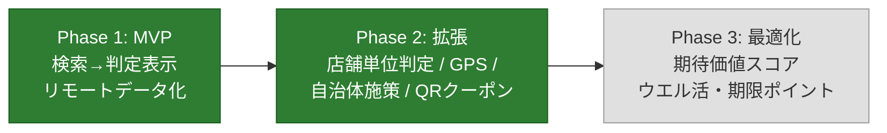

# poikatsu 進捗とロードマップ

開発の現在地と今後の計画をまとめるドキュメント。
フェーズの定義と背景は [PLAN.md](../PLAN.md)、コードの構成は [code-guide.md](code-guide.md)、個別タスクは [GitHub Issues](https://github.com/ktakjm/poikatsu/issues)（[Project Board](https://github.com/users/ktakjm/projects/1)）を参照。

最終更新: 2026-07-30

## 1. 現在地サマリ

**Phase 1（MVP）は完了**（2026-06-12）。Phase 2（店舗単位判定・GPS 周辺検索・期間限定キャンペーン・自治体施策・QR 決済クーポン・設定画面拡張）も完了（2026-06-30）。実機検証待ち。

```mermaid
flowchart LR
    P1["Phase 1: MVP<br/>検索→判定表示<br/>リモートデータ化"] --> P2["Phase 2: 拡張<br/>店舗単位判定 / GPS /<br/>自治体施策 / QRクーポン"] --> P3["Phase 3: 最適化<br/>期待価値スコア<br/>ウエル活・期限ポイント"]

    style P1 fill:#2E7D32,stroke:#1B5E20,color:#fff
    style P2 fill:#2E7D32,stroke:#1B5E20,color:#fff
    style P3 fill:#E0E0E0,stroke:#9E9E9E,color:#333
```

| フェーズ | 状態 |
|---|---|
| Phase 1（MVP） | ✅ 完了（2026-06-12） |
| Phase 2（拡張 + キャンペーン Phase A〜F） | ✅ 完了（2026-06-30）。実機検証待ち |
| Phase 3 | ⬜ 未着手 |

## 2. 完了した作業

完了済み機能の一覧は [Project Board の Done 列](https://github.com/users/ktakjm/projects/1) を参照。各機能の技術詳細は [code-guide.md](code-guide.md)、実装の経緯は git 履歴に残っている。

主な完了項目:

- **Phase 1**: チェーン名検索→判定表示→リモートデータ化（GitHub raw 配信）
- **店舗単位の対象判定**: `official_store_list` による 3 状態（対象/対象外/要確認）の断定表示
- **GPS 周辺検索 + 地図**: Google Maps SDK + YOLP ローカルサーチ。full-bleed 地図・ボトムシート・クラスタリング・場所検索・3 層モデル（モード/レンズ/ブリッジ）
- **Material 3 デザイン**: dynamic color・TopAppBar・セマンティックカラー・warning ロール
- **設定画面**: テーマ・マイカード・QR 決済・自治体登録（DataStore 永続化）
- **キャンペーン Phase A〜F**: 期間限定キャンペーン・自治体施策・QR クーポン・4 タブナビ・キャンペーンタブ・判定画面のカード/QR セクション
- **GitHub Actions CI**: main push / PR 時に `testDebugUnitTest` を自動実行し、データ整合性（merchant_id 参照切れ・エイリアス衝突等）を検出
- **S-in 前リネーム（#34）**: カード id 独立（campaigns 側が `card_id` で参照する向きに反転）・profile.json → payment_methods.json（リモート取得/テストデータ切替対象に昇格）・`card_promotion`→`promotion`・`issuer`→`operator`。設計判断は [schema-refresh-plan.md](schema-refresh-plan.md) 参照（2026-07-05、実機検証済み）
- **スキーマ拡張（#35）**: promotion のカード紐付け + 率の優先順位修正（B-1）・`card_brand` ブランド施策 + ブランドモデル再整理（カタログ=選択肢 `brands`、実ブランド=ユーザー設定。B-2）・`merchant_rules[].rate_override`（B-3）・`may_end_early`（B-4）・`recurrence` 繰り返し日付条件（B-5）・`benefit_type: lottery`（B-6）。その後の実機検証レビューでブランド保有登録（設定画面「カードブランド」）・brand_color の発行体カタログ移設を追加し schema_version: campaigns 6 / payment_methods 6。設計判断は [schema-refresh-plan.md](schema-refresh-plan.md) 参照（2026-07-06、実機検証済み）。報酬通貨マスタの設計は #39 に分離
- **ショーケースデータ全パターン整備（#33）**: data-test/ に全 11 施策・4 merchant・QR 決済を収録。4 象限（即時定額・後日定額）・UPCOMING・残り 3 日警告・official_store_list 3 状態・Amex 除外・location_hint・min_purchase / usage_limit / cap 各種・自治体施策・複数施策競合を網羅。実チェーン aliases で地図表示にも対応（2026-07-07、実機検証済み）
- **クラスタタップで内包店舗リストを表示**: クラスタピンのタップで常に「この付近に N 件」シートを開き（分解できるクラスタは同時にズーム+2）、ズームだけだと下部シートが旧検索中心基準の全体リストのままで無関係な店舗が上位に並ぶ問題を解消。複合ピン/分解不能クラスタは従来どおり「同じ場所に N 件」。あわせて再検索開始時のグループシート残留クリア・GPS 同座標でもカメラが現在地へ戻る `searchStamp`・「このエリアを検索」の表示しきい値半減（画面の約2割/下限50m）も実施。詳細は code-guide.md 7.1（2026-07-07、実機検証済み）
- **Google 標準 POI ラベルのズーム連動抑制**: 地図上の他社店舗・個人クリニック等の名前がアプリの店舗ピンと紛らわしい問題への対処。ズーム 18 以上で JSON スタイル（`MapStyleOptions`）により `poi` labels を全 off、18 未満はデフォルト表示（Google の重要度ランキングでランドマーク級のみ出る）。`visibility:"on"` を使うホワイトリスト方式はダークモードの配色を壊すため off 系ルールのみで構成。詳細は code-guide.md 7.1（2026-07-07）
- **カード施策のウォレット（Google Pay）動線（#26）**: campaigns.json に `eligible_wallets` / `ineligible_wallets`（公式がウォレット単位で対象/対象外を言い切っている事実のみ登録する 3 状態設計。schema_version 7）を追加。google_pay が eligible なら判定詳細に「ウォレット(Google Pay)を開く」起動リンク、ineligible なら「還元対象外」警告（SMCC=リンク、MUFG=警告。apple_pay が eligible なら「(Apple Payは対象)」を付記）。起動リンクのラベルを `CampaignJudgment.appLabel` に分離（バッジのカード名だと起動先と齟齬が出るため。QR は「◯◯アプリ」）。ウォレットは `<queries>` に宣言（Android 11+ の可視性制限で Play Store 経由になるのを防ぐ）（2026-07-08、実機検証済み）
- **警告色のテーマ追従修正**: warning 系（ExtendedColors）が OS のダーク設定を見ており、テーマ上書き時（OS=ダーク・アプリ=ライト等）に warning だけ暗い琥珀が出ていた。`PoikatsuTheme` が provide する `LocalAppDarkTheme` でアプリのテーマに追従。あわせてライトの琥珀面を errorContainer より抑えた彩度にし「赤=致命 > 琥珀=注意」の序列を維持。詳細は code-guide.md 6.4（2026-07-08、実機検証済み）
- **現在地の高速化・追従（FLP 移行）**: 地図を開いた直後に古い位置が出る・現在地反映が遅い問題への対処。`LocationManager` の単発 GPS 測位（コールドスタートで数秒〜数十秒、タイムアウト時は鮮度不明のキャッシュ採用）を `play-services-location` の **Fused Location Provider** に置き換え。2段階表示（2分以内の FLP キャッシュで即座に地図＋検索を出し、並行測位が 100m 以上ずれたら取り直し）＋「近く」タブ表示中の現在地継続購読（3秒/5m、`repeatOnLifecycle(STARTED)` でタブ離脱・バックグラウンド時に自動解除）。あわせて現在地確定時点で YOLP 取得を待たず地図を先出しし、結果待ちはボトムシートの「周辺の店舗を探しています…」で示す。青ドットは SDK 純正 my-location レイヤー＋`ManualLocationSource`（位置=継続購読、向き=コンパス（真北補正）を `Location.bearing` で供給）でリアルタイム追従。詳細は code-guide.md 7/7.1（2026-07-09、実機検証済み）
- **旧 OSM 系の残骸整理**: 休眠フォールバックの `OverpassClient` を削除し `Poi` を name/lat/lon に簡素化（`branch`/`brand`/`matchStore` の brand 引数は OSM タグ由来で YOLP では常に未使用）。ドキュメントも「かつて Overpass を使っていた・必要なら git 履歴参照」まで圧縮し、「Play Services 非依存」という旧方針の記述も全 docs から一掃（map-data-stack.md §5）（2026-07-09、実機検証済み）
- **地図の赤いデフォルトピン＋タップクラッシュ修正**: 稀に未定義の赤いピン（SDK 標準マーカー）が出現しタップで NPE クラッシュする事象への対処。原因はカスタムレンダラー適用前に `Clustering` へアイテムが流れる競合（標準 `DefaultClusterRenderer` が赤ピンを描き、非同期描画と差し替え掃除がすれ違うと孤児マーカーが残る→タップでキャッシュ未登録の null がリスナーへ渡る）。レンダラー適用を待ってからアイテムを流すガード＋クリックリスナーの null 許容の 2 段で修正。詳細は code-guide.md 7.1（2026-07-09、実機検証済み）
- **自治体グループ登録＋キャンペーンタブ地域フィルタ（#5/#27）・自治体マスタ自動生成（#10）**: municipalities.json を v2 スキーマ（自治体コード＋グループ内包）へ刷新し、`scripts/generate_municipalities.py` で気象庁予報区データから自動生成（一次細分=「埼玉県南部」等・まとめ地域=「23区西部」等・補完定義=「東京23区」。政令市の区分割・地域分割はスクリプトが自治体単位へ正規化）。設定画面のピッカーに「グループ(まとめて登録)」セクションを追加し、登録は `RegisteredArea`（自治体 or グループ、DataStore キー `registered_areas`）へ統合。キャンペーンタブは登録エリアで既定絞り込み＋「登録地域のみ」チップで全件切替（`filterCampaignsByArea`・domain 純 Kotlin・実マスタでテスト）。campaigns.json の `region.area_group` は廃止（グループ所属はマスタ側で解決）。実機レビューでピッカーを改善: 行はチェックボックスの単一トグル（登録/解除とも即時反映）、グループ行は ▼ で構成自治体を角丸パネルに展開（2026-07-10、実機検証済み）
- **探す・近くタブの自治体キャンペーンお知らせ（#3）**: 施策内容は複製せず「あること」だけをマイルドに知らせる設計。探すタブは初期画面（検索前）のみに「○○区で自治体キャンペーン開催中」バナー（登録地域と厳密一致。タップでキャンペーンタブの自治体フィルタへ着地）。店舗カードタップ後の判定詳細には出さない（チェーン店は自治体施策の対象外が多く店舗単位の断定ができないため）。近くタブは検索完了ごとに検索中心を 1 回だけリバースジオコーディングし、所在自治体で開催中の施策があれば検索バー下にお知らせピル（タップでキャンペーン詳細）。所在地ベースなので登録外の自治体（旅行先等）でも出る。突合の domain 関数（`municipalCampaignsForAreas`/`municipalCampaignsForLocation`。フィルタと逆に「出さない」側へ倒す厳密一致）は純 Kotlin + 実データテスト。`CampaignDetail` はタブ非依存のオーバーレイに昇格（2026-07-10、実機検証済み）。続けて**県全域施策**（かながわトクトクキャンペーン『かなトク！』等）に対応: `region.name == prefecture` を県全域のマーカーとする規約（`Region.isPrefectureWide`。data/README.md 参照）を導入し、地域フィルタ・バナーは「同県の自治体を 1 つでも登録していれば表示」、近くタブのピルは「地点がその県内なら表示」。終了日未定（予算到達で終了）の施策を許容するため実データ整合性テストの不変条件を「period_end または may_end_early」へ緩和（2026-07-10）。さらに段階制還元率（かなトクの中小20%/大手10%）の誤認防止として **`rate_rules`**（条件別還元率。schema_version 8）を追加: managed の `merchant_rules[].rate_override` と対になる条件キーの構造で、登録規則は「全条件を列挙し rate_base はその最大値」（AI でのデータ収集時に base へ入れる値の判断を推論に委ねない無条件規則。`rate_base == 最大値` を CI で強制）。表示は rate_rules がある施策の数字に「最大」を冠し内訳を列挙、managed 側も rate_override 等でグループ内の率が変動する場合は一覧サマリーに「最大」を付ける同一規則に統一（2026-07-10）
- **開発者モードの導入（#37）**: 開発者向け設定（`dataCommitRef`・`useTestData`（#33）・`useBundledData`（#36））を設定画面から別画面 `DeveloperSettingsScreen` へ集約し、「開発者モード」トグル ON 中のみ導線を出す。ON/OFF とも確認ダイアログ（ON=開発者専用・想定外挙動の注意、OFF=一括リセットの注意）を挟み、OFF 時は `resetDeveloperSettings()` が 1 回の edit で全項目を既定値へ戻して本番データに自動復帰。導線行には非既定値のサマリ（「テストデータ ON・ref=abc1234」等）を表示。あわせて「使用中データの commit」表示を追加: `refresh()` が GitHub API で ref をフル SHA に解決してから 3 ファイルの raw 取得をその SHA に固定（取得の合間の push で別 commit の内容が混ざる余地も解消）し、SHA はキャッシュにも保存して CACHE 起動でも表示（同梱モード中はグレーアウト）。詳細は code-guide.md「4. データ取得戦略」（2026-07-11、実機検証済み）
- **タブ名・アイコンの刷新**: 下部ナビの「探す/近く/キャンペーン」は各タブの軸（店起点の判定/地図起点の探索/施策起点の一覧）が名前から読めず、「探す」と「近く」の境界も曖昧だったため、名詞で統一した「お店・地図・期間限定・設定」へ変更（期間限定タブの TopAppBar タイトルは「期間限定キャンペーン」）。アイコンも意味が一致する Storefront（お店）/ Map（地図）/ LocalOffer（期間限定=値札）へ差し替え。`-extended` は依存追加せず、必要な 3 つだけ google/material-design-icons（Apache-2.0）のパスデータを `ui/theme/AppIcons.kt` へ個別コピーする方式を規約化（CLAUDE.md・code-guide.md 6・docs/licenses.md「同梱しているサードパーティ由来のコード」）。キャンペーンの意味で星を使っていた装飾（期間限定タブ空表示・お店タブの自治体バナー・地図のお知らせピル）も値札に統一し、星は「最良」の意味（判定詳細の最大おトク率）に限定（2026-07-12、実機検証済み）

- **施策データ収集の半自動化（[#8](https://github.com/ktakjm/poikatsu/issues/8)）**: Claude Code スキル `/collect-campaigns` を導入（`.claude/skills/collect-campaigns/`）。新規収集（PayPay/au PAY/d払い/カード2社/Amex/楽天ペイ・自治体は全国またはブロック指定）と既存メンテ（改定検知・verified_date 更新・期限切れ削除提案）をワンストップ化し、campaigns.json の下書きと見送り一覧まで自動生成（コミットは人間レビュー後）。着手前に各社規約・robots.txt を調査し、収集原則（事実情報のみ・楽天ドメイン不アクセス・SMCC 半手動・自治体クロスチェック等）を [docs/coupon-collection-tos.md](coupon-collection-tos.md) に文書化。maintenance 実行と municipal 関東 実行で実運用検証済み（かなトク3決済・千葉県/千葉市各4件を追加、松屋の事前決済限定を修正）。施策レベルの対象/対象外表示は [#41](https://github.com/ktakjm/poikatsu/issues/41) へ（2026-07-13）
- **ドラッグストア×メーカー×決済連動キャンペーン対応（[#43](https://github.com/ktakjm/poikatsu/issues/43)）**: PayPay×花王・楽天ペイ×花王・d払い×久光等（20〜30% と高率だが対象商品限定）を扱うためのスキーマ 3 点セット（schema_version 9）を追加: `product_scope`（対象商品限定。「最良特典」比較から分離し、一覧は無条件の特典を優先・商品限定のみなら「○% 還元(対象商品)」付記・判定詳細で「対象商品」冠＋警告表示）、`min_purchase_scope`（最低購入額の集計単位 transaction / period_total。「期間累計3,000円以上」型の表示を「期間中の購入合計○円以上(合算可)」に切替）、`requires_entry`（事前エントリー必須の警告）。メーカー主催のレシート応募型（決済不問）は帰属先が無く収録対象外と決定（mapping.md 見送り判定に追加）。merchants.json にドラッグストア 6 チェーン（ウエルシア・スギ薬局・ツルハ・マツキヨ・サンドラッグ・ココカラファイン。施策の事前登録として）と gc グループ `0202001`（ドラッグストア。実 API 検証で 6 チェーン全部のヒットと密度=0205 の 1/2〜1/3 を確認済み。コンビニ施策と結果枠を食い合わないよう 0205 とは別グループ）を追加し、YOLP 整合性テストを「事前登録を許容しつつ参照分のカバーと keyword 枠を検証」へ更新。data-test に `test_product_scope` ショーケースと専用 merchant テストドラッグ（実在 6 チェーンを aliases に持ち地図でのピン表示も確認できる）を追加（2026-07-13、実機検証待ち）
- **多チェーン施策の表示改善と地図ブリッジ・チェーン絞り込みの複数選択化（[#45](https://github.com/ktakjm/poikatsu/issues/45)/[#46](https://github.com/ktakjm/poikatsu/issues/46)）**: #43 の多チェーン促販施策がカード一覧で先頭チェーン 1 枚に見える表示ギャップへの対処。campaigns.json に `display_name`（カード表示用の短いタイトル。任意・多チェーン promotion 専用。schema は互換維持）を追加し、タイトルのフォールバック連鎖（display_name → 単一チェーンは merchant 名 → 「{先頭チェーン} 他Nチェーン」→ name）を導入（登録規則は mapping.md）。地図タブのチェーン絞り込み（レンズ 2 段目）を `Set<Merchant>` に複数選択化（`ChainFilterDropdown` チェックボックス・チェーンごとの解除可能ピル・0 件文言の複数対応。純クライアントフィルタなので YOLP コスト増なし）。施策詳細（期間限定タブ）に地図ブリッジを追加: お店タブと同じ FilledTonalButton を本文上に置き（単一「近くのこのお店を探す」/複数「近くの対象店舗を探す」）、チェーン個別の絞り込みは地図側ピルに一本化（個別チップはアクションに読めず廃止）。開始前・recurrence 非対象日もブリッジ可（YOLP 検索対象へ絞り込み中 merchant を加え、判定 0 件でも場所確認用に表示。warning 色の注意面で案内）。お店/期間限定どちらのブリッジも閉じた詳細画面を保存し、地図タブの戻る操作でブリッジ元へ復帰（`selectionBridgeReturn`/`campaignBridgeReturn`）。カード一覧のバッジ消失（FlowRow と IntrinsicSize.Min の相性で折り返し行がクリップ）を weight(fill=false) の Row へ変更して修正。UI 文言の単独「店」を「お店」に統一（2026-07-16、実機検証済み）
- **決済手段追加 AEON Pay・メルペイと決済アプリ複数対応（[#42](https://github.com/ktakjm/poikatsu/issues/42)）**: 規約確認を [coupon-collection-tos.md](coupon-collection-tos.md) に追記（AEON はグレーな一般条項+WAF の 403 を尊重してイオン系ドメイン不アクセス+半手動に、メルカリはガイドの禁止行為明記により楽天方式に。いずれも公開基準で保守側）。qr_payments カタログへ `aeon_pay` / `merpay` を追加（`enabled_default: false`。識別色はイオンマゼンタ/メルペイブルーの近似）し、collect-campaigns スキルに両社の収集経路（自治体クロスチェック+PR TIMES/加盟店側）を組み込み。既収録の自治体施策へ遡及（かなトク AEON Pay/メルペイ、千葉県・千葉市 AEON Pay。全て自治体側一次情報で確認）。AEON Pay が単独アプリ / iAEON の 2 本立てのため qr_payments を `app_packages`（サービス:アプリ = 1:N、schema_version 7）へ刷新し、判定詳細の起動リンクを候補全部のボタン表示に変更（`CampaignJudgment.appLinks` へ統合・Manifest `<queries>` も追随）（2026-07-16、実機検証済み）
- **対象/対象外スコープの両階層統一と conditions 解体（[#41](https://github.com/ktakjm/poikatsu/issues/41)）**: UI 非表示のまま公式の言い切り（参加登録店舗制・コンビニ対象外・チャネル限定等）が埋没していた `conditions` を解体し、`eligible_notes` / `ineligible_notes`（`[String]`）を**施策レベルと merchant_rules の両階層に同名・同型で導入**（旧 `note`/`exclusion_note` を改名。schema_version 10）。線引きは「見落とすとユーザーが損するか」: 損する言い切り（対象外+「〜のみ対象」型の限定）は ineligible_notes（warning 面 1 コンテナに箇条書き）、対象の拡張・明確化は eligible_notes（通常ロール）、行き場の無い補足は `memo`（旧 conditions。非表示・収集スキルの照合台帳）。判定詳細はレベル横断で連結した「対象」「対象外」2 セクション表示（お店/期間限定タブ共有 Composable）で、単一チェーン promotion のチャネル限定を施策レベルへ移し期間限定タブでも見えるように（松屋。あわせて `requires_entry` 未設定バグ修正、MUFG も要エントリー化）。階層の使い分けは「一様な事実=施策直下・店舗ごとの呼び分けは merchant 側（集約しすぎない）」。文字量圧縮の運用規則（既定値どおりの事実は書かない・冗長な言い換えをしない・バリアント間で cap_note/notes を統一）と整合性テスト（旧キー残存の生テキスト検出・payment_instruction 非空・memo への言い切り混入禁止）を追加し、data/README.md・mapping.md・code-guide.md を同一コミットで更新（2026-07-18、実機検証済み）

- **カスタムカード登録（[#2](https://github.com/ktakjm/poikatsu/issues/2)）**: 設定画面マイカードにカタログ外カードの追加・編集・削除 UI を追加。名前+識別色（12 色パレット+HEX カラーコード入力。未選択はグレー既定色）+国際ブランドを DataStore（`custom_cards`）に保持し、id は `custom:<UUID>` でカタログと衝突しない採番。エンジンへは PaymentCard に写して配管済みで、判定はキャンペーン駆動のため [#7](https://github.com/ktakjm/poikatsu/issues/7) カスタムキャンペーンが `custom:` id を参照した時点で判定に効く（ブランド付き登録は `card_brand` 施策に今から一致。`resolveCard` は firstOrNull なので `owned_brands` と重複しても判定は施策につき 1 件）。あわせて設定画面の決済手段（カード・ブランド・コード決済）全行に発行体の識別色ドット（24dp）を名前に併記し、カード行の「持っている/持っていない」補助文言を削除。UI 文言を「QR決済」→「コード決済」へ変更（商標配慮を保守側に。識別子・スキーマの `qr_payments` は維持）。副産物として、定額施策（`discount_amount`）に代表カードの常設率が `effectiveRate` へ混入し定額同士のソートが金額降順にならない問題を修正（`welcatsuApplied` も「カードの率を実際に表示したときのみ」に厳密化。回帰テスト追加）（2026-07-19、実機検証済み）
- **カスタムキャンペーン登録（[#7](https://github.com/ktakjm/poikatsu/issues/7)）**: 会員ポータル限定クーポン等、同梱データで配信できない施策をユーザー自身が登録できる UI を期間限定タブに追加（右下 FAB→全画面エディタ、施策詳細に編集・削除。登録導線は当初一覧末尾の行だったが、施策が多いとスクロールしないと見つからないため FAB に一本化）。登録内容は 2 段階構成: 基本＝名前・紐付け先決済手段（**複数選択可**。所有カタログカード / #2 のカスタムカード / コード決済（保存時に「利用中」へ自動登録）/ **ブランド指定**（Amex 会員限定施策等、card_brand 相当））・対象店舗（カタログチェーンの複数選択+一覧に無い店名の自由入力の併用可）・特典（還元/割引/抽選の型＋率・定額円・メモ）・期間（開始日・終了日とも任意）・対象日（毎日/曜日指定/日付指定＝recurrence）、折りたたみ「詳細条件」＝対象外注意（warning 表示）・対象商品限定・最低購入額(+期間合計スコープ)・利用回数・還元上限（1回/期間計/補足）・詳細 URL。DataStore（`custom_campaigns`・id は `custom:<UUID>`。旧単一決済スキーマは読み込み時に自動変換）に保持し、domain の純 Kotlin 変換（`CustomCampaigns.kt`）で**決済手段ごとに** Campaign（type=promotion・展開 id は `:pN` サフィックス）へ写して同梱データに合流させるため、エンジンにカスタム専用分岐は無い（1登録=1「率・条件」。決済ごとに率が異なる施策は別登録）。期間限定タブは登録単位で 1 カードにグルーピング（ストライプは決済色が複数並ぶ）。自由入力店名は合成 Merchant（`custom:store:<正規化名>`。同名は施策をまたいで集約）として注入し、既存の検索・POI 照合（部分一致）・YOLP キーワード検索にそのまま乗る（お店/地図/期間限定の 3 タブに自動反映）。一覧・判定カードに「自作」バッジ（secondaryContainer）で同梱施策と区別。終了日を過ぎた自作施策は判定から消えるが「終了(自作)」セクションに残して編集（期間延長）・削除の入口を維持。あわせて promotion で率も定額も無い施策にカードの常設率で代替しない修正（率を捏造して最良比較に載せない。既存データは非該当を確認済み）と、開始日・終了日とも無い施策の期間表示を「終了日未定」に統一（カスタムに限らず全施策。従来は一覧が「〜」だけ・判定詳細は非表示だった）。変換+エンジン統合の回帰テスト 20 件追加（2026-07-23、実機検証待ち）
- **amex_excluded → ineligible_brands 一般化（[#53](https://github.com/ktakjm/poikatsu/issues/53)）**: 「Amex かどうか」の Boolean フラグを除外ブランド名のリスト `merchant_rules[].ineligible_brands`（値は payment_methods.json `card_brands` 参照・整合性テストで強制。schema_version 11）へ置き換え、Amex 以外のブランド除外・複数ブランド除外に拡張可能にした。判定の保守的方針（未選択でも除外ブランドを取りうるなら除外側に倒す）は `excludedByBrand` の一般化でそのまま維持。設定画面のブランド警告文も Amex ハードコードを廃しデータ駆動（カードの施策から除外ブランドを集約して文言に埋め込む）に変更。汎用条件 DSL は作らない方針（#41 の conditions 解体と同じ「機械判定できる条件だけ型付きフィールド」の線）。旧フィールドは残さないため、**データを main へ push する前に 3 台とも新ビルドへ更新が必要**（旧アプリがリモートの新 JSON を読むと除外が消える）（2026-07-23、実機検証済み）
- **設定画面の階層化（[#47](https://github.com/ktakjm/poikatsu/issues/47)）**: 設定タブをトップページ（カテゴリ行のみ）+ サブページの 2 階層に再構成。#37 開発者向け設定で確立したオーバーレイ+戻るパターンを横展開し（`UiState.settingsSubpage`＝`SettingsSubpage` enum。topBar/本文 when の分岐順一致・`BackHandler`）、サブページは 表示 / お支払い方法（マイカード+国際ブランド+コード決済の統合。`PaymentMethodsSettings.kt`）/ マイエリア（自治体。`MunicipalitySettings.kt`）/ キャンペーンデータ / 開発者向け（開発者モードトグルをサブページ内に統合し二重ネスト回避）/ このアプリ の 6 つ。トップの各行に現在値サマリ（`UiHelpers` の純関数+単体テスト。「カード3枚・コード決済2件」「埼玉県 南部 ほか1件」等。未登録時は「登録すると期間限定タブを地域のキャンペーンに絞れます」と効果を添える）を出し遷移せず一望できるように。登録済み自治体の表示名を「都道府県 名前」（`areaDisplayName`。グループは構成自治体数を併記）へ変更し「南部(埼玉県・グループ)」問題を解消。行名は登録動機が伝わるよう「マイエリア」（マイカードと対）「キャンペーンデータ」に命名（2026-07-23、実機検証済み）
- **OSS ライセンス表示（[#48](https://github.com/ktakjm/poikatsu/issues/48)）**: 設定→このアプリに「オープンソースライセンス」行と一覧画面（`LicensesPage`）を追加。AboutLibraries 14.2.1（Apache-2.0。15.x は Kotlin 2.4 / compileSdk 37 要求のため Compose 1.10 / AGP 9 対応の 14 系を採用）の Android プラグイン（`com.mikepenz.aboutlibraries.plugin.android`）がビルド時に Gradle 依存からメタデータ（`R.raw.aboutlibraries`）を自動生成するため**依存の増減に自動追従**する（現在 137 ライブラリ。GMS 系のプロプライエタリライセンス ASDKL も区別して表示）。Gradle 依存でない同梱コード（AppIcons.kt の material-design-icons パスデータ）は `app/config/libraries/` のカスタム定義で掲載。画面は #47 の `SettingsSubpage` に LICENSES（ABOUT 配下の 2 階層目）を追加し、戻る操作は `onCloseSettingsSubpage` が親の ABOUT へ戻す。docs/licenses.md を依存追加前に更新（CLAUDE.md ルール）（2026-07-24、実機検証済み）。**保留**: AGP 9.3 / Gradle 9.5 以降、本プラグインが構成時に依存グラフを解決する既知の問題（AboutLibraries #1369）でビルド時に「Configuration 'debugCompileClasspath' was resolved during configuration time」警告が出る。実害なし（構成フェーズがわずかに遅くなるのみ）。修正は 15.x に入っているため、Kotlin 2.4 / compileSdk 37 へ上げる節目の 15.x 移行で解消する
- **自治体登録の UX 改善（[#49](https://github.com/ktakjm/poikatsu/issues/49)）**: マイエリアのピッカー（都道府県選択の階）に検索フィールドを追加し、自治体名・グループ名の部分一致で都道府県横断の候補を出す（例「札幌」→ 北海道 札幌市。`searchAreas`＝純関数を実マスタでテスト。マスタに読みがなが無いため表記の一致のみ）。都道府県から辿る既存導線は残し検索は近道として併設。登録済みリストの ✕ は確認ダイアログを挟まず即削除+Snackbar「元に戻す」（アプリ共通の snackbarHost。ピッカー内のトグル解除はチェックし直せば戻せるため出さない）（2026-07-26、実機検証済み）
- **キャンペーン通知（[#6](https://github.com/ktakjm/poikatsu/issues/6)）**: WorkManager のローカル通知方式（issue #6 の方式調査で FCM 不採用: 登録エリア・所有カード等の個人化情報は DataStore＝端末内にしかないため、判定は端末側でしか行えない。費用 ¥0）。毎日の通知時刻（設定→通知で 15 分刻みに変更可・既定 8:00。表示は「8:00頃」と厳密でないことを示す）の日次ジョブ（`CampaignNotificationWorker`。周期 24h だと発火が「前回実行の約24時間後」で後ろズレが蓄積するため、実行のたびに `setNextScheduleTimeOverride`+`UPDATE` で翌日の通知時刻へ**再アンカー**してズレを毎日リセット。残るのは当日の WorkManager 起動遅延＝通常数分で、再アンカーが漏れても周期ジョブとして生き残り次の成功時に補正される）が最新データを取得（リモート失敗時はキャッシュ→同梱にフォールバック）し、「開始日（当日+取りこぼし翌日まで）」「終了間近（3 日前から。UI の警告と同基準）」に該当する施策があるときだけ 1 件のまとめ通知を出す（recurrence の対象日通知は毎週発火して高頻度のため対象外）。対象は「自分に関係する施策」のみ: マイエリア厳密一致の自治体施策（`municipalCampaignsForAreas`）+ 所有カード/ブランド/利用中コード決済に紐づく promotion + カスタムキャンペーン（card_program は対象外）。判定・文言は `domain/NotificationPlanner.kt`（純 Kotlin+単体テスト 17 件）、カタログ×ユーザー設定のマージは rebuild から `domain/UserDataMerge.kt` へ抽出して VM と Worker で共用（表示と通知の基準ずれ防止）。再通知抑止は dedupKey（施策 id+期間の日付。期間改定で再通知される）を DataStore に記録。設定→通知サブページ（既定 OFF）の ON 操作で Android 13+ の POST_NOTIFICATIONS を要求し、許可時のみ有効化。may_end_early で終了日未定の施策は終了間近を拾えない旨をサブページに明記。依存に androidx.work:work-runtime-ktx（Apache-2.0、docs/licenses.md 追記）。通知アイコンはアプリアイコンの % シルエット（ic_launcher_monochrome と同パス）。通知チャンネルの初期値は重要度 HIGH（画面 ON ならヘッドアップ表示）+ バイブ ON（パターンは端末既定）。チャンネルは作成後の初期設定をアプリから変更できない（同 id での削除→再作成でも旧設定が復活する。上書きインストールでもチャンネルは残る）ため、**一般公開後に初期設定を変えるときは id にサフィックスを付けて別チャンネルにする**（旧 id は `deleteNotificationChannel` で掃除）。公開前の現在はアンインストール→再インストールで作り直せるので素の id のまま。**開発者向けに通知のテスト実行**（「今すぐテスト通知」「10 秒後にテスト通知」＝押してから画面を消して消灯中の鳴り方を見る用、「通知済み履歴を消す」）を追加: 日次ジョブとは別の unique work（`OneTimeWorkRequest`＋入力データ `test_run`）で、通知設定 OFF でも走り日次スケジュールには触れない一方、判定・通知そのものは本番と同じ経路を通す。JobScheduler はジョブをまとめて実行するため発火は指定時刻から数分ずれる（2026-07-28 の検証で 00:30 指定→00:31:04 発火）ので、時刻設定での動作確認は当てにせずこのテスト実行を使う。開始通知には終了日を併記（「〜が今日から開始（〜2026/07/28）」）: 開始と終了間近が同日に重なる短期施策は開始通知のみ（1施策1行で開始優先。終了当日に「今日で終了」が別途出る）のため、併記が無いと終了時期が通知から読めない（開始日=終了日の1日限り施策も併記でカバー）（2026-07-26、実機検証済み）

- **設定の JSON エクスポート/インポート（[#50](https://github.com/ktakjm/poikatsu/issues/50)）と Auto Backup ルールの明文化（[#51](https://github.com/ktakjm/poikatsu/issues/51)）**: 引き継ぎ経路を「自動（Auto Backup）+ 手動（JSON ファイル）」の 2 本立てにした。#51 はルールファイル（`data_extraction_rules.xml` / `backup_rules.xml`）のテンプレコメントを整理し、**除外なし = 全部バックアップが意図的な選択**である旨と理由（対象は DataStore と data キャッシュのみ・認証情報や端末固有データを持たない・25MB 枠に響かない）を cloud-backup / device-transfer 両方に明記。今後「復元されると困るキー」を足すときは両ファイルに除外を追加する。#50 は設定トップに「バックアップ」カテゴリ（`BackupSettingsPage`）を追加し、SAF（`CreateDocument`/`OpenDocument`）で JSON 1 ファイルの書き出し・復元を行う。含めるのは端末をまたぐ意味のあるユーザー設定だけ（開発者向け設定・通知済みキーは除外）。`schemaVersion`（現在 1）に**既定値を持たせない**ことで無関係な JSON を弾き（「全部既定値のバックアップ」として設定を消す事故の防止）、新しい版のファイルは読まずに断る。復元は中身の要約付き確認ダイアログ→1 回の edit で全上書き（マージなし）+ 通知ジョブの再同期。実行時パーミッションはバックアップに入れられないため、通知 ON のファイルを復元するときは **POST_NOTIFICATIONS を要求してから適用**し（Android 13+ かつ未許可のときだけ）、拒否されたら通知だけ OFF で復元して Snackbar で伝える（「設定は ON なのに通知が来ない」状態を作らない）。同じ食い違いは Auto Backup での復元・端末設定での権限取り消しでも起こる（どちらもアプリからは検知できない）ため、通知サブページに「通知はオンですが許可されていません」の warning 表示を追加（`ON_RESUME` のたびに権限を読み直す）。純関数（`toBackup`/`toSettings`/`encode`/`decode`）に切り出して `SettingsBackupTest` で往復・旧ファイル・壊れた値・id 重複を検証。詳細は code-guide.md「4. データ取得戦略」の設定のバックアップ節。**復元テストで判明した Auto Backup の穴 2 つも塞いだ**: 再インストール後、DataStore（マイカード等）は復元されたが通知は復元されなかった。(1) 実行時パーミッションは OS が別枠で扱い未許可のまま、(2) 通知の日次ジョブは WorkManager の Room DB（`androidx.work.workdb`）にあり、その置き場所が `no_backup` ディレクトリ（`WorkDatabasePathHelper` が `getNoBackupFilesDir()` 配下に置く）= Auto Backup 対象外。対処として (1) は通知サブページの warning 表示、(2) は起動後の初回設定 emission で `CampaignNotifications.ensureScheduled()` が「設定は ON なのにジョブが無い」を検出して登録し直す（既に登録済みなら何もしない——実行待ちのジョブを翌日へ押し出して当日分を落とさないため）（2026-07-27、実機検証済み。Auto Backup の復元テストも実施済み——手順は code-guide.md 同節）
- **おトクタブへの改名と全加盟店対象施策（[#44](https://github.com/ktakjm/poikatsu/issues/44)）**: 「期間限定」タブを「おトク」に改名（TopAppBar も「おトク」）し、期間限定でない施策も居場所を持てるタブに再定義。セクションを 開催中 → **常設** → 開催中（本日対象外）→ もうすぐ開始 → 終了（自作）に再構成し、常設（`isTimeLimited=false`）は日付なしなら期間行を省く（セクション見出しが説明を兼ねる。当初付けた「常設」バッジは他タブとの統一感を欠くため実機レビューで廃止。判定詳細の期間表示は「終了日未定」→「常設」に。may_end_early は従来どおり「終了日未定」）。**card_program（SMCC/MUFG）もおトクタブに表示**（`campaignType != CARD_PROGRAM` フィルタ撤廃。タイトルは display_name → name のフォールバックで「他Nチェーン」形式にしない。データ側に display_name「三井住友カード コンビニ・飲食店のタッチ決済」等を追加）。詳細の対象チェーン列挙は 7 件以上で先頭 4 件+「他N」に畳みタップで全展開（chevron 付きの面。SMCC の 35 チェーンで詳細が埋まらないように）。**全加盟店対象の promotion（external + merchant_rules 空）を整合性テストで許容**（おトクタブ専用施策。managed は従来どおり期間+merchant_rules 必須）し、常設抽選「たぬきの吉日 たぬきの抽選会」（au PAY・毎月5/8/15/25日・要200円・エントリー不要・Ponta 最大3,000pt 必ず当たる）を収録。**カスタムキャンペーンにも「お店を指定しない（全店舗対象）」トグル**を追加（`CustomCampaign.allStores`。選び忘れの誤登録と区別するため暗黙でなく明示トグル。保存時に external へ変換・合成 Merchant も作らない）。mapping.md の「チェーン特定できなければ external」とテストの矛盾も解消。PayPay スクラッチくじは 7/31 終了間近のため見送り。**続けておトクタブの表示レートをお店タブと同じ基準に統一**: 率の優先ロジックを純関数 `resolveCardCampaignRate` に抽出して judgeCards と共有し、所有カードの card_program はユーザー設定の実効率（ウエル活 ON なら倍率適用済み）+倍率バッジ・実質還元率注記で表示（未所有は rate_base のカタログ値へフォールバック）。カスタムキャンペーンにも「早期終了の可能性あり」チェック（`mayEndEarly`。campaigns.json の may_end_early と同義・終了日の有無と直交する 4 パターン対応）を追加し、常設と終了日未定をスキーマで区別できるようにした。セクションは常設側にも「常設（本日対象外）」を分離（開催中→常設→開催中（本日対象外）→常設（本日対象外）→もうすぐ開始→終了（自作））。may_end_early の注記は終了日なしのとき「※予告なく終了する場合があります」に出し分け（「早期」の比較対象となる期限が無いため。詳細カードも同様で、終了日あり×カスタムは予算に言及しない文言）（2026-07-29、実機検証待ち）
- **横画面（landscape）対応: NavigationRail + 地図タブの二ペイン化（[#4](https://github.com/ktakjm/poikatsu/issues/4)）**: 横持ちでは下部タブ+シート peek（220dp）が高さの約 7 割を塞ぎ地図がほぼ見えなかった問題への対処。横画面では (1) **下部タブを左端の `NavigationRail` に置き換え**（アプリ全体の骨格を `Row(Rail, Scaffold)` に。タブ定義は `NavTabSpec` で縦横共用。Rail の既定 containerColor=surface は本文と同色になるため `surfaceContainer` を明示して縦の下部タブと同色に）、(2) **地図タブをボトムシートでなく二ペイン**（地図=中央・全高・weight(1f)、お店リスト=右 320dp 固定ペイン。リスト右は地図を主役に保つ配置）に組み替え。シートの 3 状態（一覧/プレビュー/グループ）を `NearbySheetContent` に共通化して縦横で共用し、横はシート特有の状態遷移（peek/partialExpand）が消える。`searchFailed` の Snackbar は横では地図上（BottomCenter）。判定は `LocalConfiguration` の window の向きで WindowSizeClass 依存は追加しない。縦画面の挙動は無変更。検討過程（サイドシート案/幅制限シート案はモック比較の上で見送り——前者は M3 SideSheet 未提供で自作コスト、後者は幅制限が中央寄せ固定かつ高さ問題が未解決）（2026-07-29、実機検証済み）
- **お店タブの横画面対応: 上部圧縮 + 一覧+詳細の二ペイン（[#54](https://github.com/ktakjm/poikatsu/issues/54)）**: 横持ち（高さ 412dp 級）で TopAppBar+検索窓+チップ折り返し+状態行+説明文が上部の大半を占有し検索結果がほぼ見えなかった問題への対処。(1) **上部圧縮（横画面のみ・向き判定）**: 横画面の 1 ペインでは、タイトル「ポイ活ナビ」直後に検索窓（320dp）+再取得アイコンを**左詰め**で並べた 1 行ヘッダ `SearchBarRow` を TopAppBar の title スロットに置き検索窓の行（約 64dp）を節約（当初は actions＝右寄せだったが、チップ行との分断の実機レビューで左詰めに変更）、カテゴリチップは 1 行の横スクロール（地図タブ NearbyFilterBar と同型。**スクロール余地のある側をフェードさせ続きがあることを示す** `horizontalFadingEdges` を新設し両タブで共用）、データ状態行は横では非表示（再取得はヘッダ側、状態は設定→キャンペーンデータで確認可。初期説明文は結果が出れば消えるため横でも表示のまま）。(2) **一覧+詳細の list-detail 二ペイン**: `material3-adaptive`（1.2.0・Compose BOM 管理・Apache-2.0・licenses.md 追記）の `ListDetailPaneScaffold` を採用し、**分割判断は directive 指定なしで M3 標準（`calculatePaneScaffoldDirective`＝WindowSizeClass ベース。幅 Expanded 級=840dp 以上で 2 ペイン）に委ねる**。二ペイン時は**グローバル TopAppBar を出さず**（アプリバーは各ペインに属する M3 の multi-pane 定石）、一覧ペイン先頭に「タイトル+再取得」行+全幅検索窓の **2 行ヘッダ**を置き、詳細ペインは上端まで全高（詳細カードが約 64dp 高くなる。1 行同居の SearchBarRow をペイン先頭に置く案は検索窓が短すぎ、グローバルバー復活案は詳細がバー分下がる——と実機レビューでどちらも撤回し、2 行化で検索窓の幅と詳細の高さを両立）。判定詳細（selection）・店舗判定（storeCheck）は全画面オーバーレイでなく右の詳細ペインに表示（ペイン内ヘッダで✕/←、店舗判定はペイン内置換、一覧の選択行は secondaryContainer ハイライト、NavigationRail は出したまま）。判定詳細の先頭領域（カテゴリタグ・帰属・ボタン類）も判定カードと一緒にスクロールさせ、固定はタイトル（TopAppBar / PaneHeader）のみに変更（縦横共通。高さの限られる画面でカードの表示域を確保）。幅が足りない窓では従来どおり全画面オーバーレイ（縦画面と同じ見え方）になるため端末幅で挙動が割れても破綻しない。手作り Row 案との比較検討の上、レイアウト判断を M3 標準に乗せる価値（タブレット/フォルダブルへの自然な追従・ペイン切替アニメーション）を取ってライブラリ採用を決定（Rail の向き判定とは直交・併存）。おトク・設定タブへの list-detail 展開は採用可否が決まったため今後の別課題。縦画面は無変更（2026-07-30、実機検証済み）

### Phase 3: 最適化アドバイス（未着手）

判定エンジンを「還元率比較」から「期待価値スコア比較」へ拡張する。詳細は [#13](https://github.com/ktakjm/poikatsu/issues/13)。

### バックログ

個別の改善候補は [GitHub Issues](https://github.com/ktakjm/poikatsu/issues) で管理。`someday` ラベルは優先度低（必要になったら着手）。

## 4. 定常運用タスク

| タスク | 頻度 | 内容 |
|---|---|---|
| 常設施策データの確認 | 月 1 回 | `/collect-campaigns maintenance` で公式 URL を照合し `verified_date` を更新。改定があれば率・店舗リスト・`updated_at` を修正 |
| 期間限定キャンペーンの追加 | 月 1 回目安（任意） | `/collect-campaigns`（フルまたはソース/地域指定）で収集し下書きをレビュー。収録基準・情報源は [data/README.md](../data/README.md) と `.claude/skills/collect-campaigns/sources.md` 参照 |
| 期限切れデータの削除 | 月 1 回 | 終了後 30 日経過したキャンペーンを削除（`/collect-campaigns maintenance` が削除候補を提案） |
| 整合性チェック | データ更新のたび | `./gradlew :app:testDebugUnitTest`（merchant_id 参照切れ・エイリアス衝突を検出）。main push / PR 時は GitHub Actions CI でも自動実行される |
| 店舗単位の対象情報の追記 | 発見ベース | 公式が対象/対象外を**言い切っている**完全なリストを見つけたら `official_store_list` に追記。例示レベルの情報は `ineligible_notes` に文章で残すにとどめる |

## 5. リスクと割り切り

| リスク | 対応状況 |
|---|---|
| 施策情報が古くなり誤判定 | ✅ `verified_date` を判定画面に必ず表示 + データ鮮度表示 |
| 対象外店舗リストの網羅が困難 | ✅ 公式が言い切っているリストがあるチェーンだけ断定表示 |
| クーポンの個人差 | ✅ 全員配布系のみデータ化。個人配布は QR アプリへの確認導線 |
| スクレイピング自動化の規約リスク | ✅ 各社規約・robots.txt を調査し [docs/coupon-collection-tos.md](coupon-collection-tos.md) に文書化。規約適合の範囲で半自動化（事実情報のみ・楽天/メルカリ/イオン系ドメイン不アクセス・SMCC 半手動・403 不迂回） |
