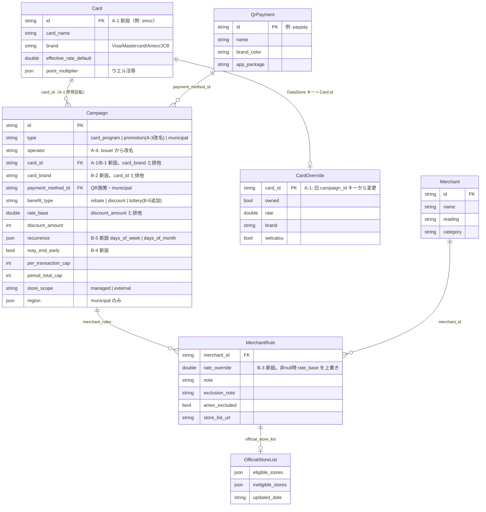

# スキーマ刷新計画（S-in 前リネーム + 拡張）

作成: 2026-07-04。実在キャンペーンの調査とスキーマ突き合わせ・命名レビューを行ったセッションの引き継ぎドキュメント。
**このセッション内で完結しない前提**で、後続セッションが本ドキュメントだけで作業を再開できるよう、調査結果・設計判断・issue 対応方針をすべて記す。

- ステータス: ~~レビュー待ち~~ → ~~issue 化~~（2026-07-04 完了: 対応A = [#34](https://github.com/ktakjm/poikatsu/issues/34)、対応B = [#35](https://github.com/ktakjm/poikatsu/issues/35)） → ~~対応A 実装~~（2026-07-05 完了） → **対応B 実装（後続セッション）**
- 実装の進行管理は GitHub Issues 側（#34 / #35）に移行済み。本ドキュメントは背景・設計判断のリファレンスとして参照する
- 完了した項目はチェックを付け、設計変更があればこのファイルを更新すること

### 対応A 実装時の設計調整（2026-07-05、#34）

- カード id は `smcc` / `mufg`（テストデータは `test_card`）。Kotlin 型名は `ProfileCard`→`PaymentCard`、`ProfileFile`→`PaymentMethodsFile`。`Profile` ラッパーは廃止し、payment_methods.json はトップレベルに `cards` / `qr_payments` を持つフラット構造、`PoikatsuData` も `cards` / `qrPayments` を直接持つ
- **payment_methods.json はリモート取得・テストデータ切替の対象に含めた**（§3 A-2 の「常にローカル」から変更）。カタログと再定義した以上 merchants/campaigns と同列に扱うのが一貫するため。`DataRepository` は 3 ファイルを取得・キャッシュし、data-test/ にも専用の payment_methods.json（`test_card`）を置いてテスト施策を紐づけた
- schema_version: campaigns.json 3→4、payment_methods.json は profile.json の 2 を引き継いで 3

## 1. 背景と目的

きっかけは 2 つの実在パターンへの対応検討:

1. **三井住友カードのタッチ決済限定・期間限定・特定店 10% 還元（上限あり）** — card_promotion がどの所有カードにも紐付かず判定から落ちる構造的な穴が見つかった
2. **AMEX ブランド施策（イシュアー不問・期間限定・30% 引き・上限・公式店舗リスト）** — カードブランドを対象条件にする概念がない

これを機に実在キャンペーンの「仕組みの型」を網羅調査（2024〜2026 実例、クレカ系 + QR/自治体系）し、スキーマの穴と S-in（一般公開）前に直すべき命名を洗い出した。

## 2. 実在キャンペーン調査の結果とスキーマ突き合わせ

### 2.1 構造的に表現できない型（対応する）

| 型 | 実例 | 頻度 | 対応 |
|---|---|---|---|
| card_promotion のカード紐付け | 三井住友「還元祭」等、カード会社の期間限定 | 高 | §4.1 |
| カードブランド条件 | Visa「タッチで Visa 割」(2026)、AMEX 系施策 | 中〜高 | §4.2 |
| 繰り返し日付条件 | d曜日(毎週金土)、イオン感謝デー(20・30日)、三太郎の日(3・13・23日)、5と0のつく日 | 高 | §4.5 |
| 抽選型 | PayPayスクラッチくじ(1/4で当選・最大全額)、三井住友「還元祭」(口数抽選)、楽天ペイ「抽選100名全額」 | 高 | §4.6 |
| 同一施策内の店舗別還元率 | 自治体系の定番(足立区: 中小20%/大手10%)、Visa「基礎+特定店で追加15%」の2層 | 中 | §4.3 |
| 早期終了(予算到達次第) | 東京都「TOKYO元気キャンペーン」2024/12/24 前倒し終了。自治体系はほぼ標準条項 | 高(自治体) | §4.4 |

### 2.2 現行スキーマで表現できる型（スキーマ対応しない）

後続セッションが再調査・再検討しないための「やらないことリスト」。

| 型 | 実例 | 受け皿 |
|---|---|---|
| 支払い元条件（残高のみ・登録クレカ払い対象外） | PayPay 自治体系ほぼ全部、楽天キャッシュ限定 | `payment_instruction` の文章。エンジンは決済手段の内部まで判定しない |
| タッチ決済限定・Apple Pay 限定 | JCB 交通機関 30%、SMCC スマホタッチ | 同上（既存 card_program も同方式） |
| エントリー必須 | 三井住友還元祭、楽天ペイ松屋 | `conditions` の文章。UI バッジ化したくなったら `entry_required: Boolean` を足す（拡張余地としてメモのみ） |
| クーポン事前取得型 | PayPay クーポン | rebate 扱いで整理済み（data/README.md） |
| 対象商品限定 | PayPay×花王 30%（年2回ペース） | `rate_base` + 施策名・`conditions` で近似。「店全体の 30%」に見える問題は #29 の表示改善側で扱う |
| 複数決済サービス同時開催・上限独立 | 葛飾区 4 社 15% | **現行設計が正解**。サービスごと別レコード（湯沢市の PayPay/au PAY 分割が実例）で上限独立も表現できている |
| キャリア限定・会員ランク連動 | スーパーPayPayクーポン(SoftBank限定) | 収録基準「全員配布」で意図的に対象外 |
| 前月実績連動 | PayPayステップ(+0.5〜2%) | 収録基準 5% 未満。将来やるなら「QR にもカード同様のユーザー実効率設定」を足す話（#13 の周辺） |
| 山分け・現金書留・非金銭(植樹) | JCB 山分け、セゾンお月玉 | レア。収録対象外 |
| 新規入会限定・リボ誘導 | 各社常設 | 店舗選択の判定に寄与しないためアプリの対象外 |

### 2.3 目指すデータモデル（ER 図）

対応 A + B 完了後の**目標状態**。リレーション（特に Card→Campaign の参照反転と、施策が決済手段に紐付く 3 経路の排他）が本図の主眼で、フィールド単位の細部は実装時に調整してよい（調整したら本図も更新すること）。

- ファイル境界: `Card`/`QrPayment` = payment_methods.json（旧 profile.json）、`Campaign`/`MerchantRule`/`OfficialStoreList` = campaigns.json、`Merchant` = merchants.json、`CardOverride` = DataStore（JSON ではない。ユーザー差分）
- **Campaign の帰属は `card_id` / `card_brand` / `payment_method_id` のいずれか 1 つ**（card_program・promotion は card_id か card_brand、QR 施策・municipal は payment_method_id）



（period_start/end・conditions・URL 系・verified_date 等の既存フィールドは変更がないため図から省略）

## 3. 対応A: S-in 前リネーム（→ #34）

一般公開後はユーザー設定（DataStore）とリモートデータ（GitHub raw）の互換維持が必要になる。**端末が手元 3 台だけの今なら、`schema_version` を上げて一斉入れ替えするだけで済む。**

### A-1. カード識別子の独立（最重要）

現状、カードの主キーが「紐づく施策の id」になっている:

- `ProfileCard.campaignId`（`app/src/main/java/com/ktakjm/poikatsu/data/Models.kt:184`）
- 判定エンジンのカード解決: `profile.cards.firstOrNull { it.campaignId == campaign.id }`（`domain/JudgmentEngine.kt:366`）
- **DataStore `card_overrides` のマップキーも campaign_id**（`data/SettingsRepository.kt:54,117`）

card_promotion 対応で 1 カード : N 施策 になると破綻する。S-in 後に直すと設定マイグレーションが必要。

対応: **参照の向きを反転する**。

```json
// payment_methods.json（旧 profile.json）
{ "id": "smcc", "card_name": "三井住友カード", "brand": "Visa", ... }

// campaigns.json — card_program / promotion 側がカードを参照
{ "id": "smcc_combini_restaurant", "type": "card_program", "card_id": "smcc", ... }
{ "id": "smcc_touch_10pct_2026_08", "type": "promotion", "card_id": "smcc", ... }
```

- `judgeCards` は `campaign.cardId == card.id` でマッチ
- DataStore `card_overrides` のキーも card id に変更（現データは捨ててよい。手元端末は設定し直し）
- 設定画面の `setOwned/setRate/setBrand/setWelcatsu`（`SettingsRepository.kt:101-111`）の引数も card id に

### A-2. profile.json → payment_methods.json

中身は cards + qr_payments の**カタログ（決済手段マスタ）**であり、ユーザー固有値は設定画面 + DataStore 差分に移った経緯があるため「profile」は実態とズレている。

- ファイル名変更 + Kotlin 型名: `Profile`/`ProfileFile`/`ProfileCard` → `PaymentMethodCatalog`/`PaymentMethodsFile`/`CardEntry` 等（実装時に自然な名前を選ぶ）
- **CLAUDE.md の「ユーザー固有の前提は data/profile.json に分離する」の記述、data/README.md、docs/code-guide.md も追従**
- assets 同梱ファイル名・`PoikatsuJson.parse` の引数名も追従

### A-3. type: "card_promotion" → "promotion"

楽天ペイ（QR）の施策 `rakuten_pay_matsuya_60th_2026_07` に既に `card_promotion` が付いており名前が実態と不一致。エンジンはこの type を分岐に使っておらず（`payment_method_id` の有無で card/QR を判定）、JSON・ドキュメント・データクラスのデフォルト値の書き換えで済む。

### A-4. issuer → operator（低優先）

PayPay・自治体施策の `issuer: "PayPay"` は発行体ではなく運営者。ただしコード上の使用はキャンペーンタブのバッジのフォールバック 1 箇所（`ui/MainViewModel.kt:1051`）のみで実害なし。A-1〜A-3 のついでに直す程度。

### 移行時の注意

- `Json { ignoreUnknownKeys = true; coerceInputValues = true }` のため、**旧フィールド名のデータを新アプリが読むと黙ってデフォルト値になる**（クラッシュしない=静かに壊れる）。リネームは campaigns.json / merchants.json / payment_methods.json / アプリを**同一コミットで一斉変更**し、`schema_version` を上げる
- データは GitHub raw(main) 優先取得のため、**push とアプリ更新の順序に注意**（CLAUDE.md の作業フロー例外を参照。旧アプリが残る端末には新データを読ませない → 3 台とも即時更新すれば済む）

## 4. 対応B: スキーマ拡張（→ #35）

優先度順。B-1 が最優先（実在の三井住友施策が来たら即必要 + 潜在バグ修正を兼ねる）。

### B-1. promotion のカード紐付け + effectiveRate 修正

A-1 の `card_id` 参照で紐付け自体は解決。エンジン側に追加で必要な修正:

- `JudgmentEngine.kt:375` の `effectiveRate = card.effectiveRateDefault ?: campaign.rateBase` は **promotion では逆**。カードの常設実効率(7%)が施策の率(10%)を上書きしてしまう潜在バグ。`type == "promotion"` なら `campaign.rateBase` を優先する
- 「タッチ決済限定」等の支払い手段条件は `payment_instruction`/`conditions` の文章のまま（構造化しない）

### B-2. card_brand（ブランド施策）

イシュアー不問・カードブランド一致で対象になる施策（AMEX 30% 引き等）。

```json
{ "type": "promotion", "card_brand": "Amex", "benefit_type": "discount", "rate_base": 30.0, ... }
```

- `card_id` と `card_brand` は排他。`card_brand` があれば所有カードから brand 一致（`CardOverride.brand` の上書き考慮後）を探してマッチ。badgeLabel はそのカード名
- 複数カードが一致したら実効率の高い方（または全部出す — 実装時に判断）
- 店舗リスト側は既存で表現可: チェーン単位なら managed + `store_list_url`/`official_store_list`、個人店中心（SHOP SMALL 型）なら external + `store_search_url`
- 定率 discount（「30% OFF」）は `formatBenefit` 実装済みだが**実データ実例ゼロ**なので初投入時に表示確認

### B-3. merchant_rules[].rate_override（店舗別還元率）

同一施策内でチェーンにより率が異なるケース。`rate_override` が非 null ならその merchant では `rate_base` の代わりに使う。判定・一覧の「最良特典」計算にも反映（→ #29 が先）。

### B-4. may_end_early（早期終了フラグ）

`may_end_early: true` で判定詳細・キャンペーンタブに「予算上限あり・早期終了の可能性」注記を出す。`period_end` ベースの「残り○日」表示が断定に見えないようにする。自治体系はほぼ全件 true になる想定。

### B-5. recurrence（繰り返し日付条件）

```json
{ "recurrence": { "days_of_week": ["FRI", "SAT"], "days_of_month": [20, 30] } }
```

- `period_start/end`（外枠の開催期間）と併用。`campaignStatus` の ACTIVE 判定を「期間内 かつ 今日が対象日」に拡張
- UI: 「今日は対象日」/「次の対象日: ○日」の表示。判定アプリとして価値が最も高い拡張
- days_of_week / days_of_month はどちらか一方（併用パターンは実在確認できるまで未対応でよい）

### B-6. lottery（抽選型）

- `benefit_type: "lottery"` を追加（rebate/discount と並ぶ 3 値目）
- 確定還元ではないため**「最良特典」比較には載せない**。キャンペーンタブ + 判定詳細の表示のみ。当選確率・最大額は `conditions` の文章で持つ（構造化しない）
- 期待値換算して比較に載せるかは #13（期待価値スコア）の論点として送る

### 見送り（拡張しない）

§2.2 参照。加えて `entry_required` フラグは実装しない（conditions 文章で足りる。UI バッジ需要が出たら再考）。

## 5. 既存 issue との関係

### 5.1 先にやるべきもの（順序依存）

| Issue | 理由 |
|---|---|
| **#23 テストフィクスチャ分離** | 全テストが実データ直読みのため、リネーム・拡張がロジックテストの期待値修正を大量に巻き込む。先に分離すれば影響がフィクスチャに閉じる |
| **#1 データ検証 CI** | リネームは data/ 一斉書き換え。参照切れの機械検出を先に用意。workflow 1 本の軽作業 |
| **#29 最良特典表示の定率脱却** | blocked 元の #28 は完了済み。discount 実戦投入・rate_override・lottery の「最良」除外はすべて #29 の表示リファクタの上に乗る |
| **#33 ショーケースデータ（仕組み部分のみ）** | 取得パス切替の仕組みだけ先行。**データ全パターン整備はスキーマ確定後**（先に作ると二重メンテ） |

### 5.2 記載修正が必要なもの

| Issue | 修正内容 |
|---|---|
| #2 カード追加/削除 UI | profile.json → payment_methods.json。**A-1（カード id 独立化）が前提**である旨の依存追記 |
| #26 Google Pay 起動動線 | type 名・ファイル名参照の更新。`judgeCards` 周辺を触るため B-1 の後に実装する順序追記。フィールド追加はスキーマ拡張 issue と調整 |
| #33 ショーケースデータ | 網羅パターンに新スキーマ分（recurrence/lottery/rate_override/may_end_early/card_brand/promotion 紐付け）を追加。profile.json 記述の追従。#30/#31 参照は完了済みなので整理 |
| #13 期待価値スコア | lottery の期待値換算（比較に載せるか）の論点を追記 |
| #6 通知（someday） | recurrence 導入で「対象日」という通知トリガー概念が増える点を追記 |
| #8 クーポン半自動化（someday） | 収集対象スキーマの変更点を軽く追記 |

### 5.3 不要になるもの

なし。

## 6. 実施順序（全体）

```
#23 フィクスチャ分離 → #1 CI → #33(仕組みのみ)
  → #34 S-in 前リネーム（A-1〜A-4 一括）
  → #29 最良特典表示
  → #35 スキーマ拡張（B-1 → B-2/B-3/B-4 → B-5 → B-6）
  → #33(データ拡充) → #2 / #26
```

- リネーム（#34）は一括 1 コミット系列で。拡張（#35）は B-1 だけでも独立リリース価値がある（三井住友の期間限定が来たら即収録できる）
- 各ステップで `./gradlew :app:testDebugUnitTest :app:assembleDebug` + 実機検証 → ユーザー指示でコミット（CLAUDE.md 作業フロー）

## 7. issue 化プラン（2026-07-04 実施済み）

- [x] 新規: [#34 S-in 前リネーム: カード id 独立・payment_methods.json 化・type/issuer 整理](https://github.com/ktakjm/poikatsu/issues/34)（本ドキュメント §3。ラベル: refactor, data）
- [x] 新規: [#35 スキーマ拡張: promotion カード紐付け・card_brand・rate_override・may_end_early・recurrence・lottery](https://github.com/ktakjm/poikatsu/issues/35)（§4。ラベル: enhancement, data。B-1〜B-6 をチェックリスト化）
- [x] 既存修正: #2 / #26 / #33 / #13 / #6 / #8 の本文末尾に §5.2 の内容を追記（履歴が分かるよう元の記述は残し、追記セクション方式。監査用コメントも各 1 件）
- [x] #34 / #35 を GitHub Project #1 に追加
